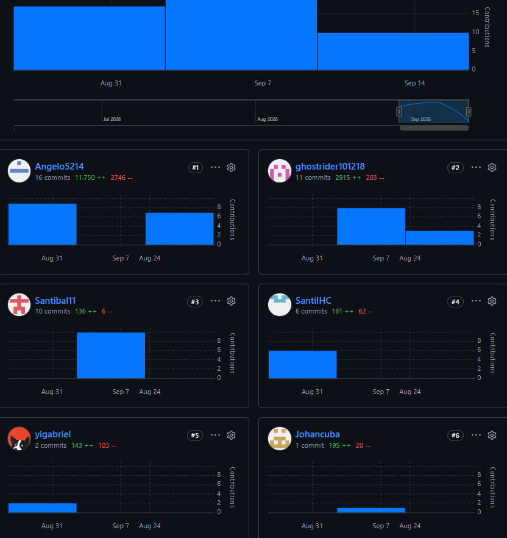
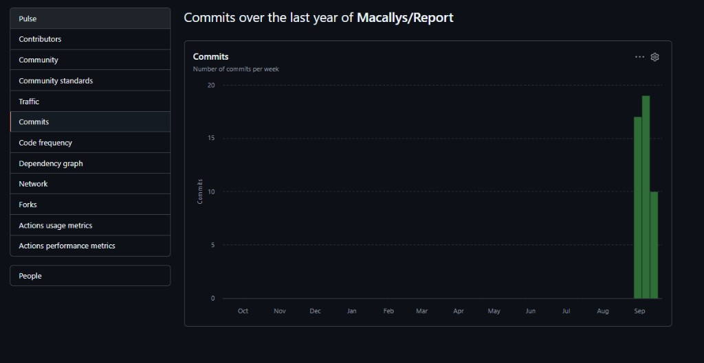

**Navegación:** [Índice](./informe.md#s-tabla-contenidos) · Siguiente: [Capítulo I](./01-capitulo-i-introduccion.md)

---

# Carátula

**Universidad Peruana de Ciencias Aplicadas**

**Facultad de Ingeniería**

**Carrera de Ingeniería de Software**

**Ciclo académico:** 2026-20

---

**Código del curso:** 1ASI0572

**Nombre del curso:** Desarrollo de Soluciones IoT

**NRC:** [NRC]

**Nombre del profesor:** [Apellidos y Nombres]

---

**Informe de Trabajo Final**

**Nombre del startup:** [Nombre del startup]

**Nombre del producto:** [Nombre del producto]

## Relación de integrantes

<table>
  <thead>
    <tr>
      <th align="left">Código</th>
      <th align="left">Apellidos y Nombres</th>
    </tr>
  </thead>
  <tbody>
    <tr>
      <td align="left"></td>
      <td align="left"></td>
    </tr>
    <tr>
      <td align="left"></td>
      <td align="left"></td>
    </tr>
    <tr>
      <td align="left"></td>
      <td align="left"></td>
    </tr>
    <tr>
      <td align="left"></td>
      <td align="left"></td>
    </tr>
  </tbody>
</table>

**Mes y año:** [Mes, Año]

---

# Registro de Versiones del Informe

<table>
  <thead>
    <tr>
      <th align="left">Versión</th>
      <th align="left">Fecha</th>
      <th align="left">Autor</th>
      <th align="left">Descripción de modificación</th>
    </tr>
  </thead>
  <tbody>
    <tr>
      <td align="left">1.0</td>
      <td align="left">2026-08-31</td>
      <td align="left"></td>
      <td align="left">Inicialización del esqueleto del informe según enunciado del Trabajo Final.</td>
    </tr>
  </tbody>
</table>

---

# Project Report Collaboration Insights

**URL del repositorio (Project Report):** [URL de la organización / repositorio GitHub]

**Entrega AV1 / TB1 / AV2 / TB2**

---

# Contenido

## Tabla de contenidos

<!-- TOC:start -->

1. [Student Outcome](informe.md#s-student-outcome)
1. [Capítulo I: Introducción](informe.md#s-cap-i)
    1. [1.1. Startup Profile](informe.md#s-1-1)
        1. [1.1.1. Descripción de la Startup](informe.md#s-1-1-1)
        1. [1.1.2. Perfiles de integrantes del equipo](informe.md#s-1-1-2)
    1. [1.2. Solution Profile](informe.md#s-1-2)
        1. [1.2.1 Antecedentes y problemática](informe.md#s-1-2-1)
        1. [1.2.2 Lean UX Process](informe.md#s-1-2-2)
            1. [1.2.2.1. Lean UX Problem Statements](informe.md#s-1-2-2-1)
            1. [1.2.2.2. Lean UX Assumptions](informe.md#s-1-2-2-2)
            1. [1.2.2.3. Lean UX Hypothesis Statements](informe.md#s-1-2-2-3)
            1. [1.2.2.4. Lean UX Canvas](informe.md#s-1-2-2-4)
    1. [1.3. Segmentos objetivo](informe.md#s-1-3)
1. [Capítulo II: Requirements Elicitation & Analysis](informe.md#s-cap-ii)
    1. [2.1. Competidores](informe.md#s-2-1)
        1. [2.1.1. Análisis competitivo](informe.md#s-2-1-1)
        1. [2.1.2. Estrategias y tácticas frente a competidores](informe.md#s-2-1-2)
    1. [2.2. Entrevistas](informe.md#s-2-2)
        1. [2.2.1. Diseño de entrevistas](informe.md#s-2-2-1)
        1. [2.2.2. Registro de entrevistas](informe.md#s-2-2-2)
        1. [2.2.3. Análisis de entrevistas](informe.md#s-2-2-3)
    1. [2.3. Needfinding](informe.md#s-2-3)
        1. [2.3.1. User Personas](informe.md#s-2-3-1)
        1. [2.3.2. User Task Matrix](informe.md#s-2-3-2)
        1. [2.3.3. User Journey Mapping](informe.md#s-2-3-3)
        1. [2.3.4. Empathy Mapping](informe.md#s-2-3-4)
    1. [2.4. Big Picture EventStorming](informe.md#s-2-4)
    1. [2.5. Ubiquitous Language](informe.md#s-2-5)
1. [Capítulo III: Requirements Specification](informe.md#s-cap-iii)
    1. [3.1. User Stories](informe.md#s-3-1)
    1. [3.2. Impact Mapping](informe.md#s-3-2)
    1. [3.3. Product Backlog](informe.md#s-3-3)
1. [Capítulo IV: Solution Software Design](informe.md#s-cap-iv)
    1. [4.1. Strategic-Level Domain-Driven Design](informe.md#s-4-1)
        1. [4.1.1. Design-Level EventStorming](informe.md#s-4-1-1)
            1. [4.1.1.1 Candidate Context Discovery](informe.md#s-4-1-1-1)
            1. [4.1.1.2 Domain Message Flows Modeling](informe.md#s-4-1-1-2)
            1. [4.1.1.3 Bounded Context Canvases](informe.md#s-4-1-1-3)
        1. [4.1.2. Context Mapping](informe.md#s-4-1-2)
        1. [4.1.3. Software Architecture](informe.md#s-4-1-3)
            1. [4.1.3.1. Software Architecture System Landscape Diagram](informe.md#s-4-1-3-1)
            1. [4.1.3.2. Software Architecture Context Level Diagrams](informe.md#s-4-1-3-2)
            1. [4.1.3.2. Software Architecture Container Level Diagrams](informe.md#s-4-1-3-2-software-architecture-container-level-diagrams)
            1. [4.1.3.3. Software Architecture Deployment Diagrams](informe.md#s-4-1-3-3)
    1. [4.2. Tactical-Level Domain-Driven Design](informe.md#s-4-2)
        1. [4.2.X. Bounded Context: \<Bounded Context Name\>](informe.md#s-4-2-x)
            1. [4.2.X.1. Domain Layer](informe.md#s-4-2-x-1)
            1. [4.2.X.2. Interface Layer](informe.md#s-4-2-x-2)
            1. [4.2.X.3. Application Layer](informe.md#s-4-2-x-3)
            1. [4.2.X.4. Infrastructure Layer](informe.md#s-4-2-x-4)
            1. [4.2.X.5. Bounded Context Software Architecture Component Level Diagrams](informe.md#s-4-2-x-5)
            1. [4.2.X.6. Bounded Context Software Architecture Code Level Diagrams](informe.md#s-4-2-x-6)
                1. [4.2.X.6.1. Bounded Context Domain Layer Class Diagrams](informe.md#s-4-2-x-6-1)
                1. [4.2.X.6.2. Bounded Context Database Design Diagram](informe.md#s-4-2-x-6-2)
1. [Capítulo V: Solution UI/UX Design](informe.md#s-cap-v)
    1. [5.1. Style Guidelines](informe.md#s-5-1)
        1. [5.1.1. General Style Guidelines](informe.md#s-5-1-1)
        1. [5.1.2. Web, Mobile and IoT Style Guidelines](informe.md#s-5-1-2)
    1. [5.2. Information Architecture](informe.md#s-5-2)
        1. [5.2.1. Organization Systems](informe.md#s-5-2-1)
        1. [5.2.2. Labeling Systems](informe.md#s-5-2-2)
        1. [5.2.3. SEO Tags and Meta Tags](informe.md#s-5-2-3)
        1. [5.2.4. Searching Systems](informe.md#s-5-2-4)
        1. [5.2.5. Navigation Systems](informe.md#s-5-2-5)
    1. [5.3. Landing Page UI Design](informe.md#s-5-3)
        1. [5.3.1. Landing Page Wireframe](informe.md#s-5-3-1)
        1. [5.3.2. Landing Page Mock-up](informe.md#s-5-3-2)
    1. [5.4. Applications UX/UI Design](informe.md#s-5-4)
        1. [5.4.1. Applications Wireframes](informe.md#s-5-4-1)
        1. [5.4.2. Applications Wireflow Diagrams](informe.md#s-5-4-2)
        1. [5.4.2. Applications Mock-ups](informe.md#s-5-4-2-applications-mock-ups)
        1. [5.4.3. Applications User Flow Diagrams](informe.md#s-5-4-3)
    1. [5.5. Applications Prototyping](informe.md#s-5-5)
    1. [5.6. IoT Device Design](informe.md#s-5-6)
1. [Capítulo VI: Product Implementation, Validation & Deployment](informe.md#s-cap-vi)
    1. [6.1. Software Configuration Management](informe.md#s-6-1)
        1. [6.1.1. Software Development Environment Configuration](informe.md#s-6-1-1)
        1. [6.1.2. Source Code Management](informe.md#s-6-1-2)
        1. [6.1.3. Source Code Style Guide & Conventions](informe.md#s-6-1-3)
        1. [6.1.4. Software Deployment Configuration](informe.md#s-6-1-4)
    1. [6.2. Landing Page, Services & Applications Implementation](informe.md#s-6-2)
        1. [6.2.X. Sprint n](informe.md#s-6-2-x)
            1. [6.2.X.1. Sprint Planning n](informe.md#s-6-2-x-1)
            1. [6.2.X.2. Aspect Leaders and Collaborators](informe.md#s-6-2-x-2)
            1. [6.2.X.3. Sprint Backlog n](informe.md#s-6-2-x-3)
            1. [6.2.X.4. Development Evidence for Sprint Review](informe.md#s-6-2-x-4)
            1. [6.2.X.5. Testing Suite Evidence for Sprint Review](informe.md#s-6-2-x-5)
            1. [6.2.X.6. Execution Evidence for Sprint Review](informe.md#s-6-2-x-6)
            1. [6.2.X.7. Services Documentation Evidence for Sprint Review](informe.md#s-6-2-x-7)
            1. [6.2.X.8. Software Deployment Evidence for Sprint Review](informe.md#s-6-2-x-8)
            1. [6.2.X.9. Team Collaboration Insights during Sprint](informe.md#s-6-2-x-9)
    1. [6.3. Validation Interviews](informe.md#s-6-3)
        1. [6.3.1. Diseño de Entrevistas](informe.md#s-6-3-1)
        1. [6.3.2. Registro de Entrevistas](informe.md#s-6-3-2)
        1. [6.3.3. Evaluaciones según heurísticas](informe.md#s-6-3-3)
    1. [6.4. Video About-the-Product](informe.md#s-6-4)
1. [Conclusiones](informe.md#s-conclusiones)
    1. [Conclusiones y recomendaciones](informe.md#s-conclusiones-recomendaciones)
    1. [Video About-the-Team](informe.md#s-video-about-the-team)
1. [Bibliografía](informe.md#s-bibliografia)
1. [Anexos](informe.md#s-anexos)
    1. [Videos de Exposiciones](informe.md#s-anexo-videos-exposiciones)
    1. [Repositorios y artefactos](informe.md#s-anexo-repositorios)

<!-- TOC:end -->

---

# Student Outcome

El curso contribuye al cumplimiento del Student Outcome ABET:

**ABET – EAC - Student Outcome 5**

**Criterio:** La capacidad de funcionar efectivamente en un equipo cuyos miembros juntos proporcionan liderazgo, crean un entorno de colaboración e inclusivo, establecen objetivos, planifican tareas y cumplen objetivos.

En el siguiente cuadro se describe las acciones realizadas y enunciados de conclusiones por parte del grupo, que permiten sustentar el haber alcanzado el logro del ABET – EAC - Student Outcome 5.

<table>
  <thead>
    <tr>
      <th align="left">Criterio específico</th>
      <th align="left">Acciones realizadas</th>
      <th align="left">Conclusiones</th>
    </tr>
  </thead>
  <tbody>
    <tr>
      <td align="left">Trabaja en equipo para proporcionar liderazgo en forma conjunta</td>
      <td align="left"></td>
      <td align="left"></td>
    </tr>
    <tr>
      <td align="left">Crea un entorno colaborativo e inclusivo, establece metas, planifica tareas y cumple objetivos.</td>
      <td align="left"></td>
      <td align="left"></td>
    </tr>
  </tbody>
</table>

---

**Navegación:** [Índice](./informe.md#s-tabla-contenidos) · Siguiente: [Capítulo I](./01-capitulo-i-introduccion.md)
