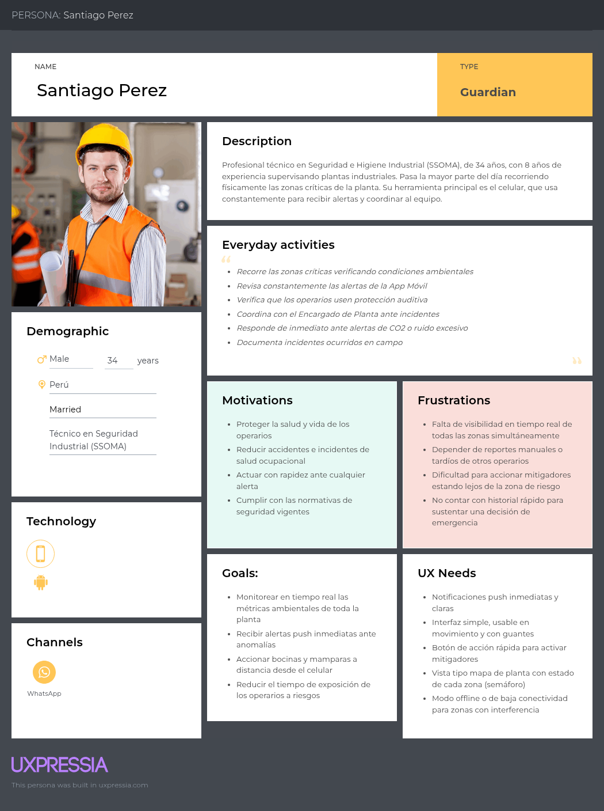
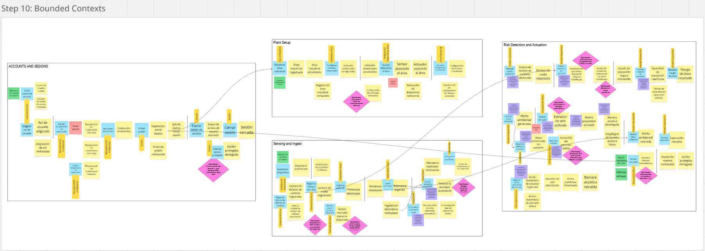

**Navegación:** [Índice](./00-student-outcome.md#s-tabla-contenidos) · Anterior: [Capítulo I](./01-capitulo-i-introduccion.md) · Siguiente: [Capítulo III](./03-capitulo-iii-requirements-specification.md)

---

# Capítulo II: Requirements Elicitation & Analysis

## 2.1. Competidores

### 2.1.1. Análisis competitivo

**Competitive Analysis Landscape**

**¿Por qué llevar a cabo este análisis?**

<table>
  <thead>
    <tr>
      <th align="left">Dimensión</th>
      <th align="center">Su startup (Nombre / Logo)</th>
      <th align="center">Competidor 1 (Nombre / Logo)</th>
      <th align="center">Competidor 2 (Nombre / Logo)</th>
      <th align="center">Competidor 3 (Nombre / Logo)</th>
    </tr>
  </thead>
  <tbody>
    <tr>
      <td align="left" colspan="5"><strong>Perfil</strong></td>
    </tr>
    <tr>
      <td align="left">Overview</td>
      <td align="left"></td>
      <td align="left"></td>
      <td align="left"></td>
      <td align="left"></td>
    </tr>
    <tr>
      <td align="left">Ventaja competitiva ¿Qué valor ofrece a los clientes?</td>
      <td align="left"></td>
      <td align="left"></td>
      <td align="left"></td>
      <td align="left"></td>
    </tr>
    <tr>
      <td align="left" colspan="5"><strong>Perfil de Marketing</strong></td>
    </tr>
    <tr>
      <td align="left">Mercado objetivo</td>
      <td align="left"></td>
      <td align="left"></td>
      <td align="left"></td>
      <td align="left"></td>
    </tr>
    <tr>
      <td align="left">Estrategias de marketing</td>
      <td align="left"></td>
      <td align="left"></td>
      <td align="left"></td>
      <td align="left"></td>
    </tr>
    <tr>
      <td align="left" colspan="5"><strong>Perfil de Producto</strong></td>
    </tr>
    <tr>
      <td align="left">Productos &amp; Servicios</td>
      <td align="left"></td>
      <td align="left"></td>
      <td align="left"></td>
      <td align="left"></td>
    </tr>
    <tr>
      <td align="left">Precios &amp; Costos</td>
      <td align="left"></td>
      <td align="left"></td>
      <td align="left"></td>
      <td align="left"></td>
    </tr>
    <tr>
      <td align="left">Canales de distribución (Web y/o Móvil)</td>
      <td align="left"></td>
      <td align="left"></td>
      <td align="left"></td>
      <td align="left"></td>
    </tr>
  </tbody>
</table>

**Análisis SWOT**

<table>
  <thead>
    <tr>
      <th align="left">SWOT</th>
      <th align="left">Su startup</th>
      <th align="left">Competidor 1</th>
      <th align="left">Competidor 2</th>
      <th align="left">Competidor 3</th>
    </tr>
  </thead>
  <tbody>
    <tr>
      <td align="left"><strong>Fortalezas</strong></td>
      <td align="left"></td>
      <td align="left"></td>
      <td align="left"></td>
      <td align="left"></td>
    </tr>
    <tr>
      <td align="left"><strong>Debilidades</strong></td>
      <td align="left"></td>
      <td align="left"></td>
      <td align="left"></td>
      <td align="left"></td>
    </tr>
    <tr>
      <td align="left"><strong>Oportunidades</strong></td>
      <td align="left"></td>
      <td align="left"></td>
      <td align="left"></td>
      <td align="left"></td>
    </tr>
    <tr>
      <td align="left"><strong>Amenazas</strong></td>
      <td align="left"></td>
      <td align="left"></td>
      <td align="left"></td>
      <td align="left"></td>
    </tr>
  </tbody>
</table>

### 2.1.2. Estrategias y tácticas frente a competidores

## 2.2. Entrevistas

### 2.2.1. Diseño de entrevistas

### 2.2.2. Registro de entrevistas

<table>
  <thead>
    <tr>
      <th align="left">ID</th>
      <th align="left">Fecha</th>
      <th align="left">Entrevistado</th>
      <th align="left">Segmento objetivo</th>
      <th align="left">Evidencia (enlace / captura)</th>
    </tr>
  </thead>
  <tbody>
    <tr>
      <td align="left">E-01</td>
      <td align="left"></td>
      <td align="left"></td>
      <td align="left"></td>
      <td align="left"></td>
    </tr>
  </tbody>
</table>

### 2.2.3. Análisis de entrevistas

## 2.3. Needfinding

### 2.3.1. User Personas

### 2.3.2. User Task Matrix

### 2.3.3. User Journey Mapping

### 2.3.4. Empathy Mapping

## 2.4. Big Picture EventStorming

## 2.5. Ubiquitous Language

<table>
  <thead>
    <tr>
      <th align="left">Término</th>
      <th align="left">Definición</th>
      <th align="left">Contexto</th>
    </tr>
  </thead>
  <tbody>
    <tr>
      <td align="left"></td>
      <td align="left"></td>
      <td align="left"></td>
    </tr>
  </tbody>
</table>

---

**Navegación:** [Índice](./00-student-outcome.md#s-tabla-contenidos) · Anterior: [Capítulo I](./01-capitulo-i-introduccion.md) · Siguiente: [Capítulo III](./03-capitulo-iii-requirements-specification.md)
