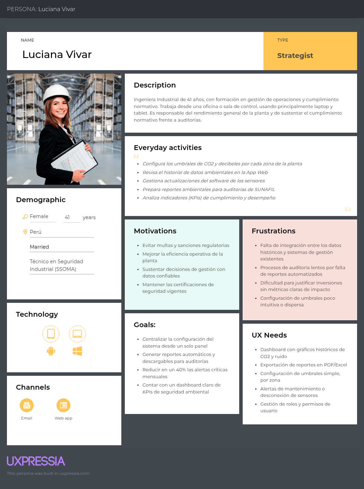
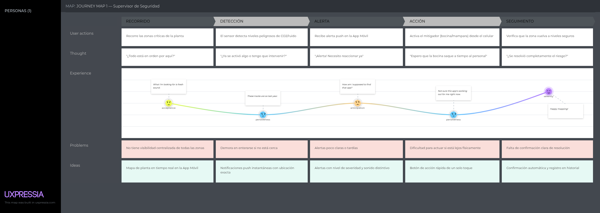
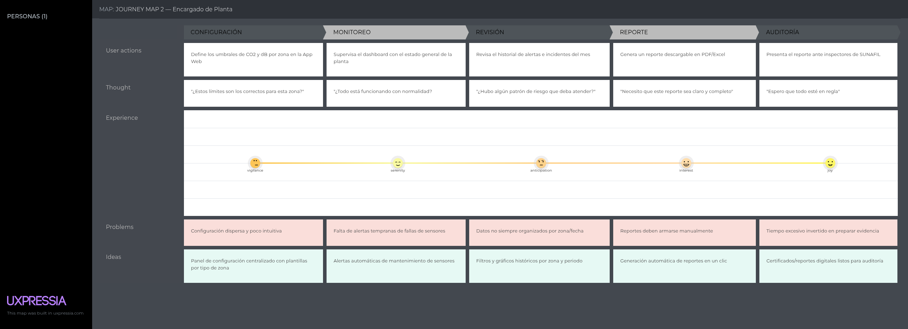
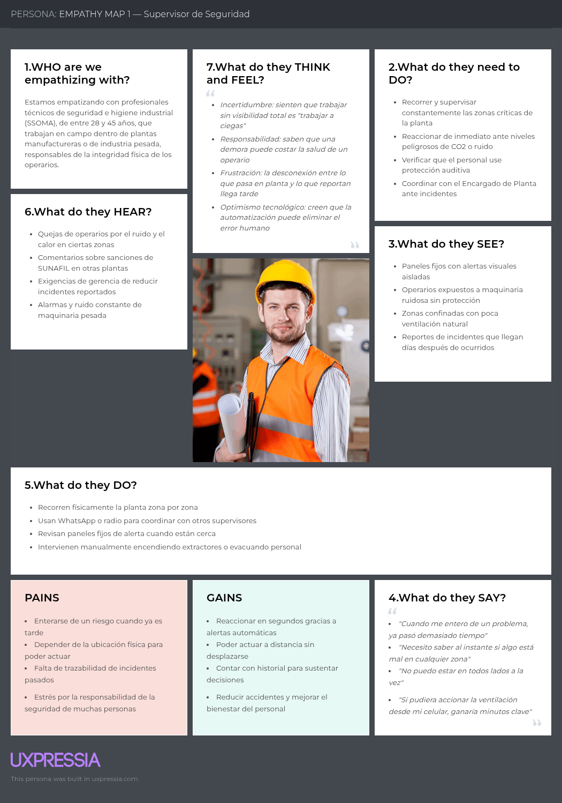
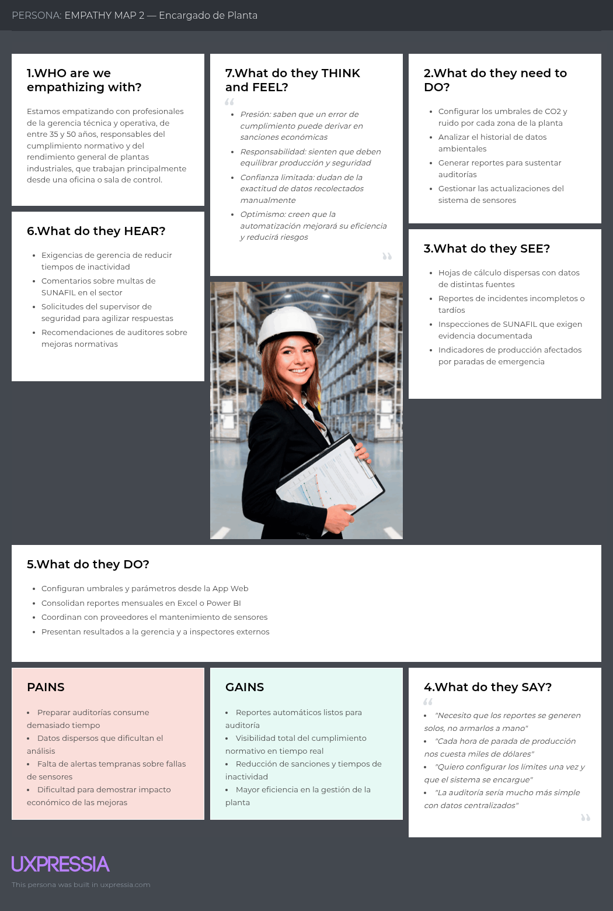

**Navegación:** [Índice](./00-student-outcome.md#s-tabla-contenidos) · Anterior: [Capítulo I](./01-capitulo-i-introduccion.md) · Siguiente: [Capítulo III](./03-capitulo-iii-requirements-specification.md)

---

# Capítulo II: Requirements Elicitation & Analysis

## 2.1. Competidores

### 2.1.1. Análisis competitivo

**Competitive Analysis Landscape**

**¿Por qué llevar a cabo este análisis?**

<table>
  <thead>
    <tr>
      <th align="left">Dimensión</th>
      <th align="center">Macallys</th>
      <th align="center">Honeywell Forge</th>
      <th align="center">Sistemas SCADA</th>
      <th align="center">Medidores Manuales</th>
    </tr>
  </thead>
  <tbody>
    <tr>
      <td align="left" colspan="5"><strong>Perfil</strong></td>
    </tr>
    <tr>
      <td align="left">Overview</td>
      <td align="left">Ecosistema IoT optimizado que cruza registros de sensores con tablas de umbrales para ejecutar acciones inmediatas.</td>
      <td align="left">Plataforma corporativa masiva para la gestión integral de edificios, energía y operaciones globales.</td>
      <td align="left">Sistemas de control y adquisición de datos centralizados, diseñados para la automatización a nivel de maquinaria pesada.</td>
      <td align="left">Equipos físicos aislados operados manualmente.</td>
    </tr>
    <tr>
      <td align="left">Ventaja competitiva ¿Qué valor ofrece a los clientes?</td>
      <td align="left">Procesamiento relacional que dispara mitigadores automáticamente, sin depender de la interacción del usuario.</td>
      <td align="left">Ecosistema completo y altamente robusto con capacidad de integración para corporaciones multinacionales.</td>
      <td align="left">Alta capacidad de control directo y fiabilidad sobre procesos complejos.</td>
      <td align="left">Bajo costo inicial por equipo y operación independiente que no requiere infraestructura de red ni bases de datos.</td>
    </tr>
    <tr>
      <td align="left" colspan="5"><strong>Perfil de Marketing</strong></td>
    </tr>
    <tr>
      <td align="left">Mercado objetivo</td>
      <td align="left">Plantas industriales. Usuarios: Supervisores de seguridad y encargados de planta.</td>
      <td align="left">Grandes corporaciones y multinacionales sobre transformación digital.</td>
      <td align="left">Plantas de industria pesada, gestionadas por ingenieros de automatización.</td>
      <td align="left">Pequeñas industrias y prevencionistas de riesgos independientes.</td>
    </tr>
    <tr>
      <td align="left">Estrategias de marketing</td>
      <td align="left">Solución enfocada en salud ocupacional, destacando la velocidad de respuesta de los dispositivos IOT.</td>
      <td align="left">Ventas B2B corporativas, ofreciendo transformación digital integral y eficiencia energética a nivel macro.</td>
      <td align="left">Provisión a través de integradores de sistemas y venta por proyectos de ingeniería a medida.</td>
      <td align="left">Venta directa a través de catálogos y distribuidores de Equipos de Protección Personal.</td>
    </tr>
    <tr>
      <td align="left" colspan="5"><strong>Perfil de Producto</strong></td>
    </tr>
    <tr>
      <td align="left">Productos &amp; Servicios</td>
      <td align="left">Nodos IoT, actuadores y API REST para gestionar alertas, registros de sensores y mitigadores.</td>
      <td align="left">Software empresarial pesado, integración de sistemas de control industrial.</td>
      <td align="left">Controladores, servidores locales con bases de datos propietarias y paneles HMI.</td>
      <td align="left">Dispositivos de hardware de medición ambiental sin capacidades de conexión a red.</td>
    </tr>
    <tr>
      <td align="left">Precios &amp; Costos</td>
      <td align="left">Costo de entrada bajo/medio.</td>
      <td align="left">Costos de implementación y licencias corporativas muy altos.</td>
      <td align="left">Muy alto. Requiere instalación de red cableada estructurada y programación por equipo.</td>
      <td align="left">Costo unitario muy bajo, pero alto costo operativo oculto por ineficiencia humana.</td>
    </tr>
    <tr>
      <td align="left">Canales de distribución (Web y/o Móvil)</td>
      <td align="left">Plataforma Web y App Móvil.</td>
      <td align="left">Aplicaciones de escritorio y plataformas Web corporativas.</td>
      <td align="left">Interfaces locales en terminales de escritorio y paneles fijos.</td>
      <td align="left">Distribuidores físicos de hardware. Sin canales digitales de interacción.</td>
    </tr>
  </tbody>
</table>

**Análisis SWOT**

<table>
  <thead>
    <tr>
      <th align="left">SWOT</th>
      <th align="left">Macallys</th>
      <th align="left">Honeywell Forge</th>
      <th align="left">Sistemas SCADA</th>
      <th align="left">Medidores Manuales</th>
    </tr>
  </thead>
  <tbody>
    <tr>
      <td align="left"><strong>Fortalezas</strong></td>
      <td align="left">Alta velocidad para disparar acciones en milisegundos. Arquitectura backend modular y ligera.</td>
      <td align="left">Ecosistema corporativo extremadamente robusto. Capacidad analítica profunda con gran volumen de datos.</td>
      <td align="left">Control directo a nivel de hardware con latencia casi nula. Localmente sin dependencia de internet.</td>
      <td align="left">Costo de adquisición casi nulo. No requiere configuración de bases de datos ni infraestructura de red.</td>
    </tr>
    <tr>
      <td align="left"><strong>Debilidades</strong></td>
      <td align="left">Dependencia de la conectividad en planta. Marca nueva en el sector.</td>
      <td align="left">Costos de licencia altos. Despliegue muy lento al requerir la construcción de almacenes de datos complejos.</td>
      <td align="left">Requiere reprogramación rígida por cada nuevo equipo integrado.</td>
      <td align="left">Dependencia total del humano, generando demora en la respuesta.</td>
    </tr>
    <tr>
      <td align="left"><strong>Oportunidades</strong></td>
      <td align="left">Preferencia por soluciones SaaS de integración rápida.</td>
      <td align="left">Absorber corporaciones multinacionales que buscan unificar sus operaciones globales.</td>
      <td align="left">Integración con maquinaria pesada antigua que aún requiere protocolos cableados.</td>
      <td align="left">Talleres o microempresas sin presupuesto que solo buscan cumplir el requisito mínimo de tener un equipo físico.</td>
    </tr>
    <tr>
      <td align="left"><strong>Amenazas</strong></td>
      <td align="left">Interferencia electromagnética que cause pérdida de paquetes de datos.</td>
      <td align="left">Startups ágiles con APIs más modernas y económicas.</td>
      <td align="left">Migración de la industria hacia arquitecturas de microservicios e IoT en la nube, dejando obsoletos los sistemas cerrados.</td>
      <td align="left">Nuevas normativas que prohíban los registros manuales en papel para validaciones de salud ocupacional.</td>
    </tr>
  </tbody>
</table>

### 2.1.2. Estrategias y tácticas frente a competidores

## 2.2. Entrevistas

### 2.2.1. Diseño de entrevistas

### 2.2.2. Registro de entrevistas

<table>
  <thead>
    <tr>
      <th align="left">ID</th>
      <th align="left">Fecha</th>
      <th align="left">Entrevistado</th>
      <th align="left">Segmento objetivo</th>
      <th align="left">Evidencia (enlace / captura)</th>
    </tr>
  </thead>
  <tbody>
    <tr>
      <td align="left">E-01</td>
      <td align="left"></td>
      <td align="left"></td>
      <td align="left"></td>
      <td align="left"></td>
    </tr>
  </tbody>
</table>

### 2.2.3. Análisis de entrevistas

## 2.3. Needfinding

Para llevar a cabo el proceso de needfinding en Macallys, se realizaron entrevistas en profundidad con usuarios pertenecientes a los segmentos objetivo del proyecto: supervisores de seguridad industrial y encargados de planta en empresas manufactureras y de industria pesada. Estas conversaciones se centraron en comprender sus hábitos, objetivos y principales frustraciones relacionadas con el monitoreo ambiental, la prevención de riesgos y el cumplimiento de normativas de seguridad ocupacional.

Gracias a esta exploración, se identificaron áreas críticas de mejora, como la falta de visibilidad en tiempo real de las condiciones ambientales en zonas críticas, la dependencia de revisiones manuales esporádicas y la limitada capacidad de reacción automática ante niveles peligrosos de CO2 y ruido. Asimismo, se evidenció la existencia de brechas tecnológicas que retrasan la respuesta ante incidentes y dificultan la elaboración de reportes para auditorías. Durante las entrevistas, surgieron patrones y necesidades recurrentes, como la importancia de contar con un sistema que centralice la información, automatice la mitigación de riesgos y permita el control remoto desde dispositivos móviles y web. De esta manera, se logra identificar una oportunidad clara para desarrollar una solución como Macallys, que facilite la prevención automatizada y mejore la seguridad y el bienestar de los operarios en plantas industriales.

### 2.3.1. User Personas

Segmento Objetivo: Supervisor de Seguridad:

Segmento Objetivo: Encargado de Planta:

### 2.3.2. User Task Matrix

| Task | Carlos Ramírez (Supervisor de Seguridad) — Frecuencia | Carlos Ramírez (Supervisor de Seguridad) — Importancia | Rosa Delgado (Encargado de Planta) — Frecuencia | Rosa Delgado (Encargado de Planta) — Importancia |
|---|---|---|---|---|
| Monitorear niveles de CO2 y ruido en tiempo real | Alta | Alta | Media | Alta |
| Recibir alertas push ante niveles peligrosos | Alta | Alta | Media | Alta |
| Accionar mitigadores a distancia (bocinas, mamparas) | Alta | Alta | Baja | Media |
| Verificar uso de protección auditiva del personal | Alta | Alta | Baja | Media |
| Configurar umbrales de CO2 y decibeles por zona | Baja | Media | Alta | Alta |
| Revisar historial de datos ambientales | Media | Alta | Alta | Alta |
| Generar reportes para auditorías (SUNAFIL) | Baja | Media | Alta | Alta |
| Gestionar actualizaciones del software de sensores | Baja | Baja | Alta | Media |
| Coordinar con otros supervisores/encargados | Alta | Alta | Media | Alta |
| Detectar fallas o desconexión de sensores | Media | Alta | Media | Alta |
| Evaluar cumplimiento normativo de la planta | Baja | Media | Alta | Alta |
| Recorrer físicamente las zonas críticas | Alta | Alta | Baja | Baja |

### 2.3.3. User Journey Mapping

Segmento Objetivo: Supervisor de Seguridad:

Segmento Objetivo: Encargado de Planta:

### 2.3.4. Empathy Mapping

Segmento Objetivo: Supervisor de Seguridad:

Segmento Objetivo: Encargado de Planta:

## 2.4. Big Picture EventStorming

Segmento Objetivo: Supervisor de Seguridad:

Segmento Objetivo: Encargado de Planta:

## 2.5. Ubiquitous Language

<table>
  <thead>
    <tr>
      <th align="left">Término</th>
      <th align="left">Definición</th>
      <th align="left">Contexto</th>
    </tr>
  </thead>
  <tbody>
    <tr>
      <td align="left">CO2 (Dióxido de carbono)</td>
      <td align="left">Gas cuya acumulación en espacios confinados representa riesgo respiratorio para el personal.</td>
      <td align="left">Se monitorea en tiempo real mediante sensores en zonas críticas.</td>
    </tr>
    <tr>
      <td align="left">Sensor de CO2</td>
      <td align="left">Dispositivo IoT que mide la concentración de dióxido de carbono en una zona.</td>
      <td align="left">Envía datos a la plataforma para activar alertas o mitigadores.</td>
    </tr>
    <tr>
      <td align="left">Sonómetro</td>
      <td align="left">Dispositivo que mide el nivel de contaminación sonora (decibeles) en una zona.</td>
      <td align="left">Utilizado para detectar exceso de ruido por maquinaria pesada.</td>
    </tr>
    <tr>
      <td align="left">Detector de presencia</td>
      <td align="left">Sensor que identifica la presencia de operarios en zonas críticas.</td>
      <td align="left">Permite activar bocinas o mamparas solo cuando hay personal expuesto.</td>
    </tr>
    <tr>
      <td align="left">Umbral</td>
      <td align="left">Valor límite configurado (de CO2 o dB) a partir del cual el sistema activa una respuesta automática.</td>
      <td align="left">Definido por el Encargado de Planta desde la App Web.</td>
    </tr>
    <tr>
      <td align="left">Zona crítica</td>
      <td align="left">Área de la planta con alto riesgo ambiental (cuartos de máquinas, calderas, pasillos confinados).</td>
      <td align="left">Punto de instalación de sensores y actuadores.</td>
    </tr>
    <tr>
      <td align="left">Actuador</td>
      <td align="left">Mecanismo que ejecuta una acción física de mitigación (ventilador, bocina, mampara).</td>
      <td align="left">Se activa automáticamente al superarse un umbral.</td>
    </tr>
    <tr>
      <td align="left">Ventilador de extracción</td>
      <td align="left">Actuador que purifica el ambiente ante exceso de CO2.</td>
      <td align="left">Se activa automáticamente sin intervención humana.</td>
    </tr>
    <tr>
      <td align="left">Bocina preventiva</td>
      <td align="left">Actuador sonoro que alerta a los operarios expuestos a niveles peligrosos.</td>
      <td align="left">Puede ser accionada a distancia por el Supervisor de Seguridad.</td>
    </tr>
    <tr>
      <td align="left">Mampara de aislamiento</td>
      <td align="left">Actuador físico que aísla una zona de riesgo.</td>
      <td align="left">Se activa junto con la bocina en casos críticos.</td>
    </tr>
    <tr>
      <td align="left">Alerta push</td>
      <td align="left">Notificación inmediata enviada a la App Móvil ante una anomalía.</td>
      <td align="left">Recibida por el Supervisor de Seguridad en tiempo real.</td>
    </tr>
    <tr>
      <td align="left">App Móvil</td>
      <td align="left">Aplicación utilizada por el Supervisor de Seguridad para monitorear y actuar en campo.</td>
      <td align="left">Permite control remoto de los dispositivos IoT.</td>
    </tr>
    <tr>
      <td align="left">App Web</td>
      <td align="left">Plataforma utilizada por el Encargado de Planta para configurar el sistema y generar reportes.</td>
      <td align="left">Centraliza la parametrización y el historial de datos.</td>
    </tr>
    <tr>
      <td align="left">Procesamiento Edge</td>
      <td align="left">Procesamiento básico de datos realizado en el propio dispositivo IoT antes de enviarlos a la nube.</td>
      <td align="left">Mitiga riesgos de latencia en zonas con alta interferencia.</td>
    </tr>
    <tr>
      <td align="left">Reporte histórico</td>
      <td align="left">Documento generado por el sistema con datos ambientales pasados.</td>
      <td align="left">Usado por el Encargado de Planta para auditorías.</td>
    </tr>
    <tr>
      <td align="left">SUNAFIL</td>
      <td align="left">Entidad peruana que fiscaliza el cumplimiento de normativas de seguridad y salud en el trabajo.</td>
      <td align="left">Referente regulatorio que motiva el uso del sistema.</td>
    </tr>
    <tr>
      <td align="left">Supervisor de Seguridad</td>
      <td align="left">Usuario que monitorea en campo las condiciones ambientales mediante la App Móvil.</td>
      <td align="left">Segmento objetivo 1 de Macallys.</td>
    </tr>
    <tr>
      <td align="left">Encargado de Planta</td>
      <td align="left">Usuario que configura el sistema y gestiona el cumplimiento normativo desde la App Web.</td>
      <td align="left">Segmento objetivo 2 de Macallys.</td>
    </tr>
    <tr>
      <td align="left">Tiempo de exposición</td>
      <td align="left">Duración durante la cual un operario está expuesto a niveles peligrosos de CO2 o ruido.</td>
      <td align="left">Métrica clave que Macallys busca reducir en un 90%.</td>
    </tr>
  </tbody>
</table>

---

**Navegación:** [Índice](./00-student-outcome.md#s-tabla-contenidos) · Anterior: [Capítulo I](./01-capitulo-i-introduccion.md) · Siguiente: [Capítulo III](./03-capitulo-iii-requirements-specification.md)
