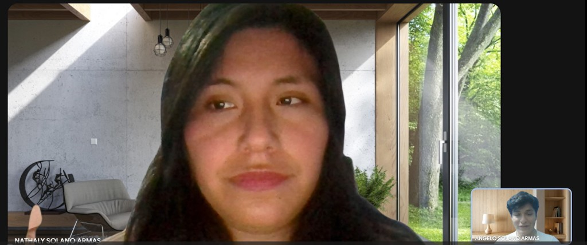

**Navegación:** [Índice](./00-student-outcome.md#s-tabla-contenidos) · Anterior: [Capítulo I](./01-capitulo-i-introduccion.md) · Siguiente: [Capítulo III](./03-capitulo-iii-requirements-specification.md)

---

# Capítulo II: Requirements Elicitation & Analysis

## 2.1. Competidores

### 2.1.1. Análisis competitivo

**Competitive Analysis Landscape**

**¿Por qué llevar a cabo este análisis?**

<table>
  <thead>
    <tr>
      <th align="left">Dimensión</th>
      <th align="center">Macallys</th>
      <th align="center">Honeywell Forge</th>
      <th align="center">Sistemas SCADA</th>
      <th align="center">Medidores Manuales</th>
    </tr>
  </thead>
  <tbody>
    <tr>
      <td align="left" colspan="5"><strong>Perfil</strong></td>
    </tr>
    <tr>
      <td align="left">Overview</td>
      <td align="left">Ecosistema IoT optimizado que cruza registros de sensores con tablas de umbrales para ejecutar acciones inmediatas.</td>
      <td align="left">Plataforma corporativa masiva para la gestión integral de edificios, energía y operaciones globales.</td>
      <td align="left">Sistemas de control y adquisición de datos centralizados, diseñados para la automatización a nivel de maquinaria pesada.</td>
      <td align="left">Equipos físicos aislados operados manualmente.</td>
    </tr>
    <tr>
      <td align="left">Ventaja competitiva ¿Qué valor ofrece a los clientes?</td>
      <td align="left">Procesamiento relacional que dispara mitigadores automáticamente, sin depender de la interacción del usuario.</td>
      <td align="left">Ecosistema completo y altamente robusto con capacidad de integración para corporaciones multinacionales.</td>
      <td align="left">Alta capacidad de control directo y fiabilidad sobre procesos complejos.</td>
      <td align="left">Bajo costo inicial por equipo y operación independiente que no requiere infraestructura de red ni bases de datos.</td>
    </tr>
    <tr>
      <td align="left" colspan="5"><strong>Perfil de Marketing</strong></td>
    </tr>
    <tr>
      <td align="left">Mercado objetivo</td>
      <td align="left">Plantas industriales. Usuarios: Supervisores de seguridad y encargados de planta.</td>
      <td align="left">Grandes corporaciones y multinacionales sobre transformación digital.</td>
      <td align="left">Plantas de industria pesada, gestionadas por ingenieros de automatización.</td>
      <td align="left">Pequeñas industrias y prevencionistas de riesgos independientes.</td>
    </tr>
    <tr>
      <td align="left">Estrategias de marketing</td>
      <td align="left">Solución enfocada en salud ocupacional, destacando la velocidad de respuesta de los dispositivos IOT.</td>
      <td align="left">Ventas B2B corporativas, ofreciendo transformación digital integral y eficiencia energética a nivel macro.</td>
      <td align="left">Provisión a través de integradores de sistemas y venta por proyectos de ingeniería a medida.</td>
      <td align="left">Venta directa a través de catálogos y distribuidores de Equipos de Protección Personal.</td>
    </tr>
    <tr>
      <td align="left" colspan="5"><strong>Perfil de Producto</strong></td>
    </tr>
    <tr>
      <td align="left">Productos &amp; Servicios</td>
      <td align="left">Nodos IoT, actuadores y API REST para gestionar alertas, registros de sensores y mitigadores.</td>
      <td align="left">Software empresarial pesado, integración de sistemas de control industrial.</td>
      <td align="left">Controladores, servidores locales con bases de datos propietarias y paneles HMI.</td>
      <td align="left">Dispositivos de hardware de medición ambiental sin capacidades de conexión a red.</td>
    </tr>
    <tr>
      <td align="left">Precios &amp; Costos</td>
      <td align="left">Costo de entrada bajo/medio.</td>
      <td align="left">Costos de implementación y licencias corporativas muy altos.</td>
      <td align="left">Muy alto. Requiere instalación de red cableada estructurada y programación por equipo.</td>
      <td align="left">Costo unitario muy bajo, pero alto costo operativo oculto por ineficiencia humana.</td>
    </tr>
    <tr>
      <td align="left">Canales de distribución (Web y/o Móvil)</td>
      <td align="left">Plataforma Web y App Móvil.</td>
      <td align="left">Aplicaciones de escritorio y plataformas Web corporativas.</td>
      <td align="left">Interfaces locales en terminales de escritorio y paneles fijos.</td>
      <td align="left">Distribuidores físicos de hardware. Sin canales digitales de interacción.</td>
    </tr>
  </tbody>
</table>

**Análisis SWOT**

<table>
  <thead>
    <tr>
      <th align="left">SWOT</th>
      <th align="left">Macallys</th>
      <th align="left">Honeywell Forge</th>
      <th align="left">Sistemas SCADA</th>
      <th align="left">Medidores Manuales</th>
    </tr>
  </thead>
  <tbody>
    <tr>
      <td align="left"><strong>Fortalezas</strong></td>
      <td align="left">Alta velocidad para disparar acciones en milisegundos. Arquitectura backend modular y ligera.</td>
      <td align="left">Ecosistema corporativo extremadamente robusto. Capacidad analítica profunda con gran volumen de datos.</td>
      <td align="left">Control directo a nivel de hardware con latencia casi nula. Localmente sin dependencia de internet.</td>
      <td align="left">Costo de adquisición casi nulo. No requiere configuración de bases de datos ni infraestructura de red.</td>
    </tr>
    <tr>
      <td align="left"><strong>Debilidades</strong></td>
      <td align="left">Dependencia de la conectividad en planta. Marca nueva en el sector.</td>
      <td align="left">Costos de licencia altos. Despliegue muy lento al requerir la construcción de almacenes de datos complejos.</td>
      <td align="left">Requiere reprogramación rígida por cada nuevo equipo integrado.</td>
      <td align="left">Dependencia total del humano, generando demora en la respuesta.</td>
    </tr>
    <tr>
      <td align="left"><strong>Oportunidades</strong></td>
      <td align="left">Preferencia por soluciones SaaS de integración rápida.</td>
      <td align="left">Absorber corporaciones multinacionales que buscan unificar sus operaciones globales.</td>
      <td align="left">Integración con maquinaria pesada antigua que aún requiere protocolos cableados.</td>
      <td align="left">Talleres o microempresas sin presupuesto que solo buscan cumplir el requisito mínimo de tener un equipo físico.</td>
    </tr>
    <tr>
      <td align="left"><strong>Amenazas</strong></td>
      <td align="left">Interferencia electromagnética que cause pérdida de paquetes de datos.</td>
      <td align="left">Startups ágiles con APIs más modernas y económicas.</td>
      <td align="left">Migración de la industria hacia arquitecturas de microservicios e IoT en la nube, dejando obsoletos los sistemas cerrados.</td>
      <td align="left">Nuevas normativas que prohíban los registros manuales en papel para validaciones de salud ocupacional.</td>
    </tr>
  </tbody>
</table>

### 2.1.2. Estrategias y tácticas frente a competidores

## 2.2. Entrevistas

### 2.2.1. Diseño de entrevistas

**Preguntas Generales**

* Nombre
* Edad
* Distrito de residencia
* Ocupación o cargo actual
* Dispositivos tecnológicos de preferencia

**Supervisor de Seguridad**

* ¿Qué tiene que pasar al final de tu jornada para que sientas que cumpliste tu meta respecto a la prevención de riesgos ambientales?
* ¿Cuáles son los mayores problemas o frustraciones que enfrentas hoy en día al intentar detectar riesgos como niveles peligrosos de CO₂ o ruido excesivo en la planta?
* Cuéntame de la última vez que hubo una condición de riesgo en tu entorno de trabajo, ¿cómo te enteraste y cuáles fueron los pasos exactos que seguiste para resolverlo?
* Si utilizaras una aplicación móvil para monitorear las zonas críticas de la planta, ¿qué información necesitarías ver inmediatamente al abrirla para tomar decisiones rápidas?
* ¿En qué escenarios de emergencia consideras que la automatización de la planta no es suficiente y necesitarías tomar el control manual remoto de los actuadores (extractores, sirenas o mamparas) desde tu celular?
* ¿Cómo verificas actualmente que las medidas de seguridad o de evacuación realmente funcionaron después de que ocurre un incidente en la planta?
* ¿Qué tan útil te resultaría tener un mapa digitalizado en tu celular con los estados de riesgo de cada zona en tiempo real, y por qué?
* Si pudieras cambiar una sola cosa del proceso actual con el que evalúas si hay personal expuesto a condiciones de riesgo, ¿qué sería?
* ¿Cómo te gustaría recibir las notificaciones o alertas en tu dispositivo móvil para asegurar que las atiendas de inmediato sin que se pierdan en el día a día?

**Encargado de Planta**

* ¿Cuál es el impacto a largo plazo que buscas lograr en la operatividad de la planta al implementar nuevos sistemas de monitoreo y automatización?
* ¿Qué tareas administrativas, de configuración de equipos o de gestión de personal te generan mayor frustración o te quitan más tiempo en el día a día?
* ¿Cuáles son los mayores desafíos al registrar físicamente nuevos sensores IoT o actuadores en las zonas críticas de la planta?
* Al definir los límites ambientales permitidos (umbrales de CO₂ y ruido) para los operarios, ¿qué dificultades o variables problemáticas encuentras habitualmente?
* Al gestionar y configurar el sistema desde una aplicación web en tu computadora, ¿qué nivel de detalle o funciones consideras indispensables para sentir que tienes el control total de la plataforma?
* ¿Qué criterios utilizas actualmente para decidir qué roles, permisos o accesos le otorgas a los supervisores de seguridad que operan bajo tu gestión?
* ¿Cómo manejas actualmente las actualizaciones de normativas de seguridad industrial y cómo las aplicas a los parámetros de los sistemas de la planta?
* Cuéntame de alguna vez en la que hubo problemas de conectividad o fallas en el hardware de monitoreo, ¿cómo te impactó a nivel de gestión de la planta?
* ¿Qué tan importante es para ti tener un registro histórico o auditoría de los eventos ambientales y de las acciones de los supervisores, y para qué lo usarías?
* Si pudieras automatizar por completo una tarea de configuración o administración de la planta que hoy haces de forma manual, ¿cuál elegirías?

### 2.2.2. Registro de entrevistas

Las entrevistas fueron grabadas en video previo consentimiento de los participantes y se organizaron por segmento objetivo. Cada registro incluye los datos generales del entrevistado, la captura del video, el enlace de acceso, el timing dentro de la grabación consolidada, la duración y un resumen descriptivo de las respuestas obtenidas.

> Nota para el equipo: las celdas marcadas entre corchetes deben completarse con los datos reales de cada entrevista. Las capturas se colocan en assets/chapter-2/ respetando los nombres de archivo indicados en cada etiqueta de imagen.

#### 2.2.2.1. Segmento objetivo 1: Supervisor de Seguridad (App Móvil)

##### 2.2.2.1.1. Entrevista 1

<table border="1">
  <tr>
    <td width="40%">
      <b>Nombres y apellidos:</b> [Nombres y apellidos] 
      <b>Edad:</b> [Edad] años 
      <b>Distrito:</b> [Distrito] 
      <b>Ocupación:</b> [Puesto exacto, ej: Supervisor SSOMA] 
      <b>Experiencia laboral:</b> [Años de experiencia] en el sector industrial 
      <b>Área de trabajo:</b> [Planta de producción, campo, etc.] 
      <b>Tipo de establecimiento:</b> [Ej: Fábrica metalmecánica] 
      <b>Nivel tecnológico:</b> [Básico / Intermedio / Avanzado] 
      <b>Timing:</b> [hh:mm:ss - hh:mm:ss] 
      <b>Duración:</b> [mm:ss] 
      <b>Entrevistador:</b> [Nombre del integrante del Grupo 03]
    </td>
    <td align="center">
      
    </td>
  </tr>
  <tr>
    <td colspan="2">
      <b>Enlace:</b>
      <a href="[URL del video en Microsoft Stream]">[Ver entrevista en Microsoft Stream]</a>
        
      <b>Resumen:</b> [Descripción detallada de cómo realiza actualmente el monitoreo de seguridad en la planta. Explicar qué herramientas manuales o antiguas utiliza, cuánto tiempo le toma y cuáles son sus mayores frustraciones al no tener control remoto. Mencionar incidentes pasados relacionados con CO2 o ruido.]
        
      [Detallar sus expectativas sobre una aplicación móvil para monitoreo en tiempo real: qué métricas necesita ver primero, cómo espera recibir las alertas de peligro y qué tan dispuesto está a adoptar una nueva tecnología en su rutina diaria.]
    </td>
  </tr>
</table>

##### 2.2.2.1.2. Entrevista 2

<table border="1">
  <tr>
    <td width="40%">
      <b>Nombres y apellidos:</b> [Nombres y apellidos] 
      <b>Edad:</b> [Edad] años 
      <b>Distrito:</b> [Distrito] 
      <b>Ocupación:</b> [Puesto exacto] 
      <b>Experiencia laboral:</b> [Años de experiencia] en el sector industrial 
      <b>Área de trabajo:</b> [Área] 
      <b>Tipo de establecimiento:</b> [Tipo de planta] 
      <b>Nivel tecnológico:</b> [Básico / Intermedio / Avanzado] 
      <b>Timing:</b> [hh:mm:ss - hh:mm:ss] 
      <b>Duración:</b> [mm:ss] 
      <b>Entrevistador:</b> [Nombre del integrante del Grupo 03]
    </td>
    <td align="center">
      
    </td>
  </tr>
  <tr>
    <td colspan="2">
      <b>Enlace:</b>
      <a href="[URL del video en Microsoft Stream]">[Ver entrevista en Microsoft Stream]</a>
        
      <b>Resumen:</b> [Descripción de su flujo de trabajo actual, problemas de comunicación en la planta, respuesta ante emergencias ambientales y disposición para utilizar una aplicación móvil de alertas automáticas.]
    </td>
  </tr>
</table>

##### 2.2.2.1.3. Entrevista 3

<table border="1">
  <tr>
    <td width="40%">
      <b>Nombres y apellidos:</b> [Nombres y apellidos] 
      <b>Edad:</b> [Edad] años 
      <b>Distrito:</b> [Distrito] 
      <b>Ocupación:</b> [Puesto exacto] 
      <b>Experiencia laboral:</b> [Años de experiencia] en el sector industrial 
      <b>Área de trabajo:</b> [Área] 
      <b>Tipo de establecimiento:</b> [Tipo de planta] 
      <b>Nivel tecnológico:</b> [Básico / Intermedio / Avanzado] 
      <b>Timing:</b> [hh:mm:ss - hh:mm:ss] 
      <b>Duración:</b> [mm:ss] 
      <b>Entrevistador:</b> [Nombre del integrante del Grupo 03]
    </td>
    <td align="center">
      
    </td>
  </tr>
  <tr>
    <td colspan="2">
      <b>Enlace:</b>
      <a href="[URL del video en Microsoft Stream]">[Ver entrevista en Microsoft Stream]</a>
        
      <b>Resumen:</b> [Descripción de su flujo de trabajo actual, problemas de comunicación en la planta, respuesta ante emergencias ambientales y disposición para utilizar una aplicación móvil de alertas automáticas.]
    </td>
  </tr>
</table>

#### 2.2.2.2. Segmento objetivo 2: Encargado de Planta (App Web)

##### 2.2.2.2.1. Entrevista 1

<table border="1">
  <tr>
    <td width="40%">
      <b>Nombres y apellidos:</b> [Nombres y apellidos] 
      <b>Edad:</b> [Edad] años 
      <b>Distrito:</b> [Distrito] 
      <b>Ocupación:</b> [Ej: Gerente de Operaciones / Jefe de Planta] 
      <b>Experiencia laboral:</b> [Años de experiencia] en gestión industrial 
      <b>Área de trabajo:</b> [Oficina técnica / Control de operaciones] 
      <b>Tipo de establecimiento:</b> [Ej: Planta procesadora de alimentos] 
      <b>Nivel tecnológico:</b> [Básico / Intermedio / Avanzado] 
      <b>Timing:</b> [hh:mm:ss - hh:mm:ss] 
      <b>Duración:</b> [mm:ss] 
      <b>Entrevistador:</b> [Nombre del integrante del Grupo 03]
    </td>
    <td align="center">
      
    </td>
  </tr>
  <tr>
    <td colspan="2">
      <b>Enlace:</b>
      <a href="[URL del video en Microsoft Stream]">[Ver entrevista en Microsoft Stream]</a>
        
      <b>Resumen:</b> [Describir cómo gestiona actualmente el cumplimiento de las normativas de salud ocupacional frente a entidades reguladoras. Mencionar los costos o multas que enfrenta la planta si hay accidentes por ruido o gases, y cómo lleva el registro histórico (probablemente en Excel o papel).]
        
      [Explicar su postura frente a la implementación de un panel web centralizado que le permita configurar topes de decibeles o partes por millón de CO2, y cómo la descarga de reportes automatizados impactaría su productividad y las auditorías.]
    </td>
  </tr>
</table>

##### 2.2.2.2.2. Entrevista 2

<table border="1">
  <tr>
    <td width="40%">
      <b>Nombres y apellidos:</b> [Nombres y apellidos] 
      <b>Edad:</b> [Edad] años 
      <b>Distrito:</b> [Distrito] 
      <b>Ocupación:</b> [Puesto exacto] 
      <b>Experiencia laboral:</b> [Años de experiencia] en gestión industrial 
      <b>Área de trabajo:</b> [Área] 
      <b>Tipo de establecimiento:</b> [Tipo de planta] 
      <b>Nivel tecnológico:</b> [Básico / Intermedio / Avanzado] 
      <b>Timing:</b> [hh:mm:ss - hh:mm:ss] 
      <b>Duración:</b> [mm:ss] 
      <b>Entrevistador:</b> [Nombre del integrante del Grupo 03]
    </td>
    <td align="center">
      
    </td>
  </tr>
  <tr>
    <td colspan="2">
      <b>Enlace:</b> <a href="[URL del video en Microsoft Stream]">[URL del video en Microsoft Stream]</a>
        
      <b>Resumen:</b> [Descripción de sus dolores actuales en la consolidación de datos ambientales, manejo de auditorías, y sus expectativas sobre el control remoto de los mitigadores desde una aplicación web.]
    </td>
  </tr>
</table>

##### 2.2.2.2.3. Entrevista 3

<table border="1">
  <tr>
    <td width="40%">
      <b>Nombres y apellidos:</b> Nathaly Solano Armas 
      <b>Edad:</b> 28 años 
      <b>Distrito:</b> Ate 
      <b>Ocupación:</b> Encargada de planta 
      <b>Experiencia laboral:</b> 6 años en gestión industrial 
      <b>Área de trabajo:</b> Monitoreo y control de planta 
      <b>Tipo de establecimiento:</b> Planta metalmecánica de tamaño medio 
      <b>Nivel tecnológico:</b> Intermedio 
      <b>Timing:</b> 00:00:00 - 00:11:06 
      <b>Duración:</b> 11:06 
      <b>Entrevistador:</b> Angelo Héctor Solano Armas
    </td>
    <td align="center">
      
    </td>
  </tr>
  <tr>
    <td colspan="2">
      <b>Enlace:</b> <a href="https://upcedupe-my.sharepoint.com/:v:/g/personal/u20231b775_upc_edu_pe/IQC3qQs5We4vS6zsu7M-w2DgATcBFhIcHwh6Y3EL3vL9im8?nav=eyJyZWZlcnJhbEluZm8iOnsicmVmZXJyYWxBcHAiOiJPbmVEcml2ZUZvckJ1c2luZXNzIiwicmVmZXJyYWxBcHBQbGF0Zm9ybSI6IldlYiIsInJlZmVycmFsTW9kZSI6InZpZXciLCJyZWZlcnJhbFZpZXciOiJNeUZpbGVzTGlua0NvcHkifX0&e=frhwHe">Ver entrevista en Microsoft Stream</a>
        
      <b>Resumen:</b> Para Nathaly, la planta debe dejar de reaccionar cuando ya hay personal expuesto: el monitoreo continuo y la automatización deben bajar el tiempo de respuesta ante CO₂ y ruido, reducir alertas críticas con ventilación preventiva y dejar evidencia para auditorías, en lugar de depender de recorridos manuales. Lo que más le quita tiempo es armar reportes a mano, alinear umbrales entre turnos, dar altas y bajas de acceso y coordinar sensores caídos; configurar equipos en papel o Excel no escala entre áreas como soldadura, compresores y calderas.
        
      Registrar sensores o actuadores falla si no se asocian al área correcta y al tipo de dispositivo (CO₂, ruido, PIR, extractor, sirena o mampara); identificadores duplicados, firmware distinto y zonas sin señal desarman el inventario. Los umbrales no son únicos: varían por espacio, tipo de ruido y presencia de personal; un tope mal calibrado no dispara o satura de falsas alertas. En la web exige dashboard por área, historial de mediciones, alertas y acciones, usuarios y roles, y trazabilidad de quién cambió la configuración; el control de actuadores lo deja al supervisor en el celular. Solo otorga rol de supervisor a quien opera seguridad en campo. Las normas llegan por correo o PDF, se traducen a Excel y se copian tarde a cada zona, por lo que quiere actualizar parámetros con versión y fecha. Una caída de internet o de un ESP32 le quita visibilidad y evidencia ante SST: el sistema debe marcar el dispositivo como no disponible y aguantar offline en el gateway. El historial es crítico para auditorías, overrides y patrones por área. Automatizaría la aplicación de umbrales por norma y el armado del reporte de eventos.
    </td>
  </tr>
</table>

### 2.2.3. Análisis de entrevistas

## 2.3. Needfinding

Para llevar a cabo el proceso de needfinding en Macallys, se realizaron entrevistas en profundidad con usuarios pertenecientes a los segmentos objetivo del proyecto: supervisores de seguridad industrial y encargados de planta en empresas manufactureras y de industria pesada. Estas conversaciones se centraron en comprender sus hábitos, objetivos y principales frustraciones relacionadas con el monitoreo ambiental, la prevención de riesgos y el cumplimiento de normativas de seguridad ocupacional.

Gracias a esta exploración, se identificaron áreas críticas de mejora, como la falta de visibilidad en tiempo real de las condiciones ambientales en zonas críticas, la dependencia de revisiones manuales esporádicas y la limitada capacidad de reacción automática ante niveles peligrosos de CO2 y ruido. Asimismo, se evidenció la existencia de brechas tecnológicas que retrasan la respuesta ante incidentes y dificultan la elaboración de reportes para auditorías. Durante las entrevistas, surgieron patrones y necesidades recurrentes, como la importancia de contar con un sistema que centralice la información, automatice la mitigación de riesgos y permita el control remoto desde dispositivos móviles y web. De esta manera, se logra identificar una oportunidad clara para desarrollar una solución como Macallys, que facilite la prevención automatizada y mejore la seguridad y el bienestar de los operarios en plantas industriales.

### 2.3.1. User Personas

Segmento Objetivo: Supervisor de Seguridad:

Segmento Objetivo: Encargado de Planta:

### 2.3.2. User Task Matrix

| Task | Carlos Ramírez (Supervisor de Seguridad) — Frecuencia | Carlos Ramírez (Supervisor de Seguridad) — Importancia | Rosa Delgado (Encargado de Planta) — Frecuencia | Rosa Delgado (Encargado de Planta) — Importancia |
|---|---|---|---|---|
| Monitorear niveles de CO2 y ruido en tiempo real | Alta | Alta | Media | Alta |
| Recibir alertas push ante niveles peligrosos | Alta | Alta | Media | Alta |
| Accionar mitigadores a distancia (bocinas, mamparas) | Alta | Alta | Baja | Media |
| Verificar uso de protección auditiva del personal | Alta | Alta | Baja | Media |
| Configurar umbrales de CO2 y decibeles por zona | Baja | Media | Alta | Alta |
| Revisar historial de datos ambientales | Media | Alta | Alta | Alta |
| Generar reportes para auditorías (SUNAFIL) | Baja | Media | Alta | Alta |
| Gestionar actualizaciones del software de sensores | Baja | Baja | Alta | Media |
| Coordinar con otros supervisores/encargados | Alta | Alta | Media | Alta |
| Detectar fallas o desconexión de sensores | Media | Alta | Media | Alta |
| Evaluar cumplimiento normativo de la planta | Baja | Media | Alta | Alta |
| Recorrer físicamente las zonas críticas | Alta | Alta | Baja | Baja |

### 2.3.3. User Journey Mapping

Segmento Objetivo: Supervisor de Seguridad:

Segmento Objetivo: Encargado de Planta:

### 2.3.4. Empathy Mapping

Segmento Objetivo: Supervisor de Seguridad:

Segmento Objetivo: Encargado de Planta:

## 2.4. Big Picture EventStorming

A partir de las entrevistas, personas y journeys del needfinding, el equipo realizó una sesión de **Big Picture EventStorming** para descubrir el lenguaje del dominio SafeGuard. Se trabajó sobre un mismo [tablero digital en Miro](https://miro.com/app/board/uXjVHoeD1bM=/?share_link_id=724295404821), avanzando por capas: primero eventos, luego orden temporal, hotspots, pivotes, comandos, políticas, read models, sistemas externos, agregados y, finalmente, candidatos a bounded contexts. El resultado agrupa el flujo en cuatro bloques: Accounts and Sessions, Plant Setup, Sensing and Ingest, y Risk Detection and Actuation.

**Tablero Miro:** [Big Picture EventStorming — SafeGuard](https://miro.com/app/board/uXjVHoeD1bM=/?share_link_id=724295404821)

**Paso 1 — Unstructured Exploration**

Se volcaron en notas amarillas todos los hechos de dominio relevantes sin imponer aún un orden estricto: autenticación de supervisor y encargado, configuración de áreas e umbrales, lecturas de CO₂/ruido, alertas ambientales y actuación de extractores, sirenas y barreras acústicas.

**Paso 2 — Timelines**

Los eventos se reordenaron en líneas temporales por flujo de negocio, dejando visible la secuencia desde el acceso de usuarios hasta la resolución de una exposición, pasando por configuración de planta e ingesta de telemetría.

**Paso 3 — Pain Points**

Se marcaron hotspots (rombos rosados) sobre dudas e incertidumbre: tokens por aplicación, fallos de umbrales, sensores offline o con mala señal, y qué ocurre si falla la activación de extractores o sirenas.

**Paso 4 — Pivotal Points**

Se identificaron los puntos pivote del dominio: cambios de estado que concentran decisión o riesgo (por ejemplo, exceso detectado, alerta generada, actuador activado o exposición resuelta) y que conectan un flujo con el siguiente.

**Paso 5 — Commands**

Sobre cada evento se añadieron los comandos (notas azules/verdes) que lo provocan: iniciar sesión, configurar umbrales, asociar sensores, registrar lecturas, evaluar riesgo y activar o anular mitigadores.

**Paso 6 — Policies**

Se documentaron las políticas de reacción automática: si se detecta exceso de CO₂ o ruido, entonces generar alerta y disparar extractores, sirenas o barreras según la severidad y la configuración de la zona.

**Paso 7 — Read Models**

Se identificaron las vistas que necesitan supervisor y encargado para decidir: mapa de zonas con riesgo, histórico de lecturas, estado de actuadores, umbrales vigentes y resumen de alertas abiertas o resueltas.

**Paso 8 — External Systems**

Se explicitaron dependencias externas al núcleo del dominio: dispositivos edge/sensores, brokers o colas de telemetría, notificaciones push y, cuando aplique, servicios de identidad o almacenamiento fuera del tablero principal.

**Paso 9 — Aggregates**

Los comandos y eventos se agruparon en agregados candidatos (cuenta/sesión, área industrial, dispositivo, telemetría, alerta/exposición, actuador), delimitando qué invariantes deben mantenerse juntos.

**Paso 10 — Bounded Contexts**

Finalmente se encerraron los bloques del tablero como candidatos a bounded contexts: Accounts and Sessions, Plant Setup, Sensing and Ingest, y Risk Detection and Actuation, base del diseño estratégico del Capítulo IV.

## 2.5. Ubiquitous Language

<table>
  <thead>
    <tr>
      <th align="left">Término</th>
      <th align="left">Definición</th>
      <th align="left">Contexto</th>
    </tr>
  </thead>
  <tbody>
    <tr>
      <td align="left">CO2 (Dióxido de carbono)</td>
      <td align="left">Gas cuya acumulación en espacios confinados representa riesgo respiratorio para el personal.</td>
      <td align="left">Se monitorea en tiempo real mediante sensores en zonas críticas.</td>
    </tr>
    <tr>
      <td align="left">Sensor de CO2</td>
      <td align="left">Dispositivo IoT que mide la concentración de dióxido de carbono en una zona.</td>
      <td align="left">Envía datos a la plataforma para activar alertas o mitigadores.</td>
    </tr>
    <tr>
      <td align="left">Sonómetro</td>
      <td align="left">Dispositivo que mide el nivel de contaminación sonora (decibeles) en una zona.</td>
      <td align="left">Utilizado para detectar exceso de ruido por maquinaria pesada.</td>
    </tr>
    <tr>
      <td align="left">Detector de presencia</td>
      <td align="left">Sensor que identifica la presencia de operarios en zonas críticas.</td>
      <td align="left">Permite activar bocinas o mamparas solo cuando hay personal expuesto.</td>
    </tr>
    <tr>
      <td align="left">Umbral</td>
      <td align="left">Valor límite configurado (de CO2 o dB) a partir del cual el sistema activa una respuesta automática.</td>
      <td align="left">Definido por el Encargado de Planta desde la App Web.</td>
    </tr>
    <tr>
      <td align="left">Zona crítica</td>
      <td align="left">Área de la planta con alto riesgo ambiental (cuartos de máquinas, calderas, pasillos confinados).</td>
      <td align="left">Punto de instalación de sensores y actuadores.</td>
    </tr>
    <tr>
      <td align="left">Actuador</td>
      <td align="left">Mecanismo que ejecuta una acción física de mitigación (ventilador, bocina, mampara).</td>
      <td align="left">Se activa automáticamente al superarse un umbral.</td>
    </tr>
    <tr>
      <td align="left">Ventilador de extracción</td>
      <td align="left">Actuador que purifica el ambiente ante exceso de CO2.</td>
      <td align="left">Se activa automáticamente sin intervención humana.</td>
    </tr>
    <tr>
      <td align="left">Bocina preventiva</td>
      <td align="left">Actuador sonoro que alerta a los operarios expuestos a niveles peligrosos.</td>
      <td align="left">Puede ser accionada a distancia por el Supervisor de Seguridad.</td>
    </tr>
    <tr>
      <td align="left">Mampara de aislamiento</td>
      <td align="left">Actuador físico que aísla una zona de riesgo.</td>
      <td align="left">Se activa junto con la bocina en casos críticos.</td>
    </tr>
    <tr>
      <td align="left">Alerta push</td>
      <td align="left">Notificación inmediata enviada a la App Móvil ante una anomalía.</td>
      <td align="left">Recibida por el Supervisor de Seguridad en tiempo real.</td>
    </tr>
    <tr>
      <td align="left">App Móvil</td>
      <td align="left">Aplicación utilizada por el Supervisor de Seguridad para monitorear y actuar en campo.</td>
      <td align="left">Permite control remoto de los dispositivos IoT.</td>
    </tr>
    <tr>
      <td align="left">App Web</td>
      <td align="left">Plataforma utilizada por el Encargado de Planta para configurar el sistema y generar reportes.</td>
      <td align="left">Centraliza la parametrización y el historial de datos.</td>
    </tr>
    <tr>
      <td align="left">Procesamiento Edge</td>
      <td align="left">Procesamiento básico de datos realizado en el propio dispositivo IoT antes de enviarlos a la nube.</td>
      <td align="left">Mitiga riesgos de latencia en zonas con alta interferencia.</td>
    </tr>
    <tr>
      <td align="left">Reporte histórico</td>
      <td align="left">Documento generado por el sistema con datos ambientales pasados.</td>
      <td align="left">Usado por el Encargado de Planta para auditorías.</td>
    </tr>
    <tr>
      <td align="left">SUNAFIL</td>
      <td align="left">Entidad peruana que fiscaliza el cumplimiento de normativas de seguridad y salud en el trabajo.</td>
      <td align="left">Referente regulatorio que motiva el uso del sistema.</td>
    </tr>
    <tr>
      <td align="left">Supervisor de Seguridad</td>
      <td align="left">Usuario que monitorea en campo las condiciones ambientales mediante la App Móvil.</td>
      <td align="left">Segmento objetivo 1 de Macallys.</td>
    </tr>
    <tr>
      <td align="left">Encargado de Planta</td>
      <td align="left">Usuario que configura el sistema y gestiona el cumplimiento normativo desde la App Web.</td>
      <td align="left">Segmento objetivo 2 de Macallys.</td>
    </tr>
    <tr>
      <td align="left">Tiempo de exposición</td>
      <td align="left">Duración durante la cual un operario está expuesto a niveles peligrosos de CO2 o ruido.</td>
      <td align="left">Métrica clave que Macallys busca reducir en un 90%.</td>
    </tr>
  </tbody>
</table>

---

**Navegación:** [Índice](./00-student-outcome.md#s-tabla-contenidos) · Anterior: [Capítulo I](./01-capitulo-i-introduccion.md) · Siguiente: [Capítulo III](./03-capitulo-iii-requirements-specification.md)
