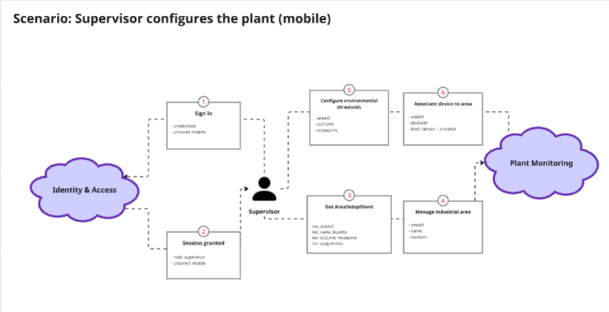
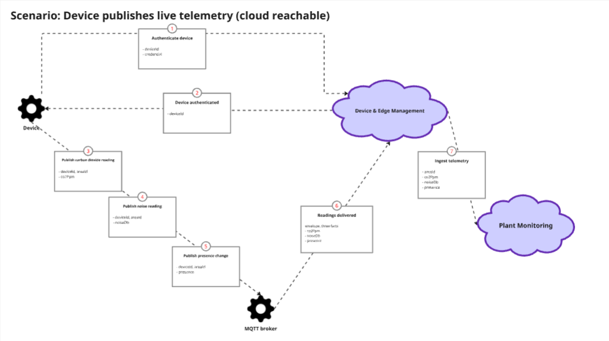
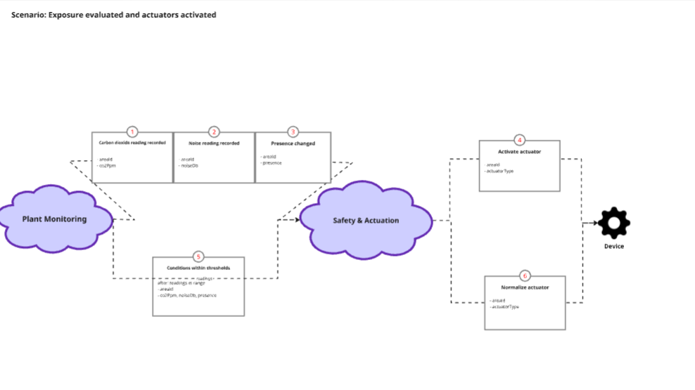
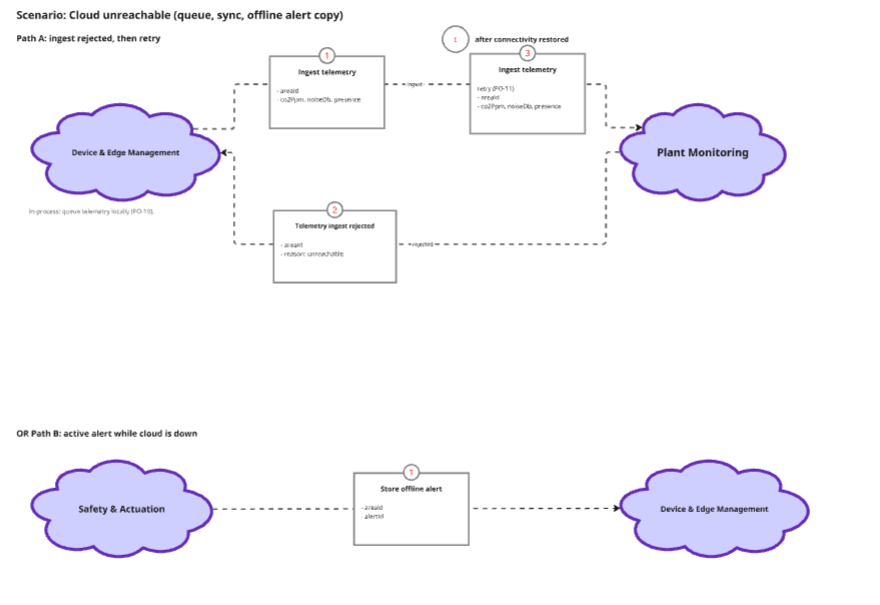
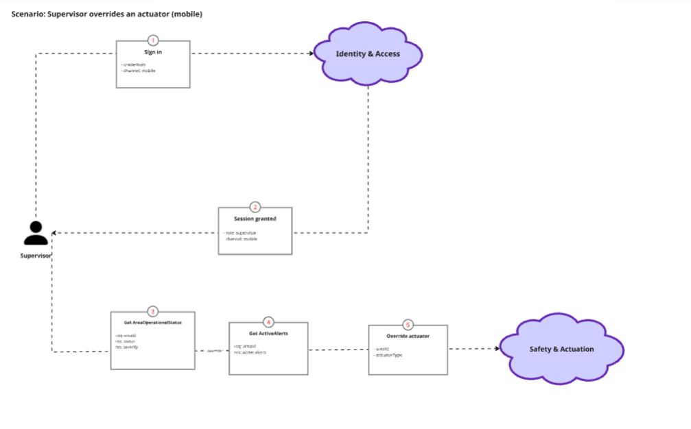

**Navegación:** [Índice](./00-student-outcome.md#s-tabla-contenidos) · Anterior: [Capítulo III](./03-capitulo-iii-requirements-specification.md) · Siguiente: [Capítulo V](./05-capitulo-v-solution-ui-ux-design.md)

---

# Capítulo IV: Solution Software Design

## 4.1. Strategic-Level Domain-Driven Design

### 4.1.1. Design-Level EventStorming

A partir del Big Picture EventStorming del Capítulo II y de las épicas EP02–EP07, el equipo realizó una sesión de **Design-Level EventStorming** para refinar el modelo hacia la implementación. Se avanzó por capas sobre el mismo tablero. El resultado son cuatro contextos: Identity & Access, Plant Monitoring, Safety & Actuation y Device & Edge Management. El objetivo fue validar flujos críticos —autenticación por rol, registro de telemetría, evaluación de exposición con actuación automática y ciclo de vida de dispositivos edge— antes de definir message flows y el context map.

**Captura 1 — Unstructured exploration y timelines** (eventos de dominio en orden de ocurrencia).

**Captura 2 — Pain points y pivotal points**

**Captura 3 — Commands, policies, read models y sistemas externos.**

**Captura 4 — Aggregates** 

**Captura 5 — Bounded contexts**

Event stormig completo : [ver en Miro](ENLACE_AQUI)

#### 4.1.1.1 Candidate Context Discovery

Los contextos candidatos se identificaron aplicando la heurística de **un Bounded Context por lenguaje ubicuo y dueño de datos**, tomando como entrada las user stories abordadas Capítulo III y el lenguaje del dominio SafePlant.

<table>
  <thead>
    <tr>
      <th align="left">Bounded Context</th>
      <th align="left">Tipo (DDD)</th>
      <th align="left">Propósito</th>
      <th align="left">Épica(s)</th>
      <th align="left">Fuera de alcance</th>
    </tr>
  </thead>
  <tbody>
    <tr>
      <td align="left"><strong>Identity & Access</strong></td>
      <td align="left">Generic Subdomain</td>
      <td align="left">Autenticación, roles, recuperación de credenciales y autorización por canal (app móvil supervisor, app web encargado de planta).</td>
      <td align="left">EP02; usuarios y roles de EP03</td>
      <td align="left">Telemetría, reglas de seguridad ni gestión de dispositivos. Vive en el monolito Cloud; el Edge no administra usuarios, solo autentica dispositivos mediante tokens o API keys.</td>
    </tr>
    <tr>
      <td align="left"><strong>Plant Monitoring</strong></td>
      <td align="left">Core Domain</td>
      <td align="left">Definición topológica de la planta (áreas, umbrales) y registro histórico de telemetría: CO₂, ruido y presencia.</td>
      <td align="left">EP03</td>
      <td align="left">Evaluación de exposición, disparo de actuadores, inventario hardware ni despliegues OTA.</td>
    </tr>
    <tr>
      <td align="left"><strong>Safety & Actuation</strong></td>
      <td align="left">Dominio de reglas de seguridad</td>
      <td align="left">Cruce presencia × condiciones ambientales (exposición), motor de reglas de riesgo, activación de extractores, sirenas y mamparas acústicas, y anulación remota de actuadores.</td>
      <td align="left">EP04, EP05</td>
      <td align="left">Configuración de áreas/umbrales (Plant Monitoring), identidad de usuarios ni ciclo de vida de firmware en edge.</td>
    </tr>
    <tr>
      <td align="left"><strong>Device & Edge Management</strong></td>
      <td align="left">Supporting Subdomain</td>
      <td align="left">Inventario y salud de hardware edge (ESP32, Raspberry Pi), despliegues OTA, sincronización offline y conectividad segura hacia Cloud.</td>
      <td align="left">EP07</td>
      <td align="left">Reglas de negocio de seguridad ocupacional ni semántica de telemetría/umbrales de planta.</td>
    </tr>
  </tbody>
</table>

#### 4.1.1.2 Domain Message Flows Modeling

Con los cuatro bounded contexts ya delimitados, el equipo modeló cómo colaboran para resolver casos de uso de SafePlant mediante **Domain Message Flow Modelling**: actores, sistemas externos y bounded contexts intercambian mensajes numerados (comando, evento o consulta) con campos de negocio. MQTT es un sistema externo; el Edge no es un quinto contexto ni un “IoT Gateway”.

**Historia 1 — Plant setup.** El supervisor, con sesión móvil en Identity & Access, define áreas, umbrales y asociación de dispositivos en Plant Monitoring.

**Historia 2 — Telemetry ingest.** El dispositivo se autentica, publica lecturas de CO₂, ruido y presencia (sin unificarlas) en el broker MQTT; Device & Edge las ingiere en Plant Monitoring. La evaluación de riesgo queda fuera de este flujo.

**Historia 3 — Exposure and actuation.** Plant Monitoring notifica lecturas y presencia a Safety & Actuation, que detecta excesos, clasifica exposición, alerta y activa extractores, sirenas o mamparas; al volver a rango, normaliza. La actuación física la ejecuta el dispositivo, no Device & Edge Management.

**Historia 4 — Offline and sync.** Si el ingest falla, Device & Edge encola telemetría y sincroniza al recuperar conectividad. Si hay alerta ambiental y cloud no alcanza, Device & Edge guarda una copia local; Safety & Actuation sigue siendo dueño del riesgo.

**Historia 5 — Supervisor override.** El supervisor, autenticado en canal móvil, consulta el estado operativo y las alertas activas y anula un actuador en Safety & Actuation. Identity no evalúa exposición; un intento desde el canal web se deniega.

#### 4.1.1.3 Bounded Context Canvases

### 4.1.2. Context Mapping

### 4.1.3. Software Architecture

#### 4.1.3.1. Software Architecture System Landscape Diagram

#### 4.1.3.2. Software Architecture Context Level Diagrams

#### 4.1.3.2. Software Architecture Container Level Diagrams

#### 4.1.3.3. Software Architecture Deployment Diagrams

## 4.2. Tactical-Level Domain-Driven Design

> Documentar cada Bounded Context en `bounded-contexts/` a partir de [`templates/bounded-context.md`](./templates/bounded-context.md).

<table>
  <thead>
    <tr>
      <th align="left">#</th>
      <th align="left">Bounded Context</th>
      <th align="left">Documento</th>
    </tr>
  </thead>
  <tbody>
    <tr>
      <td align="left">4.2.1</td>
      <td align="left"></td>
      <td align="left"></td>
    </tr>
  </tbody>
</table>

---

**Navegación:** [Índice](./00-student-outcome.md#s-tabla-contenidos) · Anterior: [Capítulo III](./03-capitulo-iii-requirements-specification.md) · Siguiente: [Capítulo V](./05-capitulo-v-solution-ui-ux-design.md)
