**Navegación:** [Índice](./00-student-outcome.md#s-tabla-contenidos) · Anterior: [Capítulo IV](./04-capitulo-iv-solution-software-design.md) · Siguiente: [Capítulo VI](./06-capitulo-vi-product-implementation.md)

---

<a id="s-cap-v"></a>
# Capítulo V: Solution UI/UX Design

<a id="s-5-1"></a>
## 5.1. Style Guidelines

<a id="s-5-1-1"></a>
### 5.1.1. General Style Guidelines

Los *style guidelines* son un conjunto de principios visuales y comunicacionales que permite mantener coherencia y claridad en la interfaz del producto. En el caso de SAFEPLANT, esta guía busca comunicar profesionalismo, precisión técnica y una identidad cercana al rubro de la seguridad industrial y el monitoreo de plantas.

La sección fija las decisiones de marca, tipografía, color y espaciado, y define el tono del lenguaje. El punto de partida es un design system de referencia: la escala modular tipográfica y los colores semánticos de Tailwind CSS. Esas referencias se adaptan al monitoreo industrial para que la consola web, la aplicación móvil y el dispositivo IoT se lean con rapidez cuando una condición de planta exige una respuesta. Las decisiones se apoyan en cuatro principios: jerarquía visual, para distinguir el dato crítico del contexto; consistencia, para que el mismo signo conserve su significado en todas las pantallas; contraste, para que el texto y los estados sigan siendo legibles; y retroalimentación, para que cada control confirme la acción del usuario.

**Branding: Nombre de marca**

SAFEPLANT representa una plataforma digital de telemetría y seguridad para plantas industriales. El nombre fusiona la protección del personal y de las condiciones de trabajo ("safe") con el entorno industrial donde opera el sistema ("plant").

El signo es un escudo con una marca de verificación. El contenedor en azul marino y el símbolo en cian separan la identidad de los colores de estado: el rojo, el ámbar y el verde quedan reservados para crítico, advertencia y condición normal. Se definen dos configuraciones del mismo logo, apilada y horizontal, para usarlo en el menú, la barra superior y la pantalla del dispositivo sin alterar el signo.


.png>)

.png>)

**Misión:**
Brindar herramientas digitales que profesionalicen el trabajo del supervisor de seguridad y del encargado de planta, integrando la tecnología IoT con la prevención de riesgos ambientales.

**Visión:**
Ser la plataforma líder en monitoreo, mitigación automática y trazabilidad de condiciones de seguridad para plantas industriales en Latinoamérica.

**Colores:**

La paleta toma como referencia los tokens semánticos de Tailwind CSS y los adapta con un azul marino y un cian propios de SAFEPLANT. El azul marino (#0F2744) sostiene la navegación, el logo y el texto sobre fondo claro. El cian (#00E5FF) y el azul (#2563EB) marcan la acción y la tecnología de monitoreo. El verde (#10B981), el ámbar (#F59E0B) y el rojo (#EF4444) codifican una condición normal, una advertencia y un estado crítico, de modo que la severidad se reconoce antes de leer la etiqueta. El texto blanco (#FFFFFF) sobre el azul marino, y el azul marino sobre los fondos claros (#F8F9FF y #FFFFFF), conservan el contraste de lectura en la consola.

**Primario:** Azul Marino #0F2744

**Secundarios:** Azul Profundo #1B3B64, Azul #2563EB y Cian #00E5FF

**Terciarios:** Azul Claro #CBDBF5, Azul Hielo #EFF4FF y Fondo #F8F9FF

**Estados:** Verde #10B981, Ámbar #F59E0B, Rojo #EF4444 y Gris #64748B

**Color de texto:**

Sobre fondo oscuro: #FFFFFF

Sobre fondo claro: #0F2744

.png>)

**Color de botones:**

**Oscuro:** #0F2744

**Azul:** #2563EB

**Cian:** #00E5FF

**Gris:** #64748B

**Claro:** #CBDBF5

Cada variante se muestra en tres estados: Normal, Hover y Clicked / Checked.

.png>)

**Tipografía:**

La tipografía define la jerarquía visual y la legibilidad de la plataforma. SAFEPLANT usa una sola familia, Space Grotesk, para que la consola, la aplicación móvil y las referencias del dispositivo se perciban como el mismo producto. Es una sans geométrica de alto rendimiento en pantalla: sus formas abiertas favorecen la lectura de etiquetas cortas y de valores como PPM y dBA.

La escala parte de una base de 16px, con proporción Major Third (1.25) e interlineado de 1.5. Esa proporción, habitual en los design systems de interfaz, produce saltos perceptibles entre niveles y evita elegir tamaños de forma arbitraria. Los peldaños resultantes son 61, 49, 39, 31, 25, 20, 16 y 13px. Cada estilo se nombra como Nombre / Tamaño / Peso.

En la interfaz, esa escala es la referencia y algunos tamaños se ajustan al contexto de lectura. El título de página sube a 128px en la vista principal, y el texto de cuerpo se fija en 18px para leer indicadores con comodidad. Los estilos aplicados son:

- **Heading 01:** Space Grotesk Black – 128px. Título principal de página.
- **Heading 02:** Space Grotesk Bold – 60px. Título de sección.
- **Heading 03:** Space Grotesk Bold – 43px. Título de subsección.
- **Heading 04:** Space Grotesk Bold – 30px. Encabezado menor.
- **Heading 05:** Space Grotesk Bold – 32px. Subtítulo.
- **Heading 06:** Space Grotesk SemiBold – 24px. Encabezado pequeño dentro de una tarjeta o panel.
- **Texto principal:** Space Grotesk Regular – 18px. Párrafos, indicadores y valores técnicos. El texto destacado usa Bold, las citas Italic y los enlaces Regular con subrayado y color azul.
- **Captions:** Space Grotesk ExtraLight Italic – 18px. Acompañan gráficas y tablas sin competir con el dato.

Los pesos disponibles van de Thin a Black. En la práctica se usan Regular para leer, Medium y SemiBold para la jerarquía intermedia, y Bold o Black para lo que debe verse primero. Los valores técnicos, como PPM y dBA, permanecen en Space Grotesk para conservar una sola familia en cifras, unidades y etiquetas.


**Espaciado:**

El espaciado ordena la relación entre texto, controles y bloques de información. La base de 16px fija una retícula de 8px, la misma lógica de espaciado de Tailwind, adaptada a esta interfaz. Los intervalos crecen en múltiplos de esa unidad —8, 16, 24 y 32px— para que márgenes, separación entre tarjetas y aire alrededor de los indicadores sigan el mismo ritmo en escritorio y en móvil. El interlineado de 1.5 evita comprimir los valores de CO₂, ruido y estado. Los botones, campos y paneles usan un radio de 10px: suaviza el contorno y conserva la sobriedad de una consola de planta.

**Tono de comunicación:**

El lenguaje se define sobre cuatro dimensiones, de acuerdo con el contexto de uso: un supervisor o un gerente que consulta el estado de la planta y, en ocasiones, debe actuar sobre un incidente.

- **Serio.** La interfaz informa riesgo ocupacional y cumplimiento. Las etiquetas nombran la condición con precisión —Crítico, Advertencia, Información, Normal, Precaución, Elevado— y reservan el énfasis visual para la severidad.
- **Formal y accesible.** Se mantiene el término técnico que el personal ya usa (CO₂, PPM, dBA, zona, nodo), en etiquetas de una a cuatro palabras. Un botón dice "Reconocer" o "Guardar Límite de CO₂", y un indicador muestra el límite junto al valor.
- **Respetuoso.** El sistema se dirige al supervisor de seguridad y al gerente de planta como responsables de la operación. Los mensajes describen el estado y la acción disponible, sin culpabilizar al usuario ni minimizar el evento.
- **Sereno.** Ante una alerta, el texto se mantiene directo y calmado. La urgencia la comunican el color, la jerarquía y el orden del incidente —detección, mitigación, confirmación y cierre—, no la exageración del mensaje. Esa calma favorece una respuesta oportuna.

En conjunto, el tono es profesional y técnico, y se mantiene claro para quien opera en planta.

<a id="s-5-1-2"></a>
### 5.1.2. Web, Mobile and IoT Style Guidelines

SAFEPLANT mantiene la misma paleta, la misma tipografía y los mismos colores de severidad en la consola web, la aplicación móvil y la lectura del nodo IoT. Cambia el gesto y el espacio disponible. En escritorio se comparan varias zonas a la vez. En el teléfono se consulta y se reconoce una alerta con una mano. En la planta, el dispositivo ejecuta la respuesta física y la confirmación queda en la pantalla del supervisor.

**Interfaz web**

El diseño web es limpio y está centrado en la operación. Las tarjetas resumen primero el estado —CO₂, presión acústica, personal en zona y alertas— y después dejan paso a la tabla y a la curva. Las gráficas marcan el límite normativo con una línea de contraste alto, para ver de inmediato si la lectura lo superó. Cada zona, sensor y actuador lleva un ícono y el color de severidad definido en la guía.

Los botones primarios son redondeados, con fondo #0F2744 y texto blanco. Los secundarios usan el azul #2563EB o el fondo claro #CBDBF5. El rojo #EF4444 identifica la severidad crítica y la confirmación de una acción que interrumpe una mitigación, y así queda separado del botón de trabajo habitual. Cada botón responde en Normal, Hover y Clicked / Checked.

Las tablas listan incidentes, zonas y nodos. El encabezado marca la jerarquía, la severidad ocupa un lugar visible y las filas se separan para recorrer código, lectura y estado. Zona, severidad y ventana temporal se filtran en la misma vista.

Las confirmaciones usan ventanas propias de la aplicación, sobre un fondo atenuado, con la acción y el cierre visibles. Sirven para reconocer un incidente o guardar un umbral. En web, móvil e IoT se usan los mismos controles genéricos: botones, campos de búsqueda, paneles de filtro y ventanas emergentes.

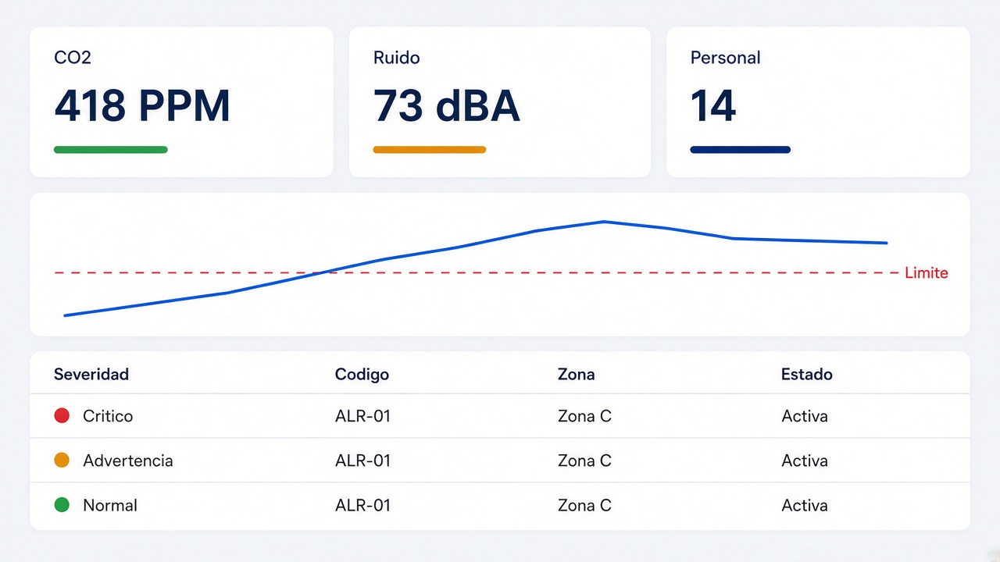

.png>)

.png>)

.png>)

.png>)

**Interfaz móvil**

La aplicación conserva los nombres de sección y el significado de cada color. El contenido pasa a una columna, la navegación baja a una barra de cinco íconos —Panel, Alertas, Umbrales, Historial y Equipos— y la alerta crítica queda arriba, al alcance del pulgar. Reconocer o aceptar se hace sobre la tarjeta. En un ancho menor, las tarjetas y las gráficas se apilan y las etiquetas se mantienen.

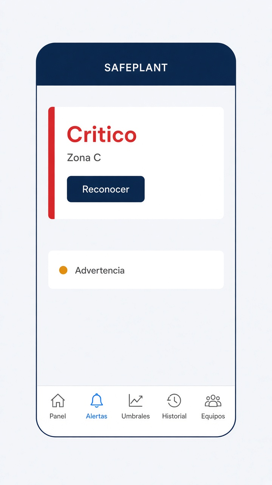

**Interfaz de la aplicación IoT y del dispositivo físico**

En el panel y en Equipos, el nodo usa el mismo lenguaje que la consola: En línea, En diagnóstico, sensor, extractor, alarma y mampara. La vista es compacta porque el supervisor la consulta en planta, a menudo desde el teléfono.

La interfaz física del nodo comunica el riesgo con la actuación. El ESP32 mide CO₂, ruido y presencia, y quien está en la zona percibe el ventilador de extracción, la alarma acústica o la mampara de seguridad. Esos efectos siguen la misma regla que la alerta en pantalla. Reconocer el incidente y cambiar un umbral se hacen en la aplicación o en la web, para que el personal no tenga que operar el nodo dentro del área expuesta. Si el enlace falla, la interfaz muestra diagnóstico o pérdida de telemetría, y la actuación local sigue disponible en la planta.

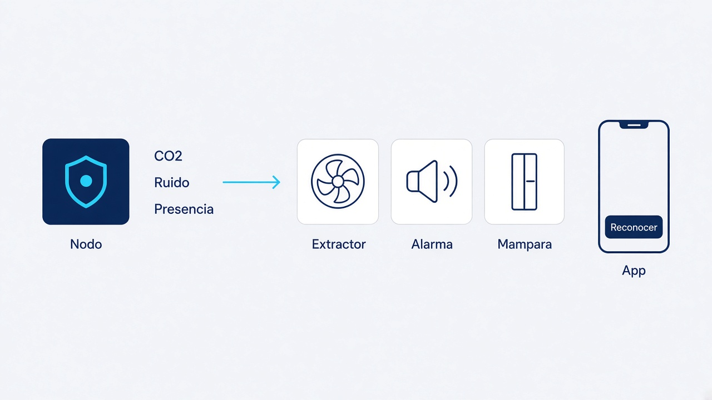
<a id="s-5-2"></a>


<a id="s-5-2"></a>
## 5.2. Information Architecture

La arquitectura de información de SAFEPLANT guía al supervisor de seguridad y al gerente de planta de forma lógica, eficiente y contextual. Cada módulo sigue el ciclo de la seguridad en planta: leer las condiciones de la zona (CO₂, ruido y presencia), detectar la exposición, ejecutar la mitigación, confirmar el incidente y dejar el registro listo para auditoría. Así, el dato técnico se captura en el momento y queda disponible para el análisis y la decisión posterior, tanto en la consola web como en el teléfono.

El Panel de Control es el punto de entrada porque la primera pregunta del usuario es el estado de la planta. Desde ahí, la arquitectura acerca el detalle solo cuando aparece una anomalía, hace falta ajustar un umbral o conviene revisar un nodo. El supervisor recorre todas las secciones y puede configurar el sistema. El gerente consulta el panel y el historial, sin modificar la operación.

A continuación se detallan los sistemas de organización, etiquetado, posicionamiento web, búsqueda y navegación que sostienen esa experiencia.

<a id="s-5-2-1"></a>
### 5.2.1. Organization Systems

En SAFEPLANT cada grupo de información usa el sistema que mejor sirve a la tarea. Hay dos familias. La organización visual define cómo se lee un conjunto en pantalla: de forma jerárquica, secuencial o matricial. La categorización define cómo se agrupa y se recupera ese contenido: por tópicos, por zona, por orden alfabético, por tiempo y por audiencia.

**Organización visual**

La **organización jerárquica** se aplica cuando el usuario debe ver primero lo urgente. En el Panel de Control el orden visual es indicadores generales (CO₂, presión acústica y personal en zonas críticas), luego la matriz de zonas y, al final, la respuesta automatizada y el estado de los nodos. En Alertas, el incidente crítico tiene más peso visual que la advertencia y que el mensaje informativo.

La **organización secuencial** se aplica cuando la tarea se completa por pasos. El incidente sigue detección del peligro, mitigación automática, pendiente de confirmación y, al cierre, resuelto o auditado. La configuración de umbrales sigue otro recorrido: el supervisor elige la zona, ajusta el límite de CO₂ o de ruido y guarda el cambio.

La **organización matricial** se aplica cuando hay que comparar varios elementos a la vez. Se usa en la matriz ambiental de zonas, en la matriz comparativa de umbrales y en las tablas de alertas y de registro de incidentes.

**Categorización del contenido**

La **categorización por tópicos** agrupa la telemetría según el parámetro medido: CO₂, presión acústica y presencia de personal. En Dispositivos, el mismo criterio separa sensores de monitoreo y actuadores de control.

La **categorización geográfica** divide la planta en zonas industriales. Alertas, historial, umbrales y dispositivos se filtran por zona, porque el riesgo se atiende en el lugar donde ocurre.

La **categorización alfabética** se usa para localizar un elemento conocido por su código. Zonas, nodos y eventos se ordenan por ese código cuando el usuario busca un identificador concreto, no cuando evalúa la urgencia.

La **categorización cronológica** ordena incidentes y registros del más reciente al más antiguo. En las gráficas, el mismo criterio ofrece las ventanas 1h, 6h, 12h y 24h, y en el historial también 7d y 30d.

La **categorización por audiencia** separa lo que ve cada grupo de usuarios. El supervisor de seguridad accede a todas las secciones y es quien configura umbrales, gestiona alertas y administra los nodos, desde la app móvil y la consola web. El gerente de planta consulta el Panel de Control y el Historial: ve el dashboard, las gráficas y los resultados, y no modifica la configuración.


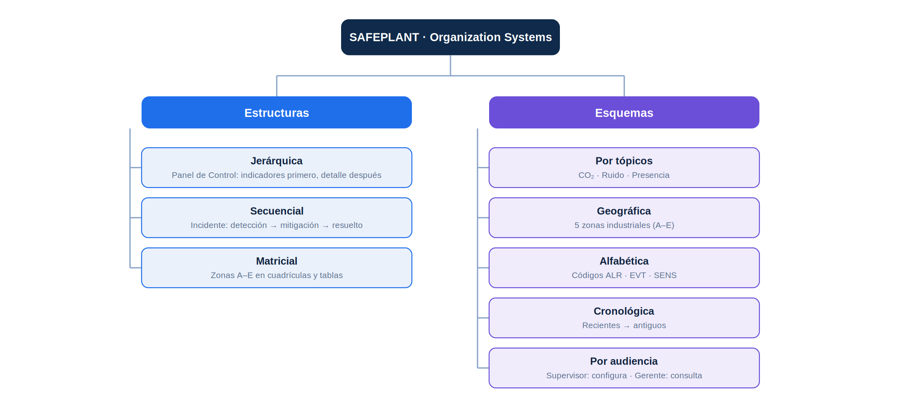


<a id="s-5-2-2"></a>
### 5.2.2. Labeling Systems

El sistema de etiquetado busca representar la información de forma clara y sin ambigüedades, usando etiquetas concisas de una a cuatro palabras, un lenguaje técnico reconocible para el personal de seguridad industrial y un estilo consistente en toda la plataforma. Cuando es necesario, las etiquetas se acompañan de íconos y de colores que refuerzan su significado. Las etiquetas utilizadas son:

- **Navegación principal:** Panel de Control, Umbrales, Alertas, Historial y Dispositivos. En la versión móvil se abrevian a Panel, Alertas, Umbrales, Historial y Equipos.
- **Niveles de severidad:** Crítico, Advertencia e Información. Se diferencian por color: rojo para crítico, amarillo para advertencia y azul para información.
- **Estados de lectura y zona:** Normal, Precaución y Elevado.
- **Estados del incidente:** Mitigación Activa, Pendiente de Confirmación, Normalizado y Resuelto / Auditado.
- **Estados de dispositivos y reglas:** En Línea, En Espera, Sincronizado, En Diagnóstico y Armada y Activa.
- **Botones de acción:** Reconocer, Aceptar, Filtrar, Exportar PDF, Reporte de Cumplimiento (PDF), Configurar Disparadores de Alerta, Guardar Límite de CO₂ y Guardar Límite de Ruido.
- **Parámetros y unidades:** CO₂ (PPM) y Presión Acústica (dBA), siempre acompañados de su límite normativo (por ejemplo, "Límite: 800 PPM").
- **Componentes de dispositivos:** Sensor de Sonido, Sensor de CO₂, Sensor de Movimiento, Ventilador de Extracción, Alarma Acústica y Mamparas de Seguridad.

Este lenguaje directo evita la sobrecarga de información y permite tomar decisiones rápidas ante una situación de riesgo.


<a id="s-5-2-3"></a>
### 5.2.3. SEO Tags and Meta Tags

Para la versión web de SAFEPLANT se definen las siguientes etiquetas base:

```html
<meta charset="UTF-8">
<meta name="viewport" content="width=device-width, initial-scale=1.0">
<title>SAFEPLANT | Telemetría de Seguridad Industrial</title>
```

Meta tags adicionales que pueden implementarse:

```html
<meta name="description" content="SAFEPLANT es una plataforma IoT que monitorea en tiempo real el CO₂, el ruido y la presencia de personal en zonas industriales, y activa respuestas automáticas de seguridad.">
<meta name="keywords" content="IoT, seguridad industrial, telemetría, CO2, ruido">
<meta property="og:title" content="SAFEPLANT | Telemetría de Seguridad Industrial">
<meta property="og:description" content="Monitoreo ambiental en tiempo real y mitigación automatizada en planta.">
<meta property="og:image" content="URL_imagen_destacada.jpg">
```

- `description` ofrece un resumen del proyecto para los buscadores.
- `keywords` ayuda a clasificar el tema de la plataforma.
- `og:title`, `og:description` y `og:image` controlan cómo se ve SAFEPLANT al compartirse en redes sociales.


<a id="s-5-2-4"></a>
### 5.2.4. Searching Systems

SAFEPLANT cuenta con un sistema de búsqueda simple, basado en barras de texto ubicadas dentro de las secciones donde hay grandes volúmenes de registros:

- **Alertas:** barra "Buscar código, zona o incidente..." que permite localizar una alerta específica.
- **Historial:** barra "Buscar por código, operador, nodo..." para encontrar eventos auditados.
- **Versión móvil:** barra "Buscar por código (ej. EVT) o nodo..." en el registro de eventos.

Además de la búsqueda por texto, el usuario puede refinar los resultados con filtros combinables: zona, severidad (Todos, Crítico, Advertencia, Auditados), ventana temporal y parámetro de telemetría. La búsqueda se ejecuta al escribir el término clave y presionar "Enter".

```html
<!-- Barra de búsqueda de alertas e incidentes -->
<form action="/alertas/search" method="GET">
  <input
    type="text"
    name="query"
    placeholder="Buscar código, zona o incidente..."
    aria-label="Buscar código, zona o incidente"
    style="width: 100%; padding: 10px; font-size: 16px;" />
</form>
```

<a id="s-5-2-5"></a>
### 5.2.5. Navigation Systems

**Navegación lateral (web):** la consola web incluye un menú lateral con las cinco secciones principales: Panel de Control, Umbrales, Alertas, Historial y Dispositivos. En la parte superior del menú se muestra el estado del sistema operativo (Planta Alfa y cantidad de nodos de telemetría activos), y la sección Alertas muestra un indicador numérico con las alertas pendientes. La barra superior presenta la ruta de ubicación (SAFEPLANT / Vista de Consola) y el usuario activo con su cargo.

**Navegación inferior (móvil):** en la aplicación móvil, las mismas secciones se acceden desde una barra inferior con íconos (Panel, Alertas, Umbrales, Historial y Equipos), que permite cambiar de sección con una sola mano y mantiene visible la ubicación actual.

**Navegación interna:** dentro de cada sección el usuario refina el contenido mediante:
- Pestañas de ventana temporal (1h, 6h, 12h, 24h; 7d, 30d).
- Filtros por zona, severidad y parámetro.
- Pestañas de estado de incidentes (Todos, Crítico, Advertencia, Auditados).
- Selector de zona en Dispositivos (Zona A a Zona E) y en la matriz comparativa de Umbrales, donde al tocar una zona se cargan sus límites.
- Paginación en las tablas de incidentes y registros.

**Navegación contextual:** desde el Panel de Control el usuario puede pasar al detalle, por ejemplo a Alertas desde un indicador crítico, o a Dispositivos desde la red de nodos IoT (Todos los Nodos). Desde Alertas y Historial se puede exportar el Reporte de Cumplimiento en PDF.

**Flujo de navegación esperado:** el usuario inicia sesión y llega al Panel de Control, donde evalúa el estado general de la planta. Si detecta una anomalía, entra a Alertas para reconocer el incidente y revisar la mitigación automática. Luego consulta el Historial para analizar la curva y auditar el evento, y si es necesario ajusta los límites en Umbrales. Finalmente revisa el estado de sensores y actuadores en Dispositivos.

<a id="s-5-3"></a>
## 5.3. Landing Page UI Design

<a id="s-5-3-1"></a>
### 5.3.1. Landing Page Wireframe

La versión wireframe de la landing page de SAFEPLANT fija la estructura en baja fidelidad, antes de color, tipografía e imágenes. Ordena la lectura del visitante: entender qué resuelve la plataforma, ver cómo se monitorea la planta y llegar a una acción para ingresar. Arriba, la navegación es un bloque de logo, enlaces y un botón. El hero deja a la izquierda el titular, un texto de apoyo y dos botones. A la derecha, una tarjeta reúne indicadores y una gráfica simple para anticipar CO₂, ruido y presencia. Debajo hay franjas de tarjetas: tres de capacidades, tres de métricas, tres módulos con ícono y cuatro bloques de incidentes o zonas. Luego, tres pasos numerados acompañan un rectángulo de formulario o consola. El cierre es un botón y el pie repite logo y enlaces. Gráficos y tarjetas son cajas simples, para revisar la jerarquía antes del mock-up.

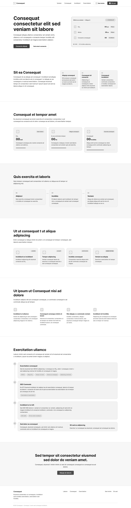

**Versión móvil**

En el wireframe móvil el mismo contenido pasa a una sola columna. El menú se reduce a un ícono, el hero apila el titular, los botones y la tarjeta de indicadores, y las franjas de tarjetas, los pasos y el cierre se leen de arriba hacia abajo. Se conservan las secciones y la acción de ingreso.

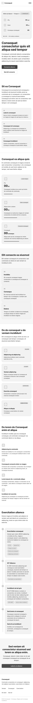

<a id="s-5-3-2"></a>
### 5.3.2. Landing Page Mock-up

La landing page de SAFEPLANT presenta la propuesta de valor y sus principales capacidades de forma visual, guiando al visitante desde una introducción al sistema hasta la invitación a conocer o iniciar la solución. El mock-up aplica los lineamientos visuales del proyecto y adapta su composición para navegadores de escritorio y móviles.

**Landing Page para Desktop Web Browser**

En la versión de escritorio se utiliza una paleta de tonos azul oscuro con acentos celestes y turquesa, asociada con la tecnología, la seguridad y el monitoreo ambiental. La jerarquía tipográfica, las tarjetas de contenido y los botones de acción permiten identificar rápidamente las funciones principales de SAFEPLANT, mientras que el contraste favorece la legibilidad y mantiene una presentación visual consistente.

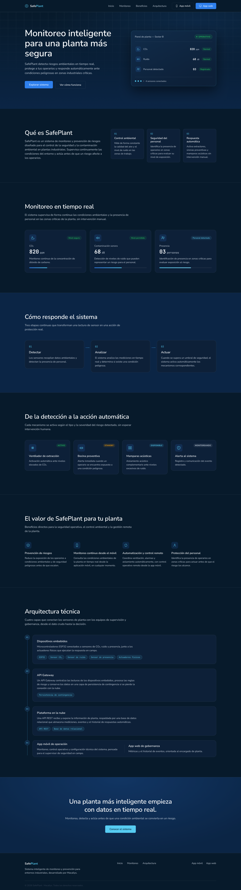

**Landing Page para Mobile Web Browser**

La versión móvil reorganiza el contenido en una columna para facilitar la lectura y la navegación en pantallas reducidas. Conserva la identidad visual, las secciones y las acciones principales de la versión de escritorio, priorizando el acceso mediante controles táctiles y manteniendo textos e indicadores legibles.


<a id="s-5-4"></a>
## 5.4. Applications UX/UI Design

<a id="s-5-4-1"></a>
### 5.4.1. Applications Wireframes


<a id="s-5-4-2"></a>
### 5.4.2. Applications Wireflow Diagrams


<a id="s-5-4-3"></a>
### 5.4.3. Applications Mock-ups

WEB:
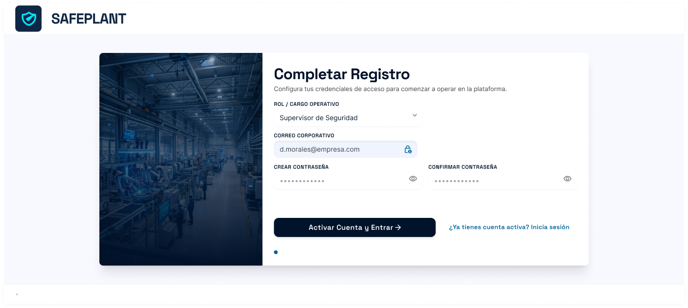
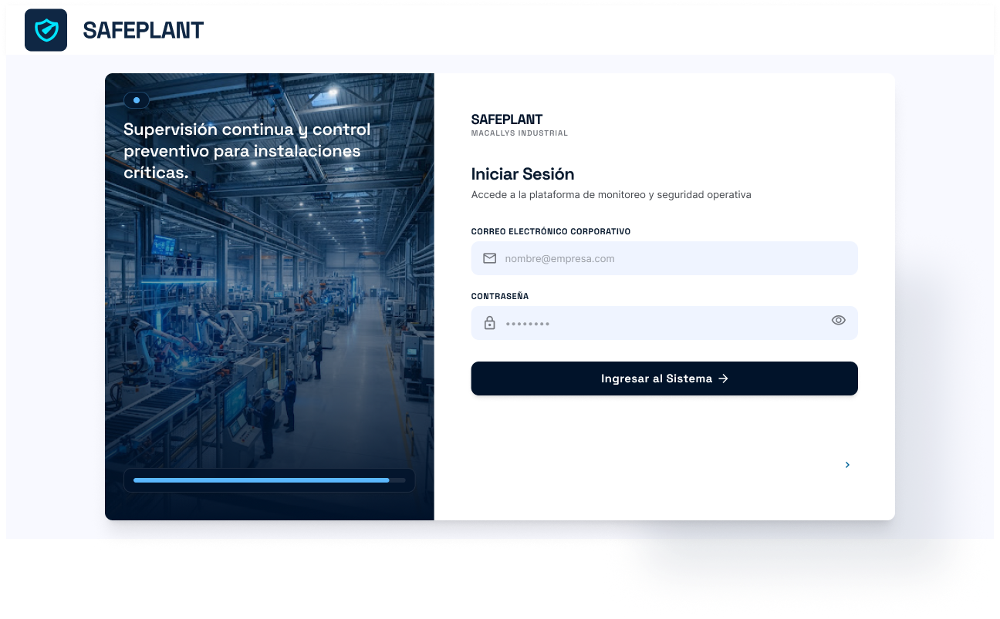
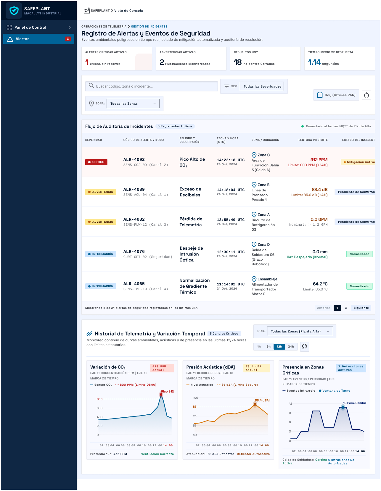
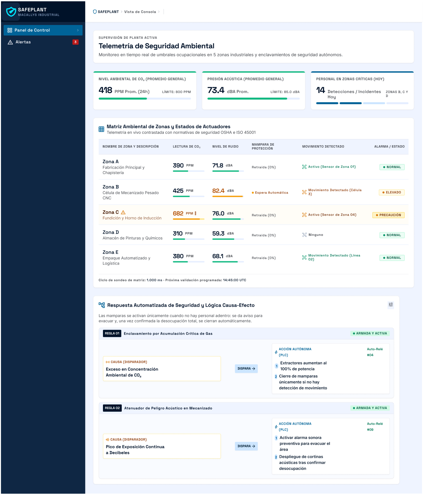
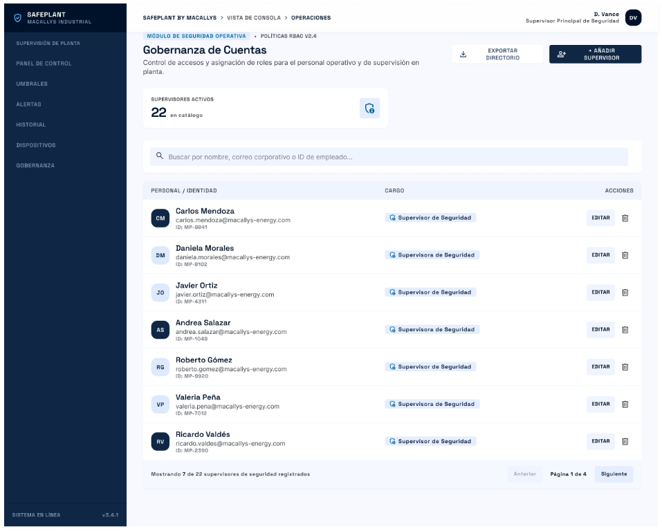

MOVIL:

.png>)
.png>)
.png>)
.png>)
.png>)
.png>)
.png>)

<a id="s-5-4-4"></a>
### 5.4.4. Applications User Flow Diagrams


<a id="s-5-5"></a>
## 5.5. Applications Prototyping

En esta sección presentamos los prototipos de interfaz de SAFEPLANT para navegadores web de escritorio y dispositivos móviles. Estos permiten simular la navegación y las interacciones principales antes de implementar la solución, y complementan los wireframes, mock-ups y diagramas de User Flow presentados anteriormente. Los criterios de diseño se aplican de manera coherente a la landing page y a la aplicación web, respetando las necesidades de información de cada contexto.

<a id="s-5-5-1"></a>
### 5.5.1. Criterios de diseño y decisiones de interacción

Las decisiones de interacción se definieron a partir de la arquitectura de información de SAFEPLANT y de los recorridos descritos en los User Flow Diagrams. La navegación principal conserva las secciones Panel de Control, Alertas, Umbrales, Historial y Dispositivos; su organización prioriza primero la consulta del estado de la planta y permite acceder después al detalle o a las acciones de configuración según el rol del usuario. La navegación contextual conecta indicadores o incidentes con la información relacionada, evitando que el usuario tenga que regresar al inicio para continuar una tarea.

Para que las pantallas sean reconocibles, se mantienen etiquetas, iconos, colores y patrones visuales consistentes con los style guides. Los niveles de severidad y los estados del sistema conservan los mismos significados en las distintas vistas. Los controles utilizan convenciones conocidas —como pestañas, filtros, selectores, botones y ventanas de confirmación— para que sus funciones puedan identificarse sin instrucciones adicionales.

El diseño responsive adapta la distribución de los contenidos al espacio disponible en escritorio y móvil, preservando la jerarquía visual, la legibilidad y el acceso a las acciones relevantes. En pantallas amplias, la interfaz facilita la comparación simultánea de indicadores y tablas; en móvil, prioriza la consulta rápida y organiza la navegación y el contenido para una pantalla reducida, sin cambiar los nombres ni el significado de las secciones.

La información se presenta de forma clara y orientada a la tarea: los indicadores importantes se distinguen de los datos complementarios, las etiquetas describen el contenido y los mensajes comunican estados o acciones con lenguaje directo. Las interacciones simuladas —por ejemplo, cambiar el periodo de una gráfica, filtrar alertas, consultar el detalle de un incidente o ajustar un umbral— corresponden a tareas previstas en los User Flow Diagrams y muestran la respuesta esperada de la interfaz. De esta manera, la arquitectura de información determina tanto qué opciones se muestran como el orden y la relación entre ellas.

<a id="s-5-5-2"></a>
### 5.5.2. Prototipos web de escritorio y móvil

El prototipo web de escritorio presenta la navegación y las vistas de consulta y gestión de SAFEPLANT para el supervisor de seguridad y la consulta de resultados para el gerente de planta, de acuerdo con los permisos descritos en la arquitectura de información. El prototipo móvil conserva las mismas secciones y etiquetas, adaptando su distribución para facilitar el acceso desde una pantalla más pequeña.

En ambos prototipos se busca representar los recorridos principales: ingresar al Panel de Control para revisar las condiciones de la planta; abrir una alerta para consultar el incidente y su mitigación; revisar el Historial para analizar eventos; y, para el supervisor, acceder a Umbrales o Dispositivos cuando la tarea requiera configuración o verificación. La navegación y los controles son una simulación de interacción para comunicar el comportamiento esperado de la solución.

**Prototipo móvil:** [Abrir prototipo en Figma](https://www.figma.com/proto/LQrxGncQXV76uBaTK4ZvQe/SAFEPLANT-IoT?node-id=76-2192&t=gFTPorlHMMO2VxnX-1&scaling=scale-down&content-scaling=responsive&page-id=9%3A2&starting-point-node-id=76%3A2192).

**Prototipo web de escritorio:** [Abrir prototipo en Figma](https://www.figma.com/proto/LQrxGncQXV76uBaTK4ZvQe/SAFEPLANT-IoT?node-id=67-2086&p=f&t=DnfUCKPU45KIZ1SG-1&scaling=scale-down&content-scaling=responsive&page-id=62%3A234&starting-point-node-id=62%3A2071).

<a id="s-5-6"></a>
## 5.6. IoT Device Design

Link a proyecto de Wowki: [https://wokwi.com/projects/477285427305212929](https://wokwi.com/projects/477285427305212929)

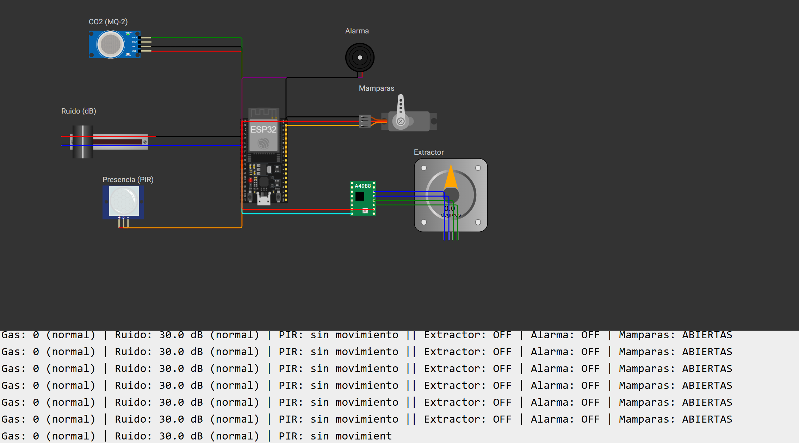

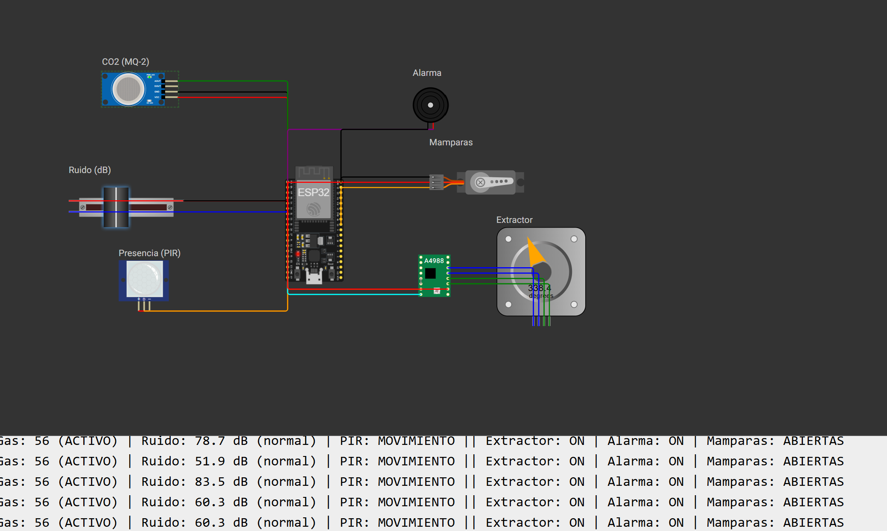

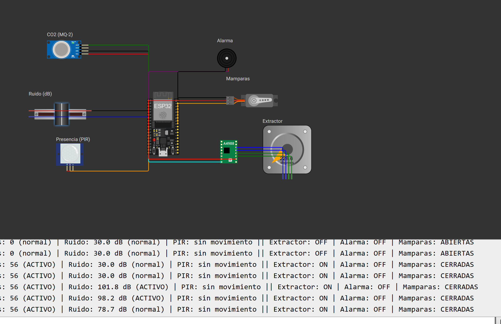

---

**Navegación:** [Índice](./00-student-outcome.md#s-tabla-contenidos) · Anterior: [Capítulo IV](./04-capitulo-iv-solution-software-design.md) · Siguiente: [Capítulo VI](./06-capitulo-vi-product-implementation.md)
