
# Carátula

**Universidad Peruana de Ciencias Aplicadas**

**Facultad de Ingeniería**

**Carrera de Ingeniería de Software**

**Ciclo académico:** 2026-20

---

**Código del curso:** 1ASI0572

**Nombre del curso:** Desarrollo de Soluciones IoT

**NRC:** [NRC]

**Nombre del profesor:** [Apellidos y Nombres]

---

**Informe de Trabajo Final**

**Nombre del startup:** [Nombre del startup]

**Nombre del producto:** [Nombre del producto]

## Relación de integrantes

<table>
  <thead>
    <tr>
      <th align="left">Código</th>
      <th align="left">Apellidos y Nombres</th>
    </tr>
  </thead>
  <tbody>
    <tr>
      <td align="left">U20231B775</td>
      <td align="left">Solano Armas, Angelo Héctor</td>
    </tr>
    <tr>
      <td align="left"></td>
      <td align="left"></td>
    </tr>
    <tr>
      <td align="left"></td>
      <td align="left"></td>
    </tr>
    <tr>
      <td align="left"></td>
      <td align="left"></td>
    </tr>
  </tbody>
</table>

**Mes y año:** [Mes, Año]

---

# Registro de Versiones del Informe

<table>
  <thead>
    <tr>
      <th align="left">Versión</th>
      <th align="left">Fecha</th>
      <th align="left">Autor</th>
      <th align="left">Descripción de modificación</th>
    </tr>
  </thead>
  <tbody>
    <tr>
      <td align="left">1.0</td>
      <td align="left">2026-08-31</td>
      <td align="left"></td>
      <td align="left">Inicialización del esqueleto del informe según enunciado del Trabajo Final.</td>
    </tr>
  </tbody>
</table>

---

# Project Report Collaboration Insights

**URL del repositorio (Project Report):** [URL de la organización / repositorio GitHub]

**Entrega AV1 / TB1 / AV2 / TB2**

---

# Contenido

## Tabla de contenidos

<!-- TOC:start -->

1. [Student Outcome](#s-student-outcome)
1. [Capítulo I: Introducción](#s-cap-i)
    1. [1.1. Startup Profile](#s-1-1)
        1. [1.1.1. Descripción de la Startup](#s-1-1-1)
        1. [1.1.2. Perfiles de integrantes del equipo](#s-1-1-2)
    1. [1.2. Solution Profile](#s-1-2)
        1. [1.2.1 Antecedentes y problemática](#s-1-2-1)
        1. [1.2.2 Lean UX Process](#s-1-2-2)
            1. [1.2.2.1. Lean UX Problem Statements](#s-1-2-2-1)
            1. [1.2.2.2. Lean UX Assumptions](#s-1-2-2-2)
            1. [1.2.2.3. Lean UX Hypothesis Statements](#s-1-2-2-3)
            1. [1.2.2.4. Lean UX Canvas](#s-1-2-2-4)
    1. [1.3. Segmentos objetivo](#s-1-3)
            1. [**Segmento Objetivo 1: Supervisor de Seguridad (App Móvil)**](#s-segmento-objetivo-1-supervisor-de-seguridad-app-movil)
            1. [**Segmento Objetivo 2: Encargado de Planta (App Web)**](#s-segmento-objetivo-2-encargado-de-planta-app-web)
1. [Capítulo II: Requirements Elicitation & Analysis](#s-cap-ii)
    1. [2.1. Competidores](#s-2-1)
        1. [2.1.1. Análisis competitivo](#s-2-1-1)
        1. [2.1.2. Estrategias y tácticas frente a competidores](#s-2-1-2)
    1. [2.2. Entrevistas](#s-2-2)
        1. [2.2.1. Diseño de entrevistas](#s-2-2-1)
        1. [2.2.2. Registro de entrevistas](#s-2-2-2)
            1. [Segmento objetivo 1: Supervisor de Seguridad (App Móvil)](#s-segmento-objetivo-1-supervisor-de-seguridad-app-movil-segmento-objetivo-1-supervisor-de-seguridad)
                1. [Entrevista 1](#s-entrevista-1)
                1. [Entrevista 2](#s-entrevista-2)
                1. [Entrevista 3](#s-entrevista-3)
            1. [Segmento objetivo 2: Encargado de Planta (App Web)](#s-segmento-objetivo-2-encargado-de-planta-app-web-segmento-objetivo-2-encargado-de-planta)
                1. [Entrevista 1](#s-entrevista-1-entrevista-1)
                1. [Entrevista 2](#s-entrevista-2-entrevista-2)
                1. [Entrevista 3](#s-entrevista-3-entrevista-3)
        1. [2.2.3. Análisis de entrevistas](#s-2-2-3)
    1. [2.3. Needfinding](#s-2-3)
        1. [2.3.1. User Personas](#s-2-3-1)
        1. [2.3.2. User Task Matrix](#s-2-3-2)
        1. [2.3.3. User Journey Mapping](#s-2-3-3)
        1. [2.3.4. Empathy Mapping](#s-2-3-4)
    1. [2.4. Big Picture EventStorming](#s-2-4)
    1. [2.5. Ubiquitous Language](#s-2-5)
1. [Chapter III: Requirements Specification](#s-chapter-iii-requirements-specification)
    1. [3.1. User Stories and Technical Stories](#s-3-1)
    1. [3.2. Impact Mapping](#s-3-2)
    1. [3.3. Product Backlog](#s-3-3)
1. [Capítulo IV: Solution Software Design](#s-cap-iv)
    1. [4.1. Strategic-Level Domain-Driven Design](#s-4-1)
        1. [4.1.1. Design-Level EventStorming](#s-4-1-1)
            1. [4.1.1.1 Candidate Context Discovery](#s-4-1-1-1)
            1. [4.1.1.2 Domain Message Flows Modeling](#s-4-1-1-2)
            1. [4.1.1.3 Bounded Context Canvases](#s-4-1-1-3)
        1. [4.1.2. Context Mapping](#s-4-1-2)
        1. [4.1.3. Software Architecture](#s-4-1-3)
            1. [4.1.3.1. Software Architecture System Landscape Diagram](#s-4-1-3-1)
            1. [4.1.3.2. Software Architecture Context Level Diagrams](#s-4-1-3-2)
            1. [4.1.3.2. Software Architecture Container Level Diagrams](#s-4-1-3-2-software-architecture-container-level-diagrams)
            1. [4.1.3.3. Software Architecture Deployment Diagrams](#s-4-1-3-3)
    1. [4.2. Tactical-Level Domain-Driven Design](#s-4-2)
        1. [4.2.1. Bounded Context: Plant Monitoring](#s-4-2-1)
            1. [4.2.1.1. Domain Layer](#s-4-2-1-1)
            1. [4.2.1.2. Interface Layer](#s-4-2-1-2)
            1. [4.2.1.3. Application Layer](#s-4-2-1-3)
            1. [4.2.1.4. Infrastructure Layer](#s-4-2-1-4)
            1. [4.2.1.5. Bounded Context Software Architecture Component Level Diagrams](#s-4-2-1-5)
            1. [4.2.1.6. Bounded Context Software Architecture Code Level Diagrams](#s-4-2-1-6)
                1. [4.2.1.6.1. Bounded Context Domain Layer Class Diagrams](#s-4-2-1-6-1)
                1. [4.2.1.6.2. Bounded Context Database Design Diagram](#s-4-2-1-6-2)
        1. [4.2.2. Bounded Context: Safety & Actuation](#s-4-2-2)
            1. [4.2.2.1. Domain Layer](#s-4-2-2-1)
            1. [4.2.2.2. Interface Layer](#s-4-2-2-2)
            1. [4.2.2.3. Application Layer](#s-4-2-2-3)
            1. [4.2.2.4. Infrastructure Layer](#s-4-2-2-4)
            1. [4.2.2.5. Bounded Context Software Architecture Component Level Diagrams](#s-4-2-2-5)
            1. [4.2.2.6. Bounded Context Software Architecture Code Level Diagrams](#s-4-2-2-6)
                1. [4.2.2.6.1. Bounded Context Domain Layer Class Diagrams](#s-4-2-2-6-1)
                1. [4.2.2.6.2. Bounded Context Database Design Diagram](#s-4-2-2-6-2)
        1. [4.2.3. Bounded Context: Device & Edge Management](#s-4-2-3)
            1. [4.2.3.1. Domain Layer](#s-4-2-3-1)
            1. [4.2.3.2. Interface Layer](#s-4-2-3-2)
            1. [4.2.3.3. Application Layer](#s-4-2-3-3)
            1. [4.2.3.4. Infrastructure Layer](#s-4-2-3-4)
            1. [4.2.3.5. Bounded Context Software Architecture Component Level Diagrams](#s-4-2-3-5)
            1. [4.2.3.6. Bounded Context Software Architecture Code Level Diagrams](#s-4-2-3-6)
                1. [4.2.3.6.1. Bounded Context Domain Layer Class Diagrams](#s-4-2-3-6-1)
                1. [4.2.3.6.2. Bounded Context Database Design Diagram](#s-4-2-3-6-2)
        1. [4.2.4. Bounded Context: Identity & Access](#s-4-2-4)
            1. [4.2.4.1. Domain Layer](#s-4-2-4-1)
            1. [4.2.4.2. Interface Layer](#s-4-2-4-2)
            1. [4.2.4.3. Application Layer](#s-4-2-4-3)
            1. [4.2.4.4. Infrastructure Layer](#s-4-2-4-4)
            1. [4.2.4.5. Bounded Context Software Architecture Component Level Diagrams](#s-4-2-4-5)
            1. [4.2.4.6. Bounded Context Software Architecture Code Level Diagrams](#s-4-2-4-6)
                1. [4.2.4.6.1. Bounded Context Domain Layer Class Diagrams](#s-4-2-4-6-1)
                1. [4.2.4.6.2. Bounded Context Database Design Diagram](#s-4-2-4-6-2)
1. [Capítulo V: Solution UI/UX Design](#s-cap-v)
    1. [5.1. Style Guidelines](#s-5-1)
        1. [5.1.1. General Style Guidelines](#s-5-1-1)
        1. [5.1.2. Web, Mobile and IoT Style Guidelines](#s-5-1-2)
    1. [5.2. Information Architecture](#s-5-2)
        1. [5.2.1. Organization Systems](#s-5-2-1)
        1. [5.2.2. Labeling Systems](#s-5-2-2)
        1. [5.2.3. SEO Tags and Meta Tags](#s-5-2-3)
        1. [5.2.4. Searching Systems](#s-5-2-4)
        1. [5.2.5. Navigation Systems](#s-5-2-5)
    1. [5.3. Landing Page UI Design](#s-5-3)
        1. [5.3.1. Landing Page Wireframe](#s-5-3-1)
        1. [5.3.2. Landing Page Mock-up](#s-5-3-2)
    1. [5.4. Applications UX/UI Design](#s-5-4)
        1. [5.4.1. Applications Wireframes](#s-5-4-1)
        1. [5.4.2. Applications Wireflow Diagrams](#s-5-4-2)
        1. [5.4.2. Applications Mock-ups](#s-5-4-2-applications-mock-ups)
        1. [5.4.3. Applications User Flow Diagrams](#s-5-4-3)
    1. [5.5. Applications Prototyping](#s-5-5)
    1. [5.6. IoT Device Design](#s-5-6)
1. [Capítulo VI: Product Implementation, Validation & Deployment](#s-cap-vi)
    1. [6.1. Software Configuration Management](#s-6-1)
        1. [6.1.1. Software Development Environment Configuration](#s-6-1-1)
        1. [6.1.2. Source Code Management](#s-6-1-2)
        1. [6.1.3. Source Code Style Guide & Conventions](#s-6-1-3)
        1. [6.1.4. Software Deployment Configuration](#s-6-1-4)
    1. [6.2. Landing Page, Services & Applications Implementation](#s-6-2)
        1. [6.2.X. Sprint n](#s-6-2-x)
            1. [6.2.X.1. Sprint Planning n](#s-6-2-x-1)
            1. [6.2.X.2. Aspect Leaders and Collaborators](#s-6-2-x-2)
            1. [6.2.X.3. Sprint Backlog n](#s-6-2-x-3)
            1. [6.2.X.4. Development Evidence for Sprint Review](#s-6-2-x-4)
            1. [6.2.X.5. Testing Suite Evidence for Sprint Review](#s-6-2-x-5)
            1. [6.2.X.6. Execution Evidence for Sprint Review](#s-6-2-x-6)
            1. [6.2.X.7. Services Documentation Evidence for Sprint Review](#s-6-2-x-7)
            1. [6.2.X.8. Software Deployment Evidence for Sprint Review](#s-6-2-x-8)
            1. [6.2.X.9. Team Collaboration Insights during Sprint](#s-6-2-x-9)
    1. [6.3. Validation Interviews](#s-6-3)
        1. [6.3.1. Diseño de Entrevistas](#s-6-3-1)
        1. [6.3.2. Registro de Entrevistas](#s-6-3-2)
        1. [6.3.3. Evaluaciones según heurísticas](#s-6-3-3)
    1. [6.4. Video About-the-Product](#s-6-4)
1. [Conclusiones](#s-conclusiones)
    1. [Conclusiones y recomendaciones](#s-conclusiones-recomendaciones)
    1. [Video About-the-Team](#s-video-about-the-team)
1. [Bibliografía](#s-bibliografia)
1. [Anexos](#s-anexos)
    1. [Videos de Exposiciones](#s-anexo-videos-exposiciones)
    1. [Repositorios y artefactos](#s-anexo-repositorios)

<!-- TOC:end -->

---

# Student Outcome

El curso contribuye al cumplimiento del Student Outcome ABET:

**ABET – EAC - Student Outcome 5**

**Criterio:** La capacidad de funcionar efectivamente en un equipo cuyos miembros juntos proporcionan liderazgo, crean un entorno de colaboración e inclusivo, establecen objetivos, planifican tareas y cumplen objetivos.

En el siguiente cuadro se describe las acciones realizadas y enunciados de conclusiones por parte del grupo, que permiten sustentar el haber alcanzado el logro del ABET – EAC - Student Outcome 5.

<table>
  <thead>
    <tr>
      <th align="left">Criterio específico</th>
      <th align="left">Acciones realizadas</th>
      <th align="left">Conclusiones</th>
    </tr>
  </thead>
  <tbody>
    <tr>
      <td align="left">Trabaja en equipo para proporcionar liderazgo en forma conjunta</td>
      <td align="left"></td>
      <td align="left"></td>
    </tr>
    <tr>
      <td align="left">Crea un entorno colaborativo e inclusivo, establece metas, planifica tareas y cumple objetivos.</td>
      <td align="left"></td>
      <td align="left"></td>
    </tr>
  </tbody>
</table>

---

# Capítulo I: Introducción

## 1.1. Startup Profile

### 1.1.1. Descripción de la Startup

**Macallys** nace con el propósito de transformar y automatizar la gestión de la seguridad ambiental en el sector industrial, ofreciendo una solución tecnológica integral para plantas que buscan proteger la salud de sus operarios y optimizar el cumplimiento de normativas. Nuestra propuesta se centra en proporcionar prevención automatizada, visibilidad en tiempo real y entornos de trabajo seguros.

Nuestra plataforma, permite a las empresas monitorear centralizadamente la concentración de CO2, los niveles de contaminación sonora y la presencia de personal en zonas críticas. Con una aplicación móvil, los supervisores de seguridad pueden controlar remotamente los dispositivos, recibir alertas y actuar al instante. Por otro lado, los encargados de planta acceden a una plataforma web intuitiva para configurar los umbrales del sistema, revisar el historial de datos y gestionar las actualizaciones. 

Macallys radica en su capacidad de respuesta: ante un exceso de CO2, el sistema acciona automáticamente un ventilador de extracción para purificar el ambiente; si detecta operarios expuestos a concentraciones peligrosas de gas o ruido, dispara una bocina preventiva y puede accionar mamparas móviles de aislamiento acústico.

Creemos firmemente que la digitalización y automatización de la seguridad industrial es el paso definitivo para garantizar la integridad de los trabajadores, reducir el ausentismo por problemas de salud y mejorar la sostenibilidad de las operaciones de manufactura e industria pesada.

**Misión:**
Nuestra misión es revolucionar la seguridad ocupacional en las plantas industriales mediante un sistema IoT inteligente que monitoree y mitigue automáticamente los riesgos ambientales.

**Visión:**
Aspiramos a convertirnos en el estándar líder en la automatización de la seguridad y salud en el trabajo en Latinoamérica, impulsando ecosistemas IoT que salven vidas y mejoren el bienestar laboral.

### 1.1.2. Perfiles de integrantes del equipo

<table>
  <thead>
    <tr>
      <th align="center">Foto</th>
      <th align="left">Apellidos y Nombres</th>
      <th align="left">Código</th>
      <th align="left">Carrera</th>
      <th align="left">Conocimientos técnicos y habilidades</th>
    </tr>
  </thead>
  <tbody>
    <tr>
      <td align="center"></td>
      <td align="left">Solano Armas, Angelo Héctor</td>
      <td align="left">U20231B775</td>
      <td align="left">Ingeniería de Software</td>
      <td align="left">Interés marcado por el curso y por las tecnologías emergentes, en especial las aplicadas a IoT. Actitud colaborativa, comunicación clara y disposición constante para aprender. Enfoque positivo ante los retos del proyecto y compromiso con el trabajo en equipo.</td>
    </tr>
    <tr>
      <td align="center"></td>
      <td align="left"></td>
      <td align="left"></td>
      <td align="left">Ingeniería de Software</td>
      <td align="left"></td>
    </tr>
    <tr>
      <td align="center"></td>
      <td align="left"></td>
      <td align="left"></td>
      <td align="left">Ingeniería de Software</td>
      <td align="left"></td>
    </tr>
    <tr>
      <td align="center"></td>
      <td align="left"></td>
      <td align="left"></td>
      <td align="left">Ingeniería de Software</td>
      <td align="left"></td>
    </tr>
  </tbody>
</table>

## 1.2. Solution Profile

### 1.2.1 Antecedentes y problemática

**Antecedentes**

El sector industrial enfrenta retos constantes relacionados a la salud ocupacional y el cumplimiento de las normativas ambientales. Según la Organización Internacional del Trabajo, cada año se producen millones de casos de enfermedades profesionales en el mundo derivadas de la exposición prolongada a agentes químicos y físicos en el lugar de trabajo. La acumulación de CO2 en espacios confinados y la alta contaminación sonora por maquinaria pesada figuran entre los principales causantes de bajas médicas y problemas respiratorios. 

Las soluciones actuales implementadas en muchas plantas son insuficientes: dependen de mediciones manuales esporádicas o de sistemas antiguos que solo emiten alertas visuales en paneles fijos, pero no toman acciones correctivas de manera automática. Esto deja a los trabajadores expuestos al riesgo hasta que un operador humano se da cuenta y enciende un extractor o evacúa el área.

**Problematica**

**What (Qué)**
Las industrias enfrentan un alto riesgo de enfermedades ocupacionales y multas debido a la exposición prolongada de su personal a niveles tóxicos de CO2 y contaminación sonora excesiva.

**When (Cuándo)**
Los problemas de contaminación y ruido se evidencian principalmente durante los picos de producción, donde la maquinaria opera a máxima capacidad y se genera mayor combustión o ruido. El personal técnico está más ocupado y puede omitir las revisiones manuales de calidad ambiental.

**Where (Dónde)**
Los incidentes ocurren en las zonas críticas dentro de las plantas: cuartos de máquinas, zonas de ensamblaje cerrado, áreas de calderas y pasillos confinados donde la ventilación natural es nula y el eco del ruido se amplifica.

**Who (Quién)**
Los involucrados principales son los Operarios de planta, quienes sufren directamente las consecuencias en su salud, y los Supervisores de Seguridad, que deben monitorear estas variables pero carecen de herramientas remotas. 

**Why (Porqué)**
Se implementa para automatizar la respuesta de seguridad, protegiendo la salud del personal y evitando indemnizaciones o accidentes de planta. Este sistema funciona al reaccionar en segundos sin depender del error o la demora humana, centralizando la información en aplicaciones dedicadas.

**How (Cómo)**
Mediante la instalación de una red IoT compuesta por sensores de CO2, sonómetros y detectores de presencia conectados a la plataforma Macallys. El sistema acciona como mitigación en milisegundos si se rompe el limite permitido. A la par, el Encargado de Planta configura las métricas desde la App Web, y el Supervisor de Seguridad visualiza el estado en tiempo real desde su App Móvil.

**How much(Cuánto)**
- **Impacto económico:** Las multas impuestas por la SUNAFIL (Superintendencia Nacional de Fiscalización Laboral) por incumplimiento de normativas de salud en el trabajo pueden superar los miles de soles, sin contar las indemnizaciones médicas por pérdida auditiva irreversible.
- **Tiempos de inactividad:** Las evacuaciones de emergencia por acumulación de gases paralizan las líneas de producción, costando a la empresa miles de dólares por cada hora de inactividad.

### 1.2.2 Lean UX Process

#### 1.2.2.1. Lean UX Problem Statements

El estado actual de la seguridad ambiental en plantas industriales está enfocado principalmente en revisiones manuales periódicas, reportes estáticos y sistemas de alerta aislados que no interactúan de forma directa con los mecanismos de la planta.

Nuestro producto abordará esta brecha mediante un sistema IoT industrial que interconecta la monitorización de CO2 y ruido con mitigadores automáticos y aplicaciones de control remoto, permitiendo reaccionar en el acto y mantener a salvo al personal en zonas críticas.

Nuestro enfoque inicial estará dirigido a supervisores de seguridad en campo y encargados de gestión de planta.

Sabremos que hemos tenido éxito cuando observemos una reducción drástica en el tiempo de exposición a niveles peligrosos de ruido y CO2, y una disminución en los incidentes de salud reportados, medido a través de los reportes históricos que generará el sistema.

#### 1.2.2.2. Lean UX Assumptions

<table>
  <thead>
    <tr>
      <th align="left">Tipo de assumption</th>
      <th align="left">Enunciados (creencias)</th>
    </tr>
  </thead>
  <tbody>
    <tr>
      <td align="left">Business Assumptions</td>
      <td align="left">• Creemos que las industrias necesitan reducir sus tasas de ausentismo por salud y evitar sanciones regulatorias mediante la automatización de la seguridad. • Estas necesidades se resuelven con un sistema IoT que no requiera reestructurar toda la planta, sino integrar sensores y actuadores manejables desde la web o móvil. • Nuestros primeros clientes serán fábricas y plantas de procesamiento medianas y grandes. • Valor esperado: Respuesta automática instantánea sin intervención humana. • Beneficios adicionales: Monitoreo remoto 24/7, registro histórico para auditorías. • Mayor riesgo: La conectividad y latencia de red dentro de zonas industriales con alta interferencia. • Mitigación: Protocolos de comunicación ligeros y procesamiento Edge básico.</td>
    </tr>
    <tr>
      <td align="left">Business Outcome Assumptions</td>
      <td align="left">• Reducir en un 90% el tiempo de respuesta ante la acumulación de gases. • Disminuir un 40% las alertas críticas mensuales gracias a la ventilación preventiva. • Lograr que los supervisores usen la app móvil diariamente como su herramienta principal.</td>
    </tr>
    <tr>
      <td align="left">User Assumptions</td>
      <td align="left">• Usuarios: Supervisores de Seguridad y Encargados de planta. • Contexto de uso: En el día a día de la operación industrial, el sistema funciona alertando anomalías. El encargado define umbrales en web y el supervisor monitorea recorriendo la planta. • Problema a resolver: Falta de control remoto e incapacidad de accionar ventilación de manera inmediata. • Características importantes: Alertas push inmediatas, gráficos de histórico de ruido, control de mitigadores y sensores.</td>
    </tr>
    <tr>
      <td align="left">User Outcome and Benefit Assumptions</td>
      <td align="left">• Ambientes de trabajo saludables sin depender de la revisión manual periódica. • Eliminación del estrés operativo del supervisor al tener una herramienta centralizada. • Auditorías simplificadas al contar con reportes de calidad del aire descargables.</td>
    </tr>
    <tr>
      <td align="left">Feature Assumptions</td>
      <td align="left">• Sensores interconectados que activan extractores. • bocinas que retiran a la gente cuando no llevan protección auditiva. • App Móvil de monitoreo remoto que da libertad de movimiento al supervisor de seguridad. • Web que facilita al encargado de planta la parametrización de las zonas críticas.</td>
    </tr>
  </tbody>
</table>

#### 1.2.2.3. Lean UX Hypothesis Statements

- #### 1. Automatización de respuesta preventiva
  - **Hipótesis:**  
    **Creemos que lograremos** una reducción del 90 % en el tiempo de exposición a niveles peligrosos de CO2, protegiendo la salud de los trabajadores. **Si** el sistema IoT  **Obtiene** la capacidad de detectar peligros y accionar automáticamente un ventilador de extracción **Con** un actuador inteligente configurado en la plataforma.

- #### 2. Monitoreo remoto ágil
  - **Hipótesis:**  
  **Creemos que lograremos** reducir el tiempo de respuesta ante crisis sonoras o ambientales en campo a menos de 1 minuto. **Si** los supervisores de seguridad **Obtienen** alertas inmediatas y la capacidad de accionar bocinas a distancia **Con** una aplicación móvil de monitoreo y control.

- #### 3. Cumplimiento y parametrización normativa
  - **Hipótesis:**  
  **Creemos que lograremos** aumentar la eficiencia de la gerencia técnica en un 30 %. **Si** los encargados de planta **Obtienen** un panel central para establecer límites específicos de dB y CO2, así como descargar reportes históricos **Con** una aplicación web orientada a la configuración del sistema.

#### 1.2.2.4. Lean UX Canvas

## 1.3. Segmentos objetivo

#### **Segmento Objetivo 1: Supervisor de Seguridad (App Móvil)**

Profesionales encargados de la seguridad industrial en campo, que están en constante movimiento a lo largo de las distintas zonas críticas de la planta. Su herramienta principal es la pp Móvil, a través de la cual realizan el monitoreo en tiempo real de las métricas ambientales y el control del sistema. Se enfrentan a ruidos fuertes, espacios amplios y necesitan información de manera rápida a través de alertas push y notificaciones de emergencia. 

#### **Segmento Objetivo 2: Encargado de Planta (App Web)**

Personal de la gerencia técnica y operativa, responsables del rendimiento general y del cumplimiento normativo de la planta industrial. Trabaja mediante la **App Web**, desde una oficina o sala de control. Este segmento se encarga de la configuración del sistema, definiendo los topes máximos de CO2 o decibeles por cada zona de la fábrica. Además, analiza históricos, instala actualizaciones del software de los sensores y emite reportes ambientales semanales o mensuales para sustentar auditorías frente a los inspectores laborales.

---

# Capítulo II: Requirements Elicitation & Analysis

## 2.1. Competidores

### 2.1.1. Análisis competitivo

**Competitive Analysis Landscape**

**¿Por qué llevar a cabo este análisis?**

<table>
  <thead>
    <tr>
      <th align="left">Dimensión</th>
      <th align="center">Macallys</th>
      <th align="center">Honeywell Forge</th>
      <th align="center">Sistemas SCADA</th>
      <th align="center">Medidores Manuales</th>
    </tr>
  </thead>
  <tbody>
    <tr>
      <td align="left" colspan="5"><strong>Perfil</strong></td>
    </tr>
    <tr>
      <td align="left">Overview</td>
      <td align="left">Ecosistema IoT optimizado que cruza registros de sensores con tablas de umbrales para ejecutar acciones inmediatas.</td>
      <td align="left">Plataforma corporativa masiva para la gestión integral de edificios, energía y operaciones globales.</td>
      <td align="left">Sistemas de control y adquisición de datos centralizados, diseñados para la automatización a nivel de maquinaria pesada.</td>
      <td align="left">Equipos físicos aislados operados manualmente.</td>
    </tr>
    <tr>
      <td align="left">Ventaja competitiva ¿Qué valor ofrece a los clientes?</td>
      <td align="left">Procesamiento relacional que dispara mitigadores automáticamente, sin depender de la interacción del usuario.</td>
      <td align="left">Ecosistema completo y altamente robusto con capacidad de integración para corporaciones multinacionales.</td>
      <td align="left">Alta capacidad de control directo y fiabilidad sobre procesos complejos.</td>
      <td align="left">Bajo costo inicial por equipo y operación independiente que no requiere infraestructura de red ni bases de datos.</td>
    </tr>
    <tr>
      <td align="left" colspan="5"><strong>Perfil de Marketing</strong></td>
    </tr>
    <tr>
      <td align="left">Mercado objetivo</td>
      <td align="left">Plantas industriales. Usuarios: Supervisores de seguridad y encargados de planta.</td>
      <td align="left">Grandes corporaciones y multinacionales sobre transformación digital.</td>
      <td align="left">Plantas de industria pesada, gestionadas por ingenieros de automatización.</td>
      <td align="left">Pequeñas industrias y prevencionistas de riesgos independientes.</td>
    </tr>
    <tr>
      <td align="left">Estrategias de marketing</td>
      <td align="left">Solución enfocada en salud ocupacional, destacando la velocidad de respuesta de los dispositivos IOT.</td>
      <td align="left">Ventas B2B corporativas, ofreciendo transformación digital integral y eficiencia energética a nivel macro.</td>
      <td align="left">Provisión a través de integradores de sistemas y venta por proyectos de ingeniería a medida.</td>
      <td align="left">Venta directa a través de catálogos y distribuidores de Equipos de Protección Personal.</td>
    </tr>
    <tr>
      <td align="left" colspan="5"><strong>Perfil de Producto</strong></td>
    </tr>
    <tr>
      <td align="left">Productos &amp; Servicios</td>
      <td align="left">Nodos IoT, actuadores y API REST para gestionar alertas, registros de sensores y mitigadores.</td>
      <td align="left">Software empresarial pesado, integración de sistemas de control industrial.</td>
      <td align="left">Controladores, servidores locales con bases de datos propietarias y paneles HMI.</td>
      <td align="left">Dispositivos de hardware de medición ambiental sin capacidades de conexión a red.</td>
    </tr>
    <tr>
      <td align="left">Precios &amp; Costos</td>
      <td align="left">Costo de entrada bajo/medio.</td>
      <td align="left">Costos de implementación y licencias corporativas muy altos.</td>
      <td align="left">Muy alto. Requiere instalación de red cableada estructurada y programación por equipo.</td>
      <td align="left">Costo unitario muy bajo, pero alto costo operativo oculto por ineficiencia humana.</td>
    </tr>
    <tr>
      <td align="left">Canales de distribución (Web y/o Móvil)</td>
      <td align="left">Plataforma Web y App Móvil.</td>
      <td align="left">Aplicaciones de escritorio y plataformas Web corporativas.</td>
      <td align="left">Interfaces locales en terminales de escritorio y paneles fijos.</td>
      <td align="left">Distribuidores físicos de hardware. Sin canales digitales de interacción.</td>
    </tr>
  </tbody>
</table>

**Análisis SWOT**

<table>
  <thead>
    <tr>
      <th align="left">SWOT</th>
      <th align="left">Macallys</th>
      <th align="left">Honeywell Forge</th>
      <th align="left">Sistemas SCADA</th>
      <th align="left">Medidores Manuales</th>
    </tr>
  </thead>
  <tbody>
    <tr>
      <td align="left"><strong>Fortalezas</strong></td>
      <td align="left">Alta velocidad para disparar acciones en milisegundos. Arquitectura backend modular y ligera.</td>
      <td align="left">Ecosistema corporativo extremadamente robusto. Capacidad analítica profunda con gran volumen de datos.</td>
      <td align="left">Control directo a nivel de hardware con latencia casi nula. Localmente sin dependencia de internet.</td>
      <td align="left">Costo de adquisición casi nulo. No requiere configuración de bases de datos ni infraestructura de red.</td>
    </tr>
    <tr>
      <td align="left"><strong>Debilidades</strong></td>
      <td align="left">Dependencia de la conectividad en planta. Marca nueva en el sector.</td>
      <td align="left">Costos de licencia altos. Despliegue muy lento al requerir la construcción de almacenes de datos complejos.</td>
      <td align="left">Requiere reprogramación rígida por cada nuevo equipo integrado.</td>
      <td align="left">Dependencia total del humano, generando demora en la respuesta.</td>
    </tr>
    <tr>
      <td align="left"><strong>Oportunidades</strong></td>
      <td align="left">Preferencia por soluciones SaaS de integración rápida.</td>
      <td align="left">Absorber corporaciones multinacionales que buscan unificar sus operaciones globales.</td>
      <td align="left">Integración con maquinaria pesada antigua que aún requiere protocolos cableados.</td>
      <td align="left">Talleres o microempresas sin presupuesto que solo buscan cumplir el requisito mínimo de tener un equipo físico.</td>
    </tr>
    <tr>
      <td align="left"><strong>Amenazas</strong></td>
      <td align="left">Interferencia electromagnética que cause pérdida de paquetes de datos.</td>
      <td align="left">Startups ágiles con APIs más modernas y económicas.</td>
      <td align="left">Migración de la industria hacia arquitecturas de microservicios e IoT en la nube, dejando obsoletos los sistemas cerrados.</td>
      <td align="left">Nuevas normativas que prohíban los registros manuales en papel para validaciones de salud ocupacional.</td>
    </tr>
  </tbody>
</table>

### 2.1.2. Estrategias y tácticas frente a competidores

## 2.2. Entrevistas

### 2.2.1. Diseño de entrevistas

**Preguntas Generales**

* Nombre
* Edad
* Distrito de residencia
* Ocupación o cargo actual
* Dispositivos tecnológicos de preferencia

**Supervisor de Seguridad**

* ¿Qué tiene que pasar al final de tu jornada para que sientas que cumpliste tu meta respecto a la prevención de riesgos ambientales?
* ¿Cuáles son los mayores problemas o frustraciones que enfrentas hoy en día al intentar detectar riesgos como niveles peligrosos de CO₂ o ruido excesivo en la planta?
* Cuéntame de la última vez que hubo una condición de riesgo en tu entorno de trabajo, ¿cómo te enteraste y cuáles fueron los pasos exactos que seguiste para resolverlo?
* Si utilizaras una aplicación móvil para monitorear las zonas críticas de la planta, ¿qué información necesitarías ver inmediatamente al abrirla para tomar decisiones rápidas?
* ¿En qué escenarios de emergencia consideras que la automatización de la planta no es suficiente y necesitarías tomar el control manual remoto de los actuadores (extractores, sirenas o mamparas) desde tu celular?
* ¿Cómo verificas actualmente que las medidas de seguridad o de evacuación realmente funcionaron después de que ocurre un incidente en la planta?
* ¿Qué tan útil te resultaría tener un mapa digitalizado en tu celular con los estados de riesgo de cada zona en tiempo real, y por qué?
* Si pudieras cambiar una sola cosa del proceso actual con el que evalúas si hay personal expuesto a condiciones de riesgo, ¿qué sería?
* ¿Cómo te gustaría recibir las notificaciones o alertas en tu dispositivo móvil para asegurar que las atiendas de inmediato sin que se pierdan en el día a día?

**Encargado de Planta**

* ¿Cuál es el impacto a largo plazo que buscas lograr en la operatividad de la planta al implementar nuevos sistemas de monitoreo y automatización?
* ¿Qué tareas administrativas, de configuración de equipos o de gestión de personal te generan mayor frustración o te quitan más tiempo en el día a día?
* ¿Cuáles son los mayores desafíos al registrar físicamente nuevos sensores IoT o actuadores en las zonas críticas de la planta?
* Al definir los límites ambientales permitidos (umbrales de CO₂ y ruido) para los operarios, ¿qué dificultades o variables problemáticas encuentras habitualmente?
* Al gestionar y configurar el sistema desde una aplicación web en tu computadora, ¿qué nivel de detalle o funciones consideras indispensables para sentir que tienes el control total de la plataforma?
* ¿Qué criterios utilizas actualmente para decidir qué roles, permisos o accesos le otorgas a los supervisores de seguridad que operan bajo tu gestión?
* ¿Cómo manejas actualmente las actualizaciones de normativas de seguridad industrial y cómo las aplicas a los parámetros de los sistemas de la planta?
* Cuéntame de alguna vez en la que hubo problemas de conectividad o fallas en el hardware de monitoreo, ¿cómo te impactó a nivel de gestión de la planta?
* ¿Qué tan importante es para ti tener un registro histórico o auditoría de los eventos ambientales y de las acciones de los supervisores, y para qué lo usarías?
* Si pudieras automatizar por completo una tarea de configuración o administración de la planta que hoy haces de forma manual, ¿cuál elegirías?

### 2.2.2. Registro de entrevistas

Las entrevistas fueron grabadas en video previo consentimiento de los participantes y se organizaron por segmento objetivo. Cada registro incluye los datos generales del entrevistado, la captura del video, el enlace de acceso, el timing dentro de la grabación consolidada, la duración y un resumen descriptivo de las respuestas obtenidas.

> Nota para el equipo: las celdas marcadas entre corchetes deben completarse con los datos reales de cada entrevista. Las capturas se colocan en assets/chapter-2/ respetando los nombres de archivo indicados en cada etiqueta de imagen.

#### Segmento objetivo 1: Supervisor de Seguridad (App Móvil)

##### Entrevista 1

<table border="1">
  <tr>
    <td width="40%">
      <b>Nombres y apellidos:</b> [Nombres y apellidos] 
      <b>Edad:</b> [Edad] años 
      <b>Distrito:</b> [Distrito] 
      <b>Ocupación:</b> [Puesto exacto, ej: Supervisor SSOMA] 
      <b>Experiencia laboral:</b> [Años de experiencia] en el sector industrial 
      <b>Área de trabajo:</b> [Planta de producción, campo, etc.] 
      <b>Tipo de establecimiento:</b> [Ej: Fábrica metalmecánica] 
      <b>Nivel tecnológico:</b> [Básico / Intermedio / Avanzado] 
      <b>Timing:</b> [hh:mm:ss - hh:mm:ss] 
      <b>Duración:</b> [mm:ss] 
      <b>Entrevistador:</b> [Nombre del integrante del Grupo 03]
    </td>
    <td align="center">
      
    </td>
  </tr>
  <tr>
    <td colspan="2">
      <b>Enlace:</b>
      <a href="[URL del video en Microsoft Stream]">[Ver entrevista en Microsoft Stream]</a>
        
      <b>Resumen:</b> [Descripción detallada de cómo realiza actualmente el monitoreo de seguridad en la planta. Explicar qué herramientas manuales o antiguas utiliza, cuánto tiempo le toma y cuáles son sus mayores frustraciones al no tener control remoto. Mencionar incidentes pasados relacionados con CO2 o ruido.]
        
      [Detallar sus expectativas sobre una aplicación móvil para monitoreo en tiempo real: qué métricas necesita ver primero, cómo espera recibir las alertas de peligro y qué tan dispuesto está a adoptar una nueva tecnología en su rutina diaria.]
    </td>
  </tr>
</table>

##### Entrevista 2

<table border="1">
  <tr>
    <td width="40%">
      <b>Nombres y apellidos:</b> [Nombres y apellidos] 
      <b>Edad:</b> [Edad] años 
      <b>Distrito:</b> [Distrito] 
      <b>Ocupación:</b> [Puesto exacto] 
      <b>Experiencia laboral:</b> [Años de experiencia] en el sector industrial 
      <b>Área de trabajo:</b> [Área] 
      <b>Tipo de establecimiento:</b> [Tipo de planta] 
      <b>Nivel tecnológico:</b> [Básico / Intermedio / Avanzado] 
      <b>Timing:</b> [hh:mm:ss - hh:mm:ss] 
      <b>Duración:</b> [mm:ss] 
      <b>Entrevistador:</b> [Nombre del integrante del Grupo 03]
    </td>
    <td align="center">
      
    </td>
  </tr>
  <tr>
    <td colspan="2">
      <b>Enlace:</b>
      <a href="[URL del video en Microsoft Stream]">[Ver entrevista en Microsoft Stream]</a>
        
      <b>Resumen:</b> [Descripción de su flujo de trabajo actual, problemas de comunicación en la planta, respuesta ante emergencias ambientales y disposición para utilizar una aplicación móvil de alertas automáticas.]
    </td>
  </tr>
</table>

##### Entrevista 3

<table border="1">
  <tr>
    <td width="40%">
      <b>Nombres y apellidos:</b> [Nombres y apellidos] 
      <b>Edad:</b> [Edad] años 
      <b>Distrito:</b> [Distrito] 
      <b>Ocupación:</b> [Puesto exacto] 
      <b>Experiencia laboral:</b> [Años de experiencia] en el sector industrial 
      <b>Área de trabajo:</b> [Área] 
      <b>Tipo de establecimiento:</b> [Tipo de planta] 
      <b>Nivel tecnológico:</b> [Básico / Intermedio / Avanzado] 
      <b>Timing:</b> [hh:mm:ss - hh:mm:ss] 
      <b>Duración:</b> [mm:ss] 
      <b>Entrevistador:</b> [Nombre del integrante del Grupo 03]
    </td>
    <td align="center">
      
    </td>
  </tr>
  <tr>
    <td colspan="2">
      <b>Enlace:</b>
      <a href="[URL del video en Microsoft Stream]">[Ver entrevista en Microsoft Stream]</a>
        
      <b>Resumen:</b> [Descripción de su flujo de trabajo actual, problemas de comunicación en la planta, respuesta ante emergencias ambientales y disposición para utilizar una aplicación móvil de alertas automáticas.]
    </td>
  </tr>
</table>

#### Segmento objetivo 2: Encargado de Planta (App Web)

##### Entrevista 1

<table border="1">
  <tr>
    <td width="40%">
      <b>Nombres y apellidos:</b> [Nombres y apellidos] 
      <b>Edad:</b> [Edad] años 
      <b>Distrito:</b> [Distrito] 
      <b>Ocupación:</b> [Ej: Gerente de Operaciones / Jefe de Planta] 
      <b>Experiencia laboral:</b> [Años de experiencia] en gestión industrial 
      <b>Área de trabajo:</b> [Oficina técnica / Control de operaciones] 
      <b>Tipo de establecimiento:</b> [Ej: Planta procesadora de alimentos] 
      <b>Nivel tecnológico:</b> [Básico / Intermedio / Avanzado] 
      <b>Timing:</b> [hh:mm:ss - hh:mm:ss] 
      <b>Duración:</b> [mm:ss] 
      <b>Entrevistador:</b> [Nombre del integrante del Grupo 03]
    </td>
    <td align="center">
      
    </td>
  </tr>
  <tr>
    <td colspan="2">
      <b>Enlace:</b>
      <a href="[URL del video en Microsoft Stream]">[Ver entrevista en Microsoft Stream]</a>
        
      <b>Resumen:</b> [Describir cómo gestiona actualmente el cumplimiento de las normativas de salud ocupacional frente a entidades reguladoras. Mencionar los costos o multas que enfrenta la planta si hay accidentes por ruido o gases, y cómo lleva el registro histórico (probablemente en Excel o papel).]
        
      [Explicar su postura frente a la implementación de un panel web centralizado que le permita configurar topes de decibeles o partes por millón de CO2, y cómo la descarga de reportes automatizados impactaría su productividad y las auditorías.]
    </td>
  </tr>
</table>

##### Entrevista 2

<table border="1">
  <tr>
    <td width="40%">
      <b>Nombres y apellidos:</b> [Nombres y apellidos] 
      <b>Edad:</b> [Edad] años 
      <b>Distrito:</b> [Distrito] 
      <b>Ocupación:</b> [Puesto exacto] 
      <b>Experiencia laboral:</b> [Años de experiencia] en gestión industrial 
      <b>Área de trabajo:</b> [Área] 
      <b>Tipo de establecimiento:</b> [Tipo de planta] 
      <b>Nivel tecnológico:</b> [Básico / Intermedio / Avanzado] 
      <b>Timing:</b> [hh:mm:ss - hh:mm:ss] 
      <b>Duración:</b> [mm:ss] 
      <b>Entrevistador:</b> [Nombre del integrante del Grupo 03]
    </td>
    <td align="center">
      
    </td>
  </tr>
  <tr>
    <td colspan="2">
      <b>Enlace:</b> <a href="[URL del video en Microsoft Stream]">[URL del video en Microsoft Stream]</a>
        
      <b>Resumen:</b> [Descripción de sus dolores actuales en la consolidación de datos ambientales, manejo de auditorías, y sus expectativas sobre el control remoto de los mitigadores desde una aplicación web.]
    </td>
  </tr>
</table>

##### Entrevista 3

<table border="1">
  <tr>
    <td width="40%">
      <b>Nombres y apellidos:</b> [Nombres y apellidos] 
      <b>Edad:</b> [Edad] años 
      <b>Distrito:</b> [Distrito] 
      <b>Ocupación:</b> [Puesto exacto] 
      <b>Experiencia laboral:</b> [Años de experiencia] en gestión industrial 
      <b>Área de trabajo:</b> [Área] 
      <b>Tipo de establecimiento:</b> [Tipo de planta] 
      <b>Nivel tecnológico:</b> [Básico / Intermedio / Avanzado] 
      <b>Timing:</b> [hh:mm:ss - hh:mm:ss] 
      <b>Duración:</b> [mm:ss] 
      <b>Entrevistador:</b> [Nombre del integrante del Grupo 03]
    </td>
    <td align="center">
      
    </td>
  </tr>
  <tr>
    <td colspan="2">
      <b>Enlace:</b> <a href="[URL del video en Microsoft Stream]">[URL del video en Microsoft Stream]</a>
        
      <b>Resumen:</b> [Descripción de sus dolores actuales en la consolidación de datos ambientales, manejo de auditorías, y sus expectativas sobre el control remoto de los mitigadores desde una aplicación web.]
    </td>
  </tr>
</table>

### 2.2.3. Análisis de entrevistas

## 2.3. Needfinding

Para llevar a cabo el proceso de needfinding en Macallys, se realizaron entrevistas en profundidad con usuarios pertenecientes a los segmentos objetivo del proyecto: supervisores de seguridad industrial y encargados de planta en empresas manufactureras y de industria pesada. Estas conversaciones se centraron en comprender sus hábitos, objetivos y principales frustraciones relacionadas con el monitoreo ambiental, la prevención de riesgos y el cumplimiento de normativas de seguridad ocupacional.

Gracias a esta exploración, se identificaron áreas críticas de mejora, como la falta de visibilidad en tiempo real de las condiciones ambientales en zonas críticas, la dependencia de revisiones manuales esporádicas y la limitada capacidad de reacción automática ante niveles peligrosos de CO2 y ruido. Asimismo, se evidenció la existencia de brechas tecnológicas que retrasan la respuesta ante incidentes y dificultan la elaboración de reportes para auditorías. Durante las entrevistas, surgieron patrones y necesidades recurrentes, como la importancia de contar con un sistema que centralice la información, automatice la mitigación de riesgos y permita el control remoto desde dispositivos móviles y web. De esta manera, se logra identificar una oportunidad clara para desarrollar una solución como Macallys, que facilite la prevención automatizada y mejore la seguridad y el bienestar de los operarios en plantas industriales.

### 2.3.1. User Personas

Segmento Objetivo: Supervisor de Seguridad:

Segmento Objetivo: Encargado de Planta:

### 2.3.2. User Task Matrix

| Task | Carlos Ramírez (Supervisor de Seguridad) — Frecuencia | Carlos Ramírez (Supervisor de Seguridad) — Importancia | Rosa Delgado (Encargado de Planta) — Frecuencia | Rosa Delgado (Encargado de Planta) — Importancia |
|---|---|---|---|---|
| Monitorear niveles de CO2 y ruido en tiempo real | Alta | Alta | Media | Alta |
| Recibir alertas push ante niveles peligrosos | Alta | Alta | Media | Alta |
| Accionar mitigadores a distancia (bocinas, mamparas) | Alta | Alta | Baja | Media |
| Verificar uso de protección auditiva del personal | Alta | Alta | Baja | Media |
| Configurar umbrales de CO2 y decibeles por zona | Baja | Media | Alta | Alta |
| Revisar historial de datos ambientales | Media | Alta | Alta | Alta |
| Generar reportes para auditorías (SUNAFIL) | Baja | Media | Alta | Alta |
| Gestionar actualizaciones del software de sensores | Baja | Baja | Alta | Media |
| Coordinar con otros supervisores/encargados | Alta | Alta | Media | Alta |
| Detectar fallas o desconexión de sensores | Media | Alta | Media | Alta |
| Evaluar cumplimiento normativo de la planta | Baja | Media | Alta | Alta |
| Recorrer físicamente las zonas críticas | Alta | Alta | Baja | Baja |

### 2.3.3. User Journey Mapping

Segmento Objetivo: Supervisor de Seguridad:

Segmento Objetivo: Encargado de Planta:

### 2.3.4. Empathy Mapping

Segmento Objetivo: Supervisor de Seguridad:

Segmento Objetivo: Encargado de Planta:

## 2.4. Big Picture EventStorming

Segmento Objetivo: Supervisor de Seguridad:

Segmento Objetivo: Encargado de Planta:

## 2.5. Ubiquitous Language

<table>
  <thead>
    <tr>
      <th align="left">Término</th>
      <th align="left">Definición</th>
      <th align="left">Contexto</th>
    </tr>
  </thead>
  <tbody>
    <tr>
      <td align="left">CO2 (Dióxido de carbono)</td>
      <td align="left">Gas cuya acumulación en espacios confinados representa riesgo respiratorio para el personal.</td>
      <td align="left">Se monitorea en tiempo real mediante sensores en zonas críticas.</td>
    </tr>
    <tr>
      <td align="left">Sensor de CO2</td>
      <td align="left">Dispositivo IoT que mide la concentración de dióxido de carbono en una zona.</td>
      <td align="left">Envía datos a la plataforma para activar alertas o mitigadores.</td>
    </tr>
    <tr>
      <td align="left">Sonómetro</td>
      <td align="left">Dispositivo que mide el nivel de contaminación sonora (decibeles) en una zona.</td>
      <td align="left">Utilizado para detectar exceso de ruido por maquinaria pesada.</td>
    </tr>
    <tr>
      <td align="left">Detector de presencia</td>
      <td align="left">Sensor que identifica la presencia de operarios en zonas críticas.</td>
      <td align="left">Permite activar bocinas o mamparas solo cuando hay personal expuesto.</td>
    </tr>
    <tr>
      <td align="left">Umbral</td>
      <td align="left">Valor límite configurado (de CO2 o dB) a partir del cual el sistema activa una respuesta automática.</td>
      <td align="left">Definido por el Encargado de Planta desde la App Web.</td>
    </tr>
    <tr>
      <td align="left">Zona crítica</td>
      <td align="left">Área de la planta con alto riesgo ambiental (cuartos de máquinas, calderas, pasillos confinados).</td>
      <td align="left">Punto de instalación de sensores y actuadores.</td>
    </tr>
    <tr>
      <td align="left">Actuador</td>
      <td align="left">Mecanismo que ejecuta una acción física de mitigación (ventilador, bocina, mampara).</td>
      <td align="left">Se activa automáticamente al superarse un umbral.</td>
    </tr>
    <tr>
      <td align="left">Ventilador de extracción</td>
      <td align="left">Actuador que purifica el ambiente ante exceso de CO2.</td>
      <td align="left">Se activa automáticamente sin intervención humana.</td>
    </tr>
    <tr>
      <td align="left">Bocina preventiva</td>
      <td align="left">Actuador sonoro que alerta a los operarios expuestos a niveles peligrosos.</td>
      <td align="left">Puede ser accionada a distancia por el Supervisor de Seguridad.</td>
    </tr>
    <tr>
      <td align="left">Mampara de aislamiento</td>
      <td align="left">Actuador físico que aísla una zona de riesgo.</td>
      <td align="left">Se activa junto con la bocina en casos críticos.</td>
    </tr>
    <tr>
      <td align="left">Alerta push</td>
      <td align="left">Notificación inmediata enviada a la App Móvil ante una anomalía.</td>
      <td align="left">Recibida por el Supervisor de Seguridad en tiempo real.</td>
    </tr>
    <tr>
      <td align="left">App Móvil</td>
      <td align="left">Aplicación utilizada por el Supervisor de Seguridad para monitorear y actuar en campo.</td>
      <td align="left">Permite control remoto de los dispositivos IoT.</td>
    </tr>
    <tr>
      <td align="left">App Web</td>
      <td align="left">Plataforma utilizada por el Encargado de Planta para configurar el sistema y generar reportes.</td>
      <td align="left">Centraliza la parametrización y el historial de datos.</td>
    </tr>
    <tr>
      <td align="left">Procesamiento Edge</td>
      <td align="left">Procesamiento básico de datos realizado en el propio dispositivo IoT antes de enviarlos a la nube.</td>
      <td align="left">Mitiga riesgos de latencia en zonas con alta interferencia.</td>
    </tr>
    <tr>
      <td align="left">Reporte histórico</td>
      <td align="left">Documento generado por el sistema con datos ambientales pasados.</td>
      <td align="left">Usado por el Encargado de Planta para auditorías.</td>
    </tr>
    <tr>
      <td align="left">SUNAFIL</td>
      <td align="left">Entidad peruana que fiscaliza el cumplimiento de normativas de seguridad y salud en el trabajo.</td>
      <td align="left">Referente regulatorio que motiva el uso del sistema.</td>
    </tr>
    <tr>
      <td align="left">Supervisor de Seguridad</td>
      <td align="left">Usuario que monitorea en campo las condiciones ambientales mediante la App Móvil.</td>
      <td align="left">Segmento objetivo 1 de Macallys.</td>
    </tr>
    <tr>
      <td align="left">Encargado de Planta</td>
      <td align="left">Usuario que configura el sistema y gestiona el cumplimiento normativo desde la App Web.</td>
      <td align="left">Segmento objetivo 2 de Macallys.</td>
    </tr>
    <tr>
      <td align="left">Tiempo de exposición</td>
      <td align="left">Duración durante la cual un operario está expuesto a niveles peligrosos de CO2 o ruido.</td>
      <td align="left">Métrica clave que Macallys busca reducir en un 90%.</td>
    </tr>
  </tbody>
</table>

---

# Chapter III: Requirements Specification

<table>
  <thead>
    <tr>
      <th align="left">Epic ID</th>
      <th align="left">Title</th>
      <th align="left">Description</th>
    </tr>
  </thead>
  <tbody>
    <tr>
      <td align="left">EP01</td>
      <td align="left">Startup and Product Landing Page</td>
      <td align="left">As a visitor, I want to learn about the SafePlant product, its benefits, and the responsible team so that I can evaluate the industrial safety and pollution-control solution and identify access to the mobile app for operation and technical configuration and to the web application for governance and metrics.</td>
    </tr>
    <tr>
      <td align="left">EP02</td>
      <td align="left">Registration and Authentication</td>
      <td align="left">As an authorized user, I want to authenticate on the channel matching my role — mobile app for the Safety Supervisor (operation and technical IoT configuration) and web application for the Plant Manager (user governance and metrics) — so that I can use the authorized functions of each segment in a controlled way.</td>
    </tr>
    <tr>
      <td align="left">EP03</td>
      <td align="left">Telemetry and Real-Time Monitoring</td>
      <td align="left">As a Safety Supervisor, I want to monitor CO₂, noise, and presence in real time by industrial areas from the mobile app, register areas and thresholds, associate sensors/actuators, and apply safety-system configuration or updates; and as a Plant Manager, I want to manage users and roles and consult the metrics dashboard and full history from the web application so that plant operations can be governed.</td>
    </tr>
    <tr>
      <td align="left">EP04</td>
      <td align="left">Presence-Based Exposure Assessment</td>
      <td align="left">As a Safety Supervisor, I want the system to correlate presence detected by sensors with CO₂ and noise environmental conditions so that personnel exposure in industrial areas can be identified and alerts prioritized from the mobile app.</td>
    </tr>
    <tr>
      <td align="left">EP05</td>
      <td align="left">Actuator Automation and Business Rules</td>
      <td align="left">As a Safety Supervisor, I want the system to automatically activate extractors, sirens, and acoustic barriers under risk conditions and to remotely override actuators from the mobile app so that personnel are protected and industrial pollution is reduced.</td>
    </tr>
    <tr>
      <td align="left">EP06</td>
      <td align="left">System Quality Attributes</td>
      <td align="left">As a Safety Supervisor and as a Plant Manager, I want SafePlant to meet performance, offline reliability, security, availability, and compatibility requirements for the mobile app for operation/technical configuration and the web application for governance and metrics so that the plant can be operated and administered continuously with information protection.</td>
    </tr>
    <tr>
      <td align="left">EP07</td>
      <td align="left">IoT Infrastructure, REST API, and Contingency</td>
      <td align="left">As a Developer, I want this epic to concentrate telemetry infrastructure, device authentication, TLS, offline SQLite, cloud synchronization, OTA, SLA metrics, and availability so that SafePlant operates reliably, securely, and resiliently.</td>
    </tr>
  </tbody>
</table>

## 3.1. User Stories and Technical Stories

This section contains the user stories and technical stories with acceptance criteria for SafePlant. Criteria use the Given-When-Then format in the third person to specify observable behavior.

US01: View SafePlant system information

As a visitor,
I want to learn the purpose and operation of the SafePlant system,
so that I can understand how it contributes to safety and environmental control in an industrial plant.

**Acceptance Criteria**

Scenario 1: Presentation of the purpose of the system
Given the visitor accesses the SafePlant static website,
When the visitor consults the section of purpose of the system,
Then the site presents a description of the objective of SafePlant in the control of safety and industrial pollution.

Scenario 2: Presentation of monitored variables
Given the visitor accesses the SafePlant static website,
When the visitor consults the section of operation of the system,
Then the site presents information about the monitoring of CO₂ in ppm, noise in dB and personnel presence in industrial areas.

Scenario 3: Presentation of automatic actions
Given the visitor accesses the SafePlant static website,
When the visitor consults the section of automatic response of the system,
Then the site presents information about the activation of extractors, preventive sirens and acoustic barriers under risk conditions.

Scenario 4: Access from compatible device
Given the visitor accesses the site from a compatible device,
When the visitor consults the informational sections of the system,
Then the site presents the content in a readable and functional way in the device used.

*Related epic: EP01*

US02: View SafePlant benefits and advantages

As a visitor,
I want to learn the benefits and competitive advantages of SafePlant,
so that I can evaluate the value the solution brings to operational safety in an industrial plant.

**Acceptance Criteria**

Scenario 1: Benefits in prevention of risks
Given the visitor accesses the SafePlant website,
When the visitor consults the section of benefits of the solution,
Then the site presents the benefits related to the prevention of environmental risks and of safety for operators.

Scenario 2: Benefits in monitoring continuous
Given the visitor accesses the SafePlant website,
When the visitor consults the section of benefits of the solution,
Then the site presents the benefits related to the continuous environmental monitoring in real time from the mobile app.

Scenario 3: Benefits in industrial automation
Given the visitor accesses the SafePlant website,
When the visitor consults the section of benefits of the solution,
Then the site presents the benefits related to the automation of responses under hazardous conditions and the remote operational control.

*Related epic: EP01*

US03: View the development team

As a visitor,
I want to learn about the SafePlant development team,
so that I can obtain information about the organization responsible for the solution.

**Acceptance Criteria**

Scenario 1: Presentation of the development team
Given the visitor accesses the SafePlant website,
When the visitor consults the section of the development team,
Then the site presents the information of the members of the team with their roles in the project.

Scenario 2: Presentation of the responsible startup
Given the visitor accesses the SafePlant website,
When the visitor consults the institutional section of the startup,
Then the site presents the name of the startup, their mission and their relationship with the project SafePlant.

Scenario 3: Section of team without data available
Given the section of the development team no has members published,
When the visitor query that section,
Then the site informs that the information of the team is being updated.

Scenario 4: Query from compatible mobile device
Given the visitor accesses from a compatible mobile device,
When the visitor consults the section of the team and of the startup,
Then the site presents the content in a readable way and navigable in the device used.

*Related epic: EP01*

US04: Submit contact form

As a visitor,
I want to submit a contact request through the website,
so that I can communicate with the SafePlant team and obtain additional information about the solution.

**Acceptance Criteria**

Scenario 1: Submission successful of contact request
Given the visitor accesses the contact form of the site web
And the visitor provides name, email and message with data valid,
When the visitor confirms the submission of the contact request,
Then the system registers the request and confirms to the visitor that the message fue recibido correctly.

Scenario 2: Submission with data required incomplete
Given the visitor accesses the contact form of the site web
And the visitor no provides one or more data required,
When the visitor confirms the submission of the contact request,
Then the system rejects the submission and informs the required fields that must completarse.

Scenario 3: Submission with email no valid
Given the visitor accesses the contact form of the site web
And the visitor provides a email with format no valid,
When the visitor confirms the submission of the contact request,
Then the system rejects the submission and informs that the email no has a format valid.

*Related epic: EP01*

US05: View system technical architecture

As a visitor,
I want to learn the technical architecture of SafePlant,
so that I can understand how embedded devices, the IoT Gateway, the cloud, the mobile app for operation and technical configuration, and the web application for governance and metrics are integrated.

**Acceptance Criteria**

Scenario 1: Layer of embedded devices
Given the visitor accesses the SafePlant website,
When the visitor consults the section of architecture technical,
Then the site presents information about the devices ESP32, sensors of CO₂, noise and presence, and actuators physical of the system.

Scenario 2: Layer of IoT Gateway
Given the visitor accesses the SafePlant website,
When the visitor consults the section of architecture technical,
Then the site presents information about the IoT Gateway basado in Raspberry Pi with processing local and persistence of contingency.

Scenario 3: Layer of platform in the cloud and channels of user
Given the visitor accesses the SafePlant website,
When the visitor consults the section of architecture technical,
Then the site presents information about the API REST, the relational database, the mobile app for monitoring, operational control, and technical configuration of the system of safety, and the web application for user governance, metrics, and history.

*Related epic: EP01*

US06: Navigate to the operations mobile app

As a visitor,
I want to access the mobile app for monitoring, operational control, and technical configuration from the informational site,
so that I can sign in as a Safety Supervisor.

**Acceptance Criteria**

Scenario 1: Redirection toward the access of the mobile app
Given the visitor is in the SafePlant website,
When the visitor requests the access a the mobile app,
Then the system redirects to the visitor to the mobile app access or authentication point of SafePlant.

Scenario 2: Access identifiable in the main navigation
Given the visitor consults the SafePlant website,
When the visitor reviews the main navigation of the site,
Then the site presents a access identifiable toward the mobile app for operation and technical configuration.

Scenario 3: Differentiation regarding to the web governance access
Given the visitor consults the main navigation,
When the visitor compares the accesos published,
Then the site distinguishes explicitly the access a the mobile app of the access a the governance and metrics web application.

Scenario 4: Access no available temporarily
Given the mobile app access point is under maintenance,
When the visitor requests enter a the mobile app,
Then the site informs temporary unavailability of the access mobile and maintains available the content informativo.

*Related epic: EP01*

US07: Safety Supervisor sign-in on the mobile app

As a Safety Supervisor,
I want to sign in to the mobile app,
so that I can remotely access monitoring, operational control, area and device registration, and configuration or updates of the safety system.

**Acceptance Criteria**

Scenario 1: Successful authentication of supervisor in the mobile app
Given the Safety Supervisor has valid credentials registered in the system,
When the supervisor provides their credentials of access in the mobile app,
Then the system grants access with the Safety Supervisor role and enables monitoring, operational control, administration of areas/devices and technical configuration.

Scenario 2: Unrecognized supervisor credentials
Given the Safety Supervisor attempts to access the mobile app,
When the supervisor provides unrecognized credentials by the system,
Then the system denies the access and informs that the credentials are not valid.

Scenario 3: Disabled supervisor account
Given the Safety Supervisor has a disabled account in the system,
When the supervisor provides credentials associated with the disabled account in the mobile app,
Then the system denies the access and informs that the account is disabled.

Scenario 4: Restriction of user governance in the mobile app
Given the Safety Supervisor maintains an active session in the mobile app,
When the supervisor attempts administrar accounts of user or roles of plant,
Then the system denies the operation and informs that the user governance performs in the Plant Manager web application.

*Related epic: EP02*

US08: Plant Manager sign-in on the web application

As a Plant Manager,
I want to sign in to the web application,
so that I can access user and role governance, the metrics dashboard, and the plant's full history.

**Acceptance Criteria**

Scenario 1: Successful authentication of Plant Manager
Given the Plant Manager has valid credentials registered in the system,
When the manager provides their credentials of access in the web application,
Then the system grants access with the role of Plant Manager and enables administration of users, metrics dashboard and full history.

Scenario 2: Unrecognized credentials of Plant Manager
Given the Plant Manager attempts to access the web application,
When the manager provides unrecognized credentials by the system,
Then the system denies the access and informs that the credentials are not valid.

Scenario 3: Restriction of operational control and technical configuration in the web application
Given the Plant Manager maintains an active session in the web application,
When the manager attempts ejecutar override of actuators, register devices IoT or apply updates technical of the system,
Then the system denies the operation and informs that those functions correspond to the Safety Supervisor in the mobile app.

*Related epic: EP02*

US09: Navigate to the governance and metrics web application

As a visitor,
I want to access the governance and metrics web application from the informational site,
so that I can sign in as a Plant Manager.

**Acceptance Criteria**

Scenario 1: Redirection toward the access of the web application
Given the visitor is in the SafePlant website,
When the visitor requests the access a the governance and metrics web application,
Then the system redirects to the visitor to the web application authentication point of SafePlant.

Scenario 2: Access identifiable in the main navigation
Given the visitor consults the SafePlant website,
When the visitor reviews the main navigation of the site,
Then the site presents a access identifiable toward the web application for governance, users, and metrics.

Scenario 3: Differentiation regarding to the access mobile of operation
Given the visitor consults the main navigation,
When the visitor compares the accesos published,
Then the site distinguishes explicitly the web governance access of the mobile access for operation and technical configuration.

Scenario 4: Access web no available temporarily
Given the web application authentication point is under maintenance,
When the visitor requests enter a the web application,
Then the site informs temporary unavailability of the access web and maintains available the content informativo.

*Related epic: EP01*

US10: Sign out of an authenticated user session

As a authenticated system user,
I want to end my active session on the mobile app or the web application,
so that I can protect access to system functions against unauthorized use of my account.

**Acceptance Criteria**

Scenario 1: Sign-out of session successful in the mobile app
Given a Safety Supervisor maintains an active session in the mobile app,
When the supervisor requests end their session,
Then the system closes the active session and restricts the access a the protected functions of the mobile app.

Scenario 2: Sign-out of session successful in the web application
Given a Plant Manager maintains an active session in the web application,
When the manager requests end their session,
Then the system closes the active session and restricts the access a the protected functions of the web application.

Scenario 3: Access attempt subsequent to the sign-out of session
Given a user ha ended their session in the mobile app or in the web application,
When the user attempts access function protegida without authenticating again,
Then the system denies the access and informs that requires authentication.

*Related epic: EP02*

US11: Create user accounts as Plant Manager

As a Plant Manager,
I want to create user accounts for Safety Supervisors and Plant Managers in the web application,
so that I can enable controlled access to mobile operations and web governance.

**Acceptance Criteria**

Scenario 1: Creation of account of Safety Supervisor
Given the Plant Manager accesses the administration of users in the web application,
When the manager registers a new account with name, email and role of Safety Supervisor,
Then the system creates the account and enables the access of the user a the mobile app with the role asignado.

Scenario 2: Creation of account of Plant Manager
Given the Plant Manager accesses the administration of users in the web application,
When the manager registers a new account with name, email and role of Plant Manager,
Then the system creates the account and enables the access of the user a the web application with the role asignado.

Scenario 3: Creation of account with email duplicate
Given the Plant Manager attempts register a new account of user in the web application,
When the email provided is already registered in the system,
Then the system rejects the creation and informs that the email is already in use.

*Related epic: EP02*

US12: Assign user roles and permissions

As a Plant Manager,
I want to assign and modify roles and permissions for system users in the web application,
so that I can control access to mobile operations and web governance.

**Acceptance Criteria**

Scenario 1: Assignment of role a user existente
Given there is a account of user registered in the system
And the Plant Manager accesses the administration of roles in the web application,
When the manager assigns a role valid of Safety Supervisor or Plant Manager a the account of the user,
Then the system updates the role of the user and applies the permissions corresponding to the channel authorized.

Scenario 2: Assignment of role no reconocido
Given the Plant Manager attempts assign a role a user in the web application,
When the role provided no is definido in the system,
Then the system rejects the assignment and informs that the role no es valid.

Scenario 3: Cambio of role of supervisor a manager
Given there is a account with role of Safety Supervisor,
When the manager assigns the role of Plant Manager a that account,
Then the system updates the permissions, restricts the access operational mobile and enables the governance web.

Scenario 4: Attempt of assignment without privileges of manager
Given a user authenticated without role of Plant Manager requests modify roles,
When the system evaluates the authorization of the operation,
Then the system denies the operation and informs that the administration of roles requires the role of Plant Manager.

*Related epic: EP02*

US13: Recover access credentials

As a registered system user,
I want to recover access to my account when I forget my credentials,
so that I can restore access to the mobile app or the web application according to my role.

**Acceptance Criteria**

Scenario 1: Request of recovery with email registered
Given a user registered ha forgotten their credentials of access,
When the user requests the recovery of access with a email registered in the system from the mobile app or the web application,
Then the system generates a process of recovery and sends the instructions to the email associated.

Scenario 2: Request of recovery with email no registered
Given a persona requests the recovery of access,
When the email provided no is registered in the system,
Then the system informs that there is no a account associated with the email provided.

Scenario 3: Reset with process of recovery expired
Given a user attempts restore their credentials,
When the process of recovery ha superado the time of validez configured,
Then the system rejects the reset and informs that the process of recovery ha expired.

*Related epic: EP02*

US14: Consolidated operational dashboard of plant areas

As a Safety Supervisor,
I want to view the consolidated operational status of all registered industrial areas in the mobile app,
so that I can obtain a remote real-time overview of environmental and safety status.

**Acceptance Criteria**

Scenario 1: Overview of industrial areas
Given the Safety Supervisor accesses the mobile app authenticated,
When the system loads the status of the industrial areas registered,
Then the mobile app presents the summary of CO₂ in ppm, noise in dB, presence and alert status of each area.

Scenario 2: Identification of areas in risk condition
Given one or more areas present conditions outside the allowed limits,
When the supervisor consults the operational dashboard in the mobile app,
Then the system identifies the areas that require immediate attention.

Scenario 3: Plant without areas registered
Given the system has no industrial areas registered,
When the supervisor consults the operational dashboard in the mobile app,
Then the system informs that there are are notas configured for monitoring.

*Related epic: EP03*

US15: Real-time CO₂ monitoring by area

As a Safety Supervisor,
I want to monitor in real time the CO₂ concentration in ppm of an industrial area from the mobile app,
so that I can promptly identify dangerous gas buildups in the industrial environment.

**Acceptance Criteria**

Scenario 1: Query of CO₂ concentration actual
Given the supervisor query an industrial area with CO₂ sensor activo from the mobile app,
When the sensor MQ-135 registers a CO₂ concentration in ppm,
Then the system registers and presents the value actual of CO₂ of the area in the mobile app.

Scenario 2: Update of measurement of CO₂
Given the supervisor monitors an industrial area in the mobile app
And the CO₂ sensor generates a new measurement,
When the system receives the new measurement through the IoT Gateway,
Then the system updates the value of CO₂ correspondiente the area monitored in the mobile app.

Scenario 3: CO₂ sensor without transmission of data
Given the supervisor monitors an industrial area in the mobile app,
When the CO₂ sensor stops send measurements within the expected interval,
Then the system identifies the sensor as no available and keeps the last valid measurement registered.

Scenario 4: Measurement of CO₂ outside the range valid of the sensor
Given the system receives a measurement of CO₂ from the embedded device,
When the value of the measurement is outside the range operational of the sensor MQ-135,
Then the system discards the measurement and registers the event as invalid measurement of CO₂.

*Related epic: EP03*

US16: Real-time noise monitoring by area

As a Safety Supervisor,
I want to monitor in real time the noise level in dB of an industrial area from the mobile app,
so that I can promptly identify hazardous noise exposure conditions for operators.

**Acceptance Criteria**

Scenario 1: Query of noise level actual
Given the supervisor query an industrial area with noise sensor activo from the mobile app,
When the sound level meter registers a sound level in dB,
Then the system registers and presents the value actual of noise of the area in the mobile app.

Scenario 2: Update of measurement of noise
Given the supervisor monitors an industrial area in the mobile app
And the noise sensor generates a new measurement,
When the system receives the new measurement through the IoT Gateway,
Then the system updates the value of noise correspondiente the area monitored in the mobile app.

Scenario 3: Noise sensor without transmission of data
Given the supervisor monitors an industrial area in the mobile app,
When the sound level meter stops send measurements within the expected interval,
Then the system identifies the sensor as no available and keeps the last valid measurement registered.

*Related epic: EP03*

US17: Personnel presence monitoring by area

As a Safety Supervisor,
I want to monitor personnel presence in an industrial area from the mobile app,
so that I can determine whether operators are exposed to hazardous environmental conditions.

**Acceptance Criteria**

Scenario 1: Detection of presence by PIR sensor
Given the supervisor monitors an industrial area with PIR sensor activo from the mobile app,
When the PIR sensor detects movimiento in the area,
Then the system registers the personnel presence in the area and the presents in the mobile app.

Scenario 2: Absence of personnel in area monitored
Given the supervisor monitors an industrial area in the mobile app,
When the PIR sensor no detects actividad in the interval configured,
Then the system records the area as without personnel present.

Scenario 3: PIR sensor without transmission of data
Given the supervisor monitors an industrial area in the mobile app,
When the PIR sensor stops send signals within the expected interval,
Then the system identifies the sensor as no available and keeps the last status of presence registered.

*Related epic: EP03*

US18: View active alerts

As a Safety Supervisor,
I want to view active environmental and safety alerts in the plant from the mobile app,
so that I can promptly address risk conditions detected by the system.

**Acceptance Criteria**

Scenario 1: Listing of alerts activas in the plant
Given the system ha detectado one or more risk conditions without resolver,
When the supervisor consults the alerts activas in the mobile app,
Then the system presents the area, the type of alerts, the measurement associated and the detection date of each alerts activates.

Scenario 2: Retiro of alerts by normalization of condition
Given the supervisor views the alerts activas in the mobile app,
When a risk condition ends in an area monitored,
Then the system removes the alerts correspondiente of the listing of alerts activas.

Scenario 3: Absence of alerts activas in the plant
Given there are no risk conditions activas in any area,
When the supervisor consults the alerts activas in the mobile app,
Then the system informs that there are no alerts activas in that moment.

*Related epic: EP03*

US19: View environmental status by industrial areas

As a Safety Supervisor,
I want to view in the mobile app the environmental status of each registered industrial area,
so that I can identify which areas require immediate attention.

**Acceptance Criteria**

Scenario 1: Listing of areas in safe status
Given all the industrial areas registered are within the allowed limits,
When the supervisor consults the listing of areas in the mobile app,
Then the system presents each area with its name, descriptive location, safe environmental status and recent measurements of CO₂, noise and presence.

Scenario 2: Identification of areas in risk condition
Given one or more industrial areas present conditions outside the allowed limits,
When the supervisor consults the listing of areas in the mobile app,
Then the system prioritizes and identifies the areas with active risk condition for operational attention.

Scenario 3: Plant without areas registered
Given the system has no industrial areas registered,
When the supervisor consults the listing of areas,
Then the system informs that there are are notas configured for monitoring.

Scenario 4: Query of the detalle of an area with machines associated
Given there is an area registered with location description and machine references or workstations,
When the supervisor selects the detalle of that area,
Then the system presents the information of the area, their thresholds, devices associated and the environmental status current.

*Related epic: EP03*

US20: Register and manage industrial areas

As a Safety Supervisor,
I want to register and manage industrial plant areas from the mobile app,
so that I can organize monitoring and associate devices and thresholds with each area.

**Acceptance Criteria**

Scenario 1: Registration of an industrial area
Given the Safety Supervisor accesses the administration of areas in the mobile app,
When the supervisor registers a new area with name, location description in the plant and machine references or associated workstations,
Then the system almacenthe area and the enables for the assignment of devices and thresholds.

Scenario 2: Modification of an area existente
Given there is an industrial area registered in the system,
When the supervisor modifies the name, the descriptive location or the referencia of machines of the area,
Then the system updates the information of the area keeping their history of events associated.

Scenario 3: Registration of area with name duplicate
Given the supervisor attempts register an industrial area,
When the name of the area already there is in the system,
Then the system rejects the registration and informs that the area already is registered.

Scenario 4: Registration with data required incomplete
Given the supervisor starts the registration of an area,
When omits the name or the location description,
Then the system rejects the registration and informs the required fields pendientes.

*Related epic: EP03*

US21: Configure environmental thresholds by area

As a Safety Supervisor,
I want to configure the allowed CO₂ limits in ppm and noise limits in dB for each registered industrial area from the mobile app,
so that I can determine when an environmental condition represents a risk in that plant sector.

**Acceptance Criteria**

Scenario 1: Configuration of limits ambientales by area
Given the supervisor has an industrial area registered,
When the supervisor configures the allowed limits of CO₂ in ppm and noise in dB for that area,
Then the system stores the limits associated to the area.

Scenario 2: Modification of limit environmental existente
Given an industrial area has limits ambientales configured,
When the supervisor modifies uno of the limits,
Then the system replaces the value previous by the new limit configured.

Scenario 3: Limit environmental outside the range allowed by the system
Given the supervisor configures a limit environmental,
When the value ingresado no meets the restrictions established by the system,
Then the system rejects the configuration and informs that the value no es valid.

Scenario 4: Area without thresholds configured
Given there is an area registered without thresholds,
When the system evaluates measurements of that area,
Then the system informs that no can classify risk by thresholds absent until that the supervisor the configure.

*Related epic: EP03*

US22: Register IoT devices by area

As a Safety Supervisor,
I want to register sensors and actuators in an industrial area from the mobile app,
so that I can enable environmental monitoring and automatic responses in that plant sector.

**Acceptance Criteria**

Scenario 1: Sensor registration in an industrial area
Given there is an industrial area registered in the system
And the Safety Supervisor accesses the administration of devices in the mobile app,
When the supervisor associates a sensor with its type, identifier and embedded device address to the area,
Then the system registers the sensor and enables it to receive measurements.

Scenario 2: Actuator registration in an industrial area
Given there is an industrial area registered in the system
And the Safety Supervisor accesses the administration of devices in the mobile app,
When the supervisor associates an actuator with its type, identifier and embedded device address to the area,
Then the system registers the actuator and enables it to receive control commands.

Scenario 3: Device registration with duplicate identifier
Given the Safety Supervisor attempts register a device IoT in the mobile app,
When the device identifier already is associated in the system,
Then the system rejects the registration and informs that the device is already in use.

Scenario 4: Registration attempt from the Plant Manager web application
Given a Plant Manager authenticated in the web application attempts register a device IoT,
When requests the creation of the device,
Then the system denies the operation and informs that the technical registration of devices belongs to the supervisor in the mobile app.

*Related epic: EP03*

US23: Plant metrics dashboard and full history

As a Plant Manager,
I want to consult the metrics dashboard and the full history of measurements, alerts, and plant events in the web application,
so that I can govern operations with consolidated information.

**Acceptance Criteria**

Scenario 1: Query of the metrics dashboard
Given the Plant Manager maintains an active session in the web application
And there are measurements and events registered,
When the manager opens the metrics dashboard,
Then the system presents consolidated indicators of CO₂, noise, alerts and overall status by area.

Scenario 2: Query of full history by area and period
Given there are events registered in one or more areas,
When the manager consults the full history for a given period in the web application,
Then the system provides measurements, alerts and actions corresponding to the queried period.

Scenario 3: History with no records in the queried period
Given there are no events in the queried period,
When the manager consults the history in the web application,
Then the system informs that there are no events registered for the indicated period.

Scenario 4: Restriction of override from the dashboard web
Given the manager views a alerts activates in the dashboard,
When attempts anular an actuator from the web application,
Then the system denies the operation and informs that the operational control performs in the mobile app.

*Related epic: EP03*

US24: Correlate personnel presence with CO₂ levels

As a Safety Supervisor,
I want the system to simultaneously evaluate personnel presence and CO₂ levels in an industrial area and present the resulting alert in the mobile app,
so that I can determine whether operators are exposed to dangerous gas concentrations.

**Acceptance Criteria**

Scenario 1: Personnel exposure a excessive CO₂
Given the system detects personnel present in an industrial area
And the CO₂ concentration in the area exceeds the allowed limit,
When the system evaluates the conditions of the area,
Then the system identifies a condition of exposure a CO₂, generates a alerts of safety for the area and the presents in the supervisor mobile app.

Scenario 2: Excessive CO₂ without personnel present
Given the system detects absence of personnel in an industrial area
And the CO₂ concentration in the area exceeds the allowed limit,
When the system evaluates the conditions of the area,
Then the system identifies a condition of excessive CO₂ without personnel exposure and activates the air extractor without activate the preventive siren.

Scenario 3: Personnel present with CO₂ inside of the limit
Given the system detects personnel present in an industrial area
And the CO₂ concentration is inside of the allowed limit,
When the system evaluates the conditions of the area,
Then the system maintains the area in exposure status segura for the personnel present.

*Related epic: EP04*

US25: Classify exposure severity by area

As a Safety Supervisor,
I want to view in the mobile app the exposure severity of each industrial area based on presence and environmental exceedance,
so that I can prioritize remote operational attention.

**Acceptance Criteria**

Scenario 1: Severity registration by presence with CO₂ exceeded
Given an area presents presenceDetected equal to true and co2Ppm above the threshold,
When the supervisor consults the exposure status in the mobile app,
Then the system presents severity equal to high, areaId, alertType equal to co2_exposure and the measurement associated.

Scenario 2: Severity media by noise exceeded without presence
Given an area presents noiseDb above the threshold and presenceDetected equal to false,
When the supervisor consults the exposure status,
Then the system presents severity equal to medium and alertType equal to noise_excess_no_presence.

Scenario 3: Severity nula in safe conditions
Given CO₂ and noise are inside of threshold with or without presence,
When the supervisor consultthe area,
Then the system presents severity equal to none and safe environmental status.

Scenario 4: Area without thresholds configured
Given the area no has thresholds current,
When the supervisor consults the severity,
Then the system informs that the severity no can calcularse by thresholds absent.

*Related epic: EP04*

US26: Short history of personnel exposures by area

As a Safety Supervisor,
I want to consult in the mobile app the short history of recent exposures by area,
so that I can address active incidents and verify the immediate effectiveness of automatic responses.

**Acceptance Criteria**

Scenario 1: Query of short history with exposiciones recent
Given there are events of exposure recent for an area,
When the supervisor consults the short history in the mobile app,
Then the system presents areaId, alertType, severity, measuredValue, detectedAt and resolvedAt when applies, prioritizing the events more recent.

Scenario 2: Filtrado by type of exposure
Given there are exposiciones of CO₂ and of noise in the area,
When the supervisor filters by alertType equal to co2_exposure,
Then the system returns only the exposiciones of CO₂ of the short history.

Scenario 3: Short history empty
Given there are no exposiciones recent in the area,
When the supervisor executes the query,
Then the system informs that there are no exposiciones recent registered.

Scenario 4: Exposure resolved after normalization
Given a exposure activates ends when the measurements return to the threshold,
When the supervisor consults the short history,
Then the system shows the exposure with status equal to resolved and resolvedAt.

*Related epic: EP04*

US27: Detect CO₂ excess

As a Safety Supervisor,
I want the system to detect when the CO₂ concentration exceeds the allowed limit in an industrial area,
so that automatic purification and prevention measures can be activated promptly.

**Acceptance Criteria**

Scenario 1: CO₂ inside of the allowed limit
Given the system monitors an industrial area with a limit of CO₂ configured,
When the sensor MQ-135 registers a concentration equal to or below the allowed limit,
Then the system maintains the area in allowed environmental status.

Scenario 2: CO₂ above the allowed limit
Given the system monitors an industrial area with a limit of CO₂ configured,
When the sensor MQ-135 registers a concentration above the allowed limit,
Then the system identifies a condition of excessive CO₂ and generates a environmental alert visible in the supervisor mobile app.

Scenario 3: Measurement of CO₂ invalid descartada
Given the system receives a measurement of CO₂ from the embedded device,
When the measurement is outside the range valid of the sensor MQ-135,
Then the system discards the measurement and registers the event as invalid measurement of CO₂.

*Related epic: EP05*

US28: Detect excessive noise

As a Safety Supervisor,
I want the system to detect when the sound level exceeds the allowed limit in an industrial area,
so that operator exposure to hazardous noise levels can be prevented.

**Acceptance Criteria**

Scenario 1: Noise inside of the allowed limit
Given the system monitors an industrial area with a limit sonoro configured,
When the sound level meter registers a nivel equal to or below the allowed limit,
Then the system maintains the area in allowed sound status.

Scenario 2: Excessive noise without personnel present
Given the system detects a sound level above the allowed limit
And the system registers absence of personnel in the area,
When the system evaluates the condition environmental,
Then the system registers the noise exposure without activate the preventive siren dirigida a operators.

Scenario 3: Excessive noise with personnel present
Given the system detects a sound level above the allowed limit
And the system detects personnel present in the area,
When the system evaluates the condition environmental,
Then the system generates a exposure alert sonora visible in the supervisor mobile app and activates the preventive siren.

*Related epic: EP05*

US29: Automatic air extractor activation for CO₂

As a Safety Supervisor,
I want the system to automatically activate the air extractor through the control relay when CO₂ excess is detected,
so that gas concentration can be reduced and safe environmental conditions restored.

**Acceptance Criteria**

Scenario 1: Activation of the extractor by CO₂ excess
Given an industrial area presents a CO₂ concentration above the allowed limit,
When the system confirms the condition of CO₂ excess,
Then the system activates the air extractor associated with the area through the control relay.

Scenario 2: Deactivation of the extractor to the normalize CO₂
Given the air extractor is activo by a condition of excessive CO₂,
When the CO₂ concentration returns to the range allowed,
Then the system deactivates the air extractor of the area.

Scenario 3: Failure in the activation of the extractor
Given the system determines that must activate the air extractor,
When the control relay no confirms the activation of the extractor,
Then the system registers the failure and generates a alerts of unavailable actuator visible in the supervisor mobile app.

Scenario 4: Communication loss with the embedded device during activation
Given the system sends the order of activation to the air extractor,
When the embedded device ESP32 no responds inside of the expected time,
Then the system registers the communication failure and maintains the alerts of excessive CO₂ activates in the supervisor mobile app.

*Related epic: EP05*

US30: Preventive siren activation for hazardous exposure

As a Safety Supervisor,
I want the system to activate the preventive siren when an operator is exposed to a hazardous CO₂ or excessive noise condition,
so that the existing risk can be warned immediately and area evacuation enabled.

**Acceptance Criteria**

Scenario 1: Siren activada by CO₂ hazardous with personnel present
Given the system detects a concentration hazardous of CO₂ in an industrial area
And the system detects personnel present in the area,
When the system determines that there is exposure of operators,
Then the system activates the preventive siren of the area.

Scenario 2: Siren activada by noise hazardous with personnel present
Given the system detects a noise level above the allowed limit
And the system detects personnel present in the area,
When the system determines that there is exposure of operators,
Then the system activates the preventive siren of the area.

Scenario 3: Siren inactiva in safe conditions with personnel present
Given the system detects personnel present in an industrial area,
When the concentraciones of CO₂ and the niveles of noise are within the allowed limits,
Then the system maintains the preventive siren desactivada.

Scenario 4: Deactivation of siren to the cesar risk condition
Given the preventive siren is activates by a condition of exposure,
When the hazardous condition disappears and there is no other condition of alarm activates in the area,
Then the system deactivates the preventive siren of the area.

*Related epic: EP05*

US31: Deploy acoustic barriers for noise exposure

As a Safety Supervisor,
I want the system to deploy mobile acoustic isolation barriers via servomotors when excessive noise with personnel present is detected,
so that operator noise exposure in the affected area can be reduced.

**Acceptance Criteria**

Scenario 1: Deployment of barriers by excessive noise with personnel
Given an industrial area presents a noise level above the allowed limit
And the system detects personnel present in the area,
When the system confirms the condition of noise exposure,
Then the system activates the servomotors and deploys the acoustic barriers of the area.

Scenario 2: Retraction of barriers to the normalize the noise
Given the acoustic barriers are desplegadas by a condition of excessive noise,
When the sound level returns to the range allowed,
Then the system retracts the acoustic barriers of the area.

Scenario 3: Failure in the deployment of acoustic barriers
Given the system determines that must desplegar the acoustic barriers,
When the servomotor no confirms the deployment inside of the expected time,
Then the system registers the failure and generates a alerts of unavailable actuator visible in the supervisor mobile app.

*Related epic: EP05*

US32: Remote manual actuator override in emergency

As a Safety Supervisor,
I want to manually override an actuator state remotely from the mobile app during an emergency,
so that I can take direct control of extractors, sirens, or barriers when the automatic response is not adequate for the situation.

**Acceptance Criteria**

Scenario 1: Remote manual override of extractor in emergency
Given the air extractor of an area is activo automatically
And the Safety Supervisor maintains an active session in the mobile app,
When the supervisor requests the manual override and activation forzada of the extractor from the mobile app,
Then the system applies the status solicitado to the extractor and registers the manual override with the identifier of the supervisor and the event date.

Scenario 2: Remote manual override of siren in emergency
Given the preventive siren of an area is activates automatically
And the Safety Supervisor maintains an active session in the mobile app,
When the supervisor requests the deactivation manual of the siren from the mobile app,
Then the system deactivates the siren and registers the manual override with the identifier of the supervisor and the event date.

Scenario 3: Manual override denegada without role of supervisor in the mobile app
Given a user authenticated in the web application or without role of Safety Supervisor attempts anular an actuator,
When the user requests the manual override of an actuator,
Then the system rejects the operation and informs that the remote manual override requires the role of Safety Supervisor in the mobile app.

*Related epic: EP05*

US33: Short log of executed automatic actions

As a Safety Supervisor,
I want to consult the short log of recent automatic actions from the mobile app,
so that I can verify that prevention mechanisms responded to the hazardous conditions detected.

**Acceptance Criteria**

Scenario 1: Registration of activation automatic of actuator
Given the system activates a extractor, a siren or a barrier acoustic,
When the automatic action executes in the area,
Then the system registers the actuator, the action realizada, the area and the moment of execution.

Scenario 2: Registration of deactivation automatic of actuator
Given an actuator is activo by a condition environmental,
When the system determines that the condition that originated the action ha ended,
Then the system registers the deactivation of the actuator with the area and the moment of the event.

Scenario 3: Query of the registration corto from the mobile app
Given there are automatic actions recent in an area,
When the supervisor consults the registration corto from the mobile app,
Then the system presents the actions recent with actuator, area, result and moment of execution.

Scenario 4: Registration of automatic action fallida
Given the system sends a order automatic an actuator,
When the actuator no confirms the execution,
Then the system registers the action as fallida with the actuator, the area and the reason of the failure.

*Related epic: EP05*

US34: Physical alarm notification to the exposed operator

As a plant operator,
I want to receive an audible physical alarm when exposed to a hazardous CO₂ or excessive noise condition,
so that I can recognize the risk situation and leave the affected area.

**Acceptance Criteria**

Scenario 1: Alarm audible by exposure a CO₂ hazardous
Given the operator is in an industrial area with hazardous condition of CO₂,
When the system activates the preventive siren of the area,
Then the operator receives the signal audible of alarm in the environment physical of the area.

Scenario 2: Alarm audible by exposure a excessive noise
Given the operator is in an industrial area with noise level above the allowed limit,
When the system activates the preventive siren of the area,
Then the operator receives the signal audible of alarm in the environment physical of the area.

Scenario 3: Absence of alarm in safe conditions
Given the operator is in an industrial area,
When the conditions of CO₂ and noise are within the allowed limits,
Then the system maintains the preventive siren desactivada in the area.

Scenario 4: Failure of siren with operator expuesto
Given the operator is in an area with risk condition activates,
When the buzzer of the siren no responds a the order of activation,
Then the system registers the failure of the actuator and maintains the exposure alert activates in the Safety Supervisor mobile app.

*Related epic: EP05*

US35: Update system configuration parameters

As a Safety Supervisor,
I want to apply updates to system configuration parameters from the mobile app,
so that areas, thresholds, devices, and rules remain aligned with plant safety operations.

**Acceptance Criteria**

Scenario 1: Update successful of parameters of configuration
Given the Safety Supervisor maintains an active session in the mobile app
And there are parameters of configuration valid for areas, thresholds or devices,
When the supervisor confirms the update of the parameters of the system,
Then the system stores the new configuration and the deja available for the monitoring and operational control.

Scenario 2: Update with parameters incomplete or invalid
Given the Safety Supervisor attempts actualizar the configuration of the system in the mobile app,
When one or more parameters required are incomplete or no meet the restrictions of the system,
Then the system rejects the update and informs the parameters that must corregirse.

Scenario 3: Query of version or status of configuration aplicada
Given the supervisor accesses the section of updates in the mobile app,
When the supervisor consults the status of the configuration of the system,
Then the system presents the configuration current and the date of the last update aplicada.

Scenario 4: Attempt of update technical by Plant Manager
Given a Plant Manager authenticated in the web application attempts apply a update technical of parameters of the system,
When requests the update,
Then the system denies the operation and informs that the technical configuration belongs to the supervisor in the mobile app.

*Related epic: EP05*

US36: Mobile app and web application compatibility

As a Safety Supervisor,
I want to use the mobile app on current Android and iOS devices to operate and technically configure the safety system, and as a Plant Manager I want to use the web application in modern browsers to govern users and consult metrics and history,
so that each role can use the authorized channel on supported environments.

**Acceptance Criteria**

Scenario 1: Operation from mobile app in compatible device
Given a Safety Supervisor accesses the mobile app in a device Android or iOS supported,
When the supervisor consults the operational dashboard and the detalle of an industrial area,
Then the system presents values of CO₂ in ppm, noise in dB, presence and alerts activas in a readable way and operable in the device used.

Scenario 2: Governance from web application in browser compatible
Given a Plant Manager accesses the web application from a supported modern web browser,
When the manager consults the administration of users or the metrics dashboard,
Then the system presents the functions of governance in a readable way and operable in the browser used.

Scenario 3: Access from browser or device no supported
Given a user attempts to access the web application or a the mobile app from a environment no included in the supported compatibility matrix,
When the user requests access a protected functions,
Then the system informs that the environment used no is supported
And the system indicates the environments compatible corresponding to each channel.

Scenario 4: Technical configuration of devices in compatible mobile device
Given a Safety Supervisor accesses the mobile app from a device supported,
When the supervisor registers a sensor or actuator in an area,
Then the system allows complete the registration in an operable way in the device used.

Scenario 5: Separation functional between channels compatible
Given a Safety Supervisor operates, configures devices and updates parameters from the mobile app and a Plant Manager administra users and query metrics from the web application,
When both users perform their functions autorizadas during the same workday,
Then the system maintains consistent the telemetry and the alerts in the mobile app
And reflects in the dashboard web the information consolidated without mixing the responsibilities of each channel.

*Related epic: EP06*

TS01: API endpoint for telemetry ingestion

As a Developer,
I want to expose a REST telemetry ingestion endpoint in JSON format,
so that CO₂, noise, and presence measurements sent by the IoT Gateway can be persisted to the cloud.

**Acceptance Criteria**

Scenario 1: Ingestion successful of telemetry valid
Given the IoT Gateway maintains a token of device current
And sends POST /api/v1/telemetry with Content-Type application/json and includes deviceId, areaId, co2Ppm, noiseDb, presenceDetected and measuredAt,
When the API processes the payload of telemetry,
Then the API responds 201 Created with a body JSON that contains telemetryId, areaId and status equal to accepted
And persists the registration in the relational database.

Scenario 2: Ingestion with fields opcionales omitidos
Given the IoT Gateway sends POST /api/v1/telemetry with the required fields deviceId, areaId, co2Ppm, noiseDb and measuredAt
And omits the field presenceDetected,
When the API validates the schema JSON of telemetry,
Then the API responds 201 Created with telemetryId and status equal to accepted
And stores presenceDetected with value nulo or false according to the policy of schema definida.

Scenario 3: Rejection due to payload JSON malformado
Given a emisor sends POST /api/v1/telemetry with a body that no es JSON valid,
When the API attempts deserializar the request,
Then the API responds 400 Bad Request with a body JSON that contains code equal to invalid_json and message descriptivo
And no inserts records of telemetry.

Scenario 4: Rejection due to measurement outside of range operational
Given the IoT Gateway sends POST /api/v1/telemetry with co2Ppm outside the range operational of the sensor MQ-135 or noiseDb outside the range of the sound level meter,
When the API executes the rules of validation of dominio,
Then the API responds 422 Unprocessable Entity with code equal to out_of_range, field and allowedRange
And no persists the invalid measurement.

Scenario 5: Indisponibilidad of the service of persistence
Given the IoT Gateway sends POST /api/v1/telemetry with a payload valid
And the service of relational database no accepts connections,
When the API attempts persist the telemetry,
Then the API responds 503 Service Unavailable with code equal to service_unavailable and retryAfter
And no confirms the acceptance of the telemetry.

Scenario 6: Timeout of network toward the API in the cloud
Given the IoT Gateway starts POST /api/v1/telemetry toward the API
And the connection of network exceeds the maximum wait time configured,
When the client HTTP of the Gateway detects the timeout,
Then the Gateway registers the network failure with status equal to timeout
And queues the telemetry for retry local without assume persistence in the cloud.

*Related epic: EP07*

TS02: Secure authentication and TLS channel for devices and sessions

As a Developer,
I want to authenticate ESP32 devices and the IoT Gateway via JWT or API Key and require TLS for API communication, in addition to valid user tokens,
so that access is restricted and confidentiality and integrity are preserved.

**Acceptance Criteria**

Scenario 1: Authentication successful with API Key current
Given the IoT Gateway includes the X-API-Key header with a registered key and current
And requests POST /api/v1/telemetry,
When the API validates the key of device,
Then the API responds 201 Created and associates the telemetry to the deviceId authorized in the payload JSON of response.

Scenario 2: Authentication successful with JWT of device
Given the IoT Gateway includes Authorization Bearer with a JWT signed, no expired and with role claim equal to gateway,
When the API validates the signature and the expiration of the token,
Then the API accepts the request protegida and responds with the code HTTP corresponding to the recurso solicitado, by ejemplo 201 Created or 200 OK.

Scenario 3: Rejection due to absence of credentials
Given a emisor requests POST /api/v1/telemetry without headers X-API-Key nor Authorization,
When the API evaluates the authentication middleware,
Then the API responds 401 Unauthorized with code equal to missing_credentials and message descriptivo
And no processes the body of the request.

Scenario 4: Rejection due to token JWT expired
Given the IoT Gateway sends Authorization Bearer with a JWT cuya marks exp already expired,
When the API validates the validity of the token,
Then the API responds 401 Unauthorized with code equal to token_expired
And no persists telemetry.

Scenario 5: Rejection due to API Key revocada
Given a emisor presents X-API-Key corresponding to a revoked key in the device repository,
When the API consults the status of the key,
Then the API responds 403 Forbidden with code equal to credential_revoked
And registers the attempt in the audit log.

Scenario 6: Link loss of the ESP32 to the Gateway during authentication local
Given the ESP32 starts a request authenticated toward the Gateway local
And the network link local interrupts before of receive response,
When the firmware detects the fails of communication,
Then the ESP32 retries the submission according to the reconnection policy local
And the Gateway no registers telemetry partial associated a that request incompleta.

Scenario 7: Transmission of telemetry by channel TLS
Given the IoT Gateway has credentials current and telemetry lista for submission,
When the Gateway executes POST /api/v1/telemetry about HTTPS,
Then the API accepts the request only if the channel es TLS and responds 201 Created with telemetryId
And rejects attempts equivalentes about channel no encrypted with 400 Bad Request or sign-out of connection segura according to the edge policy.

Scenario 8: Expiration of session of user with token vencido
Given a accessToken of supervisor or manager ha expired,
When the client requests a recurso protegido as GET /api/v1/areas/Z1/telemetry/latest,
Then the API responds 401 Unauthorized with code equal to token_expired and no returns telemetry.

*Related epic: EP07*

TS03: Local contingency persistence in Gateway SQLite

As a Developer,
I want to persist measurements and events in the IoT Gateway SQLite when internet connectivity loss is detected,
so that operational traceability is retained during offline contingency.

**Acceptance Criteria**

Scenario 1: Almacenamiento local of telemetry during internet outage
Given the IoT Gateway receives telemetry valid from a ESP32
And the probe of conectividad toward the API in the cloud fails,
When the contingency service processes the measurement,
Then the Gateway inserts a registration in SQLite with areaId, deviceId, co2Ppm, noiseDb, presenceDetected, measuredAt and syncStatus equal to pending.

Scenario 2: Almacenamiento local of alerts generada offline
Given the rules engine of the Gateway generates a environmental alert during offline contingency,
When the contingency service persists the event,
Then SQLite stores alertId, areaId, alertType, measuredValue, createdAt and syncStatus equal to pending.

Scenario 3: Rejection of insertion by schema local incomplete
Given the thread of contingency attempts insertar a measurement without areaId or without measuredAt,
When SQLite applies the NOT NULL constraints of the schema,
Then the insertion fails and the Gateway registers a local error event with code equal to sqlite_constraint
And no marks the registration as listo for synchronization.

Scenario 4: Saturation of capacity of retention local
Given the volume of records pending exceeds the threshold of retention configured in the Gateway,
When the contingency service applies the retention policy,
Then the Gateway keeps as a priority alerts and actions recent
And escribe a local event of storage_pressure with usedBytes and maxBytes.

Scenario 5: Write failure in the SQLite file
Given the filesystem of the Gateway reports I/or error to the escribir in the base SQLite,
When the contingency service attempts persist telemetry,
Then the Gateway registers code equal to sqlite_io_error
And maintains the measurement in a in-memory queue of corto plazo for retry of write.

Scenario 6: Continuidad of reception ESP32 without cloud
Given the connection a internet remains interrumpida
And a ESP32 sends a new measurement authenticated to the Gateway,
When the Gateway accepts the request local,
Then the Gateway responds 202 Accepted in the endpoint local with status equal to queued_local
And persists the registration with syncStatus equal to pending.

*Related epic: EP07*

TS04: Asynchronous synchronization of local data to the cloud

As a Developer,
I want to automatically synchronize SQLite-queued records to the cloud database when internet is restored,
so that operational history consistency is restored.

**Acceptance Criteria**

Scenario 1: Synchronization ordenada of measurements pendientes
Given there are records in SQLite with syncStatus equal to pending
And the conectividad toward the API restores,
When the synchronization worker sends the records in order chronological via POST /api/v1/telemetry,
Then the API responds 201 Created by each registration aceptado
And the Gateway updates syncStatus a synced with cloudTelemetryId.

Scenario 2: Synchronization of alerts and actions pendientes
Given there are alerts and automatic actions with syncStatus equal to pending,
When the worker publishes POST /api/v1/alerts/sync and POST /api/v1/actuator-events/sync,
Then the API responds 200 OK with acceptedCount
And the Gateway marks the records locales as synced.

Scenario 3: Retry before 503 Service Unavailable
Given the worker sends a batch of synchronization
And the API responds 503 Service Unavailable with retryAfter,
When the worker applies exponential backoff,
Then the records remain with syncStatus equal to pending
And the Gateway schedules a new attempt respecting retryAfter.

Scenario 4: Registration corrupt no sincronizable
Given a registration local presents JSON incomplete or fields inconsistentes,
When the worker attempts synchronize that registration,
Then the API responds 400 Bad Request or 422 Unprocessable Entity
And the Gateway marks syncStatus equal to failed with lastError without eliminar the registration original.

Scenario 5: Interruption of network a mitad of batch
Given the worker synchronizes a batch of N records
And the network interrupts after confirmar k records,
When the process of synchronization ends partially,
Then the k records confirmed remain synced
And the restantes remain pending for the next execution.

Scenario 6: Conflicto of idempotencia in resend
Given the Gateway resends a registration already aceptado previously with the same idempotencyKey,
When the API detects the key of idempotencia,
Then the API responds 200 OK with telemetryId existente and duplicate equal to true
And the Gateway marks the registration local as synced.

*Related epic: EP07*

TS05: OTA remote update distribution service

As a Developer,
I want to distribute authenticated OTA firmware updates to ESP32 devices from the cloud,
so that security patches and sensor corrections can be applied without physical intervention.

**Acceptance Criteria**

Scenario 1: Publication successful of package OTA
Given a process authorized sends POST /api/v1/ota/firmware with firmwareVersion, checksumSha256, targetDeviceModel and packageUrl signed,
When the API validates the package and registers the version,
Then the API responds 201 Created with otaReleaseId, firmwareVersion and status equal to published.

Scenario 2: Assignment of update a devices objective
Given there is a otaReleaseId published
And sends POST /api/v1/ota/deployments with deviceIds and otaReleaseId,
When the API creates the deployment OTA,
Then the API responds 202 Accepted with deploymentId and devicesQueued.

Scenario 3: Downloads authenticated of the firmware by the Gateway
Given the Gateway requests GET /api/v1/ota/firmware/{otaReleaseId}/package with credentials current,
When the API authorizes the downloads,
Then the API responds 200 OK with the binario or URL firmada
And the Gateway verifies checksumSha256 before of resend to the ESP32.

Scenario 4: Rejection of package with checksum invalid
Given the Gateway calculates a checksum distinto to the checksumSha256 published,
When the service OTA local aborts the installation,
Then the Gateway reports POST /api/v1/ota/deployments/{deploymentId}/status with status equal to failed and code equal to checksum_mismatch
And the API responds 200 OK registering the failure.

Scenario 5: Device ESP32 no alcanzable during OTA
Given the Gateway attempts transferir the firmware to the ESP32
And the local link no responds inside of the timeout,
When the process OTA local ends by timeout of hardware,
Then the Gateway publishes status equal to device_unreachable
And keeps the version of firmware previa in the device.

Scenario 6: Rejection of publication OTA no authorized
Given a emisor without role of deployment requests POST /api/v1/ota/firmware,
When the API evaluates authorization,
Then the API responds 403 Forbidden with code equal to insufficient_scope
And no registers the package.

*Related epic: EP07*

TS06: ESP32 telemetry reception at the IoT Gateway

As a Developer,
I want to expose a local endpoint on the IoT Gateway to receive authenticated telemetry from ESP32 devices and normalize it before sending it to the cloud or SQLite,
so that device measurements are accepted and prepared for cloud or local contingency paths.

**Acceptance Criteria**

Scenario 1: Reception local successful from ESP32
Given a ESP32 registered sends POST /local/v1/telemetry with token of device and measurements valid,
When the Gateway validates authentication and schema,
Then the Gateway responds 202 Accepted with localEventId and forwardStatus equal to queued_cloud or queued_local.

Scenario 2: Normalization of unidades and marcas temporales
Given the ESP32 sends measuredAt in epoch seconds and values numeric in format string,
When the Gateway normaliza the payload,
Then the Gateway produces a JSON canonical with measuredAt in ISO-8601 and types numeric
And responds 202 Accepted.

Scenario 3: Rejection due to token of ESP32 invalid
Given a emisor local presents a token no registered,
When the Gateway validates the device,
Then the Gateway responds 401 Unauthorized with code equal to invalid_device_token.

Scenario 4: Rejection due to payload incomplete
Given the ESP32 omits areaId in the request local,
When the Gateway validates the schema,
Then the Gateway responds 400 Bad Request with code equal to missing_field and field equal to areaId.

Scenario 5: Saturation of the buffer of entry local
Given the internal queue of the Gateway reaches their capacity maximum,
When arrives a new telemetry valid of the ESP32,
Then the Gateway responds 429 Too Many Requests with retryAfter
And no discards silently the message without response.

Scenario 6: Link loss ESP32-Gateway after acceptance partial
Given the Gateway accepts the telemetry and responds 202 Accepted
And the ESP32 no receives the response by corte of network,
When the ESP32 retries with the same idempotencyKey,
Then the Gateway detects the key and responds 202 Accepted with duplicate equal to true without duplicar the processing of negocio.

*Related epic: EP07*

TS07: Exposure evaluation engine by presence and thresholds

As a Developer,
I want to evaluate on the Gateway the combination of PIR presence with CO₂ and noise thresholds,
so that exposure alerts can be generated and actuator activation decided.

**Acceptance Criteria**

Scenario 1: Generation of alerts by CO₂ with presence
Given co2Ppm exceeds the threshold of the area
And presenceDetected es true,
When the rules engine evaluates the condition,
Then the Gateway generates a alerts with alertType equal to co2_exposure and severity registration
And queues command of siren and extractor.

Scenario 2: Activation of extractor without siren by CO₂ without presence
Given co2Ppm exceeds the threshold
And presenceDetected es false,
When the rules engine evaluates the condition,
Then the Gateway generates alerts co2_excess_no_presence
And queues only the command of extractor.

Scenario 3: Generation of alerts sonora with presence
Given noiseDb exceeds the threshold
And presenceDetected es true,
When the rules engine evaluates the condition,
Then the Gateway generates alerts noise_exposure
And queues commands of siren and barriers.

Scenario 4: Descartes by invalid measurement
Given arrives a measurement with co2Ppm outside of range,
When the rules engine receives the event,
Then the Gateway no generates commands of actuators
And registers eventType equal to invalid_measurement.

Scenario 5: Failure to the publish alerts toward the cloud
Given the engine generates a alerts valid
And POST /api/v1/alerts responds 503 Service Unavailable,
When the Gateway handles the error of publication,
Then the alerts remains in SQLite with syncStatus equal to pending
And the decision local of actuators continues.

Scenario 6: Threshold no configured for the area
Given there is telemetry valid for an areaId without thresholds loaded,
When the engine attempts evaluate rules,
Then the Gateway registers code equal to missing_thresholds
And no activates actuators by threshold indefinido.

*Related epic: EP04*

TS08: Actuator command emission to ESP32

As a Developer,
I want to send control commands from the IoT Gateway to the ESP32,
so that the extractor, buzzer, and barrier servomotors can be operated reliably.

**Acceptance Criteria**

Scenario 1: Command successful of activation of extractor
Given the Gateway sends POST /device/v1/actuators/command with actuatorType equal to extractor, action equal to on and commandId,
When the ESP32 confirms the execution of the relay,
Then the ESP32 responds 200 OK with commandId, actuatorType, state equal to on and appliedAt.

Scenario 2: Command successful of deployment of barriers
Given the Gateway sends a command with actuatorType equal to acoustic_barrier and action equal to deploy,
When the ESP32 confirms the movimiento of servomotors,
Then the ESP32 responds 200 OK with state equal to deployed.

Scenario 3: Rejection due to command with schema invalid
Given the Gateway sends a command without action or with actuatorType desconocido,
When the ESP32 validates the payload,
Then the ESP32 responds 400 Bad Request with code equal to invalid_command.

Scenario 4: Rejection due to token of command unauthorized
Given a emisor local presents a token invalid to the endpoint of commands of the ESP32,
When the ESP32 validates authentication,
Then the ESP32 responds 401 Unauthorized with code equal to invalid_device_token.

Scenario 5: Timeout of confirmation of the actuator
Given the Gateway sends a command valid
And the ESP32 no responds inside of the timeout,
When the Gateway detects expiration of wait,
Then the Gateway registers commandStatus equal to timeout
And publishes a event of actuator failure toward the cloud or SQLite.

Scenario 6: Link loss during execution of the command
Given the ESP32 receives the command and corta the link before of responder,
When the Gateway no obtains confirmation,
Then the Gateway marks the command as unconfirmed
And schedules a command of read of status of the actuator.

*Related epic: EP05*

TS09: API endpoint for telemetry query by area

As a Developer,
I want to expose a REST endpoint for recent telemetry queries by area,
so that the mobile app operational monitoring can be fed.

**Acceptance Criteria**

Scenario 1: Query successful of telemetry recent
Given there are measurements persisted for areaId Z1
And a client presents a valid supervisor JWT,
When the client requests GET /api/v1/areas/Z1/telemetry/latest,
Then the API responds 200 OK with areaId, co2Ppm, noiseDb, presenceDetected, measuredAt and quality.

Scenario 2: Query of history by range temporal
Given there are measurements in the range solicitado,
When the client requests GET /api/v1/areas/Z1/telemetry?from=...&to=...,
Then the API responds 200 OK with items[], nextCursor opcional and count.

Scenario 3: Area inexistente
Given the client requests telemetry of an areaId no registered,
When the API looks up the area,
Then the API responds 404 Not Found with code equal to area_not_found.

Scenario 4: Token of supervisor absent or invalid
Given the client omits Authorization or sends a JWT invalid,
When the API evaluates authentication,
Then the API responds 401 Unauthorized with code equal to unauthorized.

Scenario 5: Error interno of read in database
Given the query es valid
And the database produces a error inesperado,
When the API handles the exception,
Then the API responds 500 Internal Server error with code equal to internal_error and correlationId.

Scenario 6: Timeout of the client before latency elevada
Given the client mobile starts the query
And the latency exceeds the timeout of the client,
When the client aborts the request,
Then the client registers timeout without assume data updated
And can reintentar GET /api/v1/areas/Z1/telemetry/latest.

*Related epic: EP03*

TS10: API endpoint for remote actuator override

As a Developer,
I want to expose a REST endpoint for remote manual actuator override by an authenticated supervisor,
so that emergency operational control from the mobile app is enabled.

**Acceptance Criteria**

Scenario 1: Override remote successful of extractor
Given a valid supervisor JWT requests POST /api/v1/areas/Z1/actuators/override with actuatorType equal to extractor and action equal to on,
When the API authorizes and publishes the command toward the Gateway,
Then the API responds 202 Accepted with overrideId, status equal to queued and requestedBy.

Scenario 2: Confirmation of application of the override
Given the Gateway confirms the execution of the override,
When the API updates the status of the command,
Then GET /api/v1/overrides/{overrideId} responds 200 OK with status equal to applied and appliedAt.

Scenario 3: Rejection due to role unauthorized
Given a JWT of Plant Manager requests override of actuator,
When the API evaluates authorization of operational control,
Then the API responds 403 Forbidden with code equal to role_not_allowed.

Scenario 4: Rejection due to payload invalid
Given the client sends action with value no supported,
When the API validates the schema,
Then the API responds 400 Bad Request with code equal to invalid_action.

Scenario 5: Gateway no available for receive the command
Given the API attempts entregar the override to the Gateway
And the channel of command no responds,
When the API registers the delivery failure,
Then the API responds 503 Service Unavailable with code equal to gateway_unreachable and overrideId in status failed_to_queue.

Scenario 6: Timeout of confirmation of the device
Given the override fue queued
And the ESP32 no confirms inside of the SLA,
When the command service expires the wait,
Then GET /api/v1/overrides/{overrideId} responds 200 OK with status equal to timeout.

*Related epic: EP05*

TS11: Telemetry JSON schema validation

As a Developer,
I want to validate the telemetry JSON schema on the Gateway and API,
so that corrupt or incomplete payloads are rejected before persistence.

**Acceptance Criteria**

Scenario 1: Acceptance of payload conforme to the schema
Given the payload meets the JSON Schema of telemetry v1,
When the validador of schema processes the documento,
Then the service continues the flujo and responds 201 Created or 202 Accepted according to the channel.

Scenario 2: Rejection due to type of datum incorrecto
Given co2Ppm arrives as cadena no numeric,
When the validador evaluates types,
Then the service responds 400 Bad Request with code equal to schema_violation and path equal to $.co2Ppm.

Scenario 3: Rejection due to propiedad desconocida critical
Given the payload includes fields additional prohibidos by additionalProperties false,
When the validador evaluates propiedades,
Then the service responds 400 Bad Request with code equal to unexpected_property.

Scenario 4: Rejection due to marks temporal invalid
Given measuredAt no meets format ISO-8601,
When the validador evaluates formatos,
Then the service responds 400 Bad Request with code equal to invalid_datetime.

Scenario 5: Version of schema no supported
Given the emisor indicates schemaVersion equal to 99,
When the service resuelve the schema,
Then the service responds 415 Unsupported Media Type or 400 Bad Request with code equal to unsupported_schema_version.

Scenario 6: Failure interno of the engine of validation
Given the engine of JSON Schema lanza a error inesperado,
When the service captures the exception,
Then the service responds 500 Internal Server error with code equal to schema_engine_error.

*Related epic: EP07*

TS12: Idempotency for telemetry ingestion

As a Developer,
I want to support idempotency keys in telemetry ingestion,
so that duplicates from Gateway network retries are avoided.

**Acceptance Criteria**

Scenario 1: First ingestion with Idempotency-Key
Given the Gateway sends POST /api/v1/telemetry with header Idempotency-Key unique and payload valid,
When the API processes the request,
Then the API responds 201 Created with telemetryId and replayed equal to false.

Scenario 2: Retry with the same Idempotency-Key
Given there is a result almacenado for the same Idempotency-Key,
When the Gateway resends the same request,
Then the API responds 200 OK with the same telemetryId and replayed equal to true without create a second registration.

Scenario 3: Conflicto of Idempotency-Key with payload distinto
Given the same Idempotency-Key reutiliza with a body diferente,
When the API compares the hash of the payload,
Then the API responds 409 Conflict with code equal to idempotency_payload_mismatch.

Scenario 4: Idempotency-Key with format invalid
Given the header Idempotency-Key no meets the pattern allowed,
When the API validates the header,
Then the API responds 400 Bad Request with code equal to invalid_idempotency_key.

Scenario 5: Expiration of the window of idempotencia
Given the key expired in the store of idempotencia,
When arrives a retry late,
Then the API treats the request as new and responds 201 Created
And registers a warning of late_retry.

Scenario 6: Indisponibilidad of the store of idempotencia
Given the store of keys no responds,
When the API attempts register the key,
Then the API responds 503 Service Unavailable with code equal to idempotency_store_unavailable.

*Related epic: EP07*

TS13: Rate limiting on ingestion endpoints

As a Developer,
I want to apply rate limiting on ingestion endpoints,
so that the API is protected against excessive bursts or device abuse.

**Acceptance Criteria**

Scenario 1: Ingestion inside of the quota allowed
Given the Gateway sends telemetry by debajo of the limit configured by deviceId,
When the API applies the contador of tasa,
Then the API processes the request and responds 201 Created including headers X-RateLimit-Remaining.

Scenario 2: Exceso of tasa by device
Given deviceId exceeds the number maximum of requests by minute,
When the API evaluates the limitador,
Then the API responds 429 Too Many Requests with code equal to rate_limit_exceeded and retryAfter.

Scenario 3: Exceso of tasa global of the tenant
Given the volume agregado of the tenant exceeds the quota global,
When the API applies the limit of tenant,
Then the API responds 429 Too Many Requests with scope equal to tenant.

Scenario 4: Headers of limit absent by error of configuration
Given the service of rate limit no can leer the policy,
When the API handles the configuration failure,
Then the API responds 500 Internal Server error with code equal to rate_limit_config_error or degrades a safe mode documentado.

Scenario 5: Retry respecting retryAfter
Given the Gateway received 429 Too Many Requests with retryAfter,
When the Gateway wait the interval indicado and retries,
Then the API accepts the new request inside of quota and responds 201 Created.

Scenario 6: Bypass unauthorized of rate limit
Given a emisor attempts a header of bypass no reconocido,
When the API ignores the bypass,
Then the API maintains the limit and responds 429 Too Many Requests if the quota is exceeded.

*Related epic: EP07*

TS14: API and Gateway health checks

As a Developer,
I want to expose health checks for the cloud API and the IoT Gateway,
so that dependency degradations can be detected and synchronization retries guided.

**Acceptance Criteria**

Scenario 1: Health check saludable of the API
Given the database and dependencies critical respond,
When a monitor requests GET /api/v1/health,
Then the API responds 200 OK with status equal to up, db equal to up and uptimeSeconds.

Scenario 2: Health check degradado by database lenta
Given the database responds above the threshold of latency,
When the monitor requests GET /api/v1/health,
Then the API responds 200 OK or 503 Service Unavailable according to policy, with status equal to degraded and dbLatencyMs.

Scenario 3: Health check fallido of the API
Given the database no accepts connections,
When the monitor requests GET /api/v1/health,
Then the API responds 503 Service Unavailable with status equal to down.

Scenario 4: Health check local of the Gateway
Given SQLite and the listener local are operativos,
When a process requests GET /local/v1/health,
Then the Gateway responds 200 OK with status equal to up, sqlite equal to up and cloudLink equal to up or down.

Scenario 5: Detection of cloudLink down
Given the Gateway no can complete a ping authenticated a the API,
When the health local recalcula,
Then GET /local/v1/health responds 200 OK with cloudLink equal to down
And activates the contingency mode SQLite.

Scenario 6: Timeout of the monitor of salud
Given the request of health no responds inside of the timeout of the monitor,
When the monitor registers the fails,
Then the monitor treats the componente as unreachable without assume availability.

*Related epic: EP07*

TS15: Retry queue with exponential backoff

As a Developer,
I want to implement a retry queue with exponential backoff on the Gateway,
so that telemetry and events can be resent after transient network or API failures.

**Acceptance Criteria**

Scenario 1: Retry successful after failure transient
Given POST /api/v1/telemetry failed with 503 Service Unavailable
And the registration is in queue,
When the worker executes the next attempt after backoff,
Then the API responds 201 Created
And the registration exits of the queue with status synced.

Scenario 2: Backoff creciente between attempts
Given there are N failures consecutivos for a registration,
When the scheduler calculates the next attempt,
Then the interval of wait crece of way exponencial with cap maxBackoffSeconds.

Scenario 3: Abandonment after maximum of attempts
Given a registration reaches maxAttempts,
When the worker evaluates the abandonment policy,
Then the registration passes a status dead_letter with lastError
And emits a local event of technical alert.

Scenario 4: Retry before timeout of network
Given the client HTTP of the Gateway reports timeout,
When the worker reencola the message,
Then the registration remains pending with attemptCount incrementado.

Scenario 5: No retry before error 400 definitivo
Given the API responds 400 Bad Request by payload invalid,
When the worker classifies the error as no reintentable,
Then the registration passes a failed without new retries automatic.

Scenario 6: Reinicio of the Gateway with queue persistida
Given the process of the Gateway reinicia with mensajes pending in SQLite,
When the worker recovers the queue to the arrancar,
Then the mensajes pending reprograman respecting nextAttemptAt.

*Related epic: EP07*

TS16: Circuit breaker toward the cloud API

As a Developer,
I want to implement a circuit breaker on the Gateway toward the cloud API,
so that network saturation and local processing degradation during prolonged failures are avoided.

**Acceptance Criteria**

Scenario 1: Circuito cerrado in operation normal
Given the tasa of errors toward the API is under the threshold,
When the Gateway sends telemetry,
Then the requests fluyen normally and receive 201 Created or 200 OK.

Scenario 2: Apertura of the circuito by errors consecutivos
Given acumulan failures 5xx or timeouts above the threshold,
When the circuit breaker changes of status,
Then the Gateway stops llamar a the API during openInterval
And queues locally with forwardStatus equal to circuit_open.

Scenario 3: Prueba in status half-open
Given expires openInterval,
When the Gateway sends a request of prueba,
Then if the API responds 201 Created the circuito vuelve a closed; if fails regresa a open.

Scenario 4: Rejection fast in status open
Given the circuito is open,
When a new event requires submission a the cloud,
Then the Gateway no performs the llamada HTTP and registers short_circuit
And responds to the flujo local with queued_local.

Scenario 5: Metrics of status of the circuito
Given there are transiciones of status of the breaker,
When a monitor query GET /local/v1/metrics/circuit-breaker,
Then the Gateway responds 200 OK with state, failureRate and openedAt.

Scenario 6: Failure of the store of metrics of the breaker
Given the componente of metrics no persists the status,
When the Gateway continues with the policy in memoria,
Then the Gateway registers metric_store_error without interrumpir the contingency SQLite.

*Related epic: EP07*

TS17: Threshold and configuration sync to the Gateway

As a Developer,
I want to synchronize thresholds and area parameters from the cloud API to the IoT Gateway,
so that the local rules engine operates with the current configuration.

**Acceptance Criteria**

Scenario 1: Downloads successful of configuration of area
Given there are thresholds published for areaId Z1,
When the Gateway requests GET /api/v1/areas/Z1/config with credentials current,
Then the API responds 200 OK with areaId, co2ThresholdPpm, noiseThresholdDb, configVersion and updatedAt.

Scenario 2: Application local of new configVersion
Given the Gateway receives a configVersion mayor a the local,
When the configuration service updates the cache local,
Then the Gateway persists the configuration in SQLite and responds internally status equal to applied.

Scenario 3: Configuration no modificada
Given the Gateway sends If-None-Match with the version local,
When the API determines that no there is cambios,
Then the API responds 304 Not Modified.

Scenario 4: Rejection due to credencial of Gateway invalid
Given the Gateway presents a token invalid to the descargar configuration,
When the API authenticates the request,
Then the API responds 401 Unauthorized with code equal to unauthorized.

Scenario 5: Configuration corrupta rechazada locally
Given the payload of configuration no meets the schema local,
When the Gateway validates the documento,
Then the Gateway discards the update and keeps the configVersion previous
And reports 200 OK in POST /api/v1/gateway/config-ack with status equal to rejected_schema.

Scenario 6: Timeout during downloads of configuration
Given GET /api/v1/areas/Z1/config exceeds the timeout,
When the Gateway aborts the downloads,
Then the Gateway maintains the configuration local current and schedules a retry.

*Related epic: EP03*

TS18: API request auditing

As a Developer,
I want to record an audit trail of authenticated API requests,
so that security traceability and incident investigation are enabled.

**Acceptance Criteria**

Scenario 1: Registration of audit in ingestion successful
Given POST /api/v1/telemetry responds 201 Created,
When the audit middleware captures the event,
Then persists a auditLog with actorType, deviceId, route, httpStatus 201 and correlationId.

Scenario 2: Registration of audit in rechazo 401
Given a request fails authentication,
When the API responds 401 Unauthorized,
Then the auditLog registers httpStatus 401, reason equal to unauthorized and originIp.

Scenario 3: Query of audit authorized
Given a actor with permiso of safety requests GET /api/v1/audit-logs,
When the API authorizes the query,
Then the API responds 200 OK with items[] of audit and pagination.

Scenario 4: Rejection of query of audit without permiso
Given a JWT without scope of audit requests the logs,
When the API evaluates authorization,
Then the API responds 403 Forbidden with code equal to insufficient_scope.

Scenario 5: Persistence failure audit
Given the store of audit no is available,
When occurs a request of negocio successful,
Then the API responds to the client the code of negocio correspondiente
And registers a error local audit_persist_failed without revertir the operation already confirmada.

Scenario 6: Filtrado by correlationId
Given there are multiple auditLogs,
When the client query GET /api/v1/audit-logs?correlationId=...,
Then the API responds 200 OK with the events associated a that correlationId.

*Related epic: EP07*

TS19: ESP32 heartbeat and disconnect detection

As a Developer,
I want to process periodic ESP32 heartbeats on the Gateway,
so that hardware disconnections can be detected and devices marked unavailable.

**Acceptance Criteria**

Scenario 1: Heartbeat successful of device
Given a ESP32 registered sends POST /local/v1/devices/heartbeat with deviceId and firmwareVersion,
When the Gateway updates the status of the device,
Then the Gateway responds 200 OK with deviceId and status equal to online.

Scenario 2: Marcado offline by absence of heartbeat
Given transcurre the interval maximum without heartbeat of a deviceId,
When the monitor of presence of devices evaluates the timeout,
Then the Gateway marks status equal to offline and generates a event device_offline.

Scenario 3: Rejection of heartbeat no authenticated
Given a emisor sends heartbeat without token valid,
When the Gateway authenticates the request,
Then the Gateway responds 401 Unauthorized.

Scenario 4: Heartbeat with deviceId desconocido
Given the deviceId no is registered in the inventory local,
When the Gateway validates the inventory,
Then the Gateway responds 404 Not Found with code equal to device_not_registered.

Scenario 5: Publication of the status offline toward the cloud
Given a device passes a offline
And there is conectividad cloud,
When the Gateway publishes POST /api/v1/devices/{deviceId}/status,
Then the API responds 200 OK with status equal to offline.

Scenario 6: Failure of publication of status by network outage
Given the device passes a offline during offline contingency,
When the Gateway attempts publish the status,
Then the event remains in SQLite with syncStatus equal to pending.

*Related epic: EP07*

TS20: Cloud persistence of alerts and actuator actions

As a Developer,
I want to persist alerts and actuator actions in the cloud relational database,
so that operational history is available to the mobile app and full history to the web application.

**Acceptance Criteria**

Scenario 1: Persistence successful of alerts
Given the Gateway sends POST /api/v1/alerts with areaId, alertType, measuredValue and detectedAt,
When the API validates and stores the alerts,
Then the API responds 201 Created with alertId and status equal to active.

Scenario 2: Persistence successful of action of actuator
Given the Gateway sends POST /api/v1/actuator-events with actuatorType, action, result and executedAt,
When the API stores the event,
Then the API responds 201 Created with eventId.

Scenario 3: Rejection due to alerts with area inexistente
Given alert.areaId there is no in the catalog,
When the API validates integrity referencial,
Then the API responds 404 Not Found or 422 Unprocessable Entity with code equal to area_not_found.

Scenario 4: Rejection due to payload of action incomplete
Given faltan actuatorType in the body,
When the API validates the schema,
Then the API responds 400 Bad Request with field equal to actuatorType.

Scenario 5: Error 500 to the persist alerts
Given the database fails during the INSERT,
When the API captures the error,
Then the API responds 500 Internal Server error with correlationId.

Scenario 6: Query of history of alerts
Given there are alerts persisted for an area,
When a supervisor authenticated requests GET /api/v1/areas/Z1/alerts,
Then the API responds 200 OK with items[] that include alertId, alertType, status and detectedAt.

*Related epic: EP05*

TS21: User authentication API endpoint for mobile and web

As a Developer,
I want to expose a user authentication endpoint that issues supervisor or plant-manager JWTs,
so that mobile operation/technical-configuration resources and web governance resources are protected.

**Acceptance Criteria**

Scenario 1: Login successful of supervisor
Given there are valid credentials of supervisor,
When the client sends POST /api/v1/auth/login with email and password,
Then the API responds 200 OK with accessToken, refreshToken, role equal to supervisor and expiresIn.

Scenario 2: Login successful of Plant Manager
Given there are valid credentials of manager,
When the client sends POST /api/v1/auth/login,
Then the API responds 200 OK with role equal to plant_manager.

Scenario 3: Rejection due to credentials invalid
Given the password no coincide,
When the API authenticates to the user,
Then the API responds 401 Unauthorized with code equal to invalid_credentials.

Scenario 4: Rejection due to disabled account
Given the account there is with status disabled,
When the API evaluates the status of the account,
Then the API responds 403 Forbidden with code equal to account_disabled.

Scenario 5: Refresh token successful
Given the client presents a refreshToken current in POST /api/v1/auth/refresh,
When the API rotates the token,
Then the API responds 200 OK with a new accessToken.

Scenario 6: Refresh token expired
Given the refreshToken is vencido,
When the API validates the session,
Then the API responds 401 Unauthorized with code equal to refresh_token_expired.

*Related epic: EP02*

TS22: Batch telemetry ingestion

As a Developer,
I want to support batch telemetry ingestion from the Gateway,
so that delivery of multiple measurements accumulated after offline contingency is optimized.

**Acceptance Criteria**

Scenario 1: Ingestion batch successful
Given the Gateway sends POST /api/v1/telemetry/batch with a arreglo items[] of measurements valid,
When the API processes the batch,
Then the API responds 201 Created with acceptedCount, rejectedCount equal to 0 and results[].

Scenario 2: Ingestion batch partially aceptada
Given the batch contains measurements valid and invalid,
When the API evaluates item by item,
Then the API responds 207 Multi-Status with results[] that include status 201 or 422 by item.

Scenario 3: Rejection of batch empty
Given items[] arrives empty,
When the API validates the batch,
Then the API responds 400 Bad Request with code equal to empty_batch.

Scenario 4: Rejection due to size of batch exceeded
Given items[] exceeds maxBatchSize,
When the API validates the size,
Then the API responds 413 payload Too Large with maxBatchSize.

Scenario 5: Timeout during processing of batch grande
Given the processing of the batch exceeds the time maximum of the gateway of API,
When the infraestructura corta the request,
Then the client receives timeout or 504 Gateway Timeout
And the Gateway retries with lotes more small and Idempotency-Key.

Scenario 6: No authenticated in batch
Given the batch sends without credentials,
When the API authenticates,
Then the API responds 401 Unauthorized.

*Related epic: EP07*

TS23: CRUD API for industrial areas and environmental thresholds

As a Developer,
I want to expose REST endpoints for create, read, update, and soft-delete of industrial areas and thresholds,
so that the Safety Supervisor mobile app can persist the operational model by plant sectors.

**Acceptance Criteria**

Scenario 1: Successful creation of industrial area
Given a valid supervisor JWT sends POST /api/v1/areas with name, locationDescription and machineReferences,
When the API validates and persists the area,
Then the API responds 201 Created with areaId, name and status equal to active.

Scenario 2: Update of area thresholds
Given there are thresholds for areaId A1,
When the client sends PUT /api/v1/areas/A1/thresholds with co2ThresholdPpm and noiseThresholdDb,
Then the API responds 200 OK with configVersion incremented and updatedAt.

Scenario 3: Rejection due to duplicate area name
Given an area already exists with the same name,
When the client requests POST /api/v1/areas,
Then the API responds 409 Conflict with code equal to area_name_duplicate.

Scenario 4: Rejection due to out-of-range threshold
Given noiseThresholdDb is negative or exceeds the maximum allowed,
When the API validates dominio,
Then the API responds 422 Unprocessable Entity with field equal to noiseThresholdDb.

Scenario 5: Soft delete of area
Given the supervisor requests DELETE /api/v1/areas/A1,
When the API marcthe area as inactive,
Then the API responds 200 OK with status equal to inactive.

Scenario 6: Error of persistence in database
Given the database fails during INSERT of area,
When the API captures the exception,
Then the API responds 500 Internal Server error with correlationId.

*Related epic: EP03*

TS24: Near real-time alert stream to mobile clients

As a Developer,
I want to publish active alerts through an authenticated event channel,
so that the mobile app can receive risk updates without relying only on polling.

**Acceptance Criteria**

Scenario 1: Subscription successful to the channel of alerts
Given a valid supervisor JWT opens GET /api/v1/alerts/stream with Accept text/event-stream,
When the API accepts the subscription,
Then the API responds 200 OK and starts the stream SSE with event equal to heartbeat.

Scenario 2: Emission of alerts activates to the stream
Given persists a new alerts active,
When the publisher of events notifies a suscriptores of the plant,
Then the clients receive a event JSON with alertId, areaId, alertType and detectedAt.

Scenario 3: Rejection of stream without authentication
Given a client requests the stream without Authorization,
When the API evaluates authentication,
Then the API responds 401 Unauthorized.

Scenario 4: Rejection due to role no operational
Given a JWT of manager requests the stream of alerts operativas,
When the API evaluates authorization,
Then the API responds 403 Forbidden with code equal to role_not_allowed.

Scenario 5: Reconnection after outage of the stream
Given the client pierde the stream by timeout of network,
When the client vuelve a suscribir with Last-Event-ID,
Then the API responds 200 OK and resumes events posteriores to the Last-Event-ID.

Scenario 6: Degradation a polling before indisponibilidad of the publisher
Given the publisher of events no is available,
When the client detects failure of the stream,
Then the client executes GET /api/v1/alerts/active and receives 200 OK with items[] while the stream remains degraded.

*Related epic: EP03*

TS25: ESP32 device inventory and registration in the cloud

As a Developer,
I want to register and query the inventory of ESP32 devices and Gateways in the API,
so that telemetry, heartbeats, and OTA deployments are authorized only for known hardware, with registration authorized to the supervisor.

**Acceptance Criteria**

Scenario 1: Registration successful of device
Given a supervisor authenticated sends POST /api/v1/devices with deviceId, model, firmwareVersion and areaId,
When the API persists the inventory,
Then the API responds 201 Created with deviceId and status equal to registered.

Scenario 2: Query of inventory
Given there are devices registered,
When the client requests GET /api/v1/devices,
Then the API responds 200 OK with items[] that include deviceId, areaId, status and lastSeenAt.

Scenario 3: Rejection due to deviceId duplicate
Given the deviceId already there is,
When the client requests POST /api/v1/devices,
Then the API responds 409 Conflict with code equal to device_already_exists.

Scenario 4: Rejection due to area inexistente
Given areaId no is registered,
When the API validates integrity,
Then the API responds 422 Unprocessable Entity with code equal to area_not_found.

Scenario 5: Revocation of device
Given the supervisor requests POST /api/v1/devices/{deviceId}/revoke,
When the API updates the status,
Then the API responds 200 OK with status equal to revoked
And the siguientes ingestas with that deviceId receive 403 Forbidden.

Scenario 6: Rejection of registration by role of manager
Given a JWT of Plant Manager requests POST /api/v1/devices,
When the API evaluates authorization,
Then the API responds 403 Forbidden with code equal to role_not_allowed.

*Related epic: EP07*

TS26: Local response-time SLA for actuator commands

As a Developer,
I want to instrument and ensure that the local Gateway-ESP32 pipeline applies extractor, siren, and barrier commands with p95 under 2 seconds from the valid measurement that originated the alert,
so that personnel exposure is reduced.

**Acceptance Criteria**

Scenario 1: Cumplimiento of p95 under 2 seconds in activation of extractor
Given the Gateway confirms CO₂ excess with measurement valid and sends command of extractor to the ESP32,
When the ESP32 confirms state equal to on,
Then the Gateway registers latencyMs and responds internally to the evaluador of SLA with status 200 OK symbolic in GET /local/v1/metrics/actuator-latency including p95Ms menor a 2000.

Scenario 2: Cumplimiento of p95 under 2 seconds in siren with presence
Given there is risk condition with presenceDetected equal to true,
When the Gateway completes the activation of siren,
Then GET /local/v1/metrics/actuator-latency responds 200 OK with p95Ms menor a 2000 for actuatorType equal to buzzer.

Scenario 3: Incumplimiento of SLA by timeout of ESP32
Given the Gateway sends a command valid
And the ESP32 no confirms before of 2000 ms,
When the monitor of SLA evaluates the shows,
Then the Gateway registers slaBreach equal to true and publishes POST /api/v1/metrics/sla-breach receiving 202 Accepted when there is cloud, or queues the event in SQLite.

Scenario 4: Invalid measurement excluida of the calculation of SLA
Given arrives a measurement of CO₂ outside of range,
When the engine discards the measurement,
Then GET /local/v1/metrics/actuator-latency responds 200 OK without incrementar contadores of activation by that shows.

Scenario 5: Query of metrics without authentication local
Given a emisor requests GET /local/v1/metrics/actuator-latency without token of Gateway,
When the Gateway authenticates the request,
Then the Gateway responds 401 Unauthorized with code equal to missing_credentials.

Scenario 6: API cloud no available to the reportar breach
Given detects slaBreach equal to true during offline contingency,
When the Gateway attempts POST /api/v1/metrics/sla-breach,
Then the client receives timeout or 503 Service Unavailable
And the event remains pending in SQLite.

*Related epic: EP07*

TS27: Availability target and controlled degradation of API and channels

As a Developer,
I want to instrument a monthly 99.9% availability objective for the cloud API and controlled degradation of mobile/web apps,
so that operation and configuration are sustained with measurable evidence.

**Acceptance Criteria**

Scenario 1: Health up during operation nominal
Given the dependencies critical of the API respond inside of threshold,
When a monitor requests GET /api/v1/health,
Then the API responds 200 OK with status equal to up and db equal to up.

Scenario 2: Health down before fails of database
Given the database no accepts connections,
When the monitor requests GET /api/v1/health,
Then the API responds 503 Service Unavailable with status equal to down.

Scenario 3: Registration of maintenance window planned
Given a operator authorized sends POST /api/v1/maintenance-windows with startAt and endAt,
When the API registers the window,
Then the API responds 201 Created with maintenanceId and excludedFromAvailability equal to true.

Scenario 4: Calculation monthly of availability
Given ends the period monthly of evaluation,
When a process requests GET /api/v1/availability/monthly?period=YYYY-MM,
Then the API responds 200 OK with availabilityPct, objectivePct equal to 99.9 and maintained equal to true or false.

Scenario 5: Continuidad local during indisponibilidad cloud
Given GET /api/v1/health responds 503 Service Unavailable,
When the Gateway evaluates cloudLink,
Then GET /local/v1/health responds 200 OK with cloudLink equal to down and sqlite equal to up maintaining rules locales.

Scenario 6: Query of availability no authorized
Given a client without scope of operaciones requests GET /api/v1/availability/monthly,
When the API evaluates authorization,
Then the API responds 403 Forbidden with code equal to insufficient_scope.

*Related epic: EP07*

## 3.2. Impact Mapping

## 3.3. Product Backlog
<table>
  <thead>
    <tr>
      <th align="left">#</th>
      <th align="left">User Story ID</th>
      <th align="left">Title</th>
      <th align="left">Description</th>
      <th align="left">Story Points</th>
    </tr>
  </thead>
  <tbody>
    <tr>
      <td align="left">1</td>
      <td align="left">US01</td>
      <td align="left">View SafePlant system information</td>
      <td align="left">As a visitor, I want to learn the purpose and operation of the SafePlant system, so that I can understand how it contributes to safety and environmental control in an industrial plant.</td>
      <td align="left">2</td>
    </tr>
    <tr>
      <td align="left">2</td>
      <td align="left">US02</td>
      <td align="left">View SafePlant benefits and advantages</td>
      <td align="left">As a visitor, I want to learn the benefits and competitive advantages of SafePlant, so that I can evaluate the value the solution brings to operational safety in an industrial plant.</td>
      <td align="left">1</td>
    </tr>
    <tr>
      <td align="left">3</td>
      <td align="left">US03</td>
      <td align="left">View the development team</td>
      <td align="left">As a visitor, I want to learn about the SafePlant development team, so that I can obtain information about the organization responsible for the solution.</td>
      <td align="left">1</td>
    </tr>
    <tr>
      <td align="left">4</td>
      <td align="left">US04</td>
      <td align="left">Submit contact form</td>
      <td align="left">As a visitor, I want to submit a contact request through the website, so that I can communicate with the SafePlant team and obtain additional information about the solution.</td>
      <td align="left">3</td>
    </tr>
    <tr>
      <td align="left">5</td>
      <td align="left">US05</td>
      <td align="left">View system technical architecture</td>
      <td align="left">As a visitor, I want to learn the technical architecture of SafePlant, so that I can understand how embedded devices, the IoT Gateway, the cloud, the mobile app for operation and technical configuration, and the web application for governance and metrics are integrated.</td>
      <td align="left">2</td>
    </tr>
    <tr>
      <td align="left">6</td>
      <td align="left">US06</td>
      <td align="left">Navigate to the operations mobile app</td>
      <td align="left">As a visitor, I want to access the mobile app for monitoring, operational control, and technical configuration from the informational site, so that I can sign in as a Safety Supervisor.</td>
      <td align="left">2</td>
    </tr>
    <tr>
      <td align="left">7</td>
      <td align="left">US07</td>
      <td align="left">Safety Supervisor sign-in on the mobile app</td>
      <td align="left">As a Safety Supervisor, I want to sign in to the mobile app, so that I can remotely access monitoring, operational control, area and device registration, and configuration or updates of the safety system.</td>
      <td align="left">3</td>
    </tr>
    <tr>
      <td align="left">8</td>
      <td align="left">US08</td>
      <td align="left">Plant Manager sign-in on the web application</td>
      <td align="left">As a Plant Manager, I want to sign in to the web application, so that I can access user and role governance, the metrics dashboard, and the plant's full history.</td>
      <td align="left">3</td>
    </tr>
    <tr>
      <td align="left">9</td>
      <td align="left">US09</td>
      <td align="left">Navigate to the governance and metrics web application</td>
      <td align="left">As a visitor, I want to access the governance and metrics web application from the informational site, so that I can sign in as a Plant Manager.</td>
      <td align="left">2</td>
    </tr>
    <tr>
      <td align="left">10</td>
      <td align="left">US10</td>
      <td align="left">Sign out of an authenticated user session</td>
      <td align="left">As a authenticated system user, I want to end my active session on the mobile app or the web application, so that I can protect access to system functions against unauthorized use of my account.</td>
      <td align="left">3</td>
    </tr>
    <tr>
      <td align="left">11</td>
      <td align="left">US11</td>
      <td align="left">Create user accounts as Plant Manager</td>
      <td align="left">As a Plant Manager, I want to create user accounts for Safety Supervisors and Plant Managers in the web application, so that I can enable controlled access to mobile operations and web governance.</td>
      <td align="left">5</td>
    </tr>
    <tr>
      <td align="left">12</td>
      <td align="left">US12</td>
      <td align="left">Assign user roles and permissions</td>
      <td align="left">As a Plant Manager, I want to assign and modify roles and permissions for system users in the web application, so that I can control access to mobile operations and web governance.</td>
      <td align="left">5</td>
    </tr>
    <tr>
      <td align="left">13</td>
      <td align="left">US13</td>
      <td align="left">Recover access credentials</td>
      <td align="left">As a registered system user, I want to recover access to my account when I forget my credentials, so that I can restore access to the mobile app or the web application according to my role.</td>
      <td align="left">3</td>
    </tr>
    <tr>
      <td align="left">14</td>
      <td align="left">US14</td>
      <td align="left">Consolidated operational dashboard of plant areas</td>
      <td align="left">As a Safety Supervisor, I want to view the consolidated operational status of all registered industrial areas in the mobile app, so that I can obtain a remote real-time overview of environmental and safety status.</td>
      <td align="left">5</td>
    </tr>
    <tr>
      <td align="left">15</td>
      <td align="left">US15</td>
      <td align="left">Real-time CO₂ monitoring by area</td>
      <td align="left">As a Safety Supervisor, I want to monitor in real time the CO₂ concentration in ppm of an industrial area from the mobile app, so that I can promptly identify dangerous gas buildups in the industrial environment.</td>
      <td align="left">5</td>
    </tr>
    <tr>
      <td align="left">16</td>
      <td align="left">US16</td>
      <td align="left">Real-time noise monitoring by area</td>
      <td align="left">As a Safety Supervisor, I want to monitor in real time the noise level in dB of an industrial area from the mobile app, so that I can promptly identify hazardous noise exposure conditions for operators.</td>
      <td align="left">5</td>
    </tr>
    <tr>
      <td align="left">17</td>
      <td align="left">US17</td>
      <td align="left">Personnel presence monitoring by area</td>
      <td align="left">As a Safety Supervisor, I want to monitor personnel presence in an industrial area from the mobile app, so that I can determine whether operators are exposed to hazardous environmental conditions.</td>
      <td align="left">5</td>
    </tr>
    <tr>
      <td align="left">18</td>
      <td align="left">US18</td>
      <td align="left">View active alerts</td>
      <td align="left">As a Safety Supervisor, I want to view active environmental and safety alerts in the plant from the mobile app, so that I can promptly address risk conditions detected by the system.</td>
      <td align="left">5</td>
    </tr>
    <tr>
      <td align="left">19</td>
      <td align="left">US19</td>
      <td align="left">View environmental status by industrial areas</td>
      <td align="left">As a Safety Supervisor, I want to view in the mobile app the environmental status of each registered industrial area, so that I can identify which areas require immediate attention.</td>
      <td align="left">5</td>
    </tr>
    <tr>
      <td align="left">20</td>
      <td align="left">US20</td>
      <td align="left">Register and manage industrial areas</td>
      <td align="left">As a Safety Supervisor, I want to register and manage industrial plant areas from the mobile app, so that I can organize monitoring and associate devices and thresholds with each area.</td>
      <td align="left">3</td>
    </tr>
    <tr>
      <td align="left">21</td>
      <td align="left">US21</td>
      <td align="left">Configure environmental thresholds by area</td>
      <td align="left">As a Safety Supervisor, I want to configure the allowed CO₂ limits in ppm and noise limits in dB for each registered industrial area from the mobile app, so that I can determine when an environmental condition represents a risk in that plant sector.</td>
      <td align="left">3</td>
    </tr>
    <tr>
      <td align="left">22</td>
      <td align="left">US22</td>
      <td align="left">Register IoT devices by area</td>
      <td align="left">As a Safety Supervisor, I want to register sensors and actuators in an industrial area from the mobile app, so that I can enable environmental monitoring and automatic responses in that plant sector.</td>
      <td align="left">5</td>
    </tr>
    <tr>
      <td align="left">23</td>
      <td align="left">US23</td>
      <td align="left">Plant metrics dashboard and full history</td>
      <td align="left">As a Plant Manager, I want to consult the metrics dashboard and the full history of measurements, alerts, and plant events in the web application, so that I can govern operations with consolidated information.</td>
      <td align="left">5</td>
    </tr>
    <tr>
      <td align="left">24</td>
      <td align="left">US24</td>
      <td align="left">Correlate personnel presence with CO₂ levels</td>
      <td align="left">As a Safety Supervisor, I want the system to simultaneously evaluate personnel presence and CO₂ levels in an industrial area and present the resulting alert in the mobile app, so that I can determine whether operators are exposed to dangerous gas concentrations.</td>
      <td align="left">5</td>
    </tr>
    <tr>
      <td align="left">25</td>
      <td align="left">US25</td>
      <td align="left">Classify exposure severity by area</td>
      <td align="left">As a Safety Supervisor, I want to view in the mobile app the exposure severity of each industrial area based on presence and environmental exceedance, so that I can prioritize remote operational attention.</td>
      <td align="left">3</td>
    </tr>
    <tr>
      <td align="left">26</td>
      <td align="left">US26</td>
      <td align="left">Short history of personnel exposures by area</td>
      <td align="left">As a Safety Supervisor, I want to consult in the mobile app the short history of recent exposures by area, so that I can address active incidents and verify the immediate effectiveness of automatic responses.</td>
      <td align="left">3</td>
    </tr>
    <tr>
      <td align="left">27</td>
      <td align="left">US27</td>
      <td align="left">Detect CO₂ excess</td>
      <td align="left">As a Safety Supervisor, I want the system to detect when the CO₂ concentration exceeds the allowed limit in an industrial area, so that automatic purification and prevention measures can be activated promptly.</td>
      <td align="left">3</td>
    </tr>
    <tr>
      <td align="left">28</td>
      <td align="left">US28</td>
      <td align="left">Detect excessive noise</td>
      <td align="left">As a Safety Supervisor, I want the system to detect when the sound level exceeds the allowed limit in an industrial area, so that operator exposure to hazardous noise levels can be prevented.</td>
      <td align="left">3</td>
    </tr>
    <tr>
      <td align="left">29</td>
      <td align="left">US29</td>
      <td align="left">Automatic air extractor activation for CO₂</td>
      <td align="left">As a Safety Supervisor, I want the system to automatically activate the air extractor through the control relay when CO₂ excess is detected, so that gas concentration can be reduced and safe environmental conditions restored.</td>
      <td align="left">5</td>
    </tr>
    <tr>
      <td align="left">30</td>
      <td align="left">US30</td>
      <td align="left">Preventive siren activation for hazardous exposure</td>
      <td align="left">As a Safety Supervisor, I want the system to activate the preventive siren when an operator is exposed to a hazardous CO₂ or excessive noise condition, so that the existing risk can be warned immediately and area evacuation enabled.</td>
      <td align="left">3</td>
    </tr>
    <tr>
      <td align="left">31</td>
      <td align="left">US31</td>
      <td align="left">Deploy acoustic barriers for noise exposure</td>
      <td align="left">As a Safety Supervisor, I want the system to deploy mobile acoustic isolation barriers via servomotors when excessive noise with personnel present is detected, so that operator noise exposure in the affected area can be reduced.</td>
      <td align="left">3</td>
    </tr>
    <tr>
      <td align="left">32</td>
      <td align="left">US32</td>
      <td align="left">Remote manual actuator override in emergency</td>
      <td align="left">As a Safety Supervisor, I want to manually override an actuator state remotely from the mobile app during an emergency, so that I can take direct control of extractors, sirens, or barriers when the automatic response is not adequate for the situation.</td>
      <td align="left">8</td>
    </tr>
    <tr>
      <td align="left">33</td>
      <td align="left">US33</td>
      <td align="left">Short log of executed automatic actions</td>
      <td align="left">As a Safety Supervisor, I want to consult the short log of recent automatic actions from the mobile app, so that I can verify that prevention mechanisms responded to the hazardous conditions detected.</td>
      <td align="left">3</td>
    </tr>
    <tr>
      <td align="left">34</td>
      <td align="left">US34</td>
      <td align="left">Physical alarm notification to the exposed operator</td>
      <td align="left">As a plant operator, I want to receive an audible physical alarm when exposed to a hazardous CO₂ or excessive noise condition, so that I can recognize the risk situation and leave the affected area.</td>
      <td align="left">3</td>
    </tr>
    <tr>
      <td align="left">35</td>
      <td align="left">US35</td>
      <td align="left">Update system configuration parameters</td>
      <td align="left">As a Safety Supervisor, I want to apply updates to system configuration parameters from the mobile app, so that areas, thresholds, devices, and rules remain aligned with plant safety operations.</td>
      <td align="left">3</td>
    </tr>
    <tr>
      <td align="left">36</td>
      <td align="left">US36</td>
      <td align="left">Mobile app and web application compatibility</td>
      <td align="left">As a Safety Supervisor, I want to use the mobile app on current Android and iOS devices to operate and technically configure the safety system, and as a Plant Manager I want to use the web application in modern browsers to govern users and consult metrics and history, so that each role can use the authorized channel on supported environments.</td>
      <td align="left">3</td>
    </tr>
    <tr>
      <td align="left">37</td>
      <td align="left">TS01</td>
      <td align="left">API endpoint for telemetry ingestion</td>
      <td align="left">As a Developer, I want to expose a REST telemetry ingestion endpoint in JSON format, so that CO₂, noise, and presence measurements sent by the IoT Gateway can be persisted to the cloud.</td>
      <td align="left">5</td>
    </tr>
    <tr>
      <td align="left">38</td>
      <td align="left">TS02</td>
      <td align="left">Secure authentication and TLS channel for devices and sessions</td>
      <td align="left">As a Developer, I want to authenticate ESP32 devices and the IoT Gateway via JWT or API Key and require TLS for API communication, in addition to valid user tokens, so that access is restricted and confidentiality and integrity are preserved.</td>
      <td align="left">5</td>
    </tr>
    <tr>
      <td align="left">39</td>
      <td align="left">TS03</td>
      <td align="left">Local contingency persistence in Gateway SQLite</td>
      <td align="left">As a Developer, I want to persist measurements and events in the IoT Gateway SQLite when internet connectivity loss is detected, so that operational traceability is retained during offline contingency.</td>
      <td align="left">8</td>
    </tr>
    <tr>
      <td align="left">40</td>
      <td align="left">TS04</td>
      <td align="left">Asynchronous synchronization of local data to the cloud</td>
      <td align="left">As a Developer, I want to automatically synchronize SQLite-queued records to the cloud database when internet is restored, so that operational history consistency is restored.</td>
      <td align="left">8</td>
    </tr>
    <tr>
      <td align="left">41</td>
      <td align="left">TS05</td>
      <td align="left">OTA remote update distribution service</td>
      <td align="left">As a Developer, I want to distribute authenticated OTA firmware updates to ESP32 devices from the cloud, so that security patches and sensor corrections can be applied without physical intervention.</td>
      <td align="left">5</td>
    </tr>
    <tr>
      <td align="left">42</td>
      <td align="left">TS06</td>
      <td align="left">ESP32 telemetry reception at the IoT Gateway</td>
      <td align="left">As a Developer, I want to expose a local endpoint on the IoT Gateway to receive authenticated telemetry from ESP32 devices and normalize it before sending it to the cloud or SQLite, so that device measurements are accepted and prepared for cloud or local contingency paths.</td>
      <td align="left">8</td>
    </tr>
    <tr>
      <td align="left">43</td>
      <td align="left">TS07</td>
      <td align="left">Exposure evaluation engine by presence and thresholds</td>
      <td align="left">As a Developer, I want to evaluate on the Gateway the combination of PIR presence with CO₂ and noise thresholds, so that exposure alerts can be generated and actuator activation decided.</td>
      <td align="left">5</td>
    </tr>
    <tr>
      <td align="left">44</td>
      <td align="left">TS08</td>
      <td align="left">Actuator command emission to ESP32</td>
      <td align="left">As a Developer, I want to send control commands from the IoT Gateway to the ESP32, so that the extractor, buzzer, and barrier servomotors can be operated reliably.</td>
      <td align="left">5</td>
    </tr>
    <tr>
      <td align="left">45</td>
      <td align="left">TS09</td>
      <td align="left">API endpoint for telemetry query by area</td>
      <td align="left">As a Developer, I want to expose a REST endpoint for recent telemetry queries by area, so that the mobile app operational monitoring can be fed.</td>
      <td align="left">3</td>
    </tr>
    <tr>
      <td align="left">46</td>
      <td align="left">TS10</td>
      <td align="left">API endpoint for remote actuator override</td>
      <td align="left">As a Developer, I want to expose a REST endpoint for remote manual actuator override by an authenticated supervisor, so that emergency operational control from the mobile app is enabled.</td>
      <td align="left">5</td>
    </tr>
    <tr>
      <td align="left">47</td>
      <td align="left">TS11</td>
      <td align="left">Telemetry JSON schema validation</td>
      <td align="left">As a Developer, I want to validate the telemetry JSON schema on the Gateway and API, so that corrupt or incomplete payloads are rejected before persistence.</td>
      <td align="left">3</td>
    </tr>
    <tr>
      <td align="left">48</td>
      <td align="left">TS12</td>
      <td align="left">Idempotency for telemetry ingestion</td>
      <td align="left">As a Developer, I want to support idempotency keys in telemetry ingestion, so that duplicates from Gateway network retries are avoided.</td>
      <td align="left">5</td>
    </tr>
    <tr>
      <td align="left">49</td>
      <td align="left">TS13</td>
      <td align="left">Rate limiting on ingestion endpoints</td>
      <td align="left">As a Developer, I want to apply rate limiting on ingestion endpoints, so that the API is protected against excessive bursts or device abuse.</td>
      <td align="left">5</td>
    </tr>
    <tr>
      <td align="left">50</td>
      <td align="left">TS14</td>
      <td align="left">API and Gateway health checks</td>
      <td align="left">As a Developer, I want to expose health checks for the cloud API and the IoT Gateway, so that dependency degradations can be detected and synchronization retries guided.</td>
      <td align="left">3</td>
    </tr>
    <tr>
      <td align="left">51</td>
      <td align="left">TS15</td>
      <td align="left">Retry queue with exponential backoff</td>
      <td align="left">As a Developer, I want to implement a retry queue with exponential backoff on the Gateway, so that telemetry and events can be resent after transient network or API failures.</td>
      <td align="left">3</td>
    </tr>
    <tr>
      <td align="left">52</td>
      <td align="left">TS16</td>
      <td align="left">Circuit breaker toward the cloud API</td>
      <td align="left">As a Developer, I want to implement a circuit breaker on the Gateway toward the cloud API, so that network saturation and local processing degradation during prolonged failures are avoided.</td>
      <td align="left">5</td>
    </tr>
    <tr>
      <td align="left">53</td>
      <td align="left">TS17</td>
      <td align="left">Threshold and configuration sync to the Gateway</td>
      <td align="left">As a Developer, I want to synchronize thresholds and area parameters from the cloud API to the IoT Gateway, so that the local rules engine operates with the current configuration.</td>
      <td align="left">3</td>
    </tr>
    <tr>
      <td align="left">54</td>
      <td align="left">TS18</td>
      <td align="left">API request auditing</td>
      <td align="left">As a Developer, I want to record an audit trail of authenticated API requests, so that security traceability and incident investigation are enabled.</td>
      <td align="left">3</td>
    </tr>
    <tr>
      <td align="left">55</td>
      <td align="left">TS19</td>
      <td align="left">ESP32 heartbeat and disconnect detection</td>
      <td align="left">As a Developer, I want to process periodic ESP32 heartbeats on the Gateway, so that hardware disconnections can be detected and devices marked unavailable.</td>
      <td align="left">3</td>
    </tr>
    <tr>
      <td align="left">56</td>
      <td align="left">TS20</td>
      <td align="left">Cloud persistence of alerts and actuator actions</td>
      <td align="left">As a Developer, I want to persist alerts and actuator actions in the cloud relational database, so that operational history is available to the mobile app and full history to the web application.</td>
      <td align="left">3</td>
    </tr>
    <tr>
      <td align="left">57</td>
      <td align="left">TS21</td>
      <td align="left">User authentication API endpoint for mobile and web</td>
      <td align="left">As a Developer, I want to expose a user authentication endpoint that issues supervisor or plant-manager JWTs, so that mobile operation/technical-configuration resources and web governance resources are protected.</td>
      <td align="left">2</td>
    </tr>
    <tr>
      <td align="left">58</td>
      <td align="left">TS22</td>
      <td align="left">Batch telemetry ingestion</td>
      <td align="left">As a Developer, I want to support batch telemetry ingestion from the Gateway, so that delivery of multiple measurements accumulated after offline contingency is optimized.</td>
      <td align="left">5</td>
    </tr>
    <tr>
      <td align="left">59</td>
      <td align="left">TS23</td>
      <td align="left">CRUD API for industrial areas and environmental thresholds</td>
      <td align="left">As a Developer, I want to expose REST endpoints for create, read, update, and soft-delete of industrial areas and thresholds, so that the Safety Supervisor mobile app can persist the operational model by plant sectors.</td>
      <td align="left">3</td>
    </tr>
    <tr>
      <td align="left">60</td>
      <td align="left">TS24</td>
      <td align="left">Near real-time alert stream to mobile clients</td>
      <td align="left">As a Developer, I want to publish active alerts through an authenticated event channel, so that the mobile app can receive risk updates without relying only on polling.</td>
      <td align="left">3</td>
    </tr>
    <tr>
      <td align="left">61</td>
      <td align="left">TS25</td>
      <td align="left">ESP32 device inventory and registration in the cloud</td>
      <td align="left">As a Developer, I want to register and query the inventory of ESP32 devices and Gateways in the API, so that telemetry, heartbeats, and OTA deployments are authorized only for known hardware, with registration authorized to the supervisor.</td>
      <td align="left">5</td>
    </tr>
    <tr>
      <td align="left">62</td>
      <td align="left">TS26</td>
      <td align="left">Local response-time SLA for actuator commands</td>
      <td align="left">As a Developer, I want to instrument and ensure that the local Gateway-ESP32 pipeline applies extractor, siren, and barrier commands with p95 under 2 seconds from the valid measurement that originated the alert, so that personnel exposure is reduced.</td>
      <td align="left">5</td>
    </tr>
    <tr>
      <td align="left">63</td>
      <td align="left">TS27</td>
      <td align="left">Availability target and controlled degradation of API and channels</td>
      <td align="left">As a Developer, I want to instrument a monthly 99.9% availability objective for the cloud API and controlled degradation of mobile/web apps, so that operation and configuration are sustained with measurable evidence.</td>
      <td align="left">5</td>
    </tr>
  </tbody>
</table>

---

# Capítulo IV: Solution Software Design

## 4.1. Strategic-Level Domain-Driven Design

### 4.1.1. Design-Level EventStorming

A partir del Big Picture EventStorming del Capítulo II y de las épicas EP02–EP07, el equipo realizó una sesión de **Design-Level EventStorming** para refinar el modelo hacia la implementación. Se avanzó por capas sobre el mismo tablero. El resultado son cuatro contextos: Identity & Access, Plant Monitoring, Safety & Actuation y Device & Edge Management. El objetivo fue validar flujos críticos —autenticación por rol, registro de telemetría, evaluación de exposición con actuación automática y ciclo de vida de dispositivos edge— antes de definir message flows y el context map.

**Captura 1 — Unstructured exploration y timelines** (eventos de dominio en orden de ocurrencia).

**Captura 2 — Pain points y pivotal points**

**Captura 3 — Commands, policies, read models y sistemas externos.**

**Captura 4 — Aggregates** 

**Captura 5 — Bounded contexts**

EventStorming completo: [ver en Miro](https://miro.com/app/dashboard/space/2rIhoPYmRYvJJWSdjnYfNQ)

#### 4.1.1.1 Candidate Context Discovery

Los contextos candidatos se identificaron aplicando la heurística de **un Bounded Context por lenguaje ubicuo y dueño de datos**, tomando como entrada las user stories abordadas Capítulo III y el lenguaje del dominio SafePlant.

<table>
  <thead>
    <tr>
      <th align="left">Bounded Context</th>
      <th align="left">Tipo (DDD)</th>
      <th align="left">Propósito</th>
      <th align="left">Épica(s)</th>
      <th align="left">Fuera de alcance</th>
    </tr>
  </thead>
  <tbody>
    <tr>
      <td align="left"><strong>Identity & Access</strong></td>
      <td align="left">Generic Subdomain</td>
      <td align="left">Autenticación, roles, recuperación de credenciales y autorización por canal (app móvil supervisor, app web encargado de planta).</td>
      <td align="left">EP02; usuarios y roles de EP03</td>
      <td align="left">Telemetría, reglas de seguridad ni gestión de dispositivos. Vive en el monolito Cloud; el Edge no administra usuarios, solo autentica dispositivos mediante tokens o API keys.</td>
    </tr>
    <tr>
      <td align="left"><strong>Plant Monitoring</strong></td>
      <td align="left">Core Domain</td>
      <td align="left">Definición topológica de la planta (áreas, umbrales) y registro histórico de telemetría: CO₂, ruido y presencia.</td>
      <td align="left">EP03</td>
      <td align="left">Evaluación de exposición, disparo de actuadores, inventario hardware ni despliegues OTA.</td>
    </tr>
    <tr>
      <td align="left"><strong>Safety & Actuation</strong></td>
      <td align="left">Dominio de reglas de seguridad</td>
      <td align="left">Cruce presencia × condiciones ambientales (exposición), motor de reglas de riesgo, activación de extractores, sirenas y mamparas acústicas, y anulación remota de actuadores. El loop automático corre en el servidor de planta; la nube supervisa, audita y acepta override cuando hay WAN.</td>
      <td align="left">EP04, EP05</td>
      <td align="left">Configuración de áreas/umbrales (Plant Monitoring), identidad de usuarios ni ciclo de vida de firmware en edge.</td>
    </tr>
    <tr>
      <td align="left"><strong>Device & Edge Management</strong></td>
      <td align="left">Supporting Subdomain</td>
      <td align="left">Inventario y salud de hardware edge (ESP32, Raspberry Pi), despliegues OTA, sincronización offline y conectividad segura hacia Cloud.</td>
      <td align="left">EP07</td>
      <td align="left">Reglas de negocio de seguridad ocupacional ni semántica de telemetría/umbrales de planta.</td>
    </tr>
  </tbody>
</table>

#### 4.1.1.2 Domain Message Flows Modeling

Con los cuatro bounded contexts ya delimitados, el equipo modeló cómo colaboran para resolver casos de uso de SafePlant mediante **Domain Message Flow Modelling** ([ddd-crew](https://github.com/ddd-crew/domain-message-flow-modelling)). Cada diagrama es un escenario de 5 a 9 mensajes numerados (comando, evento o consulta) en formato combinado: nombre, orden y payload. MQTT y el hardware de campo son sistemas; el Edge no es un quinto contexto ni un “IoT Gateway”.

**Notación.** Persona = Supervisor o Plant manager; nube = bounded context; engranaje = broker MQTT y hardware Device; recuadro = comando, evento o consulta (la consulta lleva request y response en el mismo recuadro); flecha discontinua = emisor hacia receptor.

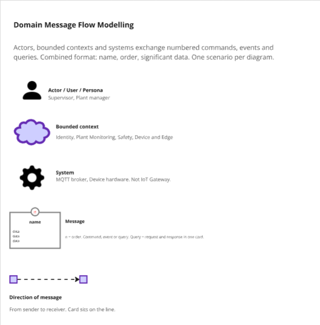

**Scenario 1 — Plant setup.** El supervisor, con sesión móvil en Identity & Access, define áreas, umbrales y asociación de dispositivos en Plant Monitoring.

**Scenario 2 — Telemetry ingest.** El dispositivo se autentica, publica lecturas de CO₂, ruido y presencia (sin unificarlas) en el broker MQTT; Device & Edge las ingiere en Plant Monitoring. La evaluación de riesgo queda fuera de este flujo.

**Scenario 3 — Exposure and actuation.** Plant Monitoring notifica lecturas y presencia a Safety & Actuation, que detecta excesos, clasifica exposición, alerta y activa extractores, sirenas o mamparas; cuando las lecturas vuelven a rango, normaliza. Quien emite `Activate`/`Normalize` es Safety **en el servidor de planta**; la actuación física la ejecuta el dispositivo, no Device & Edge Management.

**Scenario 4 — Offline and sync.** Dos caminos alternativos: si el ingest falla, Device & Edge encola telemetría y reintenta al recuperar la conectividad; si hay alerta ambiental y cloud no alcanza, Safety **ya corre en Edge** y deja la alerta en Device & Edge para sincronizar después. Los actuadores no esperan internet. Safety & Actuation sigue siendo dueño del riesgo.

**Scenario 5 — Supervisor override.** El supervisor, autenticado en canal móvil, consulta el estado operativo y las alertas activas y anula un actuador en Safety & Actuation. Identity no evalúa exposición; un intento desde el canal web se deniega.

#### 4.1.1.3 Bounded Context Canvases

Cada contexto candidato se documentó con un **Bounded Context Canvas**. El canvas fija propósito, clasificación estratégica, lenguaje, decisiones de negocio y la comunicación de entrada y salida.

**Plant Monitoring (core).** Áreas, umbrales y telemetría.

**Safety & Actuation.** Exposición, alertas y actuación automática u override.

**Device & Edge Management (supporting).** Credenciales de dispositivo, ingest, cola y sincronización.

**Identity & Access (generic).** Cuentas, sesión por canal y OHS hacia los demás contextos.

### 4.1.2. Context Mapping

Las relaciones estructurales entre los cuatro bounded contexts se mapearon con los patrones de **ddd-crew**, tal como se muestra en el diagrama a continuación.

<table>
  <thead>
    <tr>
      <th align="left">Upstream</th>
      <th align="left">Downstream</th>
      <th align="left">Patrones</th>
      <th align="left">Descripción</th>
    </tr>
  </thead>
  <tbody>
    <tr>
      <td align="left">Identity & Access</td>
      <td align="left">Plant Monitoring</td>
      <td align="left">OHS + Conformist (sesión/canal)</td>
      <td align="left">Setup de planta (áreas, umbrales, dispositivos) exige sesión de supervisor en canal móvil.</td>
    </tr>
    <tr>
      <td align="left">Identity & Access</td>
      <td align="left">Safety & Actuation</td>
      <td align="left">OHS + Conformist</td>
      <td align="left">Estado, alertas y override exigen la misma sesión móvil; Identity no evalúa exposición.</td>
    </tr>
    <tr>
      <td align="left">Plant Monitoring</td>
      <td align="left">Safety & Actuation</td>
      <td align="left">Customer/Supplier + Conformist al *evento* de lectura</td>
      <td align="left">Safety se ciñe al *evento* de lectura/presencia; Plant Monitoring puede registrar telemetría sin que haya actuación.</td>
    </tr>
    <tr>
      <td align="left">Plant Monitoring</td>
      <td align="left">Device & Edge Management</td>
      <td align="left">OHS de ingest + ACL en Edge</td>
      <td align="left">PM es dueño del hecho y del contrato de ingest; Edge traduce MQTT/cola (ACL). La flecha U→D es del modelo, no del hop MQTT.</td>
    </tr>
    <tr>
      <td align="left">Safety & Actuation</td>
      <td align="left">Device & Edge Management</td>
      <td align="left">ACL</td>
      <td align="left">Alerta persistida/sincronizada (`PO-09`); el dueño del riesgo sigue en Safety, no en `EdgeNode`.</td>
    </tr>
  </tbody>
</table>

### 4.1.3. Software Architecture

Los diagramas C4 se generan desde `docs/diagrams/c4.dsl` (Structurizr). El stack visible es **provisional** (DEC-008): ASP.NET Core (C#) en cloud y Edge, PostgreSQL en nube, SQLite en planta, Eclipse Mosquitto, SMTP, landing Angular y firmware Arduino / ESP32. Los clientes ya estaban cerrados: Flutter (móvil) y Angular (web). Identity es propia (no Auth0/Cognito). No hay un sistema “IoT Gateway”; el Edge hace de puente (DEC-002). Safety & Actuation también corre en el servidor de planta (DEC-007).

**Leyenda** (formas; los cuatro bounded contexts usan el mismo hexágono, no un color por contexto).

<table>
  <thead>
    <tr>
      <th align="left">Forma</th>
      <th align="left">Qué representa</th>
    </tr>
  </thead>
  <tbody>
    <tr>
      <td align="left">Persona</td>
      <td align="left">Supervisor, encargado de planta</td>
    </tr>
    <tr>
      <td align="left">Persona (gris)</td>
      <td align="left">Visitante de la landing</td>
    </tr>
    <tr>
      <td align="left">Caja de sistema externo</td>
      <td align="left">Hardware de campo, correo SMTP</td>
    </tr>
    <tr>
      <td align="left">Caja redondeada</td>
      <td align="left">Software interno: monolito, Edge Application, firmware</td>
    </tr>
    <tr>
      <td align="left">Cilindro</td>
      <td align="left">Base de datos (nube o planta)</td>
    </tr>
    <tr>
      <td align="left">Tubo</td>
      <td align="left">Broker MQTT</td>
    </tr>
    <tr>
      <td align="left">Móvil / navegador / carpeta</td>
      <td align="left">App Flutter, cliente Angular, landing</td>
    </tr>
    <tr>
      <td align="left">Hexágono</td>
      <td align="left">Capas Interface / Application / Domain / Infrastructure</td>
    </tr>
  </tbody>
</table>

#### 4.1.3.1. Software Architecture System Landscape Diagram

SafePlant aparece como un único sistema rodeado por el supervisor, el encargado de planta, el visitante de la landing y dos externos: el **hardware de campo** (ESP32, sensores y actuadores) y el **servicio de correo SMTP** para recuperación de credenciales.

#### 4.1.3.2. Software Architecture Context Level Diagrams

El mismo recorte, con foco en SafePlant: los usuarios no hablan con el hardware ni con el correo; esas relaciones pasan por el firmware Arduino/ESP32 y el backend ASP.NET Core.

#### 4.1.3.2. Software Architecture Container Level Diagrams

Nueve containers. El **Web Monolithic Backend** (ASP.NET Core + PostgreSQL) es una sola caja: los cuatro bounded contexts viven dentro, no como servicios. En planta, **Edge Application** (ASP.NET Core + SQLite) hospeda el runtime de Device & Edge, una proyección de Plant Monitoring y el loop vivo de Safety & Actuation; **Eclipse Mosquitto** queda entre el firmware y ese Edge. El firmware publica lecturas y ejecuta relés; la landing es Angular.

#### 4.1.3.3. Software Architecture Deployment Diagrams

Cloud en **Azure**: Static Web Apps sirve la landing y el cliente Angular; App Service hospeda el monolito ASP.NET Core; Azure Database for PostgreSQL es el sistema de registro. En la **planta**, un servidor on-prem corre Edge Application, SQLite y Eclipse Mosquitto (sin IoT Hub): ahí vive el loop de Safety. El firmware Arduino/ESP32 está en el dispositivo de campo. La app Flutter corre en el teléfono del supervisor; el correo de recuperación sigue en SMTP externo. Identity es propia (no Azure AD). El override desde la nube hacia Edge exige WAN.

## 4.2. Tactical-Level Domain-Driven Design

> Documentar cada Bounded Context en `bounded-contexts/` a partir de [`templates/bounded-context.md`](./templates/bounded-context.md).

<table>
  <thead>
    <tr>
      <th align="left">#</th>
      <th align="left">Bounded Context</th>
      <th align="left">Documento</th>
    </tr>
  </thead>
  <tbody>
    <tr>
      <td align="left">4.2.1</td>
      <td align="left">Plant Monitoring</td>
      <td align="left"><a href="bounded-contexts/bc-01-plant-monitoring.md">bc-01-plant-monitoring.md</a></td>
    </tr>
    <tr>
      <td align="left">4.2.2</td>
      <td align="left">Safety & Actuation</td>
      <td align="left"><a href="bounded-contexts/bc-02-safety-actuation.md">bc-02-safety-actuation.md</a></td>
    </tr>
    <tr>
      <td align="left">4.2.3</td>
      <td align="left">Device & Edge Management</td>
      <td align="left"><a href="bounded-contexts/bc-03-device-edge-management.md">bc-03-device-edge-management.md</a></td>
    </tr>
    <tr>
      <td align="left">4.2.4</td>
      <td align="left">Identity & Access</td>
      <td align="left"><a href="bounded-contexts/bc-04-identity-access.md">bc-04-identity-access.md</a></td>
    </tr>
  </tbody>
</table>

---

### 4.2.1. Bounded Context: Plant Monitoring

**Navegación:** [Capítulo IV](../04-capitulo-iv-solution-software-design.md) · [Índice](../00-student-outcome.md#s-tabla-contenidos)

---

Plant Monitoring da a la planta una definición estable de áreas, umbrales ambientales y qué dispositivo mide o actúa en cada zona, y registra el hecho histórico de CO₂, ruido y presencia. Es el **Core Domain**: quien usa SafePlant ve el estado de la planta aquí; no se decide exposición ni se disparan actuadores (Safety & Actuation). En `Edge Application` solo hay una **proyección** para el loop local de Safety.

Ubiquitous language: *Industrial area* · *Environmental thresholds* · *Area device assignment* · *Carbon dioxide reading* · *Noise reading* · *Presence (detected / cleared)* · *Telemetry ingested* · *Sensor associated to area* · *Actuator associated to area* · *Plant metrics history*.

#### 4.2.1.1. Domain Layer

El core del contexto son cuatro aggregates —`IndustrialArea`, `AreaThresholds`, `AreaDeviceAssignment`, `AreaTelemetry`— con value objects, las entidades de lectura separadas (CO₂, ruido, presencia) y las interfaces de repositorio.

<table>
  <thead>
    <tr>
      <th align="left">Clase</th>
      <th align="left">Tipo</th>
      <th align="left">Propósito</th>
      <th align="left">Atributos</th>
      <th align="left">Métodos</th>
      <th align="left">Relaciones</th>
    </tr>
  </thead>
  <tbody>
    <tr>
      <td align="left">`IndustrialArea`</td>
      <td align="left">Aggregate Root</td>
      <td align="left">Ficha de un área industrial: nombre único y ubicación.</td>
      <td align="left">`id`, `name`, `location`</td>
      <td align="left">`register()`, `update()`, `updateSystemConfiguration()`</td>
      <td align="left">1—0..1 `AreaThresholds`; 1—0..* `AreaDeviceAssignment`; 1—1 `AreaTelemetry`</td>
    </tr>
    <tr>
      <td align="left">`AreaThresholds`</td>
      <td align="left">Aggregate Root</td>
      <td align="left">Límites de CO₂ y ruido de esa área. Sin umbrales, Safety no clasifica.</td>
      <td align="left">`id`, `areaId`, `co2Limit`, `noiseLimit`</td>
      <td align="left">`configure()`, `update()`</td>
      <td align="left">pertenece a 1 `IndustrialArea`</td>
    </tr>
    <tr>
      <td align="left">`AreaDeviceAssignment`</td>
      <td align="left">Aggregate Root</td>
      <td align="left">Asociación de un sensor o actuador a un área. Un `deviceId` no se duplica.</td>
      <td align="left">`id`, `areaId`, `deviceId`, `kind`</td>
      <td align="left">`associate()`</td>
      <td align="left">pertenece a 1 `IndustrialArea`</td>
    </tr>
    <tr>
      <td align="left">`AreaTelemetry`</td>
      <td align="left">Aggregate Root</td>
      <td align="left">Invariante de ingest y registro histórico por área. Acepta, rechaza o reconoce duplicado.</td>
      <td align="left">`id`, `areaId`</td>
      <td align="left">`recordCarbonDioxide()`, `recordNoise()`, `recordPresence()`, `acceptIngest()`, `rejectIngest()`, `acknowledgeDuplicate()`, `markSensorUnavailable()`</td>
      <td align="left">pertenece a 1 `IndustrialArea`; contiene 0..* lecturas de cada tipo</td>
    </tr>
    <tr>
      <td align="left">`CarbonDioxideReading`</td>
      <td align="left">Entity</td>
      <td align="left">Hecho de CO₂; no se fusiona con ruido ni presencia. Lectura inválida se descarta.</td>
      <td align="left">`id`, `deviceId`, `ppm`, `recordedAt`</td>
      <td align="left">—</td>
      <td align="left">contenido en `AreaTelemetry`</td>
    </tr>
    <tr>
      <td align="left">`NoiseReading`</td>
      <td align="left">Entity</td>
      <td align="left">Hecho de ruido.</td>
      <td align="left">`id`, `deviceId`, `db`, `recordedAt`</td>
      <td align="left">—</td>
      <td align="left">contenido en `AreaTelemetry`</td>
    </tr>
    <tr>
      <td align="left">`PresenceChange`</td>
      <td align="left">Entity</td>
      <td align="left">Presencia detectada o despejada.</td>
      <td align="left">`id`, `deviceId`, `state`, `recordedAt`</td>
      <td align="left">—</td>
      <td align="left">contenido en `AreaTelemetry`</td>
    </tr>
    <tr>
      <td align="left">`AreaName`</td>
      <td align="left">Value Object</td>
      <td align="left">Nombre del área, único en la planta.</td>
      <td align="left">`value`</td>
      <td align="left">`equals()`</td>
      <td align="left">usado por `IndustrialArea`</td>
    </tr>
    <tr>
      <td align="left">`Location`</td>
      <td align="left">Value Object</td>
      <td align="left">Ficha de ubicación del área.</td>
      <td align="left">`value`</td>
      <td align="left">`equals()`</td>
      <td align="left">usado por `IndustrialArea`</td>
    </tr>
    <tr>
      <td align="left">`Co2Limit`</td>
      <td align="left">Value Object</td>
      <td align="left">Umbral de CO₂ del área.</td>
      <td align="left">`ppm`</td>
      <td align="left">`equals()`</td>
      <td align="left">usado por `AreaThresholds`</td>
    </tr>
    <tr>
      <td align="left">`NoiseLimit`</td>
      <td align="left">Value Object</td>
      <td align="left">Umbral de ruido del área.</td>
      <td align="left">`db`</td>
      <td align="left">`equals()`</td>
      <td align="left">usado por `AreaThresholds`</td>
    </tr>
    <tr>
      <td align="left">`DeviceId`</td>
      <td align="left">Value Object</td>
      <td align="left">Identificador de dispositivo; no se duplica en asociaciones.</td>
      <td align="left">`value`</td>
      <td align="left">`equals()`</td>
      <td align="left">usado por `AreaDeviceAssignment` y las lecturas</td>
    </tr>
    <tr>
      <td align="left">`DeviceKind`</td>
      <td align="left">Value Object (Enum)</td>
      <td align="left">`Sensor` o `Actuator`.</td>
      <td align="left">`value`</td>
      <td align="left">—</td>
      <td align="left">usado por `AreaDeviceAssignment`</td>
    </tr>
    <tr>
      <td align="left">`Co2Ppm`</td>
      <td align="left">Value Object</td>
      <td align="left">Concentración de CO₂; `isValid()` rechaza fuera de rango.</td>
      <td align="left">`value`</td>
      <td align="left">`isValid()`</td>
      <td align="left">usado por `CarbonDioxideReading`</td>
    </tr>
    <tr>
      <td align="left">`NoiseDb`</td>
      <td align="left">Value Object</td>
      <td align="left">Nivel de ruido en dB.</td>
      <td align="left">`value`</td>
      <td align="left">—</td>
      <td align="left">usado por `NoiseReading`</td>
    </tr>
    <tr>
      <td align="left">`PresenceState`</td>
      <td align="left">Value Object (Enum)</td>
      <td align="left">`Detected` o `Cleared`.</td>
      <td align="left">`value`</td>
      <td align="left">—</td>
      <td align="left">usado por `PresenceChange`</td>
    </tr>
    <tr>
      <td align="left">`IDomainEventPublisher`</td>
      <td align="left">Port (interface)</td>
      <td align="left">Publica eventos de dominio in-process (lecturas y presencia hacia Safety; ingest rechazado hacia Device & Edge). No habla con MQTT.</td>
      <td align="left">—</td>
      <td align="left">`publish()`</td>
      <td align="left">implementado en Infrastructure</td>
    </tr>
    <tr>
      <td align="left">`IIndustrialAreaRepository`</td>
      <td align="left">Repository (interface)</td>
      <td align="left">Persistencia de `IndustrialArea`.</td>
      <td align="left">—</td>
      <td align="left">`findById()`, `findByName()`, `save()`</td>
      <td align="left">implementada en Infrastructure</td>
    </tr>
    <tr>
      <td align="left">`IAreaThresholdsRepository`</td>
      <td align="left">Repository (interface)</td>
      <td align="left">Persistencia de `AreaThresholds`.</td>
      <td align="left">—</td>
      <td align="left">`findByAreaId()`, `save()`</td>
      <td align="left">implementada en Infrastructure</td>
    </tr>
    <tr>
      <td align="left">`IAreaDeviceAssignmentRepository`</td>
      <td align="left">Repository (interface)</td>
      <td align="left">Persistencia de `AreaDeviceAssignment`.</td>
      <td align="left">—</td>
      <td align="left">`findByDeviceId()`, `save()`</td>
      <td align="left">implementada en Infrastructure</td>
    </tr>
    <tr>
      <td align="left">`IAreaTelemetryRepository`</td>
      <td align="left">Repository (interface)</td>
      <td align="left">Persistencia de `AreaTelemetry` y sus lecturas.</td>
      <td align="left">—</td>
      <td align="left">`findLatestByAreaId()`, `save()`</td>
      <td align="left">implementada en Infrastructure</td>
    </tr>
  </tbody>
</table>

#### 4.2.1.2. Interface Layer

Dos controllers HTTP cubren setup (supervisor móvil) e historial (plant manager web). Un Consumer in-process recibe `Ingest telemetry` desde Device & Edge.

<table>
  <thead>
    <tr>
      <th align="left">Clase</th>
      <th align="left">Tipo</th>
      <th align="left">Propósito</th>
      <th align="left">Métodos / Endpoints</th>
      <th align="left">Colabora con</th>
    </tr>
  </thead>
  <tbody>
    <tr>
      <td align="left">`PlantSetupController`</td>
      <td align="left">Controller</td>
      <td align="left">Configuración de planta: área, umbrales, asociación de dispositivos y ficha de setup. Exige `sessionToken` de supervisor móvil (OHS).</td>
      <td align="left">`manageIndustrialArea()`, `configureEnvironmentalThresholds()`, `associateDeviceToArea()`, `updateSystemConfiguration()`, `getAreaSetupSheet()`</td>
      <td align="left">Supervisor Mobile App; Application Layer</td>
    </tr>
    <tr>
      <td align="left">`PlantMetricsController`</td>
      <td align="left">Controller</td>
      <td align="left">Historial de métricas de planta, solo lectura, canal web.</td>
      <td align="left">`getPlantMetricsHistory()`</td>
      <td align="left">Plant Manager Web Client; Application Layer</td>
    </tr>
    <tr>
      <td align="left">`TelemetryIngestConsumer`</td>
      <td align="left">Consumer</td>
      <td align="left">Recibe `Ingest telemetry` desde Device & Edge (mismo proceso).</td>
      <td align="left">`ingestTelemetry()`</td>
      <td align="left">Device & Edge Management; Application Layer</td>
    </tr>
  </tbody>
</table>

#### 4.2.1.3. Application Layer

<table>
  <thead>
    <tr>
      <th align="left">Clase</th>
      <th align="left">Tipo</th>
      <th align="left">Comando / Evento</th>
      <th align="left">Propósito</th>
      <th align="left">Colabora con</th>
    </tr>
  </thead>
  <tbody>
    <tr>
      <td align="left">`ManageIndustrialAreaHandler`</td>
      <td align="left">Command Handler</td>
      <td align="left">Manage industrial area</td>
      <td align="left">Registra o actualiza un área; rechaza nombre duplicado.</td>
      <td align="left">`IIndustrialAreaRepository`</td>
    </tr>
    <tr>
      <td align="left">`ConfigureEnvironmentalThresholdsHandler`</td>
      <td align="left">Command Handler</td>
      <td align="left">Configure environmental thresholds</td>
      <td align="left">Crea o actualiza umbrales de un área; rechaza valores fuera de rango.</td>
      <td align="left">`IAreaThresholdsRepository`, `IIndustrialAreaRepository`</td>
    </tr>
    <tr>
      <td align="left">`AssociateDeviceToAreaHandler`</td>
      <td align="left">Command Handler</td>
      <td align="left">Associate device to area</td>
      <td align="left">Asocia sensor o actuador; rechaza `deviceId` duplicado.</td>
      <td align="left">`IAreaDeviceAssignmentRepository`, `IIndustrialAreaRepository`</td>
    </tr>
    <tr>
      <td align="left">`UpdateSystemConfigurationHandler`</td>
      <td align="left">Command Handler</td>
      <td align="left">Update system configuration</td>
      <td align="left">Actualiza la ficha de configuración de planta del área.</td>
      <td align="left">`IIndustrialAreaRepository`</td>
    </tr>
    <tr>
      <td align="left">`RecordCarbonDioxideReadingHandler`</td>
      <td align="left">Command Handler</td>
      <td align="left">Record carbon dioxide reading</td>
      <td align="left">Registra el hecho de CO₂ o lo descarta si es inválido.</td>
      <td align="left">`IAreaTelemetryRepository`, `IDomainEventPublisher`</td>
    </tr>
    <tr>
      <td align="left">`RecordNoiseReadingHandler`</td>
      <td align="left">Command Handler</td>
      <td align="left">Record noise reading</td>
      <td align="left">Registra el hecho de ruido.</td>
      <td align="left">`IAreaTelemetryRepository`, `IDomainEventPublisher`</td>
    </tr>
    <tr>
      <td align="left">`RecordPresenceHandler`</td>
      <td align="left">Command Handler</td>
      <td align="left">Record presence</td>
      <td align="left">Registra presencia detectada o despejada.</td>
      <td align="left">`IAreaTelemetryRepository`, `IDomainEventPublisher`</td>
    </tr>
    <tr>
      <td align="left">`MarkSensorUnavailableHandler`</td>
      <td align="left">Event Handler (scheduled)</td>
      <td align="left">Mark sensor unavailable</td>
      <td align="left">Marca un sensor sin transmisión en el intervalo.</td>
      <td align="left">`IAreaTelemetryRepository`</td>
    </tr>
    <tr>
      <td align="left">`IngestTelemetryHandler`</td>
      <td align="left">Command Handler</td>
      <td align="left">Ingest telemetry</td>
      <td align="left">Acepta, rechaza o reconoce duplicado el lote de Edge; invoca los tres `Record*` **sin** unificar lecturas.</td>
      <td align="left">`RecordCarbonDioxideReadingHandler`, `RecordNoiseReadingHandler`, `RecordPresenceHandler`, `IAreaTelemetryRepository`, `IDomainEventPublisher`</td>
    </tr>
    <tr>
      <td align="left">`GetAreaSetupSheetHandler`</td>
      <td align="left">Query Handler</td>
      <td align="left">Get AreaSetupSheet</td>
      <td align="left">Devuelve área, umbrales y dispositivos ya asociados.</td>
      <td align="left">`IIndustrialAreaRepository`, `IAreaThresholdsRepository`, `IAreaDeviceAssignmentRepository`</td>
    </tr>
    <tr>
      <td align="left">`GetPlantMetricsHistoryHandler`</td>
      <td align="left">Query Handler</td>
      <td align="left">Get PlantMetricsHistory</td>
      <td align="left">Historial de lecturas para el dashboard web; no dispara actuadores.</td>
      <td align="left">`IAreaTelemetryRepository`</td>
    </tr>
  </tbody>
</table>

#### 4.2.1.4. Infrastructure Layer

Implementaciones de los cuatro repositorios y un publicador in-process. Motor de base de datos: **PostgreSQL** (DEC-008). No hay adaptador MQTT: Device & Edge es quien consume el broker.

<table>
  <thead>
    <tr>
      <th align="left">Clase</th>
      <th align="left">Tipo</th>
      <th align="left">Interfaz que implementa</th>
      <th align="left">Servicio externo</th>
      <th align="left">Propósito</th>
    </tr>
  </thead>
  <tbody>
    <tr>
      <td align="left">`IndustrialAreaRepository`</td>
      <td align="left">Repository (implementación)</td>
      <td align="left">`IIndustrialAreaRepository`</td>
      <td align="left">Cloud Database (PostgreSQL)</td>
      <td align="left">Persistencia relacional de áreas.</td>
    </tr>
    <tr>
      <td align="left">`AreaThresholdsRepository`</td>
      <td align="left">Repository (implementación)</td>
      <td align="left">`IAreaThresholdsRepository`</td>
      <td align="left">Cloud Database (PostgreSQL)</td>
      <td align="left">Persistencia relacional de umbrales.</td>
    </tr>
    <tr>
      <td align="left">`AreaDeviceAssignmentRepository`</td>
      <td align="left">Repository (implementación)</td>
      <td align="left">`IAreaDeviceAssignmentRepository`</td>
      <td align="left">Cloud Database (PostgreSQL)</td>
      <td align="left">Persistencia relacional de asociaciones dispositivo–área.</td>
    </tr>
    <tr>
      <td align="left">`AreaTelemetryRepository`</td>
      <td align="left">Repository (implementación)</td>
      <td align="left">`IAreaTelemetryRepository`</td>
      <td align="left">Cloud Database (PostgreSQL)</td>
      <td align="left">Persistencia de lecturas en **tres** tablas distintas.</td>
    </tr>
    <tr>
      <td align="left">`InProcessEventPublisher`</td>
      <td align="left">Adapter</td>
      <td align="left">`IDomainEventPublisher`</td>
      <td align="left">In-process (Safety & Actuation; Device & Edge)</td>
      <td align="left">Publica hacia Safety y Device & Edge. Sin MQTT.</td>
    </tr>
  </tbody>
</table>

#### 4.2.1.5. Bounded Context Software Architecture Component Level Diagrams

El Supervisor Mobile App llama a Interface para el setup, el Plant Manager Web Client consulta el historial, y Edge Application entrega el ingest. En el servidor de planta, una **proyección** cachea umbrales y últimas lecturas para Safety. Interface delega en Application, Application invoca Domain, e Infrastructure persiste en `Cloud Database`.

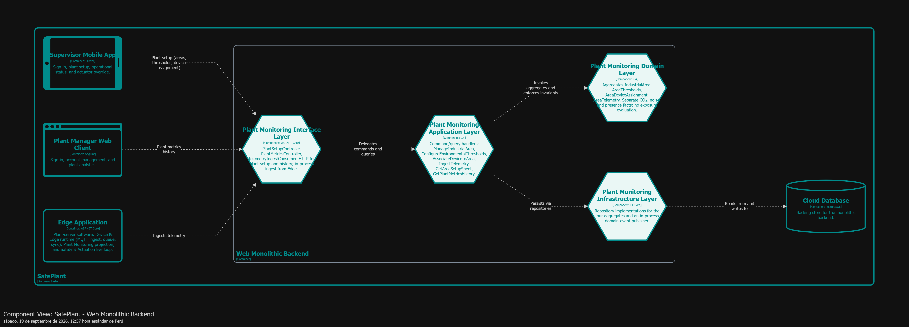

#### 4.2.1.6. Bounded Context Software Architecture Code Level Diagrams

##### 4.2.1.6.1. Bounded Context Domain Layer Class Diagrams

Incluye los cuatro aggregates, las tres entidades de lectura (sin unificar), value objects, el puerto `IDomainEventPublisher` y las interfaces de repositorio, con scope, multiplicidad y dirección de cada relación.

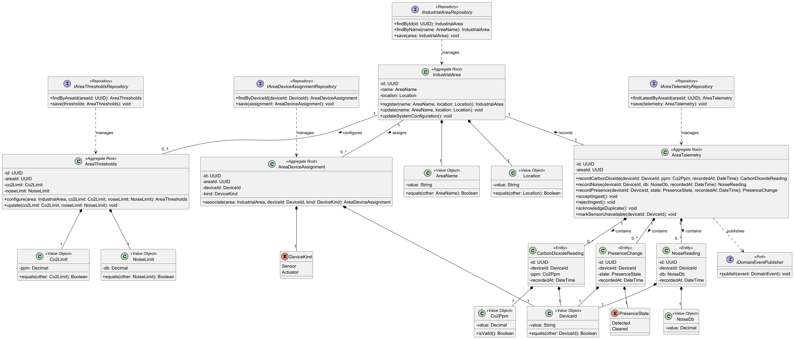

##### 4.2.1.6.2. Bounded Context Database Design Diagram

Modelo relacional lógico: `industrial_areas`, `area_thresholds` (FK UNIQUE hacia área), `area_device_assignments` (`device_id` UNIQUE), y **tres** tablas de hechos —`carbon_dioxide_readings`, `noise_readings`, `presence_events`— cada una con FK al área.

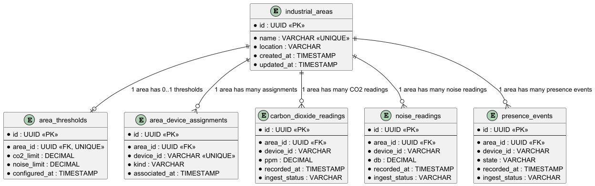

---

### 4.2.2. Bounded Context: Safety & Actuation

**Navegación:** [Capítulo IV](../04-capitulo-iv-solution-software-design.md) · [Índice](../00-student-outcome.md#s-tabla-contenidos)

---

Safety & Actuation protege al personal cruzando presencia con CO₂ y ruido: clasifica exposición, alerta y manda extractores, sirenas y mamparas, o las anula. Es el **segundo core** (cumplimiento de seguridad ocupacional). Quien opera SafePlant confía en que el riesgo se evalúa aquí.

El mismo bounded context tiene **dos runtimes** (DEC-007). En `Edge Application` corre el loop vivo: `PO-03`–`PO-08`, `Activate actuator` / `Normalize actuator` hacia el **firmware**. En el `Web Monolithic Backend` quedan estado, alertas y override del supervisor **cuando hay WAN**, más la copia de auditoría tras el sync. Device & Edge **no** evalúa riesgo. La anulación manual es un comando del supervisor en la aplicación **móvil**, no una regla automática; Identity deniega el mismo intento desde la aplicación web del encargado. Sin acceso a cloud, el loop automático sigue.

No hay entidad `Device` ni `deviceId` en este contexto: el comando identifica el área y el tipo de actuador. Varias sirenas del mismo tipo en un área se tratan como *la sirena del área*; no se direcciona una instancia suelta.

Ubiquitous language: *Personnel exposure* · *Exposure severity* · *Area risk* · *Environmental alert* · *Excessive carbon dioxide* · *Excessive noise* · *Air extractor* · *Preventive siren* · *Acoustic barrier* · *Manual override* · *Automatic actuator action*.

#### 4.2.2.1. Domain Layer

Dos aggregate roots en el mismo módulo —`ExposureState` y `AreaActuators`— y las reglas de negocio como domain services en el mismo proceso (en planta: el runtime Edge). No hay un aggregate por cada tipo de actuador: `AreaActuators` lleva el tipo en el comando. Los umbrales no se copian como dueño; llegan en los eventos de Plant Monitoring (en planta, vía la **proyección**). La severidad es `None`, `Medium` o `High`. Los fallos de relé se registran; no se reintenta aquí.

<table>
  <thead>
    <tr>
      <th align="left">Clase</th>
      <th align="left">Tipo</th>
      <th align="left">Propósito</th>
      <th align="left">Atributos</th>
      <th align="left">Métodos</th>
      <th align="left">Relaciones</th>
    </tr>
  </thead>
  <tbody>
    <tr>
      <td align="left">`ExposureState`</td>
      <td align="left">Aggregate Root</td>
      <td align="left">Cruce de presencia con ambiente, severidad y alerta **por área**.</td>
      <td align="left">`id`, `areaId`, `personnelPresent`, `severity`, `risk`, `alertActive`</td>
      <td align="left">`detectExcess()`, `evaluateExposure()`, `classifySeverity()`, `highlightRisk()`, `raiseAlert()`, `withdrawAlert()`, `resolve()`, `skipClassification()`</td>
      <td align="left">1—0..* `EnvironmentalAlert`</td>
    </tr>
    <tr>
      <td align="left">`EnvironmentalAlert`</td>
      <td align="left">Entity</td>
      <td align="left">Alerta ambiental levantada o retirada.</td>
      <td align="left">`id`, `areaId`, `raisedAt`, `withdrawnAt`</td>
      <td align="left">—</td>
      <td align="left">contenido en `ExposureState`</td>
    </tr>
    <tr>
      <td align="left">`AreaActuators`</td>
      <td align="left">Aggregate Root</td>
      <td align="left">Estado lógico de extractor, sirena y mampara del área, incluida la anulación manual. Sin `deviceId`.</td>
      <td align="left">`id`, `areaId`</td>
      <td align="left">`activate()`, `normalize()`, `override()`, `recordAutomaticAction()`</td>
      <td align="left">contiene 1..3 `ActuatorState`; 0..* `AutomaticActuatorAction`</td>
    </tr>
    <tr>
      <td align="left">`ActuatorState`</td>
      <td align="left">Entity</td>
      <td align="left">Relé lógico `(área, tipo)`: on/off/deployed y modo auto/overridden.</td>
      <td align="left">`type`, `runState`, `mode`, `lastChangedAt`</td>
      <td align="left">—</td>
      <td align="left">contenido en `AreaActuators`</td>
    </tr>
    <tr>
      <td align="left">`AutomaticActuatorAction`</td>
      <td align="left">Entity</td>
      <td align="left">Auditoría de actuación automática o fallo de relé.</td>
      <td align="left">`id`, `type`, `succeeded`, `recordedAt`</td>
      <td align="left">—</td>
      <td align="left">contenido en `AreaActuators`</td>
    </tr>
    <tr>
      <td align="left">`ExposureSeverity`</td>
      <td align="left">Value Object (Enum)</td>
      <td align="left">`None`, `Medium`, `High`. Sin yellow.</td>
      <td align="left">`value`</td>
      <td align="left">—</td>
      <td align="left">usado por `ExposureState`</td>
    </tr>
    <tr>
      <td align="left">`ActuatorType`</td>
      <td align="left">Value Object (Enum)</td>
      <td align="left">`Extractor`, `Siren`, `Barrier`.</td>
      <td align="left">`value`</td>
      <td align="left">—</td>
      <td align="left">usado por `ActuatorState` y los puertos</td>
    </tr>
    <tr>
      <td align="left">`ActuatorMode`</td>
      <td align="left">Value Object (Enum)</td>
      <td align="left">`Auto` o `Overridden`.</td>
      <td align="left">`value`</td>
      <td align="left">—</td>
      <td align="left">usado por `ActuatorState`</td>
    </tr>
    <tr>
      <td align="left">`ActuatorRunState`</td>
      <td align="left">Value Object (Enum)</td>
      <td align="left">`Off`, `On`, `Deployed`, `Retracted`, `Failed`.</td>
      <td align="left">`value`</td>
      <td align="left">—</td>
      <td align="left">usado por `ActuatorState`</td>
    </tr>
    <tr>
      <td align="left">`AreaRisk`</td>
      <td align="left">Value Object</td>
      <td align="left">Área destacada en el dashboard cuando la severidad no es nula.</td>
      <td align="left">`highlighted`</td>
      <td align="left">`equals()`</td>
      <td align="left">usado por `ExposureState`</td>
    </tr>
    <tr>
      <td align="left">`ExcessDetectionPolicy`</td>
      <td align="left">Domain Service</td>
      <td align="left">Cuando se registra una lectura, detecta exceso de CO₂ o de ruido.</td>
      <td align="left">—</td>
      <td align="left">`onReadingRecorded()`</td>
      <td align="left">comanda `ExposureState`</td>
    </tr>
    <tr>
      <td align="left">`ExposureEvaluationPolicy`</td>
      <td align="left">Domain Service</td>
      <td align="left">Cuando cambia una lectura o la presencia, evalúa la exposición del personal. No espera al evento de exceso: lee las mediciones directamente.</td>
      <td align="left">—</td>
      <td align="left">`onReadingOrPresenceChanged()`</td>
      <td align="left">comanda `ExposureState`</td>
    </tr>
    <tr>
      <td align="left">`SeverityClassificationPolicy`</td>
      <td align="left">Domain Service</td>
      <td align="left">Clasifica la severidad; si no es nula, destaca el riesgo del área y levanta la alerta ambiental.</td>
      <td align="left">—</td>
      <td align="left">`onExposureEvaluated()`</td>
      <td align="left">comanda `ExposureState`</td>
    </tr>
    <tr>
      <td align="left">`ActuationPolicy`</td>
      <td align="left">Domain Service</td>
      <td align="left">Extractor si hay CO₂ excesivo, con o sin personal. Sirena solo si hay exposición de personal a CO₂. Mampara y sirena si hay ruido excesivo y presencia.</td>
      <td align="left">—</td>
      <td align="left">`onExcessOrExposure()`</td>
      <td align="left">comanda `AreaActuators`</td>
    </tr>
    <tr>
      <td align="left">`NormalizePolicy`</td>
      <td align="left">Domain Service</td>
      <td align="left">Un solo normalize cuando las condiciones vuelven al rango: actuadores, retiro de alerta y resolución de la exposición.</td>
      <td align="left">—</td>
      <td align="left">`onConditionsWithinThresholds()`</td>
      <td align="left">comanda ambos aggregates</td>
    </tr>
    <tr>
      <td align="left">`IActuatorCommandPort`</td>
      <td align="left">Port (interface)</td>
      <td align="left">Activate / Normalize hacia firmware: `areaId` + `actuatorType`, sin `deviceId`.</td>
      <td align="left">—</td>
      <td align="left">`activate()`, `normalize()`</td>
      <td align="left">implementado en Infrastructure</td>
    </tr>
    <tr>
      <td align="left">`IOfflineAlertPort`</td>
      <td align="left">Port (interface)</td>
      <td align="left">Persistencia/sync de alerta vía `EdgeNode` si la nube no está alcanzable. El riesgo no cambia de dueño; `ExposureState` no vive dentro de `EdgeNode`.</td>
      <td align="left">—</td>
      <td align="left">`storeCopy()`</td>
      <td align="left">implementado en Infrastructure</td>
    </tr>
    <tr>
      <td align="left">`IExposureStateRepository`</td>
      <td align="left">Repository (interface)</td>
      <td align="left">Persistencia de `ExposureState`.</td>
      <td align="left">—</td>
      <td align="left">`findByAreaId()`, `save()`</td>
      <td align="left">implementada en Infrastructure</td>
    </tr>
    <tr>
      <td align="left">`IAreaActuatorsRepository`</td>
      <td align="left">Repository (interface)</td>
      <td align="left">Persistencia de `AreaActuators`.</td>
      <td align="left">—</td>
      <td align="left">`findByAreaId()`, `save()`</td>
      <td align="left">implementada en Infrastructure</td>
    </tr>
  </tbody>
</table>

#### 4.2.2.2. Interface Layer

Un controller HTTP en **cloud** para el supervisor móvil (estado operativo, alertas y anulación) y un consumer en el runtime **Edge** para los eventos de la proyección de Plant Monitoring. 

<table>
  <thead>
    <tr>
      <th align="left">Clase</th>
      <th align="left">Tipo</th>
      <th align="left">Propósito</th>
      <th align="left">Métodos / Endpoints</th>
      <th align="left">Colabora con</th>
    </tr>
  </thead>
  <tbody>
    <tr>
      <td align="left">`AreaSafetyController`</td>
      <td align="left">Controller</td>
      <td align="left">Estado operativo del área, alertas activas y anulación de actuador. Exige sesión de supervisor en la aplicación móvil.</td>
      <td align="left">`getAreaOperationalStatus()`, `getActiveAlerts()`, `overrideActuator()`</td>
      <td align="left">Supervisor Mobile App; Application Layer</td>
    </tr>
    <tr>
      <td align="left">`PlantTelemetryEventConsumer`</td>
      <td align="left">Consumer</td>
      <td align="left">Recibe lecturas, presencia y “conditions within thresholds” desde Plant Monitoring (proyección en Edge; in-process en planta).</td>
      <td align="left">`onCarbonDioxideReadingRecorded()`, `onNoiseReadingRecorded()`, `onPresenceChanged()`, `onConditionsWithinThresholds()`</td>
      <td align="left">Plant Monitoring; Application Layer</td>
    </tr>
  </tbody>
</table>

#### 4.2.2.3. Application Layer

Los event handlers de entrada disparan las reglas de negocio; hay un command handler por cada flujo de exposición y actuación, y dos consultas que **no** se fusionan: estado operativo del área y listado de alertas activas. El estado operativo se proyecta aquí a partir de lecturas ya consumidas.

<table>
  <thead>
    <tr>
      <th align="left">Clase</th>
      <th align="left">Tipo</th>
      <th align="left">Comando / Evento</th>
      <th align="left">Propósito</th>
      <th align="left">Colabora con</th>
    </tr>
  </thead>
  <tbody>
    <tr>
      <td align="left">`OnCarbonDioxideReadingRecordedHandler`</td>
      <td align="left">Event Handler</td>
      <td align="left">Carbon dioxide reading recorded</td>
      <td align="left">Dispara la detección de exceso y la evaluación de exposición.</td>
      <td align="left">`ExcessDetectionPolicy`, `ExposureEvaluationPolicy`</td>
    </tr>
    <tr>
      <td align="left">`OnNoiseReadingRecordedHandler`</td>
      <td align="left">Event Handler</td>
      <td align="left">Noise reading recorded</td>
      <td align="left">Dispara la detección de exceso y la evaluación de exposición.</td>
      <td align="left">`ExcessDetectionPolicy`, `ExposureEvaluationPolicy`</td>
    </tr>
    <tr>
      <td align="left">`OnPresenceChangedHandler`</td>
      <td align="left">Event Handler</td>
      <td align="left">Presence changed</td>
      <td align="left">Dispara la evaluación de exposición.</td>
      <td align="left">`ExposureEvaluationPolicy`</td>
    </tr>
    <tr>
      <td align="left">`OnConditionsWithinThresholdsHandler`</td>
      <td align="left">Event Handler</td>
      <td align="left">Conditions within thresholds</td>
      <td align="left">Dispara el normalize único (actuadores, alerta y exposición).</td>
      <td align="left">`NormalizePolicy`</td>
    </tr>
    <tr>
      <td align="left">`DetectEnvironmentalExcessHandler`</td>
      <td align="left">Command Handler</td>
      <td align="left">Detect environmental excess</td>
      <td align="left">Registra exceso de CO₂ o de ruido.</td>
      <td align="left">`IExposureStateRepository`</td>
    </tr>
    <tr>
      <td align="left">`EvaluatePersonnelExposureHandler`</td>
      <td align="left">Command Handler</td>
      <td align="left">Evaluate personnel exposure</td>
      <td align="left">Identifica exposición con personal, exceso sin personal, o estado seguro.</td>
      <td align="left">`IExposureStateRepository`</td>
    </tr>
    <tr>
      <td align="left">`ClassifyExposureSeverityHandler`</td>
      <td align="left">Command Handler</td>
      <td align="left">Classify exposure severity</td>
      <td align="left">Asigna severidad, o la omite si el área no tiene umbrales.</td>
      <td align="left">`IExposureStateRepository`</td>
    </tr>
    <tr>
      <td align="left">`HighlightAreaRiskHandler`</td>
      <td align="left">Command Handler</td>
      <td align="left">Highlight area risk</td>
      <td align="left">Marca el área como en riesgo en el dashboard móvil.</td>
      <td align="left">`IExposureStateRepository`</td>
    </tr>
    <tr>
      <td align="left">`RaiseEnvironmentalAlertHandler`</td>
      <td align="left">Command Handler</td>
      <td align="left">Raise environmental alert</td>
      <td align="left">Levanta la alerta; si la nube no alcanza, persiste vía `EdgeNode` para sync (`PO-09`).</td>
      <td align="left">`IExposureStateRepository`, `IOfflineAlertPort`</td>
    </tr>
    <tr>
      <td align="left">`WithdrawEnvironmentalAlertHandler`</td>
      <td align="left">Command Handler</td>
      <td align="left">Withdraw environmental alert</td>
      <td align="left">Retira la alerta al normalizar.</td>
      <td align="left">`IExposureStateRepository`</td>
    </tr>
    <tr>
      <td align="left">`ResolveExposureHandler`</td>
      <td align="left">Command Handler</td>
      <td align="left">Resolve exposure</td>
      <td align="left">Cierra el estado de exposición al normalizar.</td>
      <td align="left">`IExposureStateRepository`</td>
    </tr>
    <tr>
      <td align="left">`ActivateActuatorHandler`</td>
      <td align="left">Command Handler</td>
      <td align="left">Activate actuator</td>
      <td align="left">Enciende extractor, sirena o mampara del área vía firmware (**runtime Edge**).</td>
      <td align="left">`IAreaActuatorsRepository`, `IActuatorCommandPort`</td>
    </tr>
    <tr>
      <td align="left">`NormalizeActuatorHandler`</td>
      <td align="left">Command Handler</td>
      <td align="left">Normalize actuator</td>
      <td align="left">Apaga / retrae el tipo indicado.</td>
      <td align="left">`IAreaActuatorsRepository`, `IActuatorCommandPort`</td>
    </tr>
    <tr>
      <td align="left">`RecordAutomaticActuatorActionHandler`</td>
      <td align="left">Command Handler</td>
      <td align="left">Record automatic actuator action</td>
      <td align="left">Auditoría de éxito o fallo de relé; **sin reintento**.</td>
      <td align="left">`IAreaActuatorsRepository`</td>
    </tr>
    <tr>
      <td align="left">`OverrideActuatorHandler`</td>
      <td align="left">Command Handler</td>
      <td align="left">Override actuator</td>
      <td align="left">Control manual sin esperar sensores. Solo supervisor en la aplicación móvil; Identity ya denegó el canal web. Cloud reenvía el comando al Safety de Edge si hay WAN.</td>
      <td align="left">`IAreaActuatorsRepository`, `IActuatorCommandPort`</td>
    </tr>
    <tr>
      <td align="left">`GetAreaOperationalStatusHandler`</td>
      <td align="left">Query Handler</td>
      <td align="left">Get AreaOperationalStatus</td>
      <td align="left">Dashboard móvil: mediciones ya vistas y severidad. No se fusiona con el listado de alertas.</td>
      <td align="left">`IExposureStateRepository`</td>
    </tr>
    <tr>
      <td align="left">`GetActiveAlertsHandler`</td>
      <td align="left">Query Handler</td>
      <td align="left">Get ActiveAlerts</td>
      <td align="left">Lista de alertas ambientales aún no retiradas.</td>
      <td align="left">`IExposureStateRepository`</td>
    </tr>
  </tbody>
</table>

#### 4.2.2.4. Infrastructure Layer

Repositorios en **Edge Database** (loop vivo, SQLite) y **Cloud Database** (auditoría/sync, PostgreSQL; DEC-008). `FirmwareActuatorAdapter` solo en el runtime Edge (Arduino / ESP32). `OfflineAlertCopyAdapter` persiste en `EdgeNode` y sincroniza cuando vuelve el enlace.

<table>
  <thead>
    <tr>
      <th align="left">Clase</th>
      <th align="left">Tipo</th>
      <th align="left">Interfaz que implementa</th>
      <th align="left">Servicio externo</th>
      <th align="left">Propósito</th>
    </tr>
  </thead>
  <tbody>
    <tr>
      <td align="left">`ExposureStateRepository`</td>
      <td align="left">Repository (implementación)</td>
      <td align="left">`IExposureStateRepository`</td>
      <td align="left">Edge Database (SQLite, loop vivo) y Cloud Database (PostgreSQL, sync/auditoría)</td>
      <td align="left">Persistencia de exposición y alertas.</td>
    </tr>
    <tr>
      <td align="left">`AreaActuatorsRepository`</td>
      <td align="left">Repository (implementación)</td>
      <td align="left">`IAreaActuatorsRepository`</td>
      <td align="left">Edge Database (SQLite, loop vivo) y Cloud Database (PostgreSQL, sync/auditoría)</td>
      <td align="left">Persistencia de estados lógicos por `(area, tipo)`.</td>
    </tr>
    <tr>
      <td align="left">`FirmwareActuatorAdapter`</td>
      <td align="left">Adapter</td>
      <td align="left">`IActuatorCommandPort`</td>
      <td align="left">Device Embedded Application (Arduino / ESP32)</td>
      <td align="left">Entrega `activate` / `normalize` con `areaId` + `actuatorType` al firmware **desde el runtime Edge**, que mueve el relé.</td>
    </tr>
    <tr>
      <td align="left">`OfflineAlertCopyAdapter`</td>
      <td align="left">Adapter</td>
      <td align="left">`IOfflineAlertPort`</td>
      <td align="left">`EdgeNode`</td>
      <td align="left">Persiste la alerta para sync si la nube no alcanza. Safety sigue dueña del riesgo; no es un volcado desde el monolito.</td>
    </tr>
  </tbody>
</table>

#### 4.2.2.5. Bounded Context Software Architecture Component Level Diagrams

Safety & Actuation se reparte en dos containers. En **cloud** (`Web Monolithic Backend`) las cuatro capas atienden estado, alertas y anulación del supervisor móvil; Infrastructure persiste la copia de auditoría en `Cloud Database` y reenvía el override al runtime Edge si hay WAN. En **planta** (`Edge Application`) las mismas cuatro capas corren el loop `: Interface consume la proyección de Plant Monitoring; Infrastructure escribe el estado vivo en `Edge Database`, manda `activate`/`normalize` al firmware y deja `PO-09` en `EdgeNode`.

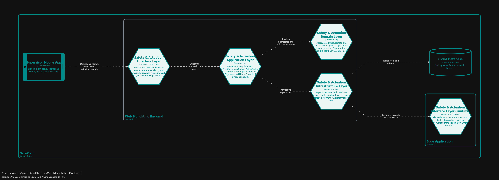

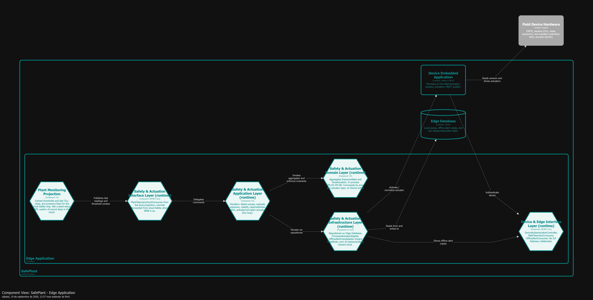

#### 4.2.2.6. Bounded Context Software Architecture Code Level Diagrams

##### 4.2.2.6.1. Bounded Context Domain Layer Class Diagrams

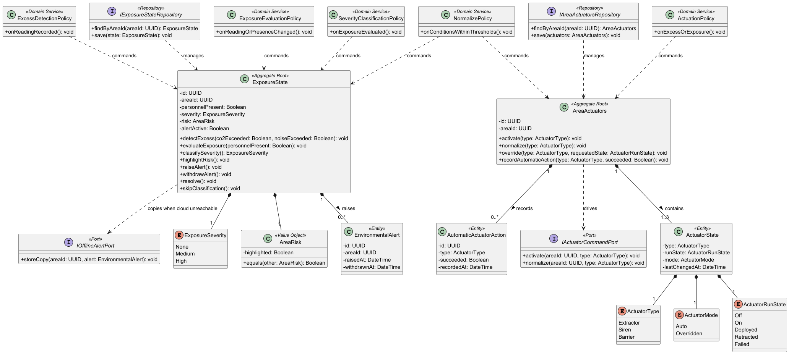

##### 4.2.2.6.2. Bounded Context Database Design Diagram

Modelo relacional lógico, **los mismos** hechos en dos almacenes: Edge Database (SQLite, loop vivo) y Cloud Database (PostgreSQL, sync/auditoría). Tablas: `exposure_states` (`area_id` UNIQUE), `environmental_alerts`, `area_actuator_states` (clave lógica `area_id` + `actuator_type`, **sin** `device_id`) y `automatic_actuator_actions`.

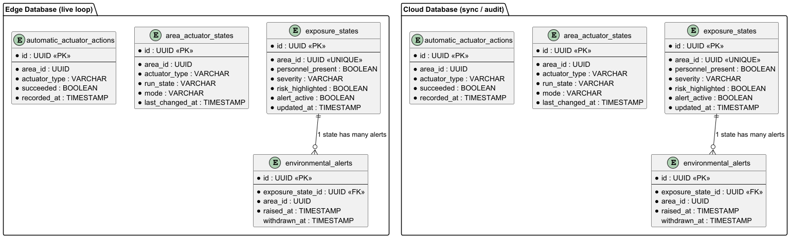

---

### 4.2.3. Bounded Context: Device & Edge Management

**Navegación:** [Capítulo IV](../04-capitulo-iv-solution-software-design.md) · [Índice](../00-student-outcome.md#s-tabla-contenidos)

---

Device & Edge Management autentica dispositivos de campo, consume las lecturas publicadas al broker MQTT y las entrega a Plant Monitoring, y mantiene continuidad si la nube no alcanza: cola local, reintento al recuperar el enlace y copia de alerta. Es un contexto **supporting**: no interpreta umbrales ni exposición.

El mismo contexto está **repartido** en dos containers. En el **Web Monolithic Backend** vive el registro maestro de `DeviceCredential`: emitir, revocar y validar contra la fuente de verdad. En la **Edge Application** vive `EdgeNode`: autenticar el firmware, consumir MQTT sin unificar CO₂, ruido y presencia, ingest hacia Plant Monitoring, cola y sync, y la copia de alerta que el Safety **runtime (hermano en el mismo container)** deja para sincronizar.

Ubiquitous language: *Device credential* · *Device authenticated* · *Edge node* · *Telemetry queued locally* · *Local telemetry sync* · *Offline alert stored* · *Duplicate telemetry acknowledged* · *Ingest telemetry*.

#### 4.2.3.1. Domain Layer

Dos aggregate roots en el mismo bounded context y en distintos procesos: `DeviceCredential` en la nube y `EdgeNode` en el runtime de planta. Las lecturas encoladas son hechos **separados** (`QueuedReading` con un tipo CO₂, ruido o presencia), no un `EnvironmentReading` unificado. Las políticas de cola y sync son domain services **in-process** en el Edge: si el ingest falla o no hay enlace, se encola; al recuperar conectividad se reintenta el **mismo** comando de ingest. El sync no inventa un segundo hecho de negocio por la misma lectura (`acknowledgeDuplicate`). La copia de alerta solo guarda `areaId` y `alertId`.

<table>
  <thead>
    <tr>
      <th align="left">Clase</th>
      <th align="left">Tipo</th>
      <th align="left">Propósito</th>
      <th align="left">Atributos</th>
      <th align="left">Métodos</th>
      <th align="left">Relaciones</th>
    </tr>
  </thead>
  <tbody>
    <tr>
      <td align="left">`DeviceCredential`</td>
      <td align="left">Aggregate Root (cloud)</td>
      <td align="left">Registro maestro de identidad del dispositivo. Fuente de verdad para emitir, autenticar y revocar.</td>
      <td align="left">`id`, `deviceId`, `secret`, `issuedAt`, `expiresAt`, `revokedAt`</td>
      <td align="left">`issue()`, `authenticate()`, `revoke()`</td>
      <td align="left">1 `DeviceId`; 1 `DeviceSecret`</td>
    </tr>
    <tr>
      <td align="left">`EdgeNode`</td>
      <td align="left">Aggregate Root (edge)</td>
      <td align="left">Cola local, sync idempotente y copias de alerta en el servidor de planta. No evalúa exposición.</td>
      <td align="left">`id`</td>
      <td align="left">`queueTelemetry()`, `syncLocalTelemetry()`, `storeOfflineAlert()`, `acknowledgeDuplicate()`</td>
      <td align="left">0..* `QueuedReading`; 0..* `OfflineAlertCopy`</td>
    </tr>
    <tr>
      <td align="left">`DeviceId`</td>
      <td align="left">Value Object</td>
      <td align="left">Identificador del dispositivo de campo. Distinto de una cuenta de usuario.</td>
      <td align="left">`value`</td>
      <td align="left">`equals()`</td>
      <td align="left">usado por `DeviceCredential` y `QueuedReading`</td>
    </tr>
    <tr>
      <td align="left">`DeviceSecret`</td>
      <td align="left">Value Object</td>
      <td align="left">Secreto almacenado como hash. Nunca se persiste en claro.</td>
      <td align="left">`hash`</td>
      <td align="left">`matches()`, `equals()`</td>
      <td align="left">usado por `DeviceCredential`</td>
    </tr>
    <tr>
      <td align="left">`QueuedReading`</td>
      <td align="left">Value Object</td>
      <td align="left">Hecho pendiente de ingest: un solo tipo (CO₂, ruido o presencia) y clave de idempotencia.</td>
      <td align="left">`deviceId`, `kind`, `measuredAt`, `payload`, `idempotencyKey`</td>
      <td align="left">`equals()`</td>
      <td align="left">contenido en `EdgeNode`</td>
    </tr>
    <tr>
      <td align="left">`OfflineAlertCopy`</td>
      <td align="left">Value Object</td>
      <td align="left">Copia local de una alerta ambiental. No incluye estado de exposición.</td>
      <td align="left">`areaId`, `alertId`, `storedAt`</td>
      <td align="left">`equals()`</td>
      <td align="left">contenido en `EdgeNode`</td>
    </tr>
    <tr>
      <td align="left">`ReadingKind`</td>
      <td align="left">Value Object (Enum)</td>
      <td align="left">`CarbonDioxide`, `Noise`, `Presence`. Tres hechos; no se fusionan.</td>
      <td align="left">`value`</td>
      <td align="left">—</td>
      <td align="left">usado por `QueuedReading`</td>
    </tr>
    <tr>
      <td align="left">`LocalQueuePolicy`</td>
      <td align="left">Domain Service (edge)</td>
      <td align="left">Si Plant Monitoring rechaza el ingest o la nube no alcanza, encola la lectura en `EdgeNode`.</td>
      <td align="left">—</td>
      <td align="left">`onIngestFailedOrUnreachable()`</td>
      <td align="left">comanda `EdgeNode`</td>
    </tr>
    <tr>
      <td align="left">`TelemetrySyncPolicy`</td>
      <td align="left">Domain Service (edge)</td>
      <td align="left">Al recuperar el enlace, sincroniza la cola y reintenta el mismo ingest. No duplica el hecho de negocio.</td>
      <td align="left">—</td>
      <td align="left">`onConnectivityRestored()`</td>
      <td align="left">comanda `EdgeNode`</td>
    </tr>
    <tr>
      <td align="left">`IDeviceCredentialRepository`</td>
      <td align="left">Repository (interface)</td>
      <td align="left">Persistencia del registro maestro en Cloud Database.</td>
      <td align="left">—</td>
      <td align="left">`findByDeviceId()`, `save()`</td>
      <td align="left">implementada en Infrastructure (cloud)</td>
    </tr>
    <tr>
      <td align="left">`IEdgeNodeRepository`</td>
      <td align="left">Repository (interface)</td>
      <td align="left">Persistencia del nodo, la cola y las copias en Edge Database.</td>
      <td align="left">—</td>
      <td align="left">`load()`, `save()`, `findPendingReadings()`, `saveQueuedReading()`</td>
      <td align="left">implementada en Infrastructure (edge)</td>
    </tr>
    <tr>
      <td align="left">`IMqttSubscriber`</td>
      <td align="left">Port (interface)</td>
      <td align="left">Suscripción a tres tópicos/hechos. El firmware publica; este contexto consume.</td>
      <td align="left">—</td>
      <td align="left">`subscribeCarbonDioxide()`, `subscribeNoise()`, `subscribePresence()`</td>
      <td align="left">implementado en Infrastructure (edge)</td>
    </tr>
    <tr>
      <td align="left">`ITelemetryIngestPort`</td>
      <td align="left">Port (interface)</td>
      <td align="left">Ingest de un hecho hacia Plant Monitoring. El reintento usa este mismo puerto.</td>
      <td align="left">—</td>
      <td align="left">`ingest()`</td>
      <td align="left">implementado en Infrastructure (edge)</td>
    </tr>
    <tr>
      <td align="left">`ICredentialSyncPort`</td>
      <td align="left">Port (interface)</td>
      <td align="left">Sincroniza la credencial del dispositivo entre Edge y el maestro cloud.</td>
      <td align="left">—</td>
      <td align="left">`syncFromCloud()`</td>
      <td align="left">implementado en Infrastructure (edge)</td>
    </tr>
  </tbody>
</table>

#### 4.2.3.2. Interface Layer

En la nube, un controller interno emite y revoca credenciales de dispositivo (no cuentas de usuario). En el Edge, el firmware se autentica, un consumer MQTT recibe tres hechos sin unificarlos y un consumer recibe `Store offline alert` desde el Safety runtime **local**. No hay un «IoT Gateway» como colaborador.

<table>
  <thead>
    <tr>
      <th align="left">Clase</th>
      <th align="left">Tipo</th>
      <th align="left">Propósito</th>
      <th align="left">Métodos / Endpoints</th>
      <th align="left">Colabora con</th>
    </tr>
  </thead>
  <tbody>
    <tr>
      <td align="left">`DeviceCredentialController`</td>
      <td align="left">Controller (cloud)</td>
      <td align="left">API interna de emisión y revocación del registro maestro. No gestiona usuarios.</td>
      <td align="left">`issue()`, `revoke()`</td>
      <td align="left">Application Layer (cloud)</td>
    </tr>
    <tr>
      <td align="left">`DeviceAuthenticationController`</td>
      <td align="left">Controller (edge)</td>
      <td align="left">Autentica el firmware contra la credencial (con sync al maestro si hace falta).</td>
      <td align="left">`authenticate()`</td>
      <td align="left">Device Embedded Application; Application Layer (edge)</td>
    </tr>
    <tr>
      <td align="left">`MqttTelemetryConsumer`</td>
      <td align="left">Consumer (edge)</td>
      <td align="left">Consume tres tópicos: CO₂, ruido y presencia. No unifica las lecturas.</td>
      <td align="left">`onCarbonDioxideReading()`, `onNoiseReading()`, `onPresenceChanged()`</td>
      <td align="left">MQTT Broker; Application Layer (edge)</td>
    </tr>
    <tr>
      <td align="left">`OfflineAlertConsumer`</td>
      <td align="left">Consumer (edge)</td>
      <td align="left">Recibe `Store offline alert` desde el Safety runtime **local** (in-process). No es un POST desde el monolito.</td>
      <td align="left">`onStoreOfflineAlert()`</td>
      <td align="left">Safety & Actuation; Application Layer (edge)</td>
    </tr>
  </tbody>
</table>

#### 4.2.3.3. Application Layer

Handlers de emisión, autenticación y revocación en la nube; en el Edge, autenticar, ingerir hacia Plant Monitoring, encolar, sincronizar y guardar la copia de alerta. El reintento de ingest es el mismo comando, no un segundo tipo.

<table>
  <thead>
    <tr>
      <th align="left">Clase</th>
      <th align="left">Tipo</th>
      <th align="left">Comando / Evento</th>
      <th align="left">Propósito</th>
      <th align="left">Colabora con</th>
    </tr>
  </thead>
  <tbody>
    <tr>
      <td align="left">`IssueDeviceCredentialHandler`</td>
      <td align="left">Command Handler (cloud)</td>
      <td align="left">Issue device credential</td>
      <td align="left">Emite el registro maestro del dispositivo.</td>
      <td align="left">`IDeviceCredentialRepository`</td>
    </tr>
    <tr>
      <td align="left">`AuthenticateDeviceCredentialHandler`</td>
      <td align="left">Command Handler (cloud)</td>
      <td align="left">Authenticate device credential</td>
      <td align="left">Valida el secreto contra la fuente de verdad. No es un inicio de sesión de usuario.</td>
      <td align="left">`IDeviceCredentialRepository`</td>
    </tr>
    <tr>
      <td align="left">`RevokeDeviceCredentialHandler`</td>
      <td align="left">Command Handler (cloud)</td>
      <td align="left">Revoke device credential</td>
      <td align="left">Revoca la credencial en el maestro.</td>
      <td align="left">`IDeviceCredentialRepository`</td>
    </tr>
    <tr>
      <td align="left">`AuthenticateDeviceHandler`</td>
      <td align="left">Command Handler (edge)</td>
      <td align="left">Authenticate device</td>
      <td align="left">Autentica el firmware en el Edge; sincroniza con el maestro si es necesario.</td>
      <td align="left">`ICredentialSyncPort`, `IEdgeNodeRepository`</td>
    </tr>
    <tr>
      <td align="left">`IngestTelemetryHandler`</td>
      <td align="left">Command Handler (edge)</td>
      <td align="left">Ingest telemetry</td>
      <td align="left">Entrega un hecho (CO₂, ruido o presencia) a Plant Monitoring. El reintento usa este mismo handler.</td>
      <td align="left">`ITelemetryIngestPort`, `LocalQueuePolicy`</td>
    </tr>
    <tr>
      <td align="left">`QueueLocallyHandler`</td>
      <td align="left">Command Handler (edge)</td>
      <td align="left">Queue locally</td>
      <td align="left">Encola la lectura cuando el ingest falla o la nube no alcanza.</td>
      <td align="left">`IEdgeNodeRepository`</td>
    </tr>
    <tr>
      <td align="left">`SyncLocalTelemetryHandler`</td>
      <td align="left">Command Handler (edge)</td>
      <td align="left">Sync local telemetry</td>
      <td align="left">Al recuperar el enlace, reintenta ingest y reconoce duplicados.</td>
      <td align="left">`IEdgeNodeRepository`, `IngestTelemetryHandler`</td>
    </tr>
    <tr>
      <td align="left">`StoreOfflineAlertHandler`</td>
      <td align="left">Command Handler (edge)</td>
      <td align="left">Store offline alert</td>
      <td align="left">Persiste la copia de alerta. No altera el dueño del riesgo.</td>
      <td align="left">`IEdgeNodeRepository`</td>
    </tr>
  </tbody>
</table>

#### 4.2.3.4. Infrastructure Layer

Repositorio de credenciales sobre Cloud Database (PostgreSQL); cola y copias sobre Edge Database (SQLite); adapter MQTT (Eclipse Mosquitto); ingest hacia Plant Monitoring; sync de credenciales Edge ↔ nube.

<table>
  <thead>
    <tr>
      <th align="left">Clase</th>
      <th align="left">Tipo</th>
      <th align="left">Interfaz que implementa</th>
      <th align="left">Servicio externo</th>
      <th align="left">Propósito</th>
    </tr>
  </thead>
  <tbody>
    <tr>
      <td align="left">`DeviceCredentialRepository`</td>
      <td align="left">Repository (implementación)</td>
      <td align="left">`IDeviceCredentialRepository`</td>
      <td align="left">Cloud Database (PostgreSQL)</td>
      <td align="left">Persistencia del registro maestro de credenciales.</td>
    </tr>
    <tr>
      <td align="left">`EdgeNodeRepository`</td>
      <td align="left">Repository (implementación)</td>
      <td align="left">`IEdgeNodeRepository`</td>
      <td align="left">Edge Database (SQLite)</td>
      <td align="left">Persistencia del nodo, la cola y las copias de alerta.</td>
    </tr>
    <tr>
      <td align="left">`MqttBrokerAdapter`</td>
      <td align="left">Adapter</td>
      <td align="left">`IMqttSubscriber`</td>
      <td align="left">MQTT Broker (Eclipse Mosquitto)</td>
      <td align="left">Consume los tres tópicos de lecturas. El broker es container interno de SafePlant.</td>
    </tr>
    <tr>
      <td align="left">`PlantMonitoringIngestAdapter`</td>
      <td align="left">Adapter</td>
      <td align="left">`ITelemetryIngestPort`</td>
      <td align="left">Plant Monitoring (mismo sistema; Interface del monolito)</td>
      <td align="left">Entrega un hecho de telemetría al ingest de Plant Monitoring.</td>
    </tr>
    <tr>
      <td align="left">`CloudCredentialSyncAdapter`</td>
      <td align="left">Adapter</td>
      <td align="left">`ICredentialSyncPort`</td>
      <td align="left">Device & Edge (cloud)</td>
      <td align="left">Sincroniza la credencial con el maestro en el monolito.</td>
    </tr>
  </tbody>
</table>

#### 4.2.3.5. Bounded Context Software Architecture Component Level Diagrams

En la nube, Interface expone emisión y revocación; Application invoca `DeviceCredential`; Infrastructure persiste en `Cloud Database` y atiende el sync desde el Edge.

En runtime, el firmware se autentica en Interface; el broker MQTT entrega lecturas; Application orquesta ingest, cola y copia de alerta. Infrastructure escribe en `Edge Database`, ingiere en Plant Monitoring (Interface del monolito) y sincroniza credenciales.

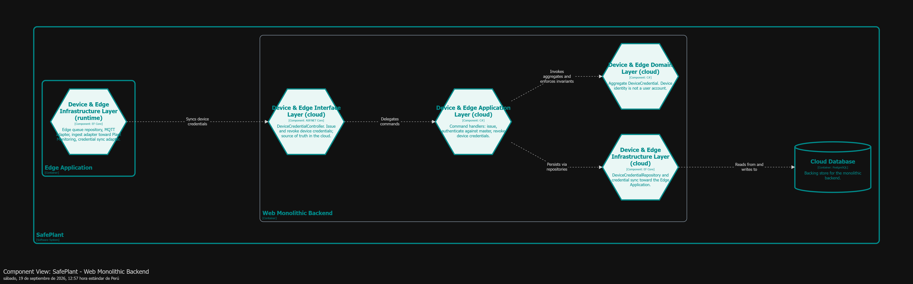

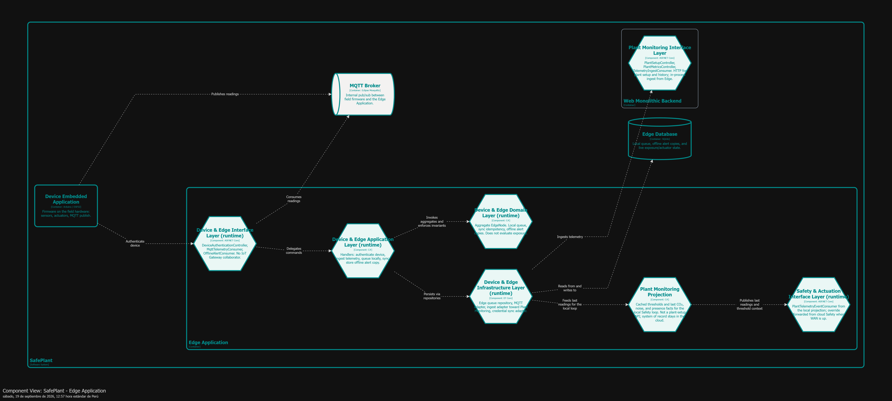

#### 4.2.3.6. Bounded Context Software Architecture Code Level Diagrams

##### 4.2.3.6.1. Bounded Context Domain Layer Class Diagrams

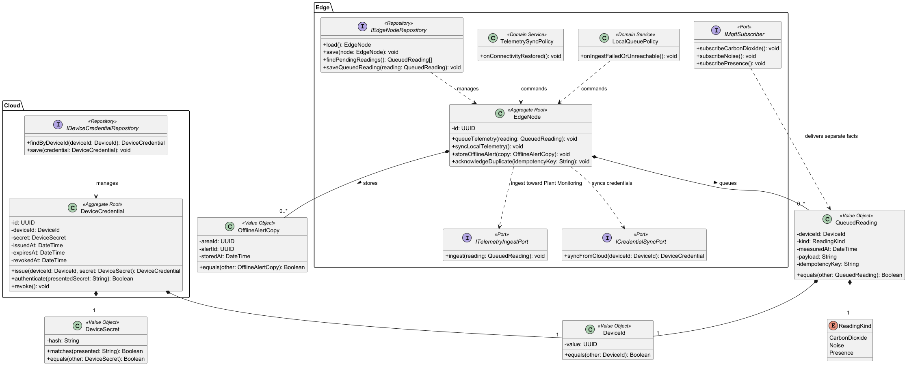

##### 4.2.3.6.2. Bounded Context Database Design Diagram

Dos esquemas lógicos. Cloud Database (PostgreSQL): `device_credentials` (`device_id` UNIQUE, `secret_hash`, vigencia, `revoked_at`). Edge Database (SQLite): `telemetry_queue` (tipo de hecho separado, `idempotency_key`) y `offline_alert_copies` (`area_id`, `alert_id`, `stored_at`).

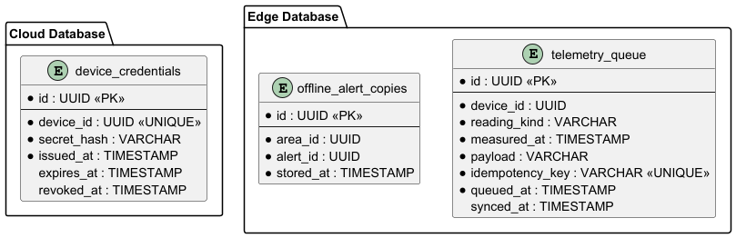

---

### 4.2.4. Bounded Context: Identity & Access

**Navegación:** [Capítulo IV](../04-capitulo-iv-solution-software-design.md) · [Índice](../00-student-outcome.md#s-tabla-contenidos)

---

Identity & Access resuelve quién entra a SafePlant, con qué rol y por qué canal —app móvil del supervisor o cliente web del encargado de planta—, y la recuperación de credenciales. Es un **Generic Subdomain**: no mide la planta ni evalúa exposición, solo concede o niega la sesión que Plant Monitoring y Safety & Actuation exigen vía Open Host Service. Vive enteramente en el monolito cloud; el Edge no administra usuarios, solo autentica dispositivos (Device & Edge Management).

Ubiquitous language: *User account* · *User role* · *Session* · *Sign in* · *Session granted* · *Protected action denied* · *Credential recovery* · *Channel (mobile / web)* · *Supervisor* · *Plant manager*.

#### 4.2.4.1. Domain Layer

El core del contexto son tres aggregates —`UserAccount`, `Session`, `CredentialRecovery`— con sus value objects, un domain service de autorización y las interfaces de repositorio que persisten cada aggregate.

<table>
  <thead>
    <tr>
      <th align="left">Clase</th>
      <th align="left">Tipo</th>
      <th align="left">Propósito</th>
      <th align="left">Atributos</th>
      <th align="left">Métodos</th>
      <th align="left">Relaciones</th>
    </tr>
  </thead>
  <tbody>
    <tr>
      <td align="left">`UserAccount`</td>
      <td align="left">Aggregate Root</td>
      <td align="left">Cuenta de un supervisor o encargado de planta, con su rol. Un correo = una cuenta (`E-07`).</td>
      <td align="left">`id`, `email`, `passwordHash`, `role`, `enabled`</td>
      <td align="left">`create()`, `assignRole()`, `disable()`, `verifyPassword()`</td>
      <td align="left">1—0..* `Session` (owns); 1—0..* `CredentialRecovery` (requests)</td>
    </tr>
    <tr>
      <td align="left">`Session`</td>
      <td align="left">Aggregate Root</td>
      <td align="left">Sesión activa en un canal (móvil o web) con token vigente (`C-06`–`C-09`).</td>
      <td align="left">`id`, `accountId`, `channel`, `token`, `issuedAt`, `expiresAt`, `closedAt`</td>
      <td align="left">`grant()`, `close()`, `isValid()`</td>
      <td align="left">pertenece a 1 `UserAccount`</td>
    </tr>
    <tr>
      <td align="left">`CredentialRecovery`</td>
      <td align="left">Aggregate Root</td>
      <td align="left">Proceso de recuperación de credenciales con vencimiento (TTL) (`C-03`–`C-05`).</td>
      <td align="left">`id`, `accountId`, `token`, `requestedAt`, `expiresAt`, `usedAt`</td>
      <td align="left">`request()`, `reset()`, `isExpired()`</td>
      <td align="left">pertenece a 1 `UserAccount`</td>
    </tr>
    <tr>
      <td align="left">`Email`</td>
      <td align="left">Value Object</td>
      <td align="left">Dirección de correo validada, única por cuenta.</td>
      <td align="left">`value`</td>
      <td align="left">`equals()`</td>
      <td align="left">usado por `UserAccount`</td>
    </tr>
    <tr>
      <td align="left">`UserRole`</td>
      <td align="left">Value Object (Enum)</td>
      <td align="left">Rol de canal: `Supervisor` o `PlantManager`.</td>
      <td align="left">`value`</td>
      <td align="left">—</td>
      <td align="left">usado por `UserAccount`</td>
    </tr>
    <tr>
      <td align="left">`Channel`</td>
      <td align="left">Value Object (Enum)</td>
      <td align="left">Canal de acceso: `Mobile` o `Web`.</td>
      <td align="left">`value`</td>
      <td align="left">—</td>
      <td align="left">usado por `Session`</td>
    </tr>
    <tr>
      <td align="left">`SessionToken`</td>
      <td align="left">Value Object</td>
      <td align="left">Token opaco de sesión.</td>
      <td align="left">`value`</td>
      <td align="left">`equals()`</td>
      <td align="left">usado por `Session`</td>
    </tr>
    <tr>
      <td align="left">`RecoveryToken`</td>
      <td align="left">Value Object</td>
      <td align="left">Token opaco de recuperación.</td>
      <td align="left">`value`</td>
      <td align="left">`equals()`</td>
      <td align="left">usado por `CredentialRecovery`</td>
    </tr>
    <tr>
      <td align="left">`AccessPolicy`</td>
      <td align="left">Domain Service</td>
      <td align="left">Evalúa si una acción protegida es permitida según rol y canal de la sesión (`C-08`). Setup de planta y override exigen supervisor **móvil**; web deniega.</td>
      <td align="left">—</td>
      <td align="left">`isActionAllowed()`</td>
      <td align="left">evalúa `Session`, `UserRole`</td>
    </tr>
    <tr>
      <td align="left">`IEmailSender`</td>
      <td align="left">Port (interface)</td>
      <td align="left">Puerto de salida hacia el servicio de recuperación de credenciales por correo.</td>
      <td align="left">—</td>
      <td align="left">`send()`</td>
      <td align="left">implementado en Infrastructure (`XS-01`)</td>
    </tr>
    <tr>
      <td align="left">`IUserAccountRepository`</td>
      <td align="left">Repository (interface)</td>
      <td align="left">Persistencia de `UserAccount`.</td>
      <td align="left">—</td>
      <td align="left">`findById()`, `findByEmail()`, `save()`</td>
      <td align="left">implementada en Infrastructure</td>
    </tr>
    <tr>
      <td align="left">`ISessionRepository`</td>
      <td align="left">Repository (interface)</td>
      <td align="left">Persistencia de `Session`.</td>
      <td align="left">—</td>
      <td align="left">`findByToken()`, `save()`</td>
      <td align="left">implementada en Infrastructure</td>
    </tr>
    <tr>
      <td align="left">`ICredentialRecoveryRepository`</td>
      <td align="left">Repository (interface)</td>
      <td align="left">Persistencia de `CredentialRecovery`.</td>
      <td align="left">—</td>
      <td align="left">`findByToken()`, `save()`</td>
      <td align="left">implementada en Infrastructure</td>
    </tr>
  </tbody>
</table>

#### 4.2.4.2. Interface Layer

Tres controllers HTTP exponen el contexto hacia el Supervisor Mobile App y el Plant Manager Web Client. Identity & Access no consume MQTT: no hay Consumer, la autenticación de dispositivos vive en Device & Edge Management (`C-14`).

<table>
  <thead>
    <tr>
      <th align="left">Clase</th>
      <th align="left">Tipo</th>
      <th align="left">Propósito</th>
      <th align="left">Métodos / Endpoints</th>
      <th align="left">Colabora con</th>
    </tr>
  </thead>
  <tbody>
    <tr>
      <td align="left">`UserAccountController`</td>
      <td align="left">Controller</td>
      <td align="left">Alta de cuentas, asignación de rol y directorio de usuarios.</td>
      <td align="left">`createUserAccount()`, `assignUserRole()`, `getUserAccountsDirectory()`</td>
      <td align="left">Plant Manager Web Client; Application Layer</td>
    </tr>
    <tr>
      <td align="left">`SessionController`</td>
      <td align="left">Controller</td>
      <td align="left">Sign-in único (canal como parámetro) y cierre de sesión.</td>
      <td align="left">`signIn()`, `closeSession()`</td>
      <td align="left">Supervisor Mobile App; Plant Manager Web Client; Application Layer</td>
    </tr>
    <tr>
      <td align="left">`CredentialRecoveryController`</td>
      <td align="left">Controller</td>
      <td align="left">Solicitud y reseteo de credenciales.</td>
      <td align="left">`requestCredentialRecovery()`, `resetCredentials()`</td>
      <td align="left">Plant Manager Web Client; Application Layer</td>
    </tr>
  </tbody>
</table>

#### 4.2.4.3. Application Layer

Un handler por comando del contexto (`C-01`–`C-09`) más el query de directorio (`RM-01`). `C-05` y `C-09` (expiración de TTL) son handlers disparados por tiempo, no por un controller.

<table>
  <thead>
    <tr>
      <th align="left">Clase</th>
      <th align="left">Tipo</th>
      <th align="left">Comando / Evento</th>
      <th align="left">Propósito</th>
      <th align="left">Colabora con</th>
    </tr>
  </thead>
  <tbody>
    <tr>
      <td align="left">`CreateUserAccountHandler`</td>
      <td align="left">Command Handler</td>
      <td align="left">Create user account (`C-01`)</td>
      <td align="left">Crea la cuenta validando correo único.</td>
      <td align="left">`IUserAccountRepository`</td>
    </tr>
    <tr>
      <td align="left">`AssignUserRoleHandler`</td>
      <td align="left">Command Handler</td>
      <td align="left">Assign user role (`C-02`)</td>
      <td align="left">Asigna o cambia el rol de una cuenta existente.</td>
      <td align="left">`IUserAccountRepository`</td>
    </tr>
    <tr>
      <td align="left">`RequestCredentialRecoveryHandler`</td>
      <td align="left">Command Handler</td>
      <td align="left">Request credential recovery (`C-03`)</td>
      <td align="left">Inicia la recuperación y notifica por correo.</td>
      <td align="left">`IUserAccountRepository`, `ICredentialRecoveryRepository`, `IEmailSender`</td>
    </tr>
    <tr>
      <td align="left">`ResetCredentialsHandler`</td>
      <td align="left">Command Handler</td>
      <td align="left">Reset credentials (`C-04`)</td>
      <td align="left">Aplica el nuevo password si el token es válido.</td>
      <td align="left">`ICredentialRecoveryRepository`, `IUserAccountRepository`</td>
    </tr>
    <tr>
      <td align="left">`ExpireCredentialRecoveryHandler`</td>
      <td align="left">Event Handler (scheduled)</td>
      <td align="left">Expire credential recovery (`C-05`)</td>
      <td align="left">Marca vencidos los procesos fuera de TTL.</td>
      <td align="left">`ICredentialRecoveryRepository`</td>
    </tr>
    <tr>
      <td align="left">`SignInHandler`</td>
      <td align="left">Command Handler</td>
      <td align="left">Sign in (`C-06`)</td>
      <td align="left">Valida credenciales y concede sesión según canal.</td>
      <td align="left">`IUserAccountRepository`, `ISessionRepository`</td>
    </tr>
    <tr>
      <td align="left">`CloseSessionHandler`</td>
      <td align="left">Command Handler</td>
      <td align="left">Close session (`C-07`)</td>
      <td align="left">Cierra la sesión activa.</td>
      <td align="left">`ISessionRepository`</td>
    </tr>
    <tr>
      <td align="left">`DenyProtectedActionHandler`</td>
      <td align="left">Command Handler</td>
      <td align="left">Attempt protected action (`C-08`)</td>
      <td align="left">Evalúa `AccessPolicy` y deniega si el rol/canal no corresponde.</td>
      <td align="left">`AccessPolicy`</td>
    </tr>
    <tr>
      <td align="left">`ExpireAccessTokenHandler`</td>
      <td align="left">Event Handler (scheduled)</td>
      <td align="left">Expire access token (`C-09`)</td>
      <td align="left">Cierra sesiones cuyo token venció.</td>
      <td align="left">`ISessionRepository`</td>
    </tr>
    <tr>
      <td align="left">`GetUserAccountsDirectoryHandler`</td>
      <td align="left">Query Handler</td>
      <td align="left">Get UserAccountsDirectory (`RM-01`)</td>
      <td align="left">Lista cuentas y roles para el Plant Manager.</td>
      <td align="left">`IUserAccountRepository`</td>
    </tr>
  </tbody>
</table>

#### 4.2.4.4. Infrastructure Layer

Implementaciones de los tres repositorios y el adaptador de correo. Motor de base de datos: **PostgreSQL**; proveedor de email: **SMTP** (DEC-008). Identity sigue propia (no Auth0/Cognito).

<table>
  <thead>
    <tr>
      <th align="left">Clase</th>
      <th align="left">Tipo</th>
      <th align="left">Interfaz que implementa</th>
      <th align="left">Servicio externo</th>
      <th align="left">Propósito</th>
    </tr>
  </thead>
  <tbody>
    <tr>
      <td align="left">`UserAccountRepository`</td>
      <td align="left">Repository (implementación)</td>
      <td align="left">`IUserAccountRepository`</td>
      <td align="left">Cloud Database (PostgreSQL)</td>
      <td align="left">Persistencia relacional de cuentas.</td>
    </tr>
    <tr>
      <td align="left">`SessionRepository`</td>
      <td align="left">Repository (implementación)</td>
      <td align="left">`ISessionRepository`</td>
      <td align="left">Cloud Database (PostgreSQL)</td>
      <td align="left">Persistencia relacional de sesiones.</td>
    </tr>
    <tr>
      <td align="left">`CredentialRecoveryRepository`</td>
      <td align="left">Repository (implementación)</td>
      <td align="left">`ICredentialRecoveryRepository`</td>
      <td align="left">Cloud Database (PostgreSQL)</td>
      <td align="left">Persistencia relacional de procesos de recuperación.</td>
    </tr>
    <tr>
      <td align="left">`EmailServiceAdapter`</td>
      <td align="left">Adapter</td>
      <td align="left">`IEmailSender`</td>
      <td align="left">Email Service (`XS-01`, SMTP)</td>
      <td align="left">Envía el correo de recuperación de credenciales.</td>
    </tr>
  </tbody>
</table>

#### 4.2.4.5. Bounded Context Software Architecture Component Level Diagrams

Identity & Access vive dentro del único container `Web Monolithic Backend`. Interface recibe las llamadas de las apps, Application orquesta comandos y queries, Domain concentra los aggregates y `AccessPolicy`, e Infrastructure implementa los repositorios y habla con `Cloud Database` y `Email Service`.

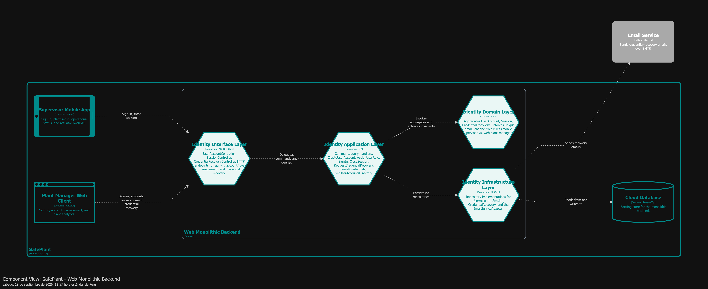

#### 4.2.4.6. Bounded Context Software Architecture Code Level Diagrams

##### 4.2.4.6.1. Bounded Context Domain Layer Class Diagrams

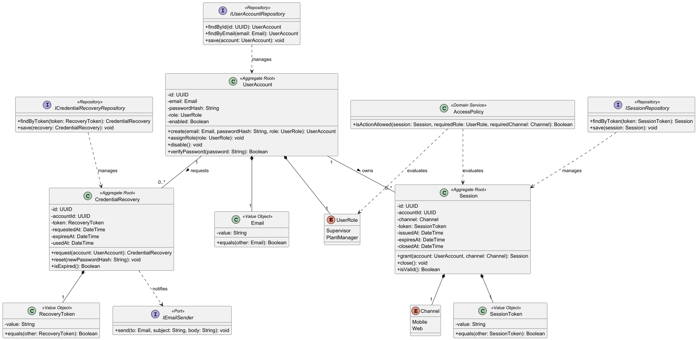

##### 4.2.4.6.2. Bounded Context Database Design Diagram

Modelo relacional lógico: `user_accounts`, `sessions` y `credential_recoveries`, con `email` y los hashes de token como `UNIQUE`, y llaves foráneas de `sessions`/`credential_recoveries` hacia `user_accounts`.

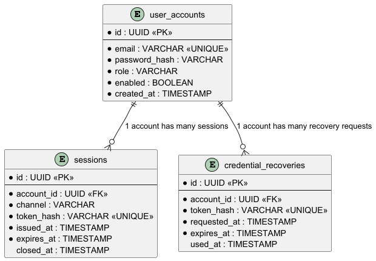

---

# Capítulo V: Solution UI/UX Design

## 5.1. Style Guidelines

### 5.1.1. General Style Guidelines

### 5.1.2. Web, Mobile and IoT Style Guidelines

## 5.2. Information Architecture

### 5.2.1. Organization Systems

### 5.2.2. Labeling Systems

### 5.2.3. SEO Tags and Meta Tags

### 5.2.4. Searching Systems

### 5.2.5. Navigation Systems

## 5.3. Landing Page UI Design

### 5.3.1. Landing Page Wireframe

### 5.3.2. Landing Page Mock-up

## 5.4. Applications UX/UI Design

### 5.4.1. Applications Wireframes

### 5.4.2. Applications Wireflow Diagrams

### 5.4.2. Applications Mock-ups

### 5.4.3. Applications User Flow Diagrams

## 5.5. Applications Prototyping

**URL del prototipo:** 

## 5.6. IoT Device Design

---

# Capítulo VI: Product Implementation, Validation & Deployment

## 6.1. Software Configuration Management

### 6.1.1. Software Development Environment Configuration

### 6.1.2. Source Code Management

### 6.1.3. Source Code Style Guide & Conventions

### 6.1.4. Software Deployment Configuration

## 6.2. Landing Page, Services & Applications Implementation

> Documentar cada sprint en `sprints/` a partir de [`templates/sprint.md`](./templates/sprint.md).

<table>
  <thead>
    <tr>
      <th align="left">#</th>
      <th align="left">Sprint</th>
      <th align="left">Documento</th>
    </tr>
  </thead>
  <tbody>
    <tr>
      <td align="left">6.2.1</td>
      <td align="left">Sprint 1</td>
      <td align="left"></td>
    </tr>
  </tbody>
</table>

---

### 6.2.X. Sprint n

> Plantilla. Copiar a `../sprints/sprint-0N.md` y registrar en el Capítulo VI § 6.2.

**Navegación:** [Capítulo VI](../06-capitulo-vi-product-implementation.md) · [Índice](../00-student-outcome.md#s-tabla-contenidos)

---

#### 6.2.X.1. Sprint Planning n

#### 6.2.X.2. Aspect Leaders and Collaborators

<table>
  <thead>
    <tr>
      <th align="left">Aspecto</th>
      <th align="left">Leader</th>
      <th align="left">Collaborators</th>
    </tr>
  </thead>
  <tbody>
    <tr>
      <td align="left"></td>
      <td align="left"></td>
      <td align="left"></td>
    </tr>
  </tbody>
</table>

#### 6.2.X.3. Sprint Backlog n

<table>
  <thead>
    <tr>
      <th align="left">ID</th>
      <th align="left">User Story / Work Item</th>
      <th align="left">Points</th>
      <th align="left">Estado</th>
    </tr>
  </thead>
  <tbody>
    <tr>
      <td align="left"></td>
      <td align="left"></td>
      <td align="left"></td>
      <td align="left"></td>
    </tr>
  </tbody>
</table>

#### 6.2.X.4. Development Evidence for Sprint Review

#### 6.2.X.5. Testing Suite Evidence for Sprint Review

#### 6.2.X.6. Execution Evidence for Sprint Review

#### 6.2.X.7. Services Documentation Evidence for Sprint Review

#### 6.2.X.8. Software Deployment Evidence for Sprint Review

#### 6.2.X.9. Team Collaboration Insights during Sprint

---

## 6.3. Validation Interviews

### 6.3.1. Diseño de Entrevistas

### 6.3.2. Registro de Entrevistas

<table>
  <thead>
    <tr>
      <th align="left">ID</th>
      <th align="left">Fecha</th>
      <th align="left">Entrevistado</th>
      <th align="left">Segmento objetivo</th>
      <th align="left">Evidencia</th>
    </tr>
  </thead>
  <tbody>
    <tr>
      <td align="left">V-01</td>
      <td align="left"></td>
      <td align="left"></td>
      <td align="left"></td>
      <td align="left"></td>
    </tr>
  </tbody>
</table>

### 6.3.3. Evaluaciones según heurísticas

## 6.4. Video About-the-Product

**URL del video:** 

---

# Conclusiones

## Conclusiones y recomendaciones

## Video About-the-Team

**URL del video:** 

---

# Bibliografía

---

# Anexos

## Videos de Exposiciones

<table>
  <thead>
    <tr>
      <th align="left">Entrega</th>
      <th align="left">Descripción</th>
      <th align="left">URL (Stream / Clipchamp)</th>
      <th align="left">Archivo .mp4</th>
    </tr>
  </thead>
  <tbody>
    <tr>
      <td align="left">AV1</td>
      <td align="left"></td>
      <td align="left"></td>
      <td align="left"></td>
    </tr>
    <tr>
      <td align="left">TB1</td>
      <td align="left"></td>
      <td align="left"></td>
      <td align="left"></td>
    </tr>
    <tr>
      <td align="left">AV2</td>
      <td align="left"></td>
      <td align="left"></td>
      <td align="left"></td>
    </tr>
    <tr>
      <td align="left">TB2</td>
      <td align="left"></td>
      <td align="left"></td>
      <td align="left"></td>
    </tr>
  </tbody>
</table>

## Repositorios y artefactos

<table>
  <thead>
    <tr>
      <th align="left">Artefacto</th>
      <th align="left">URL / ubicación</th>
    </tr>
  </thead>
  <tbody>
    <tr>
      <td align="left">Repositorio del informe (Project Report)</td>
      <td align="left"></td>
    </tr>
    <tr>
      <td align="left">Repositorio(s) de código de la solución</td>
      <td align="left"></td>
    </tr>
    <tr>
      <td align="left">Prototipos (Figma / UXPressia / LucidChart)</td>
      <td align="left"></td>
    </tr>
  </tbody>
</table>
