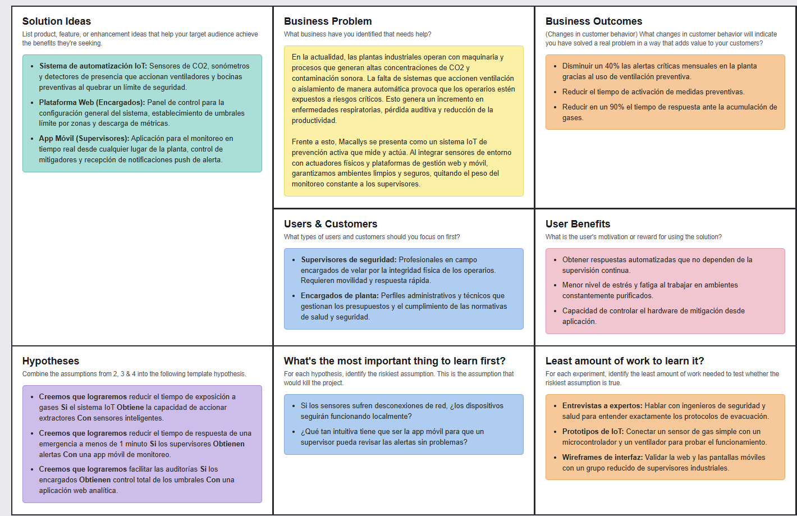
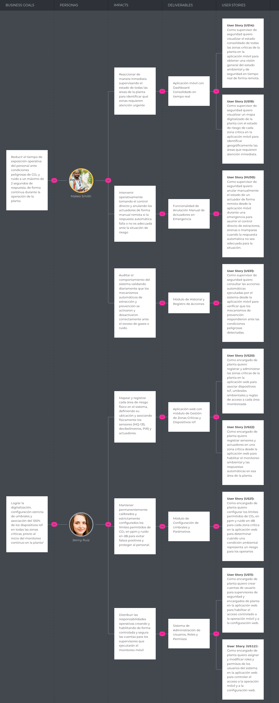
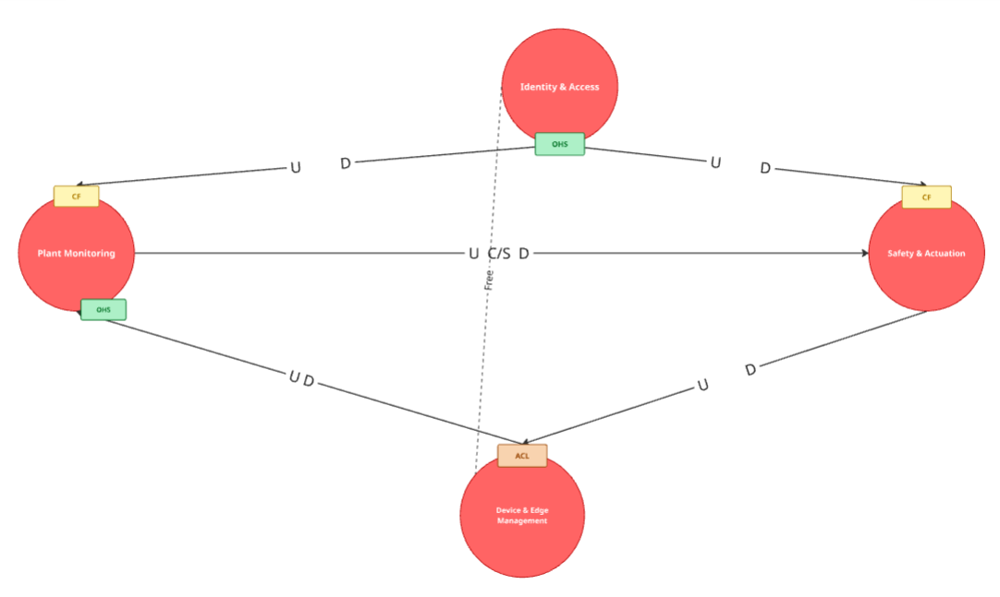
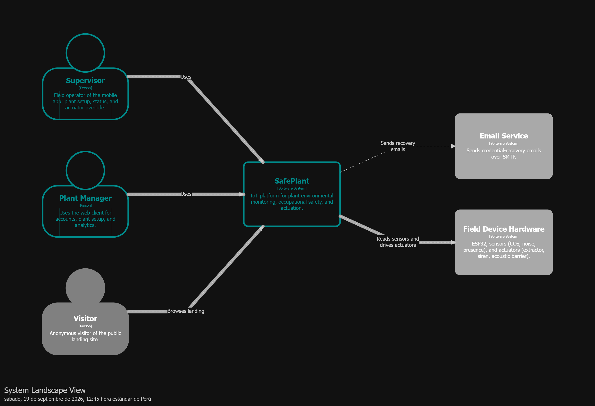
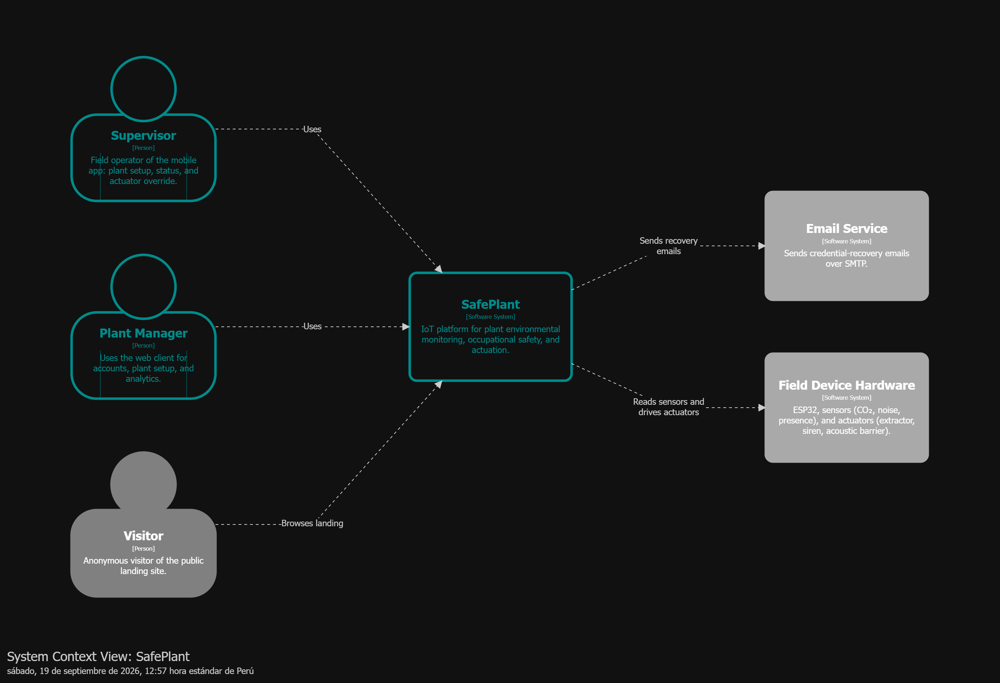
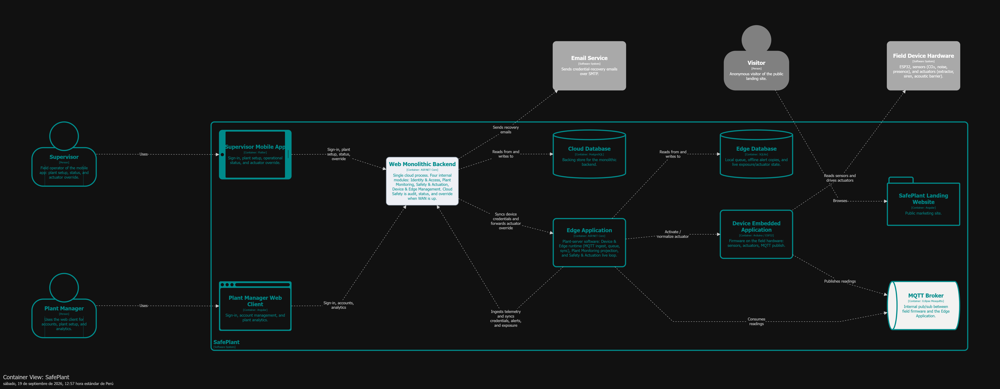
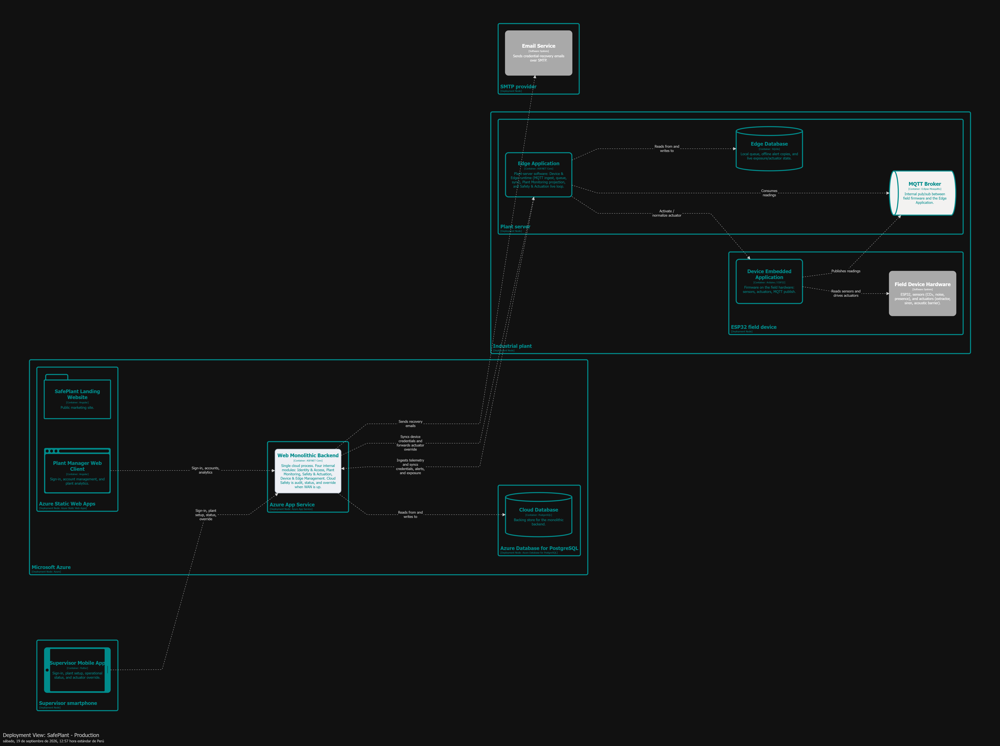

# Carátula

**Universidad Peruana de Ciencias Aplicadas**

**Facultad de Ingeniería**

**Carrera de Ingeniería de Software**

**Ciclo académico:** 2026-20

---

**Código del curso:** 1ASI0572

**Nombre del curso:** Desarrollo de Soluciones IoT

**NRC:** [NRC]

**Nombre del profesor:** [Apellidos y Nombres]

---

**Informe de Trabajo Final**

**Nombre del startup:** [Nombre del startup]

**Nombre del producto:** [Nombre del producto]

## Relación de integrantes

<table>
  <thead>
    <tr>
      <th align="left">Código</th>
      <th align="left">Apellidos y Nombres</th>
    </tr>
  </thead>
  <tbody>
    <tr>
      <td align="left"></td>
      <td align="left"></td>
    </tr>
    <tr>
      <td align="left"></td>
      <td align="left"></td>
    </tr>
    <tr>
      <td align="left"></td>
      <td align="left"></td>
    </tr>
    <tr>
      <td align="left"></td>
      <td align="left"></td>
    </tr>
  </tbody>
</table>

**Mes y año:** [Mes, Año]

---

# Registro de Versiones del Informe

<table>
  <thead>
    <tr>
      <th align="left">Versión</th>
      <th align="left">Fecha</th>
      <th align="left">Autor</th>
      <th align="left">Descripción de modificación</th>
    </tr>
  </thead>
  <tbody>
    <tr>
      <td align="left">1.0</td>
      <td align="left">2026-08-31</td>
      <td align="left"></td>
      <td align="left">Inicialización del esqueleto del informe según enunciado del Trabajo Final.</td>
    </tr>
  </tbody>
</table>

---

# Project Report Collaboration Insights

**URL del repositorio (Project Report):** [URL de la organización / repositorio GitHub]

**Entrega AV1 / TB1 / AV2 / TB2**

---

# Contenido

## Tabla de contenidos

<!-- TOC:start -->

1. [Student Outcome](#s-student-outcome)
1. [Capítulo I: Introducción](#s-cap-i)
    1. [1.1. Startup Profile](#s-1-1)
        1. [1.1.1. Descripción de la Startup](#s-1-1-1)
        1. [1.1.2. Perfiles de integrantes del equipo](#s-1-1-2)
    1. [1.2. Solution Profile](#s-1-2)
        1. [1.2.1 Antecedentes y problemática](#s-1-2-1)
        1. [1.2.2 Lean UX Process](#s-1-2-2)
            1. [1.2.2.1. Lean UX Problem Statements](#s-1-2-2-1)
            1. [1.2.2.2. Lean UX Assumptions](#s-1-2-2-2)
            1. [1.2.2.3. Lean UX Hypothesis Statements](#s-1-2-2-3)
            1. [1.2.2.4. Lean UX Canvas](#s-1-2-2-4)
    1. [1.3. Segmentos objetivo](#s-1-3)
1. [Capítulo II: Requirements Elicitation & Analysis](#s-cap-ii)
    1. [2.1. Competidores](#s-2-1)
        1. [2.1.1. Análisis competitivo](#s-2-1-1)
        1. [2.1.2. Estrategias y tácticas frente a competidores](#s-2-1-2)
    1. [2.2. Entrevistas](#s-2-2)
        1. [2.2.1. Diseño de entrevistas](#s-2-2-1)
        1. [2.2.2. Registro de entrevistas](#s-2-2-2)
        1. [2.2.3. Análisis de entrevistas](#s-2-2-3)
    1. [2.3. Needfinding](#s-2-3)
        1. [2.3.1. User Personas](#s-2-3-1)
        1. [2.3.2. User Task Matrix](#s-2-3-2)
        1. [2.3.3. User Journey Mapping](#s-2-3-3)
        1. [2.3.4. Empathy Mapping](#s-2-3-4)
    1. [2.4. Big Picture EventStorming](#s-2-4)
    1. [2.5. Ubiquitous Language](#s-2-5)
1. [Capítulo III: Requirements Specification](#s-cap-iii)
    1. [3.1. User Stories y Technical Stories](#s-3-1)
    1. [3.2. Impact Mapping](#s-3-2)
    1. [3.3. Product Backlog](#s-3-3)
    1. [3.4. Matriz de trazabilidad HU–TS–Componente](#s-3-4)
1. [Capítulo IV: Solution Software Design](#s-cap-iv)
    1. [4.1. Strategic-Level Domain-Driven Design](#s-4-1)
        1. [4.1.1. Design-Level EventStorming](#s-4-1-1)
            1. [4.1.1.1 Candidate Context Discovery](#s-4-1-1-1)
            1. [4.1.1.2 Domain Message Flows Modeling](#s-4-1-1-2)
            1. [4.1.1.3 Bounded Context Canvases](#s-4-1-1-3)
        1. [4.1.2. Context Mapping](#s-4-1-2)
        1. [4.1.3. Software Architecture](#s-4-1-3)
            1. [4.1.3.1. Software Architecture System Landscape Diagram](#s-4-1-3-1)
            1. [4.1.3.2. Software Architecture Context Level Diagrams](#s-4-1-3-2)
            1. [4.1.3.2. Software Architecture Container Level Diagrams](#s-4-1-3-2-software-architecture-container-level-diagrams)
            1. [4.1.3.3. Software Architecture Deployment Diagrams](#s-4-1-3-3)
    1. [4.2. Tactical-Level Domain-Driven Design](#s-4-2)
        1. [4.2.X. Bounded Context: \<Bounded Context Name\>](#s-4-2-x)
            1. [4.2.X.1. Domain Layer](#s-4-2-x-1)
            1. [4.2.X.2. Interface Layer](#s-4-2-x-2)
            1. [4.2.X.3. Application Layer](#s-4-2-x-3)
            1. [4.2.X.4. Infrastructure Layer](#s-4-2-x-4)
            1. [4.2.X.5. Bounded Context Software Architecture Component Level Diagrams](#s-4-2-x-5)
            1. [4.2.X.6. Bounded Context Software Architecture Code Level Diagrams](#s-4-2-x-6)
                1. [4.2.X.6.1. Bounded Context Domain Layer Class Diagrams](#s-4-2-x-6-1)
                1. [4.2.X.6.2. Bounded Context Database Design Diagram](#s-4-2-x-6-2)
1. [Capítulo V: Solution UI/UX Design](#s-cap-v)
    1. [5.1. Style Guidelines](#s-5-1)
        1. [5.1.1. General Style Guidelines](#s-5-1-1)
        1. [5.1.2. Web, Mobile and IoT Style Guidelines](#s-5-1-2)
    1. [5.2. Information Architecture](#s-5-2)
        1. [5.2.1. Organization Systems](#s-5-2-1)
        1. [5.2.2. Labeling Systems](#s-5-2-2)
        1. [5.2.3. SEO Tags and Meta Tags](#s-5-2-3)
        1. [5.2.4. Searching Systems](#s-5-2-4)
        1. [5.2.5. Navigation Systems](#s-5-2-5)
    1. [5.3. Landing Page UI Design](#s-5-3)
        1. [5.3.1. Landing Page Wireframe](#s-5-3-1)
        1. [5.3.2. Landing Page Mock-up](#s-5-3-2)
    1. [5.4. Applications UX/UI Design](#s-5-4)
        1. [5.4.1. Applications Wireframes](#s-5-4-1)
        1. [5.4.2. Applications Wireflow Diagrams](#s-5-4-2)
        1. [5.4.2. Applications Mock-ups](#s-5-4-2-applications-mock-ups)
        1. [5.4.3. Applications User Flow Diagrams](#s-5-4-3)
    1. [5.5. Applications Prototyping](#s-5-5)
    1. [5.6. IoT Device Design](#s-5-6)
1. [Capítulo VI: Product Implementation, Validation & Deployment](#s-cap-vi)
    1. [6.1. Software Configuration Management](#s-6-1)
        1. [6.1.1. Software Development Environment Configuration](#s-6-1-1)
        1. [6.1.2. Source Code Management](#s-6-1-2)
        1. [6.1.3. Source Code Style Guide & Conventions](#s-6-1-3)
        1. [6.1.4. Software Deployment Configuration](#s-6-1-4)
    1. [6.2. Landing Page, Services & Applications Implementation](#s-6-2)
        1. [6.2.X. Sprint n](#s-6-2-x)
            1. [6.2.X.1. Sprint Planning n](#s-6-2-x-1)
            1. [6.2.X.2. Aspect Leaders and Collaborators](#s-6-2-x-2)
            1. [6.2.X.3. Sprint Backlog n](#s-6-2-x-3)
            1. [6.2.X.4. Development Evidence for Sprint Review](#s-6-2-x-4)
            1. [6.2.X.5. Testing Suite Evidence for Sprint Review](#s-6-2-x-5)
            1. [6.2.X.6. Execution Evidence for Sprint Review](#s-6-2-x-6)
            1. [6.2.X.7. Services Documentation Evidence for Sprint Review](#s-6-2-x-7)
            1. [6.2.X.8. Software Deployment Evidence for Sprint Review](#s-6-2-x-8)
            1. [6.2.X.9. Team Collaboration Insights during Sprint](#s-6-2-x-9)
    1. [6.3. Validation Interviews](#s-6-3)
        1. [6.3.1. Diseño de Entrevistas](#s-6-3-1)
        1. [6.3.2. Registro de Entrevistas](#s-6-3-2)
        1. [6.3.3. Evaluaciones según heurísticas](#s-6-3-3)
    1. [6.4. Video About-the-Product](#s-6-4)
1. [Conclusiones](#s-conclusiones)
    1. [Conclusiones y recomendaciones](#s-conclusiones-recomendaciones)
    1. [Video About-the-Team](#s-video-about-the-team)
1. [Bibliografía](#s-bibliografia)
1. [Anexos](#s-anexos)
    1. [Videos de Exposiciones](#s-anexo-videos-exposiciones)
    1. [Repositorios y artefactos](#s-anexo-repositorios)

<!-- TOC:end -->

---

# Student Outcome

El curso contribuye al cumplimiento del Student Outcome ABET:

**ABET – EAC - Student Outcome 5**

**Criterio:** La capacidad de funcionar efectivamente en un equipo cuyos miembros juntos proporcionan liderazgo, crean un entorno de colaboración e inclusivo, establecen objetivos, planifican tareas y cumplen objetivos.

En el siguiente cuadro se describe las acciones realizadas y enunciados de conclusiones por parte del grupo, que permiten sustentar el haber alcanzado el logro del ABET – EAC - Student Outcome 5.

<table>
  <thead>
    <tr>
      <th align="left">Criterio específico</th>
      <th align="left">Acciones realizadas</th>
      <th align="left">Conclusiones</th>
    </tr>
  </thead>
  <tbody>
    <tr>
      <td align="left">Trabaja en equipo para proporcionar liderazgo en forma conjunta</td>
      <td align="left"></td>
      <td align="left"></td>
    </tr>
    <tr>
      <td align="left">Crea un entorno colaborativo e inclusivo, establece metas, planifica tareas y cumple objetivos.</td>
      <td align="left"></td>
      <td align="left"></td>
    </tr>
  </tbody>
</table>

---

# Capítulo I: Introducción

## 1.1. Startup Profile

### 1.1.1. Descripción de la Startup

### 1.1.2. Perfiles de integrantes del equipo

<table>
  <thead>
    <tr>
      <th align="center">Foto</th>
      <th align="left">Apellidos y Nombres</th>
      <th align="left">Código</th>
      <th align="left">Carrera</th>
      <th align="left">Conocimientos técnicos y habilidades</th>
    </tr>
  </thead>
  <tbody>
    <tr>
      <td align="center"></td>
      <td align="left"></td>
      <td align="left"></td>
      <td align="left">Ingeniería de Software</td>
      <td align="left"></td>
    </tr>
    <tr>
      <td align="center"></td>
      <td align="left"></td>
      <td align="left"></td>
      <td align="left">Ingeniería de Software</td>
      <td align="left"></td>
    </tr>
    <tr>
      <td align="center"></td>
      <td align="left"></td>
      <td align="left"></td>
      <td align="left">Ingeniería de Software</td>
      <td align="left"></td>
    </tr>
    <tr>
      <td align="center"></td>
      <td align="left"></td>
      <td align="left"></td>
      <td align="left">Ingeniería de Software</td>
      <td align="left"></td>
    </tr>
  </tbody>
</table>

## 1.2. Solution Profile

### 1.2.1 Antecedentes y problemática

### 1.2.2 Lean UX Process

#### 1.2.2.1. Lean UX Problem Statements

#### 1.2.2.2. Lean UX Assumptions

<table>
  <thead>
    <tr>
      <th align="left">Tipo de assumption</th>
      <th align="left">Enunciados (creencias)</th>
    </tr>
  </thead>
  <tbody>
    <tr>
      <td align="left">Business Assumptions</td>
      <td align="left"></td>
    </tr>
    <tr>
      <td align="left">Business Outcome Assumptions</td>
      <td align="left"></td>
    </tr>
    <tr>
      <td align="left">User Assumptions</td>
      <td align="left"></td>
    </tr>
    <tr>
      <td align="left">User Outcome and Benefit Assumptions</td>
      <td align="left"></td>
    </tr>
    <tr>
      <td align="left">Feature Assumptions</td>
      <td align="left"></td>
    </tr>
  </tbody>
</table>

#### 1.2.2.3. Lean UX Hypothesis Statements

#### 1.2.2.4. Lean UX Canvas

## 1.3. Segmentos objetivo

---

# Capítulo II: Requirements Elicitation & Analysis

## 2.1. Competidores

### 2.1.1. Análisis competitivo

**Competitive Analysis Landscape**

**¿Por qué llevar a cabo este análisis?**

<table>
  <thead>
    <tr>
      <th align="left">Dimensión</th>
      <th align="center">Su startup (Nombre / Logo)</th>
      <th align="center">Competidor 1 (Nombre / Logo)</th>
      <th align="center">Competidor 2 (Nombre / Logo)</th>
      <th align="center">Competidor 3 (Nombre / Logo)</th>
    </tr>
  </thead>
  <tbody>
    <tr>
      <td align="left" colspan="5"><strong>Perfil</strong></td>
    </tr>
    <tr>
      <td align="left">Overview</td>
      <td align="left"></td>
      <td align="left"></td>
      <td align="left"></td>
      <td align="left"></td>
    </tr>
    <tr>
      <td align="left">Ventaja competitiva ¿Qué valor ofrece a los clientes?</td>
      <td align="left"></td>
      <td align="left"></td>
      <td align="left"></td>
      <td align="left"></td>
    </tr>
    <tr>
      <td align="left" colspan="5"><strong>Perfil de Marketing</strong></td>
    </tr>
    <tr>
      <td align="left">Mercado objetivo</td>
      <td align="left"></td>
      <td align="left"></td>
      <td align="left"></td>
      <td align="left"></td>
    </tr>
    <tr>
      <td align="left">Estrategias de marketing</td>
      <td align="left"></td>
      <td align="left"></td>
      <td align="left"></td>
      <td align="left"></td>
    </tr>
    <tr>
      <td align="left" colspan="5"><strong>Perfil de Producto</strong></td>
    </tr>
    <tr>
      <td align="left">Productos &amp; Servicios</td>
      <td align="left"></td>
      <td align="left"></td>
      <td align="left"></td>
      <td align="left"></td>
    </tr>
    <tr>
      <td align="left">Precios &amp; Costos</td>
      <td align="left"></td>
      <td align="left"></td>
      <td align="left"></td>
      <td align="left"></td>
    </tr>
    <tr>
      <td align="left">Canales de distribución (Web y/o Móvil)</td>
      <td align="left"></td>
      <td align="left"></td>
      <td align="left"></td>
      <td align="left"></td>
    </tr>
  </tbody>
</table>

**Análisis SWOT**

<table>
  <thead>
    <tr>
      <th align="left">SWOT</th>
      <th align="left">Su startup</th>
      <th align="left">Competidor 1</th>
      <th align="left">Competidor 2</th>
      <th align="left">Competidor 3</th>
    </tr>
  </thead>
  <tbody>
    <tr>
      <td align="left"><strong>Fortalezas</strong></td>
      <td align="left"></td>
      <td align="left"></td>
      <td align="left"></td>
      <td align="left"></td>
    </tr>
    <tr>
      <td align="left"><strong>Debilidades</strong></td>
      <td align="left"></td>
      <td align="left"></td>
      <td align="left"></td>
      <td align="left"></td>
    </tr>
    <tr>
      <td align="left"><strong>Oportunidades</strong></td>
      <td align="left"></td>
      <td align="left"></td>
      <td align="left"></td>
      <td align="left"></td>
    </tr>
    <tr>
      <td align="left"><strong>Amenazas</strong></td>
      <td align="left"></td>
      <td align="left"></td>
      <td align="left"></td>
      <td align="left"></td>
    </tr>
  </tbody>
</table>

### 2.1.2. Estrategias y tácticas frente a competidores

## 2.2. Entrevistas

### 2.2.1. Diseño de entrevistas

### 2.2.2. Registro de entrevistas

<table>
  <thead>
    <tr>
      <th align="left">ID</th>
      <th align="left">Fecha</th>
      <th align="left">Entrevistado</th>
      <th align="left">Segmento objetivo</th>
      <th align="left">Evidencia (enlace / captura)</th>
    </tr>
  </thead>
  <tbody>
    <tr>
      <td align="left">E-01</td>
      <td align="left"></td>
      <td align="left"></td>
      <td align="left"></td>
      <td align="left"></td>
    </tr>
  </tbody>
</table>

### 2.2.3. Análisis de entrevistas

## 2.3. Needfinding

### 2.3.1. User Personas

### 2.3.2. User Task Matrix

### 2.3.3. User Journey Mapping

### 2.3.4. Empathy Mapping

## 2.4. Big Picture EventStorming

## 2.5. Ubiquitous Language

<table>
  <thead>
    <tr>
      <th align="left">Término</th>
      <th align="left">Definición</th>
      <th align="left">Contexto</th>
    </tr>
  </thead>
  <tbody>
    <tr>
      <td align="left"></td>
      <td align="left"></td>
      <td align="left"></td>
    </tr>
  </tbody>
</table>

---

# Capítulo III: Requirements Specification

<table>
  <thead>
    <tr>
      <th align="left">Epic ID</th>
      <th align="left">Título</th>
      <th align="left">Descripción</th>
    </tr>
  </thead>
  <tbody>
    <tr>
      <td align="left">EP01</td>
      <td align="left">Landing Page de Startup y Producto</td>
      <td align="left">Como visitante quiero conocer el producto SafePlant, sus beneficios y al equipo responsable para evaluar la solución de control de seguridad y contaminación industrial, e identificar el acceso a la aplicación móvil de operación y a la aplicación web de configuración.</td>
    </tr>
    <tr>
      <td align="left">EP02</td>
      <td align="left">Registro y Autenticación</td>
      <td align="left">Como usuario autorizado quiero autenticarme en el canal correspondiente a mi rol —aplicación móvil para el supervisor de seguridad y aplicación web para el encargado de planta— para utilizar de forma controlada las funciones de operación remota o de configuración del sistema.</td>
    </tr>
    <tr>
      <td align="left">EP03</td>
      <td align="left">Telemetría y Monitoreo en Tiempo Real</td>
      <td align="left">Como supervisor de seguridad quiero monitorear en tiempo real CO₂, ruido y presencia por zonas críticas desde la aplicación móvil para detectar oportunamente condiciones de riesgo en la planta industrial; y como encargado de planta quiero configurar zonas, umbrales y dispositivos desde la aplicación web para habilitar ese monitoreo.</td>
    </tr>
    <tr>
      <td align="left">EP04</td>
      <td align="left">Evaluación de Exposición por Presencia</td>
      <td align="left">Como supervisor de seguridad quiero que el sistema cruce la presencia detectada por sensores con las condiciones ambientales de CO₂ y ruido para identificar exposición de personal en zonas críticas y priorizar alertas desde la aplicación móvil.</td>
    </tr>
    <tr>
      <td align="left">EP05</td>
      <td align="left">Automatización de Actuadores y Reglas de Negocio</td>
      <td align="left">Como supervisor de seguridad quiero que el sistema active automáticamente extractores, sirenas y mamparas acústicas ante condiciones de riesgo y poder anular actuadores de forma remota desde la aplicación móvil para proteger al personal y reducir la contaminación industrial.</td>
    </tr>
    <tr>
      <td align="left">EP06</td>
      <td align="left">Atributos de Calidad del Sistema</td>
      <td align="left">Como supervisor de seguridad y como encargado de planta quiero que SafePlant cumpla requisitos de rendimiento, confiabilidad offline, seguridad, disponibilidad y compatibilidad de la aplicación móvil de operación y de la aplicación web de configuración para operar y administrar la planta con continuidad y protección de la información.</td>
    </tr>
    <tr>
      <td align="left">EP07</td>
      <td align="left">Infraestructura IoT, API REST y Contingencia</td>
      <td align="left">Como Developer quiero concentrar en esta épica la infraestructura de telemetría, autenticación de dispositivos, TLS, SQLite offline, sincronización cloud, OTA, métricas de SLA y disponibilidad para garantizar operación confiable, segura y resiliente de SafePlant.</td>
    </tr>
  </tbody>
</table>

## 3.1. User Stories y Technical Stories

<table>
  <thead>
    <tr>
      <th align="left">Epic/User Story ID</th>
      <th align="left">Título</th>
      <th align="left">Descripción</th>
      <th align="left">Criterios de Aceptación</th>
      <th align="left">Relacionado con (Epic ID)</th>
    </tr>
  </thead>
  <tbody>
    <tr>
      <td align="left">HU01</td>
      <td align="left">Consulta de información del sistema SafePlant</td>
      <td align="left">Como visitante quiero conocer el propósito y funcionamiento del sistema SafePlant para comprender cómo contribuye a la seguridad y al control ambiental de una planta industrial.</td>
      <td align="left"><strong>Escenario 1: Presentación del propósito del sistema</strong> Dado que el visitante accede al sitio web estático de SafePlant, Cuando el visitante consulta la sección de propósito del sistema, Entonces el sitio presenta una descripción del objetivo de SafePlant en el control de seguridad y contaminación industrial.  <strong>Escenario 2: Presentación de variables monitoreadas</strong> Dado que el visitante accede al sitio web estático de SafePlant, Cuando el visitante consulta la sección de funcionamiento del sistema, Entonces el sitio presenta información sobre el monitoreo de CO₂ en ppm, ruido en dB y presencia de personal en zonas críticas.  <strong>Escenario 3: Presentación de acciones automáticas</strong> Dado que el visitante accede al sitio web estático de SafePlant, Cuando el visitante consulta la sección de respuesta automática del sistema, Entonces el sitio presenta información sobre la activación de extractores, sirenas preventivas y mamparas acústicas ante condiciones de riesgo.  <strong>Escenario 4: Acceso desde dispositivo compatible</strong> Dado que el visitante accede al sitio desde un dispositivo compatible, Cuando el visitante consulta las secciones informativas del sistema, Entonces el sitio presenta el contenido de forma legible y funcional en el dispositivo utilizado.</td>
      <td align="left">EP01</td>
    </tr>
    <tr>
      <td align="left">HU02</td>
      <td align="left">Consulta de beneficios y ventajas de SafePlant</td>
      <td align="left">Como visitante quiero conocer los beneficios y ventajas competitivas de SafePlant para evaluar el valor que la solución aporta a la seguridad operativa de una planta industrial.</td>
      <td align="left"><strong>Escenario 1: Beneficios en prevención de riesgos</strong> Dado que el visitante accede al sitio web de SafePlant, Cuando el visitante consulta la sección de beneficios de la solución, Entonces el sitio presenta los beneficios relacionados con la prevención de riesgos ambientales y de seguridad para operarios.  <strong>Escenario 2: Beneficios en monitoreo continuo</strong> Dado que el visitante accede al sitio web de SafePlant, Cuando el visitante consulta la sección de beneficios de la solución, Entonces el sitio presenta los beneficios relacionados con el monitoreo ambiental continuo en tiempo real desde la aplicación móvil.  <strong>Escenario 3: Beneficios en automatización industrial</strong> Dado que el visitante accede al sitio web de SafePlant, Cuando el visitante consulta la sección de beneficios de la solución, Entonces el sitio presenta los beneficios relacionados con la automatización de respuestas ante condiciones peligrosas y el control operativo remoto.</td>
      <td align="left">EP01</td>
    </tr>
    <tr>
      <td align="left">HU03</td>
      <td align="left">Consulta del equipo desarrollador</td>
      <td align="left">Como visitante quiero conocer al equipo desarrollador de SafePlant para obtener información sobre la organización responsable de la solución.</td>
      <td align="left"><strong>Escenario 1: Presentación del equipo de desarrollo</strong> Dado que el visitante accede al sitio web de SafePlant, Cuando el visitante consulta la sección del equipo desarrollador, Entonces el sitio presenta la información de los integrantes del equipo con sus roles en el proyecto.  <strong>Escenario 2: Presentación de la startup responsable</strong> Dado que el visitante accede al sitio web de SafePlant, Cuando el visitante consulta la sección institucional de la startup, Entonces el sitio presenta el nombre de la startup, su misión y su relación con el proyecto SafePlant.  <strong>Escenario 3: Sección de equipo sin datos disponibles</strong> Dado que la sección del equipo desarrollador no posee integrantes publicados, Cuando el visitante consulta dicha sección, Entonces el sitio informa que la información del equipo se encuentra en actualización.  <strong>Escenario 4: Consulta desde dispositivo móvil compatible</strong> Dado que el visitante accede desde un dispositivo móvil compatible, Cuando el visitante consulta la sección del equipo y de la startup, Entonces el sitio presenta el contenido de forma legible y navegable en el dispositivo utilizado.</td>
      <td align="left">EP01</td>
    </tr>
    <tr>
      <td align="left">HU04</td>
      <td align="left">Envío de formulario de contacto</td>
      <td align="left">Como visitante quiero enviar una solicitud de contacto a través del sitio web para comunicarme con el equipo de SafePlant y obtener información adicional sobre la solución.</td>
      <td align="left"><strong>Escenario 1: Envío exitoso de solicitud de contacto</strong> Dado que el visitante accede al formulario de contacto del sitio web Y el visitante proporciona nombre, correo electrónico y mensaje con datos válidos, Cuando el visitante confirma el envío de la solicitud de contacto, Entonces el sistema registra la solicitud y confirma al visitante que el mensaje fue recibido correctamente.  <strong>Escenario 2: Envío con datos obligatorios incompletos</strong> Dado que el visitante accede al formulario de contacto del sitio web Y el visitante no proporciona uno o más datos obligatorios, Cuando el visitante confirma el envío de la solicitud de contacto, Entonces el sistema rechaza el envío e informa los campos obligatorios que deben completarse.  <strong>Escenario 3: Envío con correo electrónico no válido</strong> Dado que el visitante accede al formulario de contacto del sitio web Y el visitante proporciona un correo electrónico con formato no válido, Cuando el visitante confirma el envío de la solicitud de contacto, Entonces el sistema rechaza el envío e informa que el correo electrónico no tiene un formato válido.</td>
      <td align="left">EP01</td>
    </tr>
    <tr>
      <td align="left">HU05</td>
      <td align="left">Consulta de arquitectura técnica del sistema</td>
      <td align="left">Como visitante quiero conocer la arquitectura técnica de SafePlant para comprender cómo se integran los dispositivos embebidos, el IoT Gateway, la nube, la aplicación móvil de operación y la aplicación web de configuración.</td>
      <td align="left"><strong>Escenario 1: Capa de dispositivos embebidos</strong> Dado que el visitante accede al sitio web de SafePlant, Cuando el visitante consulta la sección de arquitectura técnica, Entonces el sitio presenta información sobre los dispositivos ESP32, sensores de CO₂, ruido y presencia, y actuadores físicos del sistema.  <strong>Escenario 2: Capa de IoT Gateway</strong> Dado que el visitante accede al sitio web de SafePlant, Cuando el visitante consulta la sección de arquitectura técnica, Entonces el sitio presenta información sobre el IoT Gateway basado en Raspberry Pi con procesamiento local y persistencia de contingencia.  <strong>Escenario 3: Capa de plataforma en la nube y canales de usuario</strong> Dado que el visitante accede al sitio web de SafePlant, Cuando el visitante consulta la sección de arquitectura técnica, Entonces el sitio presenta información sobre la API REST, la base de datos relacional, la aplicación móvil de monitoreo y control operativo, y la aplicación web de configuración y actualizaciones del sistema.</td>
      <td align="left">EP01</td>
    </tr>
    <tr>
      <td align="left">HU06</td>
      <td align="left">Navegación hacia la aplicación móvil de operación</td>
      <td align="left">Como visitante quiero acceder a la aplicación móvil de monitoreo y control operativo desde el sitio informativo para iniciar sesión como supervisor de seguridad.</td>
      <td align="left"><strong>Escenario 1: Redirección hacia el acceso de la aplicación móvil</strong> Dado que el visitante se encuentra en el sitio web de SafePlant, Cuando el visitante solicita el acceso a la aplicación móvil de operación, Entonces el sistema redirige al visitante al punto de acceso o autenticación de la aplicación móvil de SafePlant.  <strong>Escenario 2: Acceso identificable en la navegación principal</strong> Dado que el visitante consulta el sitio web de SafePlant, Cuando el visitante revisa la navegación principal del sitio, Entonces el sitio presenta un acceso identificable hacia la aplicación móvil de monitoreo y control operativo.  <strong>Escenario 3: Diferenciación respecto al acceso web de configuración</strong> Dado que el visitante consulta la navegación principal, Cuando el visitante compara los accesos publicados, Entonces el sitio distingue explícitamente el acceso a la aplicación móvil de operación del acceso a la aplicación web de configuración.  <strong>Escenario 4: Acceso no disponible temporalmente</strong> Dado que el punto de acceso a la aplicación móvil se encuentra en mantenimiento, Cuando el visitante solicita ingresar a la aplicación móvil, Entonces el sitio informa indisponibilidad temporal del acceso móvil y mantiene disponible el contenido informativo.</td>
      <td align="left">EP01</td>
    </tr>
    <tr>
      <td align="left">HU07</td>
      <td align="left">Inicio de sesión de supervisor de seguridad en la aplicación móvil</td>
      <td align="left">Como supervisor de seguridad quiero iniciar sesión en la aplicación móvil para acceder de forma remota a las funciones de monitoreo y control operativo de la planta.</td>
      <td align="left"><strong>Escenario 1: Autenticación exitosa de supervisor en la aplicación móvil</strong> Dado que el supervisor de seguridad dispone de credenciales válidas registradas en el sistema, Cuando el supervisor proporciona sus credenciales de acceso en la aplicación móvil, Entonces el sistema concede el acceso a la aplicación móvil con el rol de supervisor de seguridad y habilita las funciones de monitoreo y control operativo remoto.  <strong>Escenario 2: Credenciales no reconocidas de supervisor</strong> Dado que el supervisor de seguridad intenta acceder a la aplicación móvil, Cuando el supervisor proporciona credenciales no reconocidas por el sistema, Entonces el sistema deniega el acceso e informa que las credenciales no son válidas.  <strong>Escenario 3: Cuenta de supervisor deshabilitada</strong> Dado que el supervisor de seguridad posee una cuenta deshabilitada en el sistema, Cuando el supervisor proporciona credenciales asociadas a la cuenta deshabilitada en la aplicación móvil, Entonces el sistema deniega el acceso e informa que la cuenta se encuentra deshabilitada.  <strong>Escenario 4: Restricción de funciones de configuración en la aplicación móvil</strong> Dado que el supervisor de seguridad mantiene una sesión activa en la aplicación móvil, Cuando el supervisor intenta acceder a funciones de configuración del sistema, Entonces el sistema deniega la operación e informa que la configuración se realiza en la aplicación web.</td>
      <td align="left">EP02</td>
    </tr>
    <tr>
      <td align="left">HU08</td>
      <td align="left">Inicio de sesión de encargado de planta en la aplicación web</td>
      <td align="left">Como encargado de planta quiero iniciar sesión en la aplicación web para acceder a las funciones de configuración del sistema, administración de usuarios y actualizaciones.</td>
      <td align="left"><strong>Escenario 1: Autenticación exitosa de encargado de planta</strong> Dado que el encargado de planta dispone de credenciales válidas registradas en el sistema, Cuando el encargado proporciona sus credenciales de acceso en la aplicación web, Entonces el sistema concede el acceso a la aplicación web con el rol de encargado de planta y habilita las funciones de configuración y actualizaciones.  <strong>Escenario 2: Credenciales no reconocidas de encargado de planta</strong> Dado que el encargado de planta intenta acceder a la aplicación web, Cuando el encargado proporciona credenciales no reconocidas por el sistema, Entonces el sistema deniega el acceso e informa que las credenciales no son válidas.  <strong>Escenario 3: Restricción de control operativo en la aplicación web</strong> Dado que el encargado de planta mantiene una sesión activa en la aplicación web, Cuando el encargado intenta ejecutar control operativo remoto de actuadores, Entonces el sistema deniega la operación e informa que el control operativo se realiza en la aplicación móvil.</td>
      <td align="left">EP02</td>
    </tr>
    <tr>
      <td align="left">HU09</td>
      <td align="left">Navegación hacia la aplicación web de configuración</td>
      <td align="left">Como visitante quiero acceder a la aplicación web de configuración desde el sitio informativo para iniciar sesión como encargado de planta.</td>
      <td align="left"><strong>Escenario 1: Redirección hacia el acceso de la aplicación web</strong> Dado que el visitante se encuentra en el sitio web de SafePlant, Cuando el visitante solicita el acceso a la aplicación web de configuración, Entonces el sistema redirige al visitante al punto de autenticación de la aplicación web de SafePlant.  <strong>Escenario 2: Acceso identificable en la navegación principal</strong> Dado que el visitante consulta el sitio web de SafePlant, Cuando el visitante revisa la navegación principal del sitio, Entonces el sitio presenta un acceso identificable hacia la aplicación web de configuración y actualizaciones.  <strong>Escenario 3: Diferenciación respecto al acceso móvil de operación</strong> Dado que el visitante consulta la navegación principal, Cuando el visitante compara los accesos publicados, Entonces el sitio distingue explícitamente el acceso web de configuración del acceso móvil de operación.  <strong>Escenario 4: Acceso web no disponible temporalmente</strong> Dado que el punto de autenticación de la aplicación web se encuentra en mantenimiento, Cuando el visitante solicita ingresar a la aplicación web, Entonces el sitio informa indisponibilidad temporal del acceso web y mantiene disponible el contenido informativo.</td>
      <td align="left">EP01</td>
    </tr>
    <tr>
      <td align="left">HU10</td>
      <td align="left">Cierre de sesión de usuario autenticado</td>
      <td align="left">Como usuario autenticado del sistema quiero finalizar mi sesión activa en la aplicación móvil o en la aplicación web para proteger el acceso a las funciones del sistema ante el uso no autorizado de mi cuenta.</td>
      <td align="left"><strong>Escenario 1: Cierre de sesión exitoso en la aplicación móvil</strong> Dado que un supervisor de seguridad mantiene una sesión activa en la aplicación móvil, Cuando el supervisor solicita finalizar su sesión, Entonces el sistema cierra la sesión activa y restringe el acceso a las funciones protegidas de la aplicación móvil.  <strong>Escenario 2: Cierre de sesión exitoso en la aplicación web</strong> Dado que un encargado de planta mantiene una sesión activa en la aplicación web, Cuando el encargado solicita finalizar su sesión, Entonces el sistema cierra la sesión activa y restringe el acceso a las funciones protegidas de la aplicación web.  <strong>Escenario 3: Intento de acceso posterior al cierre de sesión</strong> Dado que un usuario ha finalizado su sesión en la aplicación móvil o en la aplicación web, Cuando el usuario intenta acceder a una función protegida sin autenticarse nuevamente, Entonces el sistema deniega el acceso e informa que se requiere autenticación.</td>
      <td align="left">EP02</td>
    </tr>
    <tr>
      <td align="left">HU11</td>
      <td align="left">Creación de cuenta de usuario por encargado de planta</td>
      <td align="left">Como encargado de planta quiero crear cuentas de usuario para supervisores de seguridad y encargados de planta en la aplicación web para habilitar el acceso controlado a la operación móvil y a la configuración web.</td>
      <td align="left"><strong>Escenario 1: Creación de cuenta de supervisor de seguridad</strong> Dado que el encargado de planta accede a la administración de usuarios en la aplicación web, Cuando el encargado registra una nueva cuenta con nombre, correo electrónico y rol de supervisor de seguridad, Entonces el sistema crea la cuenta y habilita el acceso del usuario a la aplicación móvil con el rol asignado.  <strong>Escenario 2: Creación de cuenta de encargado de planta</strong> Dado que el encargado de planta accede a la administración de usuarios en la aplicación web, Cuando el encargado registra una nueva cuenta con nombre, correo electrónico y rol de encargado de planta, Entonces el sistema crea la cuenta y habilita el acceso del usuario a la aplicación web con el rol asignado.  <strong>Escenario 3: Creación de cuenta con correo duplicado</strong> Dado que el encargado de planta intenta registrar una nueva cuenta de usuario en la aplicación web, Cuando el correo electrónico proporcionado ya se encuentra registrado en el sistema, Entonces el sistema rechaza la creación e informa que el correo electrónico ya está en uso.</td>
      <td align="left">EP02</td>
    </tr>
    <tr>
      <td align="left">HU12</td>
      <td align="left">Asignación de roles y permisos de usuario</td>
      <td align="left">Como encargado de planta quiero asignar y modificar roles y permisos de los usuarios del sistema en la aplicación web para controlar el acceso a la operación móvil y a la configuración web.</td>
      <td align="left"><strong>Escenario 1: Asignación de rol a usuario existente</strong> Dado que existe una cuenta de usuario registrada en el sistema Y el encargado de planta accede a la administración de roles en la aplicación web, Cuando el encargado asigna un rol válido de supervisor de seguridad o encargado de planta a la cuenta del usuario, Entonces el sistema actualiza el rol del usuario y aplica los permisos correspondientes al canal autorizado.  <strong>Escenario 2: Asignación de rol no reconocido</strong> Dado que el encargado de planta intenta asignar un rol a un usuario en la aplicación web, Cuando el rol proporcionado no se encuentra definido en el sistema, Entonces el sistema rechaza la asignación e informa que el rol no es válido.  <strong>Escenario 3: Cambio de rol de supervisor a encargado</strong> Dado que existe una cuenta con rol de supervisor de seguridad, Cuando el encargado asigna el rol de encargado de planta a esa cuenta, Entonces el sistema actualiza los permisos y restringe el acceso operativo móvil mientras habilita la configuración web.  <strong>Escenario 4: Intento de asignación sin privilegios de encargado</strong> Dado que un usuario autenticado sin rol de encargado de planta solicita modificar roles, Cuando el sistema evalúa la autorización de la operación, Entonces el sistema deniega la operación e informa que la administración de roles requiere el rol de encargado de planta.</td>
      <td align="left">EP02</td>
    </tr>
    <tr>
      <td align="left">HU13</td>
      <td align="left">Recuperación de credenciales de acceso</td>
      <td align="left">Como usuario registrado del sistema quiero recuperar el acceso a mi cuenta cuando olvide mis credenciales para restablecer mi acceso a la aplicación móvil o a la aplicación web según mi rol.</td>
      <td align="left"><strong>Escenario 1: Solicitud de recuperación con correo registrado</strong> Dado que un usuario registrado ha olvidado sus credenciales de acceso, Cuando el usuario solicita la recuperación de acceso con un correo electrónico registrado en el sistema desde la aplicación móvil o la aplicación web, Entonces el sistema genera un proceso de recuperación y envía las instrucciones al correo electrónico asociado.  <strong>Escenario 2: Solicitud de recuperación con correo no registrado</strong> Dado que una persona solicita la recuperación de acceso, Cuando el correo electrónico proporcionado no se encuentra registrado en el sistema, Entonces el sistema informa que no existe una cuenta asociada al correo electrónico proporcionado.  <strong>Escenario 3: Restablecimiento con proceso de recuperación expirado</strong> Dado que un usuario intenta restablecer sus credenciales, Cuando el proceso de recuperación ha superado el tiempo de validez configurado, Entonces el sistema rechaza el restablecimiento e informa que el proceso de recuperación ha expirado.</td>
      <td align="left">EP02</td>
    </tr>
    <tr>
      <td align="left">HU14</td>
      <td align="left">Dashboard consolidado de la planta</td>
      <td align="left">Como supervisor de seguridad quiero visualizar el estado consolidado de todas las zonas críticas de la planta en la aplicación móvil para obtener una visión general del estado ambiental y de seguridad en tiempo real de forma remota.</td>
      <td align="left"><strong>Escenario 1: Vista general de zonas críticas</strong> Dado que el supervisor de seguridad accede a la aplicación móvil autenticado, Cuando el sistema carga el estado de las zonas críticas registradas, Entonces la aplicación móvil presenta el resumen de CO₂ en ppm, ruido en dB, presencia y estado de alerta de cada zona.  <strong>Escenario 2: Identificación de zonas en condición de riesgo</strong> Dado que una o más zonas críticas presentan condiciones fuera de los límites permitidos, Cuando el supervisor consulta el dashboard consolidado en la aplicación móvil, Entonces el sistema identifica las zonas que requieren atención inmediata.  <strong>Escenario 3: Planta sin zonas críticas registradas</strong> Dado que el sistema no posee zonas críticas registradas, Cuando el supervisor consulta el dashboard consolidado en la aplicación móvil, Entonces el sistema informa que no existen zonas críticas configuradas para monitoreo.</td>
      <td align="left">EP03</td>
    </tr>
    <tr>
      <td align="left">HU15</td>
      <td align="left">Monitoreo de CO₂ en tiempo real por zona</td>
      <td align="left">Como supervisor de seguridad quiero monitorear en tiempo real la concentración de CO₂ en ppm de una zona crítica desde la aplicación móvil para identificar oportunamente acumulaciones peligrosas del gas en el ambiente industrial.</td>
      <td align="left"><strong>Escenario 1: Consulta de concentración de CO₂ actual</strong> Dado que el supervisor consulta una zona crítica con sensor de CO₂ activo desde la aplicación móvil, Cuando el sensor MQ-135 registra una concentración de CO₂ en ppm, Entonces el sistema registra y presenta el valor actual de CO₂ de la zona en la aplicación móvil.  <strong>Escenario 2: Actualización de medición de CO₂</strong> Dado que el supervisor monitorea una zona crítica en la aplicación móvil Y el sensor de CO₂ genera una nueva medición, Cuando el sistema recibe la nueva medición a través del IoT Gateway, Entonces el sistema actualiza el valor de CO₂ correspondiente a la zona monitoreada en la aplicación móvil.  <strong>Escenario 3: Sensor de CO₂ sin transmisión de datos</strong> Dado que el supervisor monitorea una zona crítica en la aplicación móvil, Cuando el sensor de CO₂ deja de enviar mediciones dentro del intervalo esperado, Entonces el sistema identifica el sensor como no disponible y conserva la última medición válida registrada.  <strong>Escenario 4: Medición de CO₂ fuera del rango válido del sensor</strong> Dado que el sistema recibe una medición de CO₂ desde el dispositivo embebido, Cuando el valor de la medición se encuentra fuera del rango operativo del sensor MQ-135, Entonces el sistema descarta la medición y registra el evento como medición inválida de CO₂.</td>
      <td align="left">EP03</td>
    </tr>
    <tr>
      <td align="left">HU16</td>
      <td align="left">Monitoreo de ruido en tiempo real por zona</td>
      <td align="left">Como supervisor de seguridad quiero monitorear en tiempo real el nivel de ruido en dB de una zona crítica desde la aplicación móvil para identificar oportunamente condiciones de exposición sonora peligrosa para los operarios.</td>
      <td align="left"><strong>Escenario 1: Consulta de nivel de ruido actual</strong> Dado que el supervisor consulta una zona crítica con sensor de ruido activo desde la aplicación móvil, Cuando el decibelímetro registra un nivel sonoro en dB, Entonces el sistema registra y presenta el valor actual de ruido de la zona en la aplicación móvil.  <strong>Escenario 2: Actualización de medición de ruido</strong> Dado que el supervisor monitorea una zona crítica en la aplicación móvil Y el sensor de ruido genera una nueva medición, Cuando el sistema recibe la nueva medición a través del IoT Gateway, Entonces el sistema actualiza el valor de ruido correspondiente a la zona monitoreada en la aplicación móvil.  <strong>Escenario 3: Sensor de ruido sin transmisión de datos</strong> Dado que el supervisor monitorea una zona crítica en la aplicación móvil, Cuando el decibelímetro deja de enviar mediciones dentro del intervalo esperado, Entonces el sistema identifica el sensor como no disponible y conserva la última medición válida registrada.</td>
      <td align="left">EP03</td>
    </tr>
    <tr>
      <td align="left">HU17</td>
      <td align="left">Monitoreo de presencia de personal por zona</td>
      <td align="left">Como supervisor de seguridad quiero monitorear la presencia de personal en una zona crítica desde la aplicación móvil para determinar si existen operarios expuestos a condiciones ambientales de riesgo.</td>
      <td align="left"><strong>Escenario 1: Detección de presencia por sensor PIR</strong> Dado que el supervisor monitorea una zona crítica con sensor PIR activo desde la aplicación móvil, Cuando el sensor PIR detecta movimiento en la zona, Entonces el sistema registra la presencia de personal en la zona y la presenta en la aplicación móvil.  <strong>Escenario 2: Ausencia de personal en zona monitoreada</strong> Dado que el supervisor monitorea una zona crítica en la aplicación móvil, Cuando el sensor PIR no detecta actividad en el intervalo configurado, Entonces el sistema registra la zona como sin personal presente.  <strong>Escenario 3: Sensor PIR sin transmisión de datos</strong> Dado que el supervisor monitorea una zona crítica en la aplicación móvil, Cuando el sensor PIR deja de enviar señales dentro del intervalo esperado, Entonces el sistema identifica el sensor como no disponible y conserva el último estado de presencia registrado.</td>
      <td align="left">EP03</td>
    </tr>
    <tr>
      <td align="left">HU18</td>
      <td align="left">Visualización de alertas activas</td>
      <td align="left">Como supervisor de seguridad quiero visualizar las alertas ambientales y de seguridad activas en la planta desde la aplicación móvil para atender oportunamente las condiciones de riesgo detectadas por el sistema.</td>
      <td align="left"><strong>Escenario 1: Listado de alertas activas en la planta</strong> Dado que el sistema ha detectado una o más condiciones de riesgo sin resolver, Cuando el supervisor consulta las alertas activas en la aplicación móvil, Entonces el sistema presenta la zona, el tipo de alerta, la medición asociada y la fecha de detección de cada alerta activa.  <strong>Escenario 2: Retiro de alerta por normalización de condición</strong> Dado que el supervisor visualiza las alertas activas en la aplicación móvil, Cuando una condición de riesgo finaliza en una zona monitoreada, Entonces el sistema retira la alerta correspondiente del listado de alertas activas.  <strong>Escenario 3: Ausencia de alertas activas en la planta</strong> Dado que no existen condiciones de riesgo activas en ninguna zona, Cuando el supervisor consulta las alertas activas en la aplicación móvil, Entonces el sistema informa que no existen alertas activas en ese momento.</td>
      <td align="left">EP03</td>
    </tr>
    <tr>
      <td align="left">HU19</td>
      <td align="left">Mapa digitalizado de riesgos por zona</td>
      <td align="left">Como supervisor de seguridad quiero visualizar un mapa digitalizado de la planta con el estado de riesgo de cada zona crítica en la aplicación móvil para identificar geográficamente las áreas que requieren atención inmediata.</td>
      <td align="left"><strong>Escenario 1: Mapa con zonas en estado seguro</strong> Dado que todas las zonas críticas registradas se encuentran dentro de los límites permitidos, Cuando el supervisor consulta el mapa digitalizado de riesgos en la aplicación móvil, Entonces el sistema presenta todas las zonas con su estado ambiental seguro en el mapa de la planta.  <strong>Escenario 2: Mapa con zonas en condición de riesgo</strong> Dado que una o más zonas críticas presentan condiciones fuera de los límites permitidos, Cuando el supervisor consulta el mapa digitalizado de riesgos en la aplicación móvil, Entonces el sistema identifica en el mapa las zonas que presentan condición de riesgo activa.  <strong>Escenario 3: Zona sin posición definida en el mapa</strong> Dado que existe una zona crítica registrada sin posición definida en el mapa, Cuando el supervisor consulta el mapa digitalizado de riesgos en la aplicación móvil, Entonces el sistema presenta la zona en el listado de zonas sin ubicación e informa que la posición de la zona no se encuentra configurada en el mapa.</td>
      <td align="left">EP03</td>
    </tr>
    <tr>
      <td align="left">HU20</td>
      <td align="left">Gestión de zonas críticas</td>
      <td align="left">Como encargado de planta quiero registrar y administrar las zonas críticas de la planta en la aplicación web para asociar dispositivos IoT, umbrales ambientales y reglas de acceso a cada área monitoreada.</td>
      <td align="left"><strong>Escenario 1: Registro de zona crítica</strong> Dado que el encargado de planta accede a la administración de zonas críticas en la aplicación web, Cuando el encargado registra una nueva zona con nombre, descripción y ubicación en el mapa, Entonces el sistema almacena la zona y la habilita para la asignación de dispositivos y configuraciones.  <strong>Escenario 2: Modificación de zona crítica existente</strong> Dado que existe una zona crítica registrada en el sistema, Cuando el encargado de planta modifica los datos de la zona en la aplicación web, Entonces el sistema actualiza la información de la zona conservando su historial de eventos asociado.  <strong>Escenario 3: Registro de zona con nombre duplicado</strong> Dado que el encargado de planta intenta registrar una zona crítica en la aplicación web, Cuando el nombre de la zona ya existe en el sistema, Entonces el sistema rechaza el registro e informa que la zona ya se encuentra registrada.</td>
      <td align="left">EP03</td>
    </tr>
    <tr>
      <td align="left">HU21</td>
      <td align="left">Configuración de umbrales ambientales por zona</td>
      <td align="left">Como encargado de planta quiero configurar los límites permitidos de CO₂ en ppm y ruido en dB para cada zona crítica en la aplicación web para determinar cuándo una condición ambiental representa un riesgo para los operarios.</td>
      <td align="left"><strong>Escenario 1: Configuración de límites ambientales</strong> Dado que el encargado de planta dispone de una zona crítica registrada en la aplicación web, Cuando el encargado configura los límites permitidos de CO₂ en ppm y ruido en dB, Entonces el sistema almacena los límites asociados a la zona.  <strong>Escenario 2: Modificación de límite ambiental existente</strong> Dado que una zona crítica tiene límites ambientales configurados, Cuando el encargado de planta modifica uno de los límites en la aplicación web, Entonces el sistema reemplaza el valor anterior por el nuevo límite configurado.  <strong>Escenario 3: Límite ambiental fuera del rango permitido por el sistema</strong> Dado que el encargado de planta configura un límite ambiental en la aplicación web, Cuando el valor ingresado no cumple las restricciones establecidas por el sistema, Entonces el sistema rechaza la configuración e informa que el valor no es válido.</td>
      <td align="left">EP03</td>
    </tr>
    <tr>
      <td align="left">HU22</td>
      <td align="left">Registro de dispositivos IoT por zona</td>
      <td align="left">Como encargado de planta quiero registrar sensores y actuadores en una zona crítica desde la aplicación web para habilitar el monitoreo ambiental y las respuestas automáticas en esa área de la planta.</td>
      <td align="left"><strong>Escenario 1: Registro de sensor en zona crítica</strong> Dado que existe una zona crítica registrada en el sistema Y el encargado de planta accede a la administración de dispositivos en la aplicación web, Cuando el encargado asocia un sensor con su tipo, identificador y dirección del dispositivo embebido, Entonces el sistema registra el sensor y lo habilita para recibir mediciones.  <strong>Escenario 2: Registro de actuador en zona crítica</strong> Dado que existe una zona crítica registrada en el sistema Y el encargado de planta accede a la administración de dispositivos en la aplicación web, Cuando el encargado asocia un actuador con su tipo, identificador y dirección del dispositivo embebido, Entonces el sistema registra el actuador y lo habilita para recibir órdenes de control.  <strong>Escenario 3: Registro de dispositivo con identificador duplicado</strong> Dado que el encargado de planta intenta registrar un dispositivo IoT en la aplicación web, Cuando el identificador del dispositivo ya se encuentra asociado en el sistema, Entonces el sistema rechaza el registro e informa que el dispositivo ya está en uso.</td>
      <td align="left">EP03</td>
    </tr>
    <tr>
      <td align="left">HU23</td>
      <td align="left">Consulta de historial de mediciones y eventos ambientales</td>
      <td align="left">Como supervisor de seguridad quiero consultar el historial de mediciones, alertas y acciones automáticas de una zona crítica en la aplicación móvil para analizar incidentes y verificar el comportamiento del sistema ante condiciones de riesgo.</td>
      <td align="left"><strong>Escenario 1: Registro automático de evento ambiental</strong> Dado que el sistema detecta una condición ambiental fuera de los límites permitidos, Cuando el sistema procesa la condición, Entonces el sistema registra el evento con la zona, el tipo de condición, la medición y la fecha correspondiente.  <strong>Escenario 2: Consulta de historial por zona y periodo</strong> Dado que existen eventos registrados en una zona crítica, Cuando el supervisor consulta el historial de eventos de la zona para un periodo determinado en la aplicación móvil, Entonces el sistema proporciona los eventos registrados correspondientes al periodo consultado.  <strong>Escenario 3: Historial sin registros en el periodo consultado</strong> Dado que una zona crítica no posee eventos en el periodo consultado, Cuando el supervisor consulta el historial de la zona en la aplicación móvil, Entonces el sistema informa que no existen eventos registrados para el periodo indicado.</td>
      <td align="left">EP03</td>
    </tr>
    <tr>
      <td align="left">HU24</td>
      <td align="left">Cruce de presencia de personal con niveles de CO₂</td>
      <td align="left">Como supervisor de seguridad quiero que el sistema evalúe simultáneamente la presencia de personal y los niveles de CO₂ en una zona crítica y me presente la alerta resultante en la aplicación móvil para determinar si existen operarios expuestos a concentraciones peligrosas del gas.</td>
      <td align="left"><strong>Escenario 1: Exposición de personal a CO₂ excesivo</strong> Dado que el sistema detecta personal presente en una zona crítica Y la concentración de CO₂ en la zona supera el límite permitido, Cuando el sistema evalúa las condiciones de la zona, Entonces el sistema identifica una condición de exposición a CO₂, genera una alerta de seguridad para la zona y la presenta en la aplicación móvil del supervisor.  <strong>Escenario 2: CO₂ excesivo sin personal presente</strong> Dado que el sistema detecta ausencia de personal en una zona crítica Y la concentración de CO₂ en la zona supera el límite permitido, Cuando el sistema evalúa las condiciones de la zona, Entonces el sistema identifica una condición de CO₂ excesivo sin exposición de personal y activa el extractor de aire sin activar la sirena preventiva.  <strong>Escenario 3: Personal presente con CO₂ dentro del límite</strong> Dado que el sistema detecta personal presente en una zona crítica Y la concentración de CO₂ se encuentra dentro del límite permitido, Cuando el sistema evalúa las condiciones de la zona, Entonces el sistema mantiene la zona en estado de exposición segura para el personal presente.</td>
      <td align="left">EP04</td>
    </tr>
    <tr>
      <td align="left">HU25</td>
      <td align="left">Clasificación de severidad de exposición por zona</td>
      <td align="left">Como supervisor de seguridad quiero visualizar en la aplicación móvil la severidad de exposición de cada zona crítica según presencia y excedencia ambiental para priorizar la atención operativa remota.</td>
      <td align="left"><strong>Escenario 1: Severidad alta por presencia con CO₂ excedido</strong> Dado que una zona presenta presenceDetected igual a true y co2Ppm por encima del umbral, Cuando el supervisor consulta el estado de exposición en la aplicación móvil, Entonces el sistema presenta severity igual a high, zoneId, alertType igual a co2_exposure y la medición asociada.  <strong>Escenario 2: Severidad media por ruido excedido sin presencia</strong> Dado que una zona presenta noiseDb por encima del umbral y presenceDetected igual a false, Cuando el supervisor consulta el estado de exposición, Entonces el sistema presenta severity igual a medium y alertType igual a noise_excess_no_presence.  <strong>Escenario 3: Severidad nula en condiciones seguras</strong> Dado que CO₂ y ruido se encuentran dentro de umbral con o sin presencia, Cuando el supervisor consulta la zona, Entonces el sistema presenta severity igual a none y estado ambiental seguro.  <strong>Escenario 4: Zona sin umbrales configurados</strong> Dado que la zona no posee umbrales vigentes, Cuando el supervisor consulta la severidad, Entonces el sistema informa que la severidad no puede calcularse por umbrales ausentes.</td>
      <td align="left">EP04</td>
    </tr>
    <tr>
      <td align="left">HU26</td>
      <td align="left">Historial de exposiciones de personal por zona</td>
      <td align="left">Como supervisor de seguridad quiero consultar en la aplicación móvil el historial de exposiciones detectadas por zona para analizar patrones de riesgo y la efectividad de las respuestas automáticas.</td>
      <td align="left"><strong>Escenario 1: Consulta de historial con exposiciones registradas</strong> Dado que existen eventos de exposición almacenados para una zona en un periodo, Cuando el supervisor consulta el historial de exposiciones en la aplicación móvil, Entonces el sistema presenta zoneId, alertType, severity, measuredValue, detectedAt y resolvedAt cuando aplica.  <strong>Escenario 2: Filtrado por tipo de exposición</strong> Dado que existen exposiciones de CO₂ y de ruido en la zona, Cuando el supervisor filtra por alertType igual a co2_exposure, Entonces el sistema retorna únicamente las exposiciones de CO₂ del periodo.  <strong>Escenario 3: Historial vacío en el periodo</strong> Dado que no existen exposiciones en el periodo consultado, Cuando el supervisor ejecuta la consulta, Entonces el sistema informa que no existen exposiciones registradas para el periodo indicado.  <strong>Escenario 4: Exposición resuelta tras normalización</strong> Dado que una exposición activa finaliza cuando las mediciones retornan al umbral, Cuando el supervisor consulta el historial, Entonces el sistema muestra la exposición con status igual a resolved y resolvedAt.</td>
      <td align="left">EP04</td>
    </tr>
    <tr>
      <td align="left">HU27</td>
      <td align="left">Detección de exceso de CO₂</td>
      <td align="left">Como supervisor de seguridad quiero que el sistema detecte cuando la concentración de CO₂ supera el límite permitido en una zona crítica para activar oportunamente las medidas automáticas de purificación y prevención.</td>
      <td align="left"><strong>Escenario 1: CO₂ dentro del límite permitido</strong> Dado que el sistema monitorea una zona crítica con un límite de CO₂ configurado, Cuando el sensor MQ-135 registra una concentración igual o inferior al límite permitido, Entonces el sistema mantiene la zona en estado ambiental permitido.  <strong>Escenario 2: CO₂ por encima del límite permitido</strong> Dado que el sistema monitorea una zona crítica con un límite de CO₂ configurado, Cuando el sensor MQ-135 registra una concentración superior al límite permitido, Entonces el sistema identifica una condición de CO₂ excesivo y genera una alerta ambiental visible en la aplicación móvil del supervisor.  <strong>Escenario 3: Medición de CO₂ inválida descartada</strong> Dado que el sistema recibe una medición de CO₂ desde el dispositivo embebido, Cuando la medición se encuentra fuera del rango válido del sensor MQ-135, Entonces el sistema descarta la medición y registra el evento como medición inválida de CO₂.</td>
      <td align="left">EP05</td>
    </tr>
    <tr>
      <td align="left">HU28</td>
      <td align="left">Detección de ruido excesivo</td>
      <td align="left">Como supervisor de seguridad quiero que el sistema detecte cuando el nivel sonoro supera el límite permitido en una zona crítica para prevenir la exposición de los operarios a niveles de ruido peligrosos.</td>
      <td align="left"><strong>Escenario 1: Ruido dentro del límite permitido</strong> Dado que el sistema monitorea una zona crítica con un límite sonoro configurado, Cuando el decibelímetro registra un nivel igual o inferior al límite permitido, Entonces el sistema mantiene la zona en estado sonoro permitido.  <strong>Escenario 2: Ruido excesivo sin personal presente</strong> Dado que el sistema detecta un nivel sonoro superior al límite permitido Y el sistema registra ausencia de personal en la zona, Cuando el sistema evalúa la condición ambiental, Entonces el sistema registra la exposición sonora sin activar la sirena preventiva dirigida a operarios.  <strong>Escenario 3: Ruido excesivo con personal presente</strong> Dado que el sistema detecta un nivel sonoro superior al límite permitido Y el sistema detecta personal presente en la zona, Cuando el sistema evalúa la condición ambiental, Entonces el sistema genera una alerta de exposición sonora visible en la aplicación móvil del supervisor y activa la sirena preventiva.</td>
      <td align="left">EP05</td>
    </tr>
    <tr>
      <td align="left">HU29</td>
      <td align="left">Activación automática del extractor de aire por CO₂</td>
      <td align="left">Como supervisor de seguridad quiero que el sistema active automáticamente el extractor de aire mediante el relé de control cuando se detecte un exceso de CO₂ para reducir la concentración del gas y recuperar condiciones ambientales seguras.</td>
      <td align="left"><strong>Escenario 1: Activación del extractor por exceso de CO₂</strong> Dado que una zona crítica presenta una concentración de CO₂ superior al límite permitido, Cuando el sistema confirma la condición de exceso de CO₂, Entonces el sistema activa el extractor de aire asociado a la zona mediante el relé de control.  <strong>Escenario 2: Desactivación del extractor al normalizar CO₂</strong> Dado que el extractor de aire se encuentra activo por una condición de CO₂ excesivo, Cuando la concentración de CO₂ retorna al rango permitido, Entonces el sistema desactiva el extractor de aire de la zona.  <strong>Escenario 3: Fallo en la activación del extractor</strong> Dado que el sistema determina que debe activar el extractor de aire, Cuando el relé de control no confirma la activación del extractor, Entonces el sistema registra el fallo y genera una alerta de actuador no disponible visible en la aplicación móvil del supervisor.  <strong>Escenario 4: Pérdida de comunicación con el dispositivo embebido durante activación</strong> Dado que el sistema envía la orden de activación al extractor de aire, Cuando el dispositivo embebido ESP32 no responde dentro del tiempo esperado, Entonces el sistema registra el fallo de comunicación y mantiene la alerta de CO₂ excesivo activa en la aplicación móvil del supervisor.</td>
      <td align="left">EP05</td>
    </tr>
    <tr>
      <td align="left">HU30</td>
      <td align="left">Activación de sirena preventiva por exposición a condición peligrosa</td>
      <td align="left">Como supervisor de seguridad quiero que el sistema active la sirena preventiva cuando un operario se encuentre expuesto a una condición peligrosa de CO₂ o ruido excesivo para advertir inmediatamente sobre el riesgo existente y permitir la evacuación de la zona.</td>
      <td align="left"><strong>Escenario 1: Sirena activada por CO₂ peligroso con personal presente</strong> Dado que el sistema detecta una concentración peligrosa de CO₂ en una zona crítica Y el sistema detecta personal presente en la zona, Cuando el sistema determina que existe exposición de operarios, Entonces el sistema activa la sirena preventiva de la zona.  <strong>Escenario 2: Sirena activada por ruido peligroso con personal presente</strong> Dado que el sistema detecta un nivel de ruido superior al límite permitido Y el sistema detecta personal presente en la zona, Cuando el sistema determina que existe exposición de operarios, Entonces el sistema activa la sirena preventiva de la zona.  <strong>Escenario 3: Sirena inactiva en condiciones seguras con personal presente</strong> Dado que el sistema detecta personal presente en una zona crítica, Cuando las concentraciones de CO₂ y los niveles de ruido se encuentran dentro de los límites permitidos, Entonces el sistema mantiene la sirena preventiva desactivada.  <strong>Escenario 4: Desactivación de sirena al cesar condición de riesgo</strong> Dado que la sirena preventiva se encuentra activa por una condición de exposición, Cuando la condición peligrosa desaparece y no existe otra condición de alarma activa en la zona, Entonces el sistema desactiva la sirena preventiva de la zona.</td>
      <td align="left">EP05</td>
    </tr>
    <tr>
      <td align="left">HU31</td>
      <td align="left">Despliegue de mamparas acústicas por exposición sonora</td>
      <td align="left">Como supervisor de seguridad quiero que el sistema despliegue mamparas móviles de aislamiento acústico mediante servomotores cuando se detecte ruido excesivo con personal presente para reducir la exposición sonora de los operarios en la zona afectada.</td>
      <td align="left"><strong>Escenario 1: Despliegue de mamparas por ruido excesivo con personal</strong> Dado que una zona crítica presenta un nivel de ruido superior al límite permitido Y el sistema detecta personal presente en la zona, Cuando el sistema confirma la condición de exposición sonora, Entonces el sistema activa los servomotores y despliega las mamparas acústicas de la zona.  <strong>Escenario 2: Retracción de mamparas al normalizar el ruido</strong> Dado que las mamparas acústicas se encuentran desplegadas por una condición de ruido excesivo, Cuando el nivel sonoro retorna al rango permitido, Entonces el sistema retrae las mamparas acústicas de la zona.  <strong>Escenario 3: Fallo en el despliegue de mamparas acústicas</strong> Dado que el sistema determina que debe desplegar las mamparas acústicas, Cuando el servomotor no confirma el despliegue dentro del tiempo esperado, Entonces el sistema registra el fallo y genera una alerta de actuador no disponible visible en la aplicación móvil del supervisor.</td>
      <td align="left">EP05</td>
    </tr>
    <tr>
      <td align="left">HU32</td>
      <td align="left">Anulación manual remota de actuador en emergencia</td>
      <td align="left">Como supervisor de seguridad quiero anular manualmente el estado de un actuador de forma remota desde la aplicación móvil durante una emergencia para asumir el control directo de extractores, sirenas o mamparas cuando la respuesta automática no sea adecuada para la situación.</td>
      <td align="left"><strong>Escenario 1: Anulación manual remota de extractor en emergencia</strong> Dado que el extractor de aire de una zona se encuentra activo automáticamente Y el supervisor de seguridad mantiene una sesión activa en la aplicación móvil, Cuando el supervisor solicita la anulación manual y activación forzada del extractor desde la aplicación móvil, Entonces el sistema aplica el estado solicitado al extractor y registra la anulación manual con el identificador del supervisor y la fecha del evento.  <strong>Escenario 2: Anulación manual remota de sirena en emergencia</strong> Dado que la sirena preventiva de una zona se encuentra activa automáticamente Y el supervisor de seguridad mantiene una sesión activa en la aplicación móvil, Cuando el supervisor solicita la desactivación manual de la sirena desde la aplicación móvil, Entonces el sistema desactiva la sirena y registra la anulación manual con el identificador del supervisor y la fecha del evento.  <strong>Escenario 3: Anulación manual denegada sin rol de supervisor en la aplicación móvil</strong> Dado que un usuario autenticado en la aplicación web o sin rol de supervisor de seguridad intenta anular un actuador, Cuando el usuario solicita la anulación manual de un actuador, Entonces el sistema rechaza la operación e informa que la anulación manual remota requiere el rol de supervisor de seguridad en la aplicación móvil.</td>
      <td align="left">EP05</td>
    </tr>
    <tr>
      <td align="left">HU33</td>
      <td align="left">Registro de acciones automáticas ejecutadas</td>
      <td align="left">Como supervisor de seguridad quiero consultar las acciones automáticas ejecutadas por el sistema desde la aplicación móvil para verificar que los mecanismos de prevención respondieron ante las condiciones peligrosas detectadas.</td>
      <td align="left"><strong>Escenario 1: Registro de activación automática de actuador</strong> Dado que el sistema activa un extractor, una sirena o una mampara acústica, Cuando la acción automática se ejecuta en la zona, Entonces el sistema registra el actuador, la acción realizada, la zona y el momento de ejecución.  <strong>Escenario 2: Registro de desactivación automática de actuador</strong> Dado que un actuador se encuentra activo por una condición ambiental, Cuando el sistema determina que la condición que originó la acción ha finalizado, Entonces el sistema registra la desactivación del actuador con la zona y el momento del evento.  <strong>Escenario 3: Consulta de acciones automáticas desde la aplicación móvil</strong> Dado que existen acciones automáticas registradas en una zona crítica, Cuando el supervisor consulta el registro de acciones desde la aplicación móvil, Entonces el sistema presenta las acciones ejecutadas con actuador, zona, resultado y momento de ejecución.  <strong>Escenario 4: Registro de acción automática fallida</strong> Dado que el sistema envía una orden automática a un actuador, Cuando el actuador no confirma la ejecución, Entonces el sistema registra la acción como fallida con el actuador, la zona y el motivo del fallo.</td>
      <td align="left">EP05</td>
    </tr>
    <tr>
      <td align="left">HU34</td>
      <td align="left">Notificación física de alarma al operario expuesto</td>
      <td align="left">Como operario de planta quiero recibir una alarma física audible cuando me encuentre expuesto a una condición peligrosa de CO₂ o ruido excesivo para conocer la situación de riesgo y retirarme de la zona afectada.</td>
      <td align="left"><strong>Escenario 1: Alarma audible por exposición a CO₂ peligroso</strong> Dado que el operario se encuentra en una zona crítica con condición peligrosa de CO₂, Cuando el sistema activa la sirena preventiva de la zona, Entonces el operario recibe la señal audible de alarma en el entorno físico de la zona.  <strong>Escenario 2: Alarma audible por exposición a ruido excesivo</strong> Dado que el operario se encuentra en una zona crítica con nivel de ruido superior al límite permitido, Cuando el sistema activa la sirena preventiva de la zona, Entonces el operario recibe la señal audible de alarma en el entorno físico de la zona.  <strong>Escenario 3: Ausencia de alarma en condiciones seguras</strong> Dado que el operario se encuentra en una zona crítica, Cuando las condiciones de CO₂ y ruido se encuentran dentro de los límites permitidos, Entonces el sistema mantiene la sirena preventiva desactivada en la zona.  <strong>Escenario 4: Fallo de sirena con operario expuesto</strong> Dado que el operario se encuentra en una zona con condición de riesgo activa, Cuando el buzzer de la sirena no responde a la orden de activación, Entonces el sistema registra el fallo del actuador y mantiene la alerta de exposición activa en la aplicación móvil del supervisor de seguridad.</td>
      <td align="left">EP05</td>
    </tr>
    <tr>
      <td align="left">HU35</td>
      <td align="left">Actualización de parámetros de configuración del sistema</td>
      <td align="left">Como encargado de planta quiero aplicar actualizaciones de parámetros de configuración del sistema desde la aplicación web para mantener zonas, umbrales, dispositivos y reglas alineados con la operación de la planta.</td>
      <td align="left"><strong>Escenario 1: Actualización exitosa de parámetros de configuración</strong> Dado que el encargado de planta mantiene una sesión activa en la aplicación web Y existen parámetros de configuración válidos para zonas, umbrales o dispositivos, Cuando el encargado confirma la actualización de los parámetros del sistema, Entonces el sistema almacena la nueva configuración y la deja disponible para el monitoreo y control operativo en la aplicación móvil.  <strong>Escenario 2: Actualización con parámetros incompletos o inválidos</strong> Dado que el encargado de planta intenta actualizar la configuración del sistema en la aplicación web, Cuando uno o más parámetros obligatorios están incompletos o no cumplen las restricciones del sistema, Entonces el sistema rechaza la actualización e informa los parámetros que deben corregirse.  <strong>Escenario 3: Consulta de versión o estado de configuración aplicada</strong> Dado que el encargado de planta accede a la sección de actualizaciones en la aplicación web, Cuando el encargado consulta el estado de la configuración del sistema, Entonces el sistema presenta la configuración vigente y la fecha de la última actualización aplicada.</td>
      <td align="left">EP05</td>
    </tr>
    <tr>
      <td align="left">HU36</td>
      <td align="left">Compatibilidad de la aplicación móvil y de la aplicación web</td>
      <td align="left">Como supervisor de seguridad quiero usar la aplicación móvil en dispositivos Android e iOS actuales para operar de forma remota, y como encargado de planta quiero usar la aplicación web en navegadores modernos para configurar y actualizar el sistema.</td>
      <td align="left"><strong>Escenario 1: Operación desde aplicación móvil en dispositivo compatible</strong> Dado que un supervisor de seguridad accede a la aplicación móvil en un dispositivo Android o iOS soportado, Cuando el supervisor consulta el dashboard consolidado y el detalle de una zona crítica, Entonces el sistema presenta valores de CO₂ en ppm, ruido en dB, presencia y alertas activas de forma legible y operable en el dispositivo utilizado.  <strong>Escenario 2: Configuración desde aplicación web en navegador compatible</strong> Dado que un encargado de planta accede a la aplicación web desde un navegador web moderno soportado, Cuando el encargado consulta la administración de zonas, umbrales o dispositivos, Entonces el sistema presenta las funciones de configuración de forma legible y operable en el navegador utilizado.  <strong>Escenario 3: Acceso desde navegador o dispositivo no soportado</strong> Dado que un usuario intenta acceder a la aplicación web o a la aplicación móvil desde un entorno no incluido en la matriz de compatibilidad soportada, Cuando el usuario solicita acceso a funciones protegidas, Entonces el sistema informa que el entorno utilizado no se encuentra soportado Y el sistema indica los entornos compatibles correspondientes a cada canal.  <strong>Escenario 4: Consulta de mapa de riesgos en dispositivo móvil compatible</strong> Dado que un supervisor de seguridad accede a la aplicación móvil desde un dispositivo soportado, Cuando el supervisor consulta el mapa digitalizado de riesgos por zona, Entonces el sistema presenta el estado de riesgo de cada zona crítica configurada en el mapa de la planta de forma comprensible en el dispositivo utilizado.  <strong>Escenario 5: Separación funcional entre canales compatibles</strong> Dado que un supervisor de seguridad opera desde la aplicación móvil y un encargado de planta configura desde la aplicación web, Cuando ambos usuarios realizan sus funciones autorizadas durante la misma jornada, Entonces el sistema mantiene coherente la telemetría y las alertas en la aplicación móvil Y aplica la configuración actualizada desde la aplicación web sin mezclar las responsabilidades de cada canal.</td>
      <td align="left">EP06</td>
    </tr>
    <tr>
      <td align="left">TS01</td>
      <td align="left">API Endpoint para la ingesta de telemetría</td>
      <td align="left">Como Developer quiero exponer un endpoint REST de ingesta de telemetría en formato JSON para persistir mediciones de CO₂, ruido y presencia enviadas por el IoT Gateway hacia la nube.</td>
      <td align="left"><strong>Escenario 1: Ingesta exitosa de telemetría válida</strong> Dado que el IoT Gateway mantiene un token de dispositivo vigente Y envía POST /api/v1/telemetry con Content-Type application/json e incluye deviceId, zoneId, co2Ppm, noiseDb, presenceDetected y measuredAt, Cuando la API procesa el payload de telemetría, Entonces la API responde 201 Created con un cuerpo JSON que contiene telemetryId, zoneId y status igual a accepted Y persiste el registro en la base de datos relacional.  <strong>Escenario 2: Ingesta con campos opcionales omitidos</strong> Dado que el IoT Gateway envía POST /api/v1/telemetry con los campos obligatorios deviceId, zoneId, co2Ppm, noiseDb y measuredAt Y omite el campo presenceDetected, Cuando la API valida el esquema JSON de telemetría, Entonces la API responde 201 Created con telemetryId y status igual a accepted Y almacena presenceDetected con valor nulo o false según la política de esquema definida.  <strong>Escenario 3: Rechazo por payload JSON malformado</strong> Dado que un emisor envía POST /api/v1/telemetry con un cuerpo que no es JSON válido, Cuando la API intenta deserializar la solicitud, Entonces la API responde 400 Bad Request con un cuerpo JSON que contiene code igual a invalid_json y message descriptivo Y no inserta registros de telemetría.  <strong>Escenario 4: Rechazo por medición fuera de rango operativo</strong> Dado que el IoT Gateway envía POST /api/v1/telemetry con co2Ppm fuera del rango operativo del sensor MQ-135 o noiseDb fuera del rango del decibelímetro, Cuando la API ejecuta las reglas de validación de dominio, Entonces la API responde 422 Unprocessable Entity con code igual a out_of_range, field y allowedRange Y no persiste la medición inválida.  <strong>Escenario 5: Indisponibilidad del servicio de persistencia</strong> Dado que el IoT Gateway envía POST /api/v1/telemetry con un payload válido Y el servicio de base de datos relacional no acepta conexiones, Cuando la API intenta persistir la telemetría, Entonces la API responde 503 Service Unavailable con code igual a service_unavailable y retryAfter Y no confirma la aceptación de la telemetría.  <strong>Escenario 6: Timeout de red hacia la API en la nube</strong> Dado que el IoT Gateway inicia POST /api/v1/telemetry hacia la API Y la conexión de red supera el tiempo máximo de espera configurado, Cuando el cliente HTTP del Gateway detecta el timeout, Entonces el Gateway registra el fallo de red con status igual a timeout Y encola la telemetría para reintento local sin asumir persistencia en la nube.</td>
      <td align="left">EP07</td>
    </tr>
    <tr>
      <td align="left">TS02</td>
      <td align="left">Autenticación segura y canal TLS de dispositivos y sesiones</td>
      <td align="left">Como Developer quiero autenticar dispositivos ESP32 y el IoT Gateway mediante JWT o API Key y exigir TLS en la comunicación hacia la API, además de tokens de usuario vigentes, para restringir el acceso y preservar confidencialidad e integridad.</td>
      <td align="left"><strong>Escenario 1: Autenticación exitosa con API Key vigente</strong> Dado que el IoT Gateway incluye la cabecera X-API-Key con una clave registrada y vigente Y solicita POST /api/v1/telemetry, Cuando la API valida la clave de dispositivo, Entonces la API responde 201 Created y asocia la telemetría al deviceId autorizado en el payload JSON de respuesta.  <strong>Escenario 2: Autenticación exitosa con JWT de dispositivo</strong> Dado que el IoT Gateway incluye Authorization Bearer con un JWT firmado, no expirado y con claim role igual a gateway, Cuando la API valida la firma y la expiración del token, Entonces la API acepta la solicitud protegida y responde con el código HTTP correspondiente al recurso solicitado, por ejemplo 201 Created o 200 OK.  <strong>Escenario 3: Rechazo por ausencia de credenciales</strong> Dado que un emisor solicita POST /api/v1/telemetry sin cabeceras X-API-Key ni Authorization, Cuando la API evalúa el middleware de autenticación, Entonces la API responde 401 Unauthorized con code igual a missing_credentials y message descriptivo Y no procesa el cuerpo de la solicitud.  <strong>Escenario 4: Rechazo por token JWT expirado</strong> Dado que el IoT Gateway envía Authorization Bearer con un JWT cuya marca exp ya venció, Cuando la API valida la vigencia del token, Entonces la API responde 401 Unauthorized con code igual a token_expired Y no persiste telemetría.  <strong>Escenario 5: Rechazo por API Key revocada</strong> Dado que un emisor presenta X-API-Key correspondiente a una clave revocada en el repositorio de dispositivos, Cuando la API consulta el estado de la clave, Entonces la API responde 403 Forbidden con code igual a credential_revoked Y registra el intento en el log de auditoría.  <strong>Escenario 6: Pérdida de enlace del ESP32 al Gateway durante autenticación local</strong> Dado que el ESP32 inicia una solicitud autenticada hacia el Gateway local Y el enlace de red local se interrumpe antes de recibir respuesta, Cuando el firmware detecta la falla de comunicación, Entonces el ESP32 reintenta el envío según la política de reconexión local Y el Gateway no registra telemetría parcial asociada a esa solicitud incompleta.  <strong>Escenario 7: Transmisión de telemetría por canal TLS</strong> Dado que el IoT Gateway dispone de credenciales vigentes y telemetría lista para envío, Cuando el Gateway ejecuta POST /api/v1/telemetry sobre HTTPS, Entonces la API acepta la solicitud solo si el canal es TLS y responde 201 Created con telemetryId Y rechaza intentos equivalentes sobre canal no cifrado con 400 Bad Request o cierre de conexión segura según la política del edge.  <strong>Escenario 8: Expiración de sesión de usuario con token vencido</strong> Dado que un accessToken de supervisor o encargado ha expirado, Cuando el cliente solicita un recurso protegido como GET /api/v1/zones/Z1/telemetry/latest, Entonces la API responde 401 Unauthorized con code igual a token_expired y no retorna telemetría.</td>
      <td align="left">EP07</td>
    </tr>
    <tr>
      <td align="left">TS03</td>
      <td align="left">Persistencia local de contingencia en SQLite del Gateway</td>
      <td align="left">Como Developer quiero persistir mediciones y eventos en SQLite del IoT Gateway cuando se detecta pérdida de conexión a internet para conservar trazabilidad operativa durante la contingencia offline.</td>
      <td align="left"><strong>Escenario 1: Almacenamiento local de telemetría durante caída de internet</strong> Dado que el IoT Gateway recibe telemetría válida desde un ESP32 Y la sonda de conectividad hacia la API en la nube falla, Cuando el servicio de contingencia procesa la medición, Entonces el Gateway inserta un registro en SQLite con zoneId, deviceId, co2Ppm, noiseDb, presenceDetected, measuredAt y syncStatus igual a pending.  <strong>Escenario 2: Almacenamiento local de alerta generada offline</strong> Dado que el motor de reglas del Gateway genera una alerta ambiental durante contingencia offline, Cuando el servicio de contingencia persiste el evento, Entonces SQLite almacena alertId, zoneId, alertType, measuredValue, createdAt y syncStatus igual a pending.  <strong>Escenario 3: Rechazo de inserción por esquema local incompleto</strong> Dado que el hilo de contingencia intenta insertar una medición sin zoneId o sin measuredAt, Cuando SQLite aplica las restricciones NOT NULL del esquema, Entonces la inserción falla y el Gateway registra un evento de error local con code igual a sqlite_constraint Y no marca el registro como listo para sincronización.  <strong>Escenario 4: Saturación de capacidad de retención local</strong> Dado que el volumen de registros pending supera el umbral de retención configurado en el Gateway, Cuando el servicio de contingencia aplica la política de retención, Entonces el Gateway conserva prioritariamente alertas y acciones recientes Y escribe un evento local de storage_pressure con usedBytes y maxBytes.  <strong>Escenario 5: Fallo de escritura en el archivo SQLite</strong> Dado que el sistema de archivos del Gateway reporta error de E/S al escribir en la base SQLite, Cuando el servicio de contingencia intenta persistir telemetría, Entonces el Gateway registra code igual a sqlite_io_error Y mantiene la medición en una cola en memoria de corto plazo para reintento de escritura.  <strong>Escenario 6: Continuidad de recepción ESP32 sin nube</strong> Dado que la conexión a internet permanece interrumpida Y un ESP32 envía una nueva medición autenticada al Gateway, Cuando el Gateway acepta la solicitud local, Entonces el Gateway responde 202 Accepted en el endpoint local con status igual a queued_local Y persiste el registro con syncStatus igual a pending.</td>
      <td align="left">EP07</td>
    </tr>
    <tr>
      <td align="left">TS04</td>
      <td align="left">Sincronización asíncrona de datos locales hacia la nube</td>
      <td align="left">Como Developer quiero sincronizar automáticamente los registros encolados en SQLite hacia la base de datos cloud cuando se restablece internet para restablecer la consistencia del historial operativo.</td>
      <td align="left"><strong>Escenario 1: Sincronización ordenada de mediciones pendientes</strong> Dado que existen registros en SQLite con syncStatus igual a pending Y la conectividad hacia la API se restablece, Cuando el worker de sincronización envía los registros en orden cronológico mediante POST /api/v1/telemetry, Entonces la API responde 201 Created por cada registro aceptado Y el Gateway actualiza syncStatus a synced con cloudTelemetryId.  <strong>Escenario 2: Sincronización de alertas y acciones pendientes</strong> Dado que existen alertas y acciones automáticas con syncStatus igual a pending, Cuando el worker publica POST /api/v1/alerts/sync y POST /api/v1/actuator-events/sync, Entonces la API responde 200 OK con acceptedCount Y el Gateway marca los registros locales como synced.  <strong>Escenario 3: Reintento ante 503 Service Unavailable</strong> Dado que el worker envía un lote de sincronización Y la API responde 503 Service Unavailable con retryAfter, Cuando el worker aplica backoff exponencial, Entonces los registros permanecen con syncStatus igual a pending Y el Gateway agenda un nuevo intento respetando retryAfter.  <strong>Escenario 4: Registro corrupto no sincronizable</strong> Dado que un registro local presenta JSON incompleto o campos inconsistentes, Cuando el worker intenta sincronizar ese registro, Entonces la API responde 400 Bad Request o 422 Unprocessable Entity Y el Gateway marca syncStatus igual a failed con lastError sin eliminar el registro original.  <strong>Escenario 5: Interrupción de red a mitad de lote</strong> Dado que el worker sincroniza un lote de N registros Y la red se interrumpe tras confirmar k registros, Cuando el proceso de sincronización finaliza parcialmente, Entonces los k registros confirmados quedan synced Y los restantes permanecen pending para la siguiente ejecución.  <strong>Escenario 6: Conflicto de idempotencia en reenvío</strong> Dado que el Gateway reenvía un registro ya aceptado previamente con el mismo idempotencyKey, Cuando la API detecta la clave de idempotencia, Entonces la API responde 200 OK con telemetryId existente y duplicate igual a true Y el Gateway marca el registro local como synced.</td>
      <td align="left">EP07</td>
    </tr>
    <tr>
      <td align="left">TS05</td>
      <td align="left">Servicio de distribución de actualizaciones remotas OTA</td>
      <td align="left">Como Developer quiero distribuir actualizaciones de firmware OTA a los ESP32 desde la nube de forma autenticada para aplicar parches de seguridad y correcciones de sensores sin intervención física.</td>
      <td align="left"><strong>Escenario 1: Publicación exitosa de paquete OTA</strong> Dado que un proceso autorizado envía POST /api/v1/ota/firmware con firmwareVersion, checksumSha256, targetDeviceModel y packageUrl firmado, Cuando la API valida el paquete y registra la versión, Entonces la API responde 201 Created con otaReleaseId, firmwareVersion y status igual a published.  <strong>Escenario 2: Asignación de actualización a dispositivos objetivo</strong> Dado que existe un otaReleaseId publicado Y se envía POST /api/v1/ota/deployments con deviceIds y otaReleaseId, Cuando la API crea el despliegue OTA, Entonces la API responde 202 Accepted con deploymentId y devicesQueued.  <strong>Escenario 3: Descarga autenticada del firmware por el Gateway</strong> Dado que el Gateway solicita GET /api/v1/ota/firmware/{otaReleaseId}/package con credenciales vigentes, Cuando la API autoriza la descarga, Entonces la API responde 200 OK con el binario o URL firmada Y el Gateway verifica checksumSha256 antes de reenviar al ESP32.  <strong>Escenario 4: Rechazo de paquete con checksum inválido</strong> Dado que el Gateway calcula un checksum distinto al checksumSha256 publicado, Cuando el servicio OTA local aborta la instalación, Entonces el Gateway reporta POST /api/v1/ota/deployments/{deploymentId}/status con status igual a failed y code igual a checksum_mismatch Y la API responde 200 OK registrando el fallo.  <strong>Escenario 5: Dispositivo ESP32 no alcanzable durante OTA</strong> Dado que el Gateway intenta transferir el firmware al ESP32 Y el enlace local no responde dentro del timeout, Cuando el proceso OTA local finaliza por timeout de hardware, Entonces el Gateway publica status igual a device_unreachable Y conserva la versión de firmware previa en el dispositivo.  <strong>Escenario 6: Rechazo de publicación OTA no autorizada</strong> Dado que un emisor sin rol de despliegue solicita POST /api/v1/ota/firmware, Cuando la API evalúa autorización, Entonces la API responde 403 Forbidden con code igual a insufficient_scope Y no registra el paquete.</td>
      <td align="left">EP07</td>
    </tr>
    <tr>
      <td align="left">TS06</td>
      <td align="left">Recepción de telemetría ESP32 en el IoT Gateway</td>
      <td align="left">Como Developer quiero exponer un endpoint local en el IoT Gateway para recibir telemetría autenticada desde ESP32 y normalizarla antes de enviarla a la nube o a SQLite.</td>
      <td align="left"><strong>Escenario 1: Recepción local exitosa desde ESP32</strong> Dado que un ESP32 registrado envía POST /local/v1/telemetry con token de dispositivo y mediciones válidas, Cuando el Gateway valida autenticación y esquema, Entonces el Gateway responde 202 Accepted con localEventId y forwardStatus igual a queued_cloud o queued_local.  <strong>Escenario 2: Normalización de unidades y marcas temporales</strong> Dado que el ESP32 envía measuredAt en epoch seconds y valores numéricos en formato string, Cuando el Gateway normaliza el payload, Entonces el Gateway produce un JSON canónico con measuredAt en ISO-8601 y tipos numéricos Y responde 202 Accepted.  <strong>Escenario 3: Rechazo por token de ESP32 inválido</strong> Dado que un emisor local presenta un token no registrado, Cuando el Gateway valida el dispositivo, Entonces el Gateway responde 401 Unauthorized con code igual a invalid_device_token.  <strong>Escenario 4: Rechazo por payload incompleto</strong> Dado que el ESP32 omite zoneId en la solicitud local, Cuando el Gateway valida el esquema, Entonces el Gateway responde 400 Bad Request con code igual a missing_field y field igual a zoneId.  <strong>Escenario 5: Saturación del buffer de ingreso local</strong> Dado que la cola interna del Gateway alcanza su capacidad máxima, Cuando llega una nueva telemetría válida del ESP32, Entonces el Gateway responde 429 Too Many Requests con retryAfter Y no descarta silenciosamente el mensaje sin respuesta.  <strong>Escenario 6: Pérdida de enlace ESP32-Gateway tras aceptación parcial</strong> Dado que el Gateway acepta la telemetría y responde 202 Accepted Y el ESP32 no recibe la respuesta por corte de red, Cuando el ESP32 reintenta con el mismo idempotencyKey, Entonces el Gateway detecta la clave y responde 202 Accepted con duplicate igual a true sin duplicar el procesamiento de negocio.</td>
      <td align="left">EP07</td>
    </tr>
    <tr>
      <td align="left">TS07</td>
      <td align="left">Motor de evaluación de exposición por presencia y umbrales</td>
      <td align="left">Como Developer quiero evaluar en el Gateway la combinación de presencia PIR con umbrales de CO₂ y ruido para generar alertas de exposición y decidir la activación de actuadores.</td>
      <td align="left"><strong>Escenario 1: Generación de alerta por CO₂ con presencia</strong> Dado que co2Ppm supera el umbral de la zona Y presenceDetected es true, Cuando el motor de reglas evalúa la condición, Entonces el Gateway genera una alerta con alertType igual a co2_exposure y severity alta Y encola comando de sirena y extractor.  <strong>Escenario 2: Activación de extractor sin sirena por CO₂ sin presencia</strong> Dado que co2Ppm supera el umbral Y presenceDetected es false, Cuando el motor de reglas evalúa la condición, Entonces el Gateway genera alerta co2_excess_no_presence Y encola solo el comando de extractor.  <strong>Escenario 3: Generación de alerta sonora con presencia</strong> Dado que noiseDb supera el umbral Y presenceDetected es true, Cuando el motor de reglas evalúa la condición, Entonces el Gateway genera alerta noise_exposure Y encola comandos de sirena y mamparas.  <strong>Escenario 4: Descartes por medición inválida</strong> Dado que llega una medición con co2Ppm fuera de rango, Cuando el motor de reglas recibe el evento, Entonces el Gateway no genera comandos de actuadores Y registra eventType igual a invalid_measurement.  <strong>Escenario 5: Fallo al publicar alerta hacia la nube</strong> Dado que el motor genera una alerta válida Y POST /api/v1/alerts responde 503 Service Unavailable, Cuando el Gateway maneja el error de publicación, Entonces la alerta queda en SQLite con syncStatus igual a pending Y la decisión local de actuadores continúa.  <strong>Escenario 6: Umbral no configurado para la zona</strong> Dado que existe telemetría válida para una zoneId sin umbrales cargados, Cuando el motor intenta evaluar reglas, Entonces el Gateway registra code igual a missing_thresholds Y no activa actuadores por umbral indefinido.</td>
      <td align="left">EP04</td>
    </tr>
    <tr>
      <td align="left">TS08</td>
      <td align="left">Emisión de comandos de actuadores hacia ESP32</td>
      <td align="left">Como Developer quiero enviar comandos de control desde el IoT Gateway hacia el ESP32 para operar extractor, buzzer y servomotores de mamparas de forma confiable.</td>
      <td align="left"><strong>Escenario 1: Comando exitoso de activación de extractor</strong> Dado que el Gateway envía POST /device/v1/actuators/command con actuatorType igual a extractor, action igual a on y commandId, Cuando el ESP32 confirma la ejecución del relé, Entonces el ESP32 responde 200 OK con commandId, actuatorType, state igual a on y appliedAt.  <strong>Escenario 2: Comando exitoso de despliegue de mamparas</strong> Dado que el Gateway envía un comando con actuatorType igual a acoustic_barrier y action igual a deploy, Cuando el ESP32 confirma el movimiento de servomotores, Entonces el ESP32 responde 200 OK con state igual a deployed.  <strong>Escenario 3: Rechazo por comando con esquema inválido</strong> Dado que el Gateway envía un comando sin action o con actuatorType desconocido, Cuando el ESP32 valida el payload, Entonces el ESP32 responde 400 Bad Request con code igual a invalid_command.  <strong>Escenario 4: Rechazo por token de comando no autorizado</strong> Dado que un emisor local presenta un token inválido al endpoint de comandos del ESP32, Cuando el ESP32 valida autenticación, Entonces el ESP32 responde 401 Unauthorized con code igual a invalid_device_token.  <strong>Escenario 5: Timeout de confirmación del actuador</strong> Dado que el Gateway envía un comando válido Y el ESP32 no responde dentro del timeout, Cuando el Gateway detecta expiración de espera, Entonces el Gateway registra commandStatus igual a timeout Y publica un evento de fallo de actuador hacia la nube o SQLite.  <strong>Escenario 6: Pérdida de enlace durante ejecución del comando</strong> Dado que el ESP32 recibe el comando y corta el enlace antes de responder, Cuando el Gateway no obtiene confirmación, Entonces el Gateway marca el comando como unconfirmed Y programa un comando de lectura de estado del actuador.</td>
      <td align="left">EP05</td>
    </tr>
    <tr>
      <td align="left">TS09</td>
      <td align="left">API Endpoint de consulta de telemetría por zona</td>
      <td align="left">Como Developer quiero exponer un endpoint REST de consulta de telemetría reciente por zona para alimentar el monitoreo operativo de la aplicación móvil.</td>
      <td align="left"><strong>Escenario 1: Consulta exitosa de telemetría reciente</strong> Dado que existen mediciones persistidas para zoneId Z1 Y un cliente presenta un JWT de supervisor vigente, Cuando el cliente solicita GET /api/v1/zones/Z1/telemetry/latest, Entonces la API responde 200 OK con zoneId, co2Ppm, noiseDb, presenceDetected, measuredAt y quality.  <strong>Escenario 2: Consulta de historial por rango temporal</strong> Dado que existen mediciones en el rango solicitado, Cuando el cliente solicita GET /api/v1/zones/Z1/telemetry?from=...&to=..., Entonces la API responde 200 OK con items[], nextCursor opcional y count.  <strong>Escenario 3: Zona inexistente</strong> Dado que el cliente solicita telemetría de una zoneId no registrada, Cuando la API busca la zona, Entonces la API responde 404 Not Found con code igual a zone_not_found.  <strong>Escenario 4: Token de supervisor ausente o inválido</strong> Dado que el cliente omite Authorization o envía un JWT inválido, Cuando la API evalúa autenticación, Entonces la API responde 401 Unauthorized con code igual a unauthorized.  <strong>Escenario 5: Error interno de lectura en base de datos</strong> Dado que la consulta es válida Y la base de datos produce un error inesperado, Cuando la API maneja la excepción, Entonces la API responde 500 Internal Server Error con code igual a internal_error y correlationId.  <strong>Escenario 6: Timeout del cliente ante latencia elevada</strong> Dado que el cliente móvil inicia la consulta Y la latencia supera el timeout del cliente, Cuando el cliente aborta la solicitud, Entonces el cliente registra timeout sin asumir datos actualizados Y puede reintentar GET /api/v1/zones/Z1/telemetry/latest.</td>
      <td align="left">EP03</td>
    </tr>
    <tr>
      <td align="left">TS10</td>
      <td align="left">API Endpoint de anulación remota de actuadores</td>
      <td align="left">Como Developer quiero exponer un endpoint REST para anulación manual remota de actuadores por parte del supervisor autenticado para permitir control operativo de emergencia desde la aplicación móvil.</td>
      <td align="left"><strong>Escenario 1: Anulación remota exitosa de extractor</strong> Dado que un JWT de supervisor vigente solicita POST /api/v1/zones/Z1/actuators/override con actuatorType igual a extractor y action igual a on, Cuando la API autoriza y publica el comando hacia el Gateway, Entonces la API responde 202 Accepted con overrideId, status igual a queued y requestedBy.  <strong>Escenario 2: Confirmación de aplicación del override</strong> Dado que el Gateway confirma la ejecución del override, Cuando la API actualiza el estado del comando, Entonces GET /api/v1/overrides/{overrideId} responde 200 OK con status igual a applied y appliedAt.  <strong>Escenario 3: Rechazo por rol no autorizado</strong> Dado que un JWT de encargado de planta solicita override de actuador, Cuando la API evalúa autorización de control operativo, Entonces la API responde 403 Forbidden con code igual a role_not_allowed.  <strong>Escenario 4: Rechazo por payload inválido</strong> Dado que el cliente envía action con valor no soportado, Cuando la API valida el esquema, Entonces la API responde 400 Bad Request con code igual a invalid_action.  <strong>Escenario 5: Gateway no disponible para recibir el comando</strong> Dado que la API intenta entregar el override al Gateway Y el canal de comando no responde, Cuando la API registra el fallo de entrega, Entonces la API responde 503 Service Unavailable con code igual a gateway_unreachable y overrideId en estado failed_to_queue.  <strong>Escenario 6: Timeout de confirmación del dispositivo</strong> Dado que el override fue encolado Y el ESP32 no confirma dentro del SLA, Cuando el servicio de comandos expira la espera, Entonces GET /api/v1/overrides/{overrideId} responde 200 OK con status igual a timeout.</td>
      <td align="left">EP05</td>
    </tr>
    <tr>
      <td align="left">TS11</td>
      <td align="left">Validación de esquema JSON de telemetría</td>
      <td align="left">Como Developer quiero validar el esquema JSON de telemetría en Gateway y API para rechazar payloads corruptos o incompletos antes de la persistencia.</td>
      <td align="left"><strong>Escenario 1: Aceptación de payload conforme al esquema</strong> Dado que el payload cumple el JSON Schema de telemetría v1, Cuando el validador de esquema procesa el documento, Entonces el servicio continúa el flujo y responde 201 Created o 202 Accepted según el canal.  <strong>Escenario 2: Rechazo por tipo de dato incorrecto</strong> Dado que co2Ppm llega como cadena no numérica, Cuando el validador evalúa tipos, Entonces el servicio responde 400 Bad Request con code igual a schema_violation y path igual a $.co2Ppm.  <strong>Escenario 3: Rechazo por propiedad desconocida crítica</strong> Dado que el payload incluye campos adicionales prohibidos por additionalProperties false, Cuando el validador evalúa propiedades, Entonces el servicio responde 400 Bad Request con code igual a unexpected_property.  <strong>Escenario 4: Rechazo por marca temporal inválida</strong> Dado que measuredAt no cumple formato ISO-8601, Cuando el validador evalúa formatos, Entonces el servicio responde 400 Bad Request con code igual a invalid_datetime.  <strong>Escenario 5: Versión de esquema no soportada</strong> Dado que el emisor indica schemaVersion igual a 99, Cuando el servicio resuelve el esquema, Entonces el servicio responde 415 Unsupported Media Type o 400 Bad Request con code igual a unsupported_schema_version.  <strong>Escenario 6: Fallo interno del motor de validación</strong> Dado que el motor de JSON Schema lanza un error inesperado, Cuando el servicio captura la excepción, Entonces el servicio responde 500 Internal Server Error con code igual a schema_engine_error.</td>
      <td align="left">EP07</td>
    </tr>
    <tr>
      <td align="left">TS12</td>
      <td align="left">Idempotencia en la ingesta de telemetría</td>
      <td align="left">Como Developer quiero soportar claves de idempotencia en la ingesta de telemetría para evitar duplicados ante reintentos de red del Gateway.</td>
      <td align="left"><strong>Escenario 1: Primera ingesta con Idempotency-Key</strong> Dado que el Gateway envía POST /api/v1/telemetry con cabecera Idempotency-Key única y payload válido, Cuando la API procesa la solicitud, Entonces la API responde 201 Created con telemetryId y replayed igual a false.  <strong>Escenario 2: Reintento con la misma Idempotency-Key</strong> Dado que existe un resultado almacenado para la misma Idempotency-Key, Cuando el Gateway reenvía el mismo request, Entonces la API responde 200 OK con el mismo telemetryId y replayed igual a true sin crear un segundo registro.  <strong>Escenario 3: Conflicto de Idempotency-Key con payload distinto</strong> Dado que la misma Idempotency-Key se reutiliza con un cuerpo diferente, Cuando la API compara el hash del payload, Entonces la API responde 409 Conflict con code igual a idempotency_payload_mismatch.  <strong>Escenario 4: Idempotency-Key con formato inválido</strong> Dado que la cabecera Idempotency-Key no cumple el patrón permitido, Cuando la API valida la cabecera, Entonces la API responde 400 Bad Request con code igual a invalid_idempotency_key.  <strong>Escenario 5: Expiración de la ventana de idempotencia</strong> Dado que la clave expiró en el almacén de idempotencia, Cuando llega un reintento tardío, Entonces la API trata la solicitud como nueva y responde 201 Created Y registra un aviso de late_retry.  <strong>Escenario 6: Indisponibilidad del almacén de idempotencia</strong> Dado que el almacén de claves no responde, Cuando la API intenta registrar la clave, Entonces la API responde 503 Service Unavailable con code igual a idempotency_store_unavailable.</td>
      <td align="left">EP07</td>
    </tr>
    <tr>
      <td align="left">TS13</td>
      <td align="left">Limitación de tasa en endpoints de ingesta</td>
      <td align="left">Como Developer quiero aplicar rate limiting en los endpoints de ingesta para proteger la API ante ráfagas excesivas o abuso de dispositivos.</td>
      <td align="left"><strong>Escenario 1: Ingesta dentro del cupo permitido</strong> Dado que el Gateway envía telemetría por debajo del límite configurado por deviceId, Cuando la API aplica el contador de tasa, Entonces la API procesa la solicitud y responde 201 Created incluyendo cabeceras X-RateLimit-Remaining.  <strong>Escenario 2: Exceso de tasa por dispositivo</strong> Dado que deviceId supera el número máximo de solicitudes por minuto, Cuando la API evalúa el limitador, Entonces la API responde 429 Too Many Requests con code igual a rate_limit_exceeded y retryAfter.  <strong>Escenario 3: Exceso de tasa global del tenant</strong> Dado que el volumen agregado del tenant supera el cupo global, Cuando la API aplica el límite de tenant, Entonces la API responde 429 Too Many Requests con scope igual a tenant.  <strong>Escenario 4: Cabeceras de límite ausentes por error de configuración</strong> Dado que el servicio de rate limit no puede leer la política, Cuando la API maneja el fallo de configuración, Entonces la API responde 500 Internal Server Error con code igual a rate_limit_config_error o degrada a modo seguro documentado.  <strong>Escenario 5: Reintento respetando retryAfter</strong> Dado que el Gateway recibió 429 Too Many Requests con retryAfter, Cuando el Gateway espera el intervalo indicado y reintenta, Entonces la API acepta la nueva solicitud dentro de cupo y responde 201 Created.  <strong>Escenario 6: Bypass no autorizado de rate limit</strong> Dado que un emisor intenta un header de bypass no reconocido, Cuando la API ignora el bypass, Entonces la API mantiene el límite y responde 429 Too Many Requests si el cupo está excedido.</td>
      <td align="left">EP07</td>
    </tr>
    <tr>
      <td align="left">TS14</td>
      <td align="left">Health checks de API y Gateway</td>
      <td align="left">Como Developer quiero exponer health checks de la API en la nube y del IoT Gateway para detectar degradaciones de dependencias y orientar reintentos de sincronización.</td>
      <td align="left"><strong>Escenario 1: Health check saludable de la API</strong> Dado que la base de datos y dependencias críticas responden, Cuando un monitor solicita GET /api/v1/health, Entonces la API responde 200 OK con status igual a up, db igual a up y uptimeSeconds.  <strong>Escenario 2: Health check degradado por base de datos lenta</strong> Dado que la base de datos responde por encima del umbral de latencia, Cuando el monitor solicita GET /api/v1/health, Entonces la API responde 200 OK o 503 Service Unavailable según política, con status igual a degraded y dbLatencyMs.  <strong>Escenario 3: Health check fallido de la API</strong> Dado que la base de datos no acepta conexiones, Cuando el monitor solicita GET /api/v1/health, Entonces la API responde 503 Service Unavailable con status igual a down.  <strong>Escenario 4: Health check local del Gateway</strong> Dado que SQLite y el listener local están operativos, Cuando un proceso solicita GET /local/v1/health, Entonces el Gateway responde 200 OK con status igual a up, sqlite igual a up y cloudLink igual a up o down.  <strong>Escenario 5: Detección de cloudLink down</strong> Dado que el Gateway no puede completar un ping autenticado a la API, Cuando el health local se recalcula, Entonces GET /local/v1/health responde 200 OK con cloudLink igual a down Y activa el modo de contingencia SQLite.  <strong>Escenario 6: Timeout del monitor de salud</strong> Dado que la solicitud de health no responde dentro del timeout del monitor, Cuando el monitor registra la falla, Entonces el monitor trata el componente como unreachable sin asumir disponibilidad.</td>
      <td align="left">EP07</td>
    </tr>
    <tr>
      <td align="left">TS15</td>
      <td align="left">Cola de reintentos con backoff exponencial</td>
      <td align="left">Como Developer quiero implementar una cola de reintentos con backoff exponencial en el Gateway para reenviar telemetría y eventos ante fallos transitorios de red o de la API.</td>
      <td align="left"><strong>Escenario 1: Reintento exitoso tras fallo transitorio</strong> Dado que POST /api/v1/telemetry falló con 503 Service Unavailable Y el registro está en cola, Cuando el worker ejecuta el siguiente intento tras backoff, Entonces la API responde 201 Created Y el registro sale de la cola con status synced.  <strong>Escenario 2: Backoff creciente entre intentos</strong> Dado que existen N fallos consecutivos para un registro, Cuando el scheduler calcula el próximo intento, Entonces el intervalo de espera crece de forma exponencial con tope maxBackoffSeconds.  <strong>Escenario 3: Abandono tras máximo de intentos</strong> Dado que un registro alcanza maxAttempts, Cuando el worker evalúa la política de abandono, Entonces el registro pasa a status dead_letter con lastError Y se emite un evento local de alerta técnica.  <strong>Escenario 4: Reintento ante timeout de red</strong> Dado que el cliente HTTP del Gateway reporta timeout, Cuando el worker reencola el mensaje, Entonces el registro permanece pending con attemptCount incrementado.  <strong>Escenario 5: No reintento ante error 400 definitivo</strong> Dado que la API responde 400 Bad Request por payload inválido, Cuando el worker clasifica el error como no reintentable, Entonces el registro pasa a failed sin nuevos reintentos automáticos.  <strong>Escenario 6: Reinicio del Gateway con cola persistida</strong> Dado que el proceso del Gateway se reinicia con mensajes pending en SQLite, Cuando el worker recupera la cola al arrancar, Entonces los mensajes pending se reprograman respetando nextAttemptAt.</td>
      <td align="left">EP07</td>
    </tr>
    <tr>
      <td align="left">TS16</td>
      <td align="left">Circuit breaker hacia la API en la nube</td>
      <td align="left">Como Developer quiero implementar un circuit breaker en el Gateway hacia la API en la nube para evitar saturar la red y degradar el procesamiento local durante una falla prolongada.</td>
      <td align="left"><strong>Escenario 1: Circuito cerrado en operación normal</strong> Dado que la tasa de errores hacia la API está bajo el umbral, Cuando el Gateway envía telemetría, Entonces las solicitudes fluyen normalmente y reciben 201 Created o 200 OK.  <strong>Escenario 2: Apertura del circuito por errores consecutivos</strong> Dado que se acumulan fallos 5xx o timeouts por encima del umbral, Cuando el circuit breaker cambia de estado, Entonces el Gateway deja de llamar a la API durante openInterval Y encola localmente con forwardStatus igual a circuit_open.  <strong>Escenario 3: Prueba en estado half-open</strong> Dado que expira openInterval, Cuando el Gateway envía una solicitud de prueba, Entonces si la API responde 201 Created el circuito vuelve a closed; si falla regresa a open.  <strong>Escenario 4: Rechazo rápido en estado open</strong> Dado que el circuito está open, Cuando un nuevo evento requiere envío a la nube, Entonces el Gateway no realiza la llamada HTTP y registra short_circuit Y responde al flujo local con queued_local.  <strong>Escenario 5: Métricas de estado del circuito</strong> Dado que existen transiciones de estado del breaker, Cuando un monitor consulta GET /local/v1/metrics/circuit-breaker, Entonces el Gateway responde 200 OK con state, failureRate y openedAt.  <strong>Escenario 6: Fallo del almacén de métricas del breaker</strong> Dado que el componente de métricas no persiste el estado, Cuando el Gateway continúa con la política en memoria, Entonces el Gateway registra metric_store_error sin interrumpir la contingencia SQLite.</td>
      <td align="left">EP07</td>
    </tr>
    <tr>
      <td align="left">TS17</td>
      <td align="left">Sincronización de umbrales y configuración hacia el Gateway</td>
      <td align="left">Como Developer quiero sincronizar umbrales y parámetros de zona desde la API cloud hacia el IoT Gateway para que el motor local de reglas opere con la configuración vigente.</td>
      <td align="left"><strong>Escenario 1: Descarga exitosa de configuración de zona</strong> Dado que existen umbrales publicados para zoneId Z1, Cuando el Gateway solicita GET /api/v1/zones/Z1/config con credenciales vigentes, Entonces la API responde 200 OK con zoneId, co2ThresholdPpm, noiseThresholdDb, configVersion y updatedAt.  <strong>Escenario 2: Aplicación local de nueva configVersion</strong> Dado que el Gateway recibe una configVersion mayor a la local, Cuando el servicio de configuración actualiza el caché local, Entonces el Gateway persiste la configuración en SQLite y responde internamente status igual a applied.  <strong>Escenario 3: Configuración no modificada</strong> Dado que el Gateway envía If-None-Match con la versión local, Cuando la API determina que no hay cambios, Entonces la API responde 304 Not Modified.  <strong>Escenario 4: Rechazo por credencial de Gateway inválida</strong> Dado que el Gateway presenta un token inválido al descargar configuración, Cuando la API autentica la solicitud, Entonces la API responde 401 Unauthorized con code igual a unauthorized.  <strong>Escenario 5: Configuración corrupta rechazada localmente</strong> Dado que el payload de configuración no cumple el esquema local, Cuando el Gateway valida el documento, Entonces el Gateway descarta la actualización y conserva la configVersion anterior Y reporta 200 OK en POST /api/v1/gateway/config-ack con status igual a rejected_schema.  <strong>Escenario 6: Timeout durante descarga de configuración</strong> Dado que GET /api/v1/zones/Z1/config supera el timeout, Cuando el Gateway aborta la descarga, Entonces el Gateway mantiene la configuración local vigente y agenda un reintento.</td>
      <td align="left">EP03</td>
    </tr>
    <tr>
      <td align="left">TS18</td>
      <td align="left">Auditoría de peticiones a la API</td>
      <td align="left">Como Developer quiero registrar auditoría de peticiones autenticadas a la API para trazabilidad de seguridad e investigación de incidentes.</td>
      <td align="left"><strong>Escenario 1: Registro de auditoría en ingesta exitosa</strong> Dado que POST /api/v1/telemetry responde 201 Created, Cuando el middleware de auditoría captura el evento, Entonces se persiste un auditLog con actorType, deviceId, route, httpStatus 201 y correlationId.  <strong>Escenario 2: Registro de auditoría en rechazo 401</strong> Dado que una solicitud falla autenticación, Cuando la API responde 401 Unauthorized, Entonces el auditLog registra httpStatus 401, reason igual a unauthorized y originIp.  <strong>Escenario 3: Consulta de auditoría autorizada</strong> Dado que un actor con permiso de seguridad solicita GET /api/v1/audit-logs, Cuando la API autoriza la consulta, Entonces la API responde 200 OK con items[] de auditoría y paginación.  <strong>Escenario 4: Rechazo de consulta de auditoría sin permiso</strong> Dado que un JWT sin scope de auditoría solicita los logs, Cuando la API evalúa autorización, Entonces la API responde 403 Forbidden con code igual a insufficient_scope.  <strong>Escenario 5: Fallo al persistir auditoría</strong> Dado que el almacén de auditoría no está disponible, Cuando ocurre una solicitud de negocio exitosa, Entonces la API responde al cliente el código de negocio correspondiente Y registra un error local audit_persist_failed sin revertir la operación ya confirmada.  <strong>Escenario 6: Filtrado por correlationId</strong> Dado que existen múltiples auditLogs, Cuando el cliente consulta GET /api/v1/audit-logs?correlationId=..., Entonces la API responde 200 OK con los eventos asociados a ese correlationId.</td>
      <td align="left">EP07</td>
    </tr>
    <tr>
      <td align="left">TS19</td>
      <td align="left">Heartbeat y detección de desconexión de ESP32</td>
      <td align="left">Como Developer quiero procesar heartbeats periódicos de los ESP32 en el Gateway para detectar desconexiones de hardware y marcar dispositivos como no disponibles.</td>
      <td align="left"><strong>Escenario 1: Heartbeat exitoso de dispositivo</strong> Dado que un ESP32 registrado envía POST /local/v1/devices/heartbeat con deviceId y firmwareVersion, Cuando el Gateway actualiza el estado del dispositivo, Entonces el Gateway responde 200 OK con deviceId y status igual a online.  <strong>Escenario 2: Marcado offline por ausencia de heartbeat</strong> Dado que transcurre el intervalo máximo sin heartbeat de un deviceId, Cuando el monitor de presencia de dispositivos evalúa el timeout, Entonces el Gateway marca status igual a offline y genera un evento device_offline.  <strong>Escenario 3: Rechazo de heartbeat no autenticado</strong> Dado que un emisor envía heartbeat sin token válido, Cuando el Gateway autentica la solicitud, Entonces el Gateway responde 401 Unauthorized.  <strong>Escenario 4: Heartbeat con deviceId desconocido</strong> Dado que el deviceId no está registrado en el inventario local, Cuando el Gateway valida el inventario, Entonces el Gateway responde 404 Not Found con code igual a device_not_registered.  <strong>Escenario 5: Publicación del estado offline hacia la nube</strong> Dado que un dispositivo pasa a offline Y existe conectividad cloud, Cuando el Gateway publica POST /api/v1/devices/{deviceId}/status, Entonces la API responde 200 OK con status igual a offline.  <strong>Escenario 6: Fallo de publicación de estado por caída de red</strong> Dado que el dispositivo pasa a offline durante contingencia offline, Cuando el Gateway intenta publicar el estado, Entonces el evento queda en SQLite con syncStatus igual a pending.</td>
      <td align="left">EP07</td>
    </tr>
    <tr>
      <td align="left">TS20</td>
      <td align="left">Persistencia de alertas y acciones de actuadores en la nube</td>
      <td align="left">Como Developer quiero persistir alertas y acciones de actuadores en la base de datos relacional cloud para habilitar historial operativo consultable por la aplicación móvil.</td>
      <td align="left"><strong>Escenario 1: Persistencia exitosa de alerta</strong> Dado que el Gateway envía POST /api/v1/alerts con zoneId, alertType, measuredValue y detectedAt, Cuando la API valida y almacena la alerta, Entonces la API responde 201 Created con alertId y status igual a active.  <strong>Escenario 2: Persistencia exitosa de acción de actuador</strong> Dado que el Gateway envía POST /api/v1/actuator-events con actuatorType, action, result y executedAt, Cuando la API almacena el evento, Entonces la API responde 201 Created con eventId.  <strong>Escenario 3: Rechazo por alerta con zona inexistente</strong> Dado que alert.zoneId no existe en el catálogo, Cuando la API valida integridad referencial, Entonces la API responde 404 Not Found o 422 Unprocessable Entity con code igual a zone_not_found.  <strong>Escenario 4: Rechazo por payload de acción incompleto</strong> Dado que falta actuatorType en el cuerpo, Cuando la API valida el esquema, Entonces la API responde 400 Bad Request con field igual a actuatorType.  <strong>Escenario 5: Error 500 al persistir alerta</strong> Dado que la base de datos falla durante el INSERT, Cuando la API captura el error, Entonces la API responde 500 Internal Server Error con correlationId.  <strong>Escenario 6: Consulta de historial de alertas</strong> Dado que existen alertas persistidas para una zona, Cuando un supervisor autenticado solicita GET /api/v1/zones/Z1/alerts, Entonces la API responde 200 OK con items[] que incluyen alertId, alertType, status y detectedAt.</td>
      <td align="left">EP05</td>
    </tr>
    <tr>
      <td align="left">TS21</td>
      <td align="left">API Endpoint de autenticación de usuarios de app móvil y web</td>
      <td align="left">Como Developer quiero exponer un endpoint de autenticación de usuarios que emita JWT de supervisor o encargado para proteger los recursos de operación y configuración.</td>
      <td align="left"><strong>Escenario 1: Login exitoso de supervisor</strong> Dado que existen credenciales válidas de supervisor, Cuando el cliente envía POST /api/v1/auth/login con email y password, Entonces la API responde 200 OK con accessToken, refreshToken, role igual a supervisor y expiresIn.  <strong>Escenario 2: Login exitoso de encargado de planta</strong> Dado que existen credenciales válidas de encargado, Cuando el cliente envía POST /api/v1/auth/login, Entonces la API responde 200 OK con role igual a plant_manager.  <strong>Escenario 3: Rechazo por credenciales inválidas</strong> Dado que el password no coincide, Cuando la API autentica al usuario, Entonces la API responde 401 Unauthorized con code igual a invalid_credentials.  <strong>Escenario 4: Rechazo por cuenta deshabilitada</strong> Dado que la cuenta existe con status disabled, Cuando la API evalúa el estado de la cuenta, Entonces la API responde 403 Forbidden con code igual a account_disabled.  <strong>Escenario 5: Refresh token exitoso</strong> Dado que el cliente presenta un refreshToken vigente en POST /api/v1/auth/refresh, Cuando la API rota el token, Entonces la API responde 200 OK con un nuevo accessToken.  <strong>Escenario 6: Refresh token expirado</strong> Dado que el refreshToken está vencido, Cuando la API valida la sesión, Entonces la API responde 401 Unauthorized con code igual a refresh_token_expired.</td>
      <td align="left">EP02</td>
    </tr>
    <tr>
      <td align="left">TS22</td>
      <td align="left">Ingesta por lote de telemetría</td>
      <td align="left">Como Developer quiero soportar ingesta por lote de telemetría desde el Gateway para optimizar el envío de múltiples mediciones acumuladas tras una contingencia offline.</td>
      <td align="left"><strong>Escenario 1: Ingesta batch exitosa</strong> Dado que el Gateway envía POST /api/v1/telemetry/batch con un arreglo items[] de mediciones válidas, Cuando la API procesa el lote, Entonces la API responde 201 Created con acceptedCount, rejectedCount igual a 0 y results[].  <strong>Escenario 2: Ingesta batch parcialmente aceptada</strong> Dado que el lote contiene mediciones válidas e inválidas, Cuando la API evalúa ítem por ítem, Entonces la API responde 207 Multi-Status con results[] que incluyen status 201 o 422 por ítem.  <strong>Escenario 3: Rechazo de lote vacío</strong> Dado que items[] llega vacío, Cuando la API valida el lote, Entonces la API responde 400 Bad Request con code igual a empty_batch.  <strong>Escenario 4: Rechazo por tamaño de lote excedido</strong> Dado que items[] supera maxBatchSize, Cuando la API valida el tamaño, Entonces la API responde 413 Payload Too Large con maxBatchSize.  <strong>Escenario 5: Timeout durante procesamiento de lote grande</strong> Dado que el procesamiento del lote supera el tiempo máximo del gateway de API, Cuando la infraestructura corta la solicitud, Entonces el cliente recibe timeout o 504 Gateway Timeout Y el Gateway reintenta con lotes más pequeños e Idempotency-Key.  <strong>Escenario 6: No autenticado en batch</strong> Dado que el lote se envía sin credenciales, Cuando la API autentica, Entonces la API responde 401 Unauthorized.</td>
      <td align="left">EP07</td>
    </tr>
    <tr>
      <td align="left">TS23</td>
      <td align="left">API CRUD de zonas y umbrales ambientales</td>
      <td align="left">Como Developer quiero exponer endpoints REST de creación, lectura, actualización y baja lógica de zonas y umbrales para que la aplicación web de configuración persista el modelo operativo.</td>
      <td align="left"><strong>Escenario 1: Creación exitosa de zona</strong> Dado que un JWT de encargado vigente envía POST /api/v1/zones con name, description y mapPosition, Cuando la API valida y persiste la zona, Entonces la API responde 201 Created con zoneId, name y status igual a active.  <strong>Escenario 2: Actualización de umbrales de zona</strong> Dado que existen umbrales para zoneId Z1, Cuando el cliente envía PUT /api/v1/zones/Z1/thresholds con co2ThresholdPpm y noiseThresholdDb, Entonces la API responde 200 OK con configVersion incrementada y updatedAt.  <strong>Escenario 3: Rechazo por nombre de zona duplicado</strong> Dado que ya existe una zona con el mismo name, Cuando el cliente solicita POST /api/v1/zones, Entonces la API responde 409 Conflict con code igual a zone_name_duplicate.  <strong>Escenario 4: Rechazo por umbral fuera de rango</strong> Dado que noiseThresholdDb es negativo o supera el máximo permitido, Cuando la API valida dominio, Entonces la API responde 422 Unprocessable Entity con field igual a noiseThresholdDb.  <strong>Escenario 5: Baja lógica de zona</strong> Dado que el encargado solicita DELETE /api/v1/zones/Z1, Cuando la API marca la zona como inactive, Entonces la API responde 200 OK con status igual a inactive.  <strong>Escenario 6: Error de persistencia en base de datos</strong> Dado que la base de datos falla durante INSERT de zona, Cuando la API captura la excepción, Entonces la API responde 500 Internal Server Error con correlationId.</td>
      <td align="left">EP03</td>
    </tr>
    <tr>
      <td align="left">TS24</td>
      <td align="left">Stream de alertas en tiempo casi real hacia clientes móviles</td>
      <td align="left">Como Developer quiero publicar alertas activas mediante un canal de eventos autenticado para que la aplicación móvil reciba actualizaciones de riesgo sin depender solo de polling.</td>
      <td align="left"><strong>Escenario 1: Suscripción exitosa al canal de alertas</strong> Dado que un JWT de supervisor vigente abre GET /api/v1/alerts/stream con Accept text/event-stream, Cuando la API acepta la suscripción, Entonces la API responde 200 OK e inicia el stream SSE con event igual a heartbeat.  <strong>Escenario 2: Emisión de alerta activa al stream</strong> Dado que se persiste una nueva alerta active, Cuando el publisher de eventos notifica a suscriptores de la planta, Entonces los clientes reciben un evento JSON con alertId, zoneId, alertType y detectedAt.  <strong>Escenario 3: Rechazo de stream sin autenticación</strong> Dado que un cliente solicita el stream sin Authorization, Cuando la API evalúa autenticación, Entonces la API responde 401 Unauthorized.  <strong>Escenario 4: Rechazo por rol no operativo</strong> Dado que un JWT de encargado solicita el stream de alertas operativas, Cuando la API evalúa autorización, Entonces la API responde 403 Forbidden con code igual a role_not_allowed.  <strong>Escenario 5: Reconexión tras caída del stream</strong> Dado que el cliente pierde el stream por timeout de red, Cuando el cliente se vuelve a suscribir con Last-Event-ID, Entonces la API responde 200 OK y reanuda eventos posteriores al Last-Event-ID.  <strong>Escenario 6: Degradación a polling ante indisponibilidad del publisher</strong> Dado que el publisher de eventos no está disponible, Cuando el cliente detecta fallo del stream, Entonces el cliente ejecuta GET /api/v1/alerts/active y recibe 200 OK con items[] mientras el stream permanece degraded.</td>
      <td align="left">EP03</td>
    </tr>
    <tr>
      <td align="left">TS25</td>
      <td align="left">Inventario y registro de dispositivos ESP32 en la nube</td>
      <td align="left">Como Developer quiero registrar y consultar el inventario de dispositivos ESP32 y Gateways en la API para autorizar telemetría, heartbeats y despliegues OTA únicamente a hardware conocido.</td>
      <td align="left"><strong>Escenario 1: Registro exitoso de dispositivo</strong> Dado que un encargado autenticado envía POST /api/v1/devices con deviceId, model, firmwareVersion y zoneId, Cuando la API persiste el inventario, Entonces la API responde 201 Created con deviceId y status igual a registered.  <strong>Escenario 2: Consulta de inventario</strong> Dado que existen dispositivos registrados, Cuando el cliente solicita GET /api/v1/devices, Entonces la API responde 200 OK con items[] que incluyen deviceId, zoneId, status y lastSeenAt.  <strong>Escenario 3: Rechazo por deviceId duplicado</strong> Dado que el deviceId ya existe, Cuando el cliente solicita POST /api/v1/devices, Entonces la API responde 409 Conflict con code igual a device_already_exists.  <strong>Escenario 4: Rechazo por zona inexistente</strong> Dado que zoneId no está registrado, Cuando la API valida integridad, Entonces la API responde 422 Unprocessable Entity con code igual a zone_not_found.  <strong>Escenario 5: Revocación de dispositivo</strong> Dado que el encargado solicita POST /api/v1/devices/{deviceId}/revoke, Cuando la API actualiza el estado, Entonces la API responde 200 OK con status igual a revoked Y las siguientes ingestas con ese deviceId reciben 403 Forbidden.  <strong>Escenario 6: Timeout al consultar inventario</strong> Dado que GET /api/v1/devices supera el timeout del cliente, Cuando el cliente aborta, Entonces el cliente registra timeout y reintenta la consulta sin asumir un inventario vacío.</td>
      <td align="left">EP07</td>
    </tr>
    <tr>
      <td align="left">TS26</td>
      <td align="left">SLA de tiempo de respuesta local en comandos de actuadores</td>
      <td align="left">Como Developer quiero instrumentar y garantizar que el pipeline local Gateway-ESP32 aplique comandos de extractor, sirena y mamparas con p95 inferior a 2 segundos desde la medición válida que originó la alerta para reducir la exposición del personal.</td>
      <td align="left"><strong>Escenario 1: Cumplimiento de p95 bajo 2 segundos en activación de extractor</strong> Dado que el Gateway confirma exceso de CO₂ con medición válida y envía comando de extractor al ESP32, Cuando el ESP32 confirma state igual a on, Entonces el Gateway registra latencyMs y responde internamente al evaluador de SLA con status 200 OK simbólico en GET /local/v1/metrics/actuator-latency incluyendo p95Ms menor a 2000.  <strong>Escenario 2: Cumplimiento de p95 bajo 2 segundos en sirena con presencia</strong> Dado que existe condición de riesgo con presenceDetected igual a true, Cuando el Gateway completa la activación de sirena, Entonces GET /local/v1/metrics/actuator-latency responde 200 OK con p95Ms menor a 2000 para actuatorType igual a buzzer.  <strong>Escenario 3: Incumplimiento de SLA por timeout de ESP32</strong> Dado que el Gateway envía un comando válido Y el ESP32 no confirma antes de 2000 ms, Cuando el monitor de SLA evalúa la muestra, Entonces el Gateway registra slaBreach igual a true y publica POST /api/v1/metrics/sla-breach recibiendo 202 Accepted cuando hay nube, o encola el evento en SQLite.  <strong>Escenario 4: Medición inválida excluida del cálculo de SLA</strong> Dado que llega una medición de CO₂ fuera de rango, Cuando el motor descarta la medición, Entonces GET /local/v1/metrics/actuator-latency responde 200 OK sin incrementar contadores de activación por esa muestra.  <strong>Escenario 5: Consulta de métricas sin autenticación local</strong> Dado que un emisor solicita GET /local/v1/metrics/actuator-latency sin token de Gateway, Cuando el Gateway autentica la solicitud, Entonces el Gateway responde 401 Unauthorized con code igual a missing_credentials.  <strong>Escenario 6: API cloud no disponible al reportar breach</strong> Dado que se detecta slaBreach igual a true durante contingencia offline, Cuando el Gateway intenta POST /api/v1/metrics/sla-breach, Entonces el cliente recibe timeout o 503 Service Unavailable Y el evento queda pending en SQLite.</td>
      <td align="left">EP07</td>
    </tr>
    <tr>
      <td align="left">TS27</td>
      <td align="left">Objetivo de disponibilidad y degradación controlada de API y canales</td>
      <td align="left">Como Developer quiero instrumentar disponibilidad mensual objetivo de 99.9% de la API cloud y degradación controlada de apps móvil/web para sostener operación y configuración con evidencia medible.</td>
      <td align="left"><strong>Escenario 1: Health up durante operación nominal</strong> Dado que las dependencias críticas de la API responden dentro de umbral, Cuando un monitor solicita GET /api/v1/health, Entonces la API responde 200 OK con status igual a up y db igual a up.  <strong>Escenario 2: Health down ante falla de base de datos</strong> Dado que la base de datos no acepta conexiones, Cuando el monitor solicita GET /api/v1/health, Entonces la API responde 503 Service Unavailable con status igual a down.  <strong>Escenario 3: Registro de ventana de mantenimiento planificado</strong> Dado que un operador autorizado envía POST /api/v1/maintenance-windows con startAt y endAt, Cuando la API registra la ventana, Entonces la API responde 201 Created con maintenanceId y excludedFromAvailability igual a true.  <strong>Escenario 4: Cálculo mensual de disponibilidad</strong> Dado que finaliza el periodo mensual de evaluación, Cuando un proceso solicita GET /api/v1/availability/monthly?period=YYYY-MM, Entonces la API responde 200 OK con availabilityPct, objectivePct igual a 99.9 y maintained igual a true o false.  <strong>Escenario 5: Continuidad local durante indisponibilidad cloud</strong> Dado que GET /api/v1/health responde 503 Service Unavailable, Cuando el Gateway evalúa cloudLink, Entonces GET /local/v1/health responde 200 OK con cloudLink igual a down y sqlite igual a up manteniendo reglas locales.  <strong>Escenario 6: Consulta de disponibilidad no autorizada</strong> Dado que un cliente sin scope de operaciones solicita GET /api/v1/availability/monthly, Cuando la API evalúa autorización, Entonces la API responde 403 Forbidden con code igual a insufficient_scope.</td>
      <td align="left">EP07</td>
    </tr>
  </tbody>
</table>

## 3.2. Impact Mapping

## 3.3. Product Backlog

<table>
  <thead>
    <tr>
      <th align="left">ID</th>
      <th align="left">User Story / Technical Story</th>
      <th align="left">Points</th>
      <th align="left">Sprint</th>
      <th align="left">Priority</th>
    </tr>
  </thead>
  <tbody>
    <tr>
      <td align="left">HU01</td>
      <td align="left">Consulta de información del sistema SafePlant</td>
      <td align="left">3</td>
      <td align="left">Sprint 1</td>
      <td align="left">Should</td>
    </tr>
    <tr>
      <td align="left">HU02</td>
      <td align="left">Consulta de beneficios y ventajas de SafePlant</td>
      <td align="left">3</td>
      <td align="left">Sprint 1</td>
      <td align="left">Should</td>
    </tr>
    <tr>
      <td align="left">HU03</td>
      <td align="left">Consulta del equipo desarrollador</td>
      <td align="left">3</td>
      <td align="left">Sprint 1</td>
      <td align="left">Should</td>
    </tr>
    <tr>
      <td align="left">HU04</td>
      <td align="left">Envío de formulario de contacto</td>
      <td align="left">3</td>
      <td align="left">Sprint 1</td>
      <td align="left">Should</td>
    </tr>
    <tr>
      <td align="left">HU05</td>
      <td align="left">Consulta de arquitectura técnica del sistema</td>
      <td align="left">3</td>
      <td align="left">Sprint 1</td>
      <td align="left">Should</td>
    </tr>
    <tr>
      <td align="left">HU06</td>
      <td align="left">Navegación hacia la aplicación móvil de operación</td>
      <td align="left">3</td>
      <td align="left">Sprint 1</td>
      <td align="left">Should</td>
    </tr>
    <tr>
      <td align="left">HU07</td>
      <td align="left">Inicio de sesión de supervisor de seguridad en la aplicación móvil</td>
      <td align="left">3</td>
      <td align="left">Sprint 1</td>
      <td align="left">Should</td>
    </tr>
    <tr>
      <td align="left">HU08</td>
      <td align="left">Inicio de sesión de encargado de planta en la aplicación web</td>
      <td align="left">3</td>
      <td align="left">Sprint 1</td>
      <td align="left">Should</td>
    </tr>
    <tr>
      <td align="left">HU09</td>
      <td align="left">Navegación hacia la aplicación web de configuración</td>
      <td align="left">3</td>
      <td align="left">Sprint 1</td>
      <td align="left">Should</td>
    </tr>
    <tr>
      <td align="left">HU10</td>
      <td align="left">Cierre de sesión de usuario autenticado</td>
      <td align="left">8</td>
      <td align="left">Sprint 1</td>
      <td align="left">Must</td>
    </tr>
    <tr>
      <td align="left">HU11</td>
      <td align="left">Creación de cuenta de usuario por encargado de planta</td>
      <td align="left">5</td>
      <td align="left">Sprint 3</td>
      <td align="left">Should</td>
    </tr>
    <tr>
      <td align="left">HU12</td>
      <td align="left">Asignación de roles y permisos de usuario</td>
      <td align="left">5</td>
      <td align="left">Sprint 3</td>
      <td align="left">Should</td>
    </tr>
    <tr>
      <td align="left">HU13</td>
      <td align="left">Recuperación de credenciales de acceso</td>
      <td align="left">5</td>
      <td align="left">Sprint 3</td>
      <td align="left">Should</td>
    </tr>
    <tr>
      <td align="left">HU14</td>
      <td align="left">Dashboard consolidado de la planta</td>
      <td align="left">8</td>
      <td align="left">Sprint 1</td>
      <td align="left">Must</td>
    </tr>
    <tr>
      <td align="left">HU15</td>
      <td align="left">Monitoreo de CO₂ en tiempo real por zona</td>
      <td align="left">8</td>
      <td align="left">Sprint 1</td>
      <td align="left">Must</td>
    </tr>
    <tr>
      <td align="left">HU16</td>
      <td align="left">Monitoreo de ruido en tiempo real por zona</td>
      <td align="left">8</td>
      <td align="left">Sprint 1</td>
      <td align="left">Must</td>
    </tr>
    <tr>
      <td align="left">HU17</td>
      <td align="left">Monitoreo de presencia de personal por zona</td>
      <td align="left">8</td>
      <td align="left">Sprint 1</td>
      <td align="left">Must</td>
    </tr>
    <tr>
      <td align="left">HU18</td>
      <td align="left">Visualización de alertas activas</td>
      <td align="left">8</td>
      <td align="left">Sprint 1</td>
      <td align="left">Must</td>
    </tr>
    <tr>
      <td align="left">HU19</td>
      <td align="left">Mapa digitalizado de riesgos por zona</td>
      <td align="left">5</td>
      <td align="left">Sprint 1</td>
      <td align="left">Must</td>
    </tr>
    <tr>
      <td align="left">HU20</td>
      <td align="left">Gestión de zonas críticas</td>
      <td align="left">8</td>
      <td align="left">Sprint 1</td>
      <td align="left">Must</td>
    </tr>
    <tr>
      <td align="left">HU21</td>
      <td align="left">Configuración de umbrales ambientales por zona</td>
      <td align="left">8</td>
      <td align="left">Sprint 1</td>
      <td align="left">Must</td>
    </tr>
    <tr>
      <td align="left">HU22</td>
      <td align="left">Registro de dispositivos IoT por zona</td>
      <td align="left">8</td>
      <td align="left">Sprint 1</td>
      <td align="left">Must</td>
    </tr>
    <tr>
      <td align="left">HU23</td>
      <td align="left">Consulta de historial de mediciones y eventos ambientales</td>
      <td align="left">5</td>
      <td align="left">Sprint 3</td>
      <td align="left">Should</td>
    </tr>
    <tr>
      <td align="left">HU24</td>
      <td align="left">Cruce de presencia de personal con niveles de CO₂</td>
      <td align="left">8</td>
      <td align="left">Sprint 1</td>
      <td align="left">Must</td>
    </tr>
    <tr>
      <td align="left">HU25</td>
      <td align="left">Clasificación de severidad de exposición por zona</td>
      <td align="left">8</td>
      <td align="left">Sprint 1</td>
      <td align="left">Must</td>
    </tr>
    <tr>
      <td align="left">HU26</td>
      <td align="left">Historial de exposiciones de personal por zona</td>
      <td align="left">5</td>
      <td align="left">Sprint 1</td>
      <td align="left">Must</td>
    </tr>
    <tr>
      <td align="left">HU27</td>
      <td align="left">Detección de exceso de CO₂</td>
      <td align="left">8</td>
      <td align="left">Sprint 1</td>
      <td align="left">Must</td>
    </tr>
    <tr>
      <td align="left">HU28</td>
      <td align="left">Detección de ruido excesivo</td>
      <td align="left">8</td>
      <td align="left">Sprint 1</td>
      <td align="left">Must</td>
    </tr>
    <tr>
      <td align="left">HU29</td>
      <td align="left">Activación automática del extractor de aire por CO₂</td>
      <td align="left">8</td>
      <td align="left">Sprint 2</td>
      <td align="left">Must</td>
    </tr>
    <tr>
      <td align="left">HU30</td>
      <td align="left">Activación de sirena preventiva por exposición a condición peligrosa</td>
      <td align="left">8</td>
      <td align="left">Sprint 2</td>
      <td align="left">Must</td>
    </tr>
    <tr>
      <td align="left">HU31</td>
      <td align="left">Despliegue de mamparas acústicas por exposición sonora</td>
      <td align="left">5</td>
      <td align="left">Sprint 3</td>
      <td align="left">Should</td>
    </tr>
    <tr>
      <td align="left">HU32</td>
      <td align="left">Anulación manual remota de actuador en emergencia</td>
      <td align="left">8</td>
      <td align="left">Sprint 2</td>
      <td align="left">Must</td>
    </tr>
    <tr>
      <td align="left">HU33</td>
      <td align="left">Registro de acciones automáticas ejecutadas</td>
      <td align="left">5</td>
      <td align="left">Sprint 3</td>
      <td align="left">Should</td>
    </tr>
    <tr>
      <td align="left">HU34</td>
      <td align="left">Notificación física de alarma al operario expuesto</td>
      <td align="left">5</td>
      <td align="left">Sprint 3</td>
      <td align="left">Should</td>
    </tr>
    <tr>
      <td align="left">HU35</td>
      <td align="left">Actualización de parámetros de configuración del sistema</td>
      <td align="left">5</td>
      <td align="left">Sprint 3</td>
      <td align="left">Should</td>
    </tr>
    <tr>
      <td align="left">HU36</td>
      <td align="left">Compatibilidad de la aplicación móvil y de la aplicación web</td>
      <td align="left">5</td>
      <td align="left">Sprint 3</td>
      <td align="left">Should</td>
    </tr>
    <tr>
      <td align="left">TS01</td>
      <td align="left">API Endpoint para la ingesta de telemetría</td>
      <td align="left">8</td>
      <td align="left">Sprint 1</td>
      <td align="left">Must</td>
    </tr>
    <tr>
      <td align="left">TS02</td>
      <td align="left">Autenticación segura y canal TLS de dispositivos y sesiones</td>
      <td align="left">8</td>
      <td align="left">Sprint 1</td>
      <td align="left">Must</td>
    </tr>
    <tr>
      <td align="left">TS03</td>
      <td align="left">Persistencia local de contingencia en SQLite del Gateway</td>
      <td align="left">8</td>
      <td align="left">Sprint 1</td>
      <td align="left">Must</td>
    </tr>
    <tr>
      <td align="left">TS04</td>
      <td align="left">Sincronización asíncrona de datos locales hacia la nube</td>
      <td align="left">8</td>
      <td align="left">Sprint 1</td>
      <td align="left">Must</td>
    </tr>
    <tr>
      <td align="left">TS05</td>
      <td align="left">Servicio de distribución de actualizaciones remotas OTA</td>
      <td align="left">5</td>
      <td align="left">Sprint 2</td>
      <td align="left">Should</td>
    </tr>
    <tr>
      <td align="left">TS06</td>
      <td align="left">Recepción de telemetría ESP32 en el IoT Gateway</td>
      <td align="left">5</td>
      <td align="left">Sprint 3</td>
      <td align="left">Should</td>
    </tr>
    <tr>
      <td align="left">TS07</td>
      <td align="left">Motor de evaluación de exposición por presencia y umbrales</td>
      <td align="left">8</td>
      <td align="left">Sprint 1</td>
      <td align="left">Must</td>
    </tr>
    <tr>
      <td align="left">TS08</td>
      <td align="left">Emisión de comandos de actuadores hacia ESP32</td>
      <td align="left">8</td>
      <td align="left">Sprint 1</td>
      <td align="left">Must</td>
    </tr>
    <tr>
      <td align="left">TS09</td>
      <td align="left">API Endpoint de consulta de telemetría por zona</td>
      <td align="left">5</td>
      <td align="left">Sprint 3</td>
      <td align="left">Should</td>
    </tr>
    <tr>
      <td align="left">TS10</td>
      <td align="left">API Endpoint de anulación remota de actuadores</td>
      <td align="left">5</td>
      <td align="left">Sprint 2</td>
      <td align="left">Should</td>
    </tr>
    <tr>
      <td align="left">TS11</td>
      <td align="left">Validación de esquema JSON de telemetría</td>
      <td align="left">5</td>
      <td align="left">Sprint 3</td>
      <td align="left">Should</td>
    </tr>
    <tr>
      <td align="left">TS12</td>
      <td align="left">Idempotencia en la ingesta de telemetría</td>
      <td align="left">8</td>
      <td align="left">Sprint 1</td>
      <td align="left">Must</td>
    </tr>
    <tr>
      <td align="left">TS13</td>
      <td align="left">Limitación de tasa en endpoints de ingesta</td>
      <td align="left">8</td>
      <td align="left">Sprint 1</td>
      <td align="left">Must</td>
    </tr>
    <tr>
      <td align="left">TS14</td>
      <td align="left">Health checks de API y Gateway</td>
      <td align="left">5</td>
      <td align="left">Sprint 2</td>
      <td align="left">Should</td>
    </tr>
    <tr>
      <td align="left">TS15</td>
      <td align="left">Cola de reintentos con backoff exponencial</td>
      <td align="left">5</td>
      <td align="left">Sprint 3</td>
      <td align="left">Should</td>
    </tr>
    <tr>
      <td align="left">TS16</td>
      <td align="left">Circuit breaker hacia la API en la nube</td>
      <td align="left">5</td>
      <td align="left">Sprint 2</td>
      <td align="left">Should</td>
    </tr>
    <tr>
      <td align="left">TS17</td>
      <td align="left">Sincronización de umbrales y configuración hacia el Gateway</td>
      <td align="left">5</td>
      <td align="left">Sprint 3</td>
      <td align="left">Should</td>
    </tr>
    <tr>
      <td align="left">TS18</td>
      <td align="left">Auditoría de peticiones a la API</td>
      <td align="left">5</td>
      <td align="left">Sprint 3</td>
      <td align="left">Should</td>
    </tr>
    <tr>
      <td align="left">TS19</td>
      <td align="left">Heartbeat y detección de desconexión de ESP32</td>
      <td align="left">5</td>
      <td align="left">Sprint 3</td>
      <td align="left">Should</td>
    </tr>
    <tr>
      <td align="left">TS20</td>
      <td align="left">Persistencia de alertas y acciones de actuadores en la nube</td>
      <td align="left">5</td>
      <td align="left">Sprint 3</td>
      <td align="left">Should</td>
    </tr>
    <tr>
      <td align="left">TS21</td>
      <td align="left">API Endpoint de autenticación de usuarios de app móvil y web</td>
      <td align="left">5</td>
      <td align="left">Sprint 3</td>
      <td align="left">Should</td>
    </tr>
    <tr>
      <td align="left">TS22</td>
      <td align="left">Ingesta por lote de telemetría</td>
      <td align="left">8</td>
      <td align="left">Sprint 1</td>
      <td align="left">Must</td>
    </tr>
    <tr>
      <td align="left">TS23</td>
      <td align="left">API CRUD de zonas y umbrales ambientales</td>
      <td align="left">5</td>
      <td align="left">Sprint 3</td>
      <td align="left">Should</td>
    </tr>
    <tr>
      <td align="left">TS24</td>
      <td align="left">Stream de alertas en tiempo casi real hacia clientes móviles</td>
      <td align="left">5</td>
      <td align="left">Sprint 3</td>
      <td align="left">Should</td>
    </tr>
    <tr>
      <td align="left">TS25</td>
      <td align="left">Inventario y registro de dispositivos ESP32 en la nube</td>
      <td align="left">5</td>
      <td align="left">Sprint 3</td>
      <td align="left">Should</td>
    </tr>
    <tr>
      <td align="left">TS26</td>
      <td align="left">SLA de tiempo de respuesta local en comandos de actuadores</td>
      <td align="left">8</td>
      <td align="left">Sprint 1</td>
      <td align="left">Must</td>
    </tr>
    <tr>
      <td align="left">TS27</td>
      <td align="left">Objetivo de disponibilidad y degradación controlada de API y canales</td>
      <td align="left">5</td>
      <td align="left">Sprint 2</td>
      <td align="left">Should</td>
    </tr>
  </tbody>
</table>

## 3.4. Matriz de trazabilidad HU–TS–Componente

<table>
  <thead>
    <tr>
      <th align="left">HU / Capacidad</th>
      <th align="left">TS relacionadas</th>
      <th align="left">Componente</th>
    </tr>
  </thead>
  <tbody>
    <tr>
      <td align="left">HU07/HU08</td>
      <td align="left">TS21</td>
      <td align="left">API Auth</td>
    </tr>
    <tr>
      <td align="left">HU14–HU19</td>
      <td align="left">TS01, TS09, TS24</td>
      <td align="left">API + App móvil</td>
    </tr>
    <tr>
      <td align="left">HU20–HU22</td>
      <td align="left">TS23, TS17</td>
      <td align="left">API + App web + Gateway</td>
    </tr>
    <tr>
      <td align="left">HU24–HU26</td>
      <td align="left">TS07</td>
      <td align="left">Gateway reglas</td>
    </tr>
    <tr>
      <td align="left">HU27–HU34</td>
      <td align="left">TS08, TS10, TS20, TS26</td>
      <td align="left">Gateway + ESP32 + API</td>
    </tr>
    <tr>
      <td align="left">HU35</td>
      <td align="left">TS05, TS17, TS23</td>
      <td align="left">API + App web + Gateway + ESP32</td>
    </tr>
    <tr>
      <td align="left">HU36</td>
      <td align="left">TS27</td>
      <td align="left">App móvil + App web + API</td>
    </tr>
    <tr>
      <td align="left">Contingencia offline</td>
      <td align="left">TS03, TS04</td>
      <td align="left">Gateway SQLite + API</td>
    </tr>
    <tr>
      <td align="left">Seguridad transporte</td>
      <td align="left">TS02</td>
      <td align="left">API TLS + tokens</td>
    </tr>
    <tr>
      <td align="left">Disponibilidad</td>
      <td align="left">TS27, TS14</td>
      <td align="left">API + Gateway</td>
    </tr>
  </tbody>
</table>

---

# Capítulo IV: Solution Software Design

## 4.1. Strategic-Level Domain-Driven Design

### 4.1.1. Design-Level EventStorming

#### 4.1.1.1 Candidate Context Discovery

#### 4.1.1.2 Domain Message Flows Modeling

#### 4.1.1.3 Bounded Context Canvases

### 4.1.2. Context Mapping

### 4.1.3. Software Architecture

#### 4.1.3.1. Software Architecture System Landscape Diagram

#### 4.1.3.2. Software Architecture Context Level Diagrams

#### 4.1.3.2. Software Architecture Container Level Diagrams

#### 4.1.3.3. Software Architecture Deployment Diagrams

## 4.2. Tactical-Level Domain-Driven Design

> Documentar cada Bounded Context en `bounded-contexts/` a partir de [`templates/bounded-context.md`](./templates/bounded-context.md).

<table>
  <thead>
    <tr>
      <th align="left">#</th>
      <th align="left">Bounded Context</th>
      <th align="left">Documento</th>
    </tr>
  </thead>
  <tbody>
    <tr>
      <td align="left">4.2.1</td>
      <td align="left"></td>
      <td align="left"></td>
    </tr>
  </tbody>
</table>

---

### 4.2.X. Bounded Context: \<Bounded Context Name\>

> Plantilla. Copiar a `../bounded-contexts/bc-0N-<nombre>.md` y registrar en el Capítulo IV § 4.2.

**Navegación:** [Capítulo IV](../04-capitulo-iv-solution-software-design.md) · [Índice](../00-student-outcome.md#s-tabla-contenidos)

---

#### 4.2.X.1. Domain Layer

#### 4.2.X.2. Interface Layer

#### 4.2.X.3. Application Layer

#### 4.2.X.4. Infrastructure Layer

#### 4.2.X.5. Bounded Context Software Architecture Component Level Diagrams

#### 4.2.X.6. Bounded Context Software Architecture Code Level Diagrams

##### 4.2.X.6.1. Bounded Context Domain Layer Class Diagrams

##### 4.2.X.6.2. Bounded Context Database Design Diagram

---

# Capítulo V: Solution UI/UX Design

## 5.1. Style Guidelines

### 5.1.1. General Style Guidelines

### 5.1.2. Web, Mobile and IoT Style Guidelines

## 5.2. Information Architecture

### 5.2.1. Organization Systems

### 5.2.2. Labeling Systems

### 5.2.3. SEO Tags and Meta Tags

### 5.2.4. Searching Systems

### 5.2.5. Navigation Systems

## 5.3. Landing Page UI Design

### 5.3.1. Landing Page Wireframe

### 5.3.2. Landing Page Mock-up

## 5.4. Applications UX/UI Design

### 5.4.1. Applications Wireframes

### 5.4.2. Applications Wireflow Diagrams

### 5.4.2. Applications Mock-ups

### 5.4.3. Applications User Flow Diagrams

## 5.5. Applications Prototyping

**URL del prototipo:** 

## 5.6. IoT Device Design

---

# Capítulo VI: Product Implementation, Validation & Deployment

## 6.1. Software Configuration Management

### 6.1.1. Software Development Environment Configuration

### 6.1.2. Source Code Management

### 6.1.3. Source Code Style Guide & Conventions

### 6.1.4. Software Deployment Configuration

## 6.2. Landing Page, Services & Applications Implementation

> Documentar cada sprint en `sprints/` a partir de [`templates/sprint.md`](./templates/sprint.md).

<table>
  <thead>
    <tr>
      <th align="left">#</th>
      <th align="left">Sprint</th>
      <th align="left">Documento</th>
    </tr>
  </thead>
  <tbody>
    <tr>
      <td align="left">6.2.1</td>
      <td align="left">Sprint 1</td>
      <td align="left"></td>
    </tr>
  </tbody>
</table>

---

### 6.2.X. Sprint n

> Plantilla. Copiar a `../sprints/sprint-0N.md` y registrar en el Capítulo VI § 6.2.

**Navegación:** [Capítulo VI](../06-capitulo-vi-product-implementation.md) · [Índice](../00-student-outcome.md#s-tabla-contenidos)

---

#### 6.2.X.1. Sprint Planning n

#### 6.2.X.2. Aspect Leaders and Collaborators

<table>
  <thead>
    <tr>
      <th align="left">Aspecto</th>
      <th align="left">Leader</th>
      <th align="left">Collaborators</th>
    </tr>
  </thead>
  <tbody>
    <tr>
      <td align="left"></td>
      <td align="left"></td>
      <td align="left"></td>
    </tr>
  </tbody>
</table>

#### 6.2.X.3. Sprint Backlog n

<table>
  <thead>
    <tr>
      <th align="left">ID</th>
      <th align="left">User Story / Work Item</th>
      <th align="left">Points</th>
      <th align="left">Estado</th>
    </tr>
  </thead>
  <tbody>
    <tr>
      <td align="left"></td>
      <td align="left"></td>
      <td align="left"></td>
      <td align="left"></td>
    </tr>
  </tbody>
</table>

#### 6.2.X.4. Development Evidence for Sprint Review

#### 6.2.X.5. Testing Suite Evidence for Sprint Review

#### 6.2.X.6. Execution Evidence for Sprint Review

#### 6.2.X.7. Services Documentation Evidence for Sprint Review

#### 6.2.X.8. Software Deployment Evidence for Sprint Review

#### 6.2.X.9. Team Collaboration Insights during Sprint

---

## 6.3. Validation Interviews

### 6.3.1. Diseño de Entrevistas

### 6.3.2. Registro de Entrevistas

<table>
  <thead>
    <tr>
      <th align="left">ID</th>
      <th align="left">Fecha</th>
      <th align="left">Entrevistado</th>
      <th align="left">Segmento objetivo</th>
      <th align="left">Evidencia</th>
    </tr>
  </thead>
  <tbody>
    <tr>
      <td align="left">V-01</td>
      <td align="left"></td>
      <td align="left"></td>
      <td align="left"></td>
      <td align="left"></td>
    </tr>
  </tbody>
</table>

### 6.3.3. Evaluaciones según heurísticas

## 6.4. Video About-the-Product

**URL del video:** 

---

# Conclusiones

## Conclusiones y recomendaciones

## Video About-the-Team

**URL del video:** 

---

# Bibliografía

---

# Anexos

## Videos de Exposiciones

<table>
  <thead>
    <tr>
      <th align="left">Entrega</th>
      <th align="left">Descripción</th>
      <th align="left">URL (Stream / Clipchamp)</th>
      <th align="left">Archivo .mp4</th>
    </tr>
  </thead>
  <tbody>
    <tr>
      <td align="left">AV1</td>
      <td align="left"></td>
      <td align="left"></td>
      <td align="left"></td>
    </tr>
    <tr>
      <td align="left">TB1</td>
      <td align="left"></td>
      <td align="left"></td>
      <td align="left"></td>
    </tr>
    <tr>
      <td align="left">AV2</td>
      <td align="left"></td>
      <td align="left"></td>
      <td align="left"></td>
    </tr>
    <tr>
      <td align="left">TB2</td>
      <td align="left"></td>
      <td align="left"></td>
      <td align="left"></td>
    </tr>
  </tbody>
</table>

## Repositorios y artefactos

<table>
  <thead>
    <tr>
      <th align="left">Artefacto</th>
      <th align="left">URL / ubicación</th>
    </tr>
  </thead>
  <tbody>
    <tr>
      <td align="left">Repositorio del informe (Project Report)</td>
      <td align="left"></td>
    </tr>
    <tr>
      <td align="left">Repositorio(s) de código de la solución</td>
      <td align="left"></td>
    </tr>
    <tr>
      <td align="left">Prototipos (Figma / UXPressia / LucidChart)</td>
      <td align="left"></td>
    </tr>
  </tbody>
</table>
