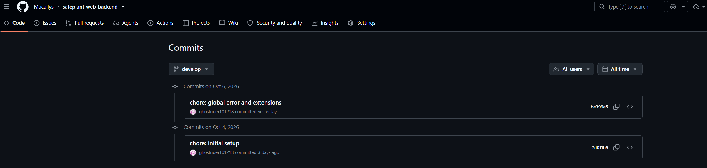
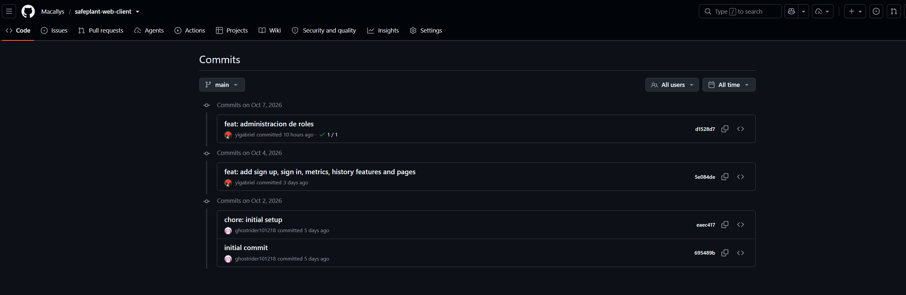
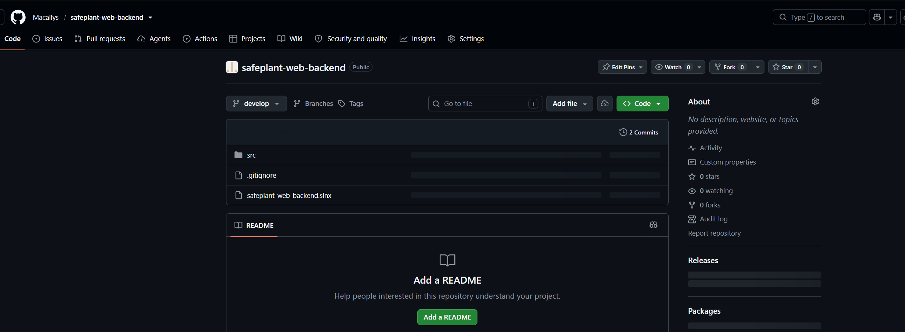
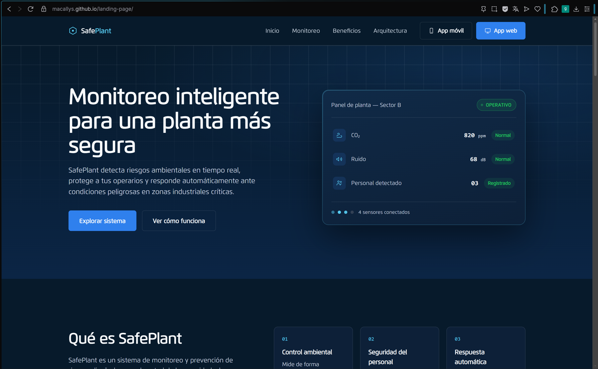
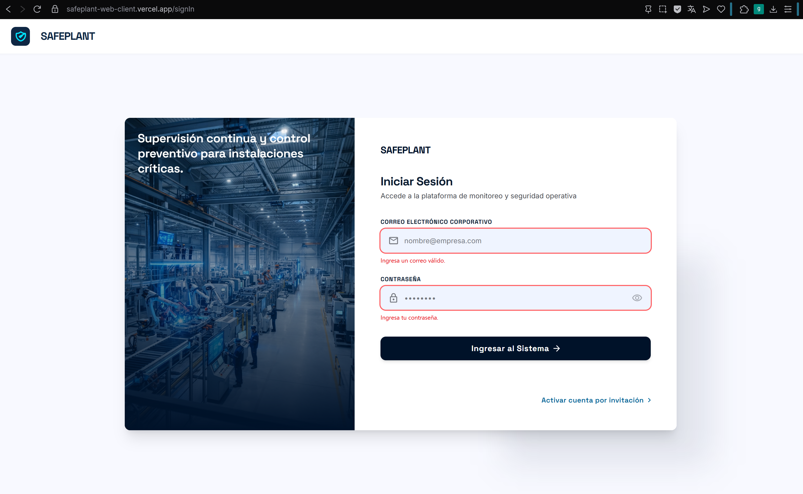
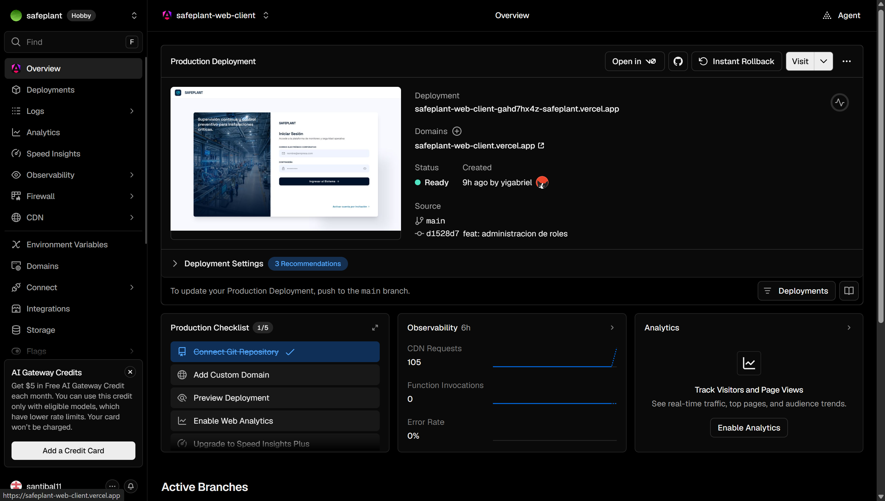
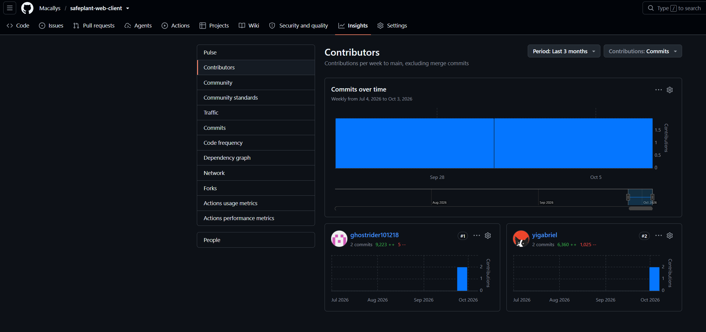
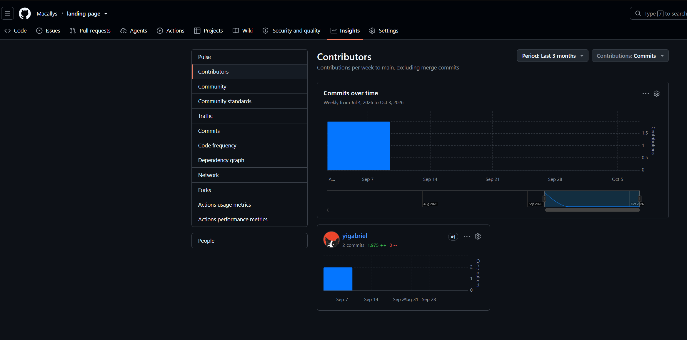
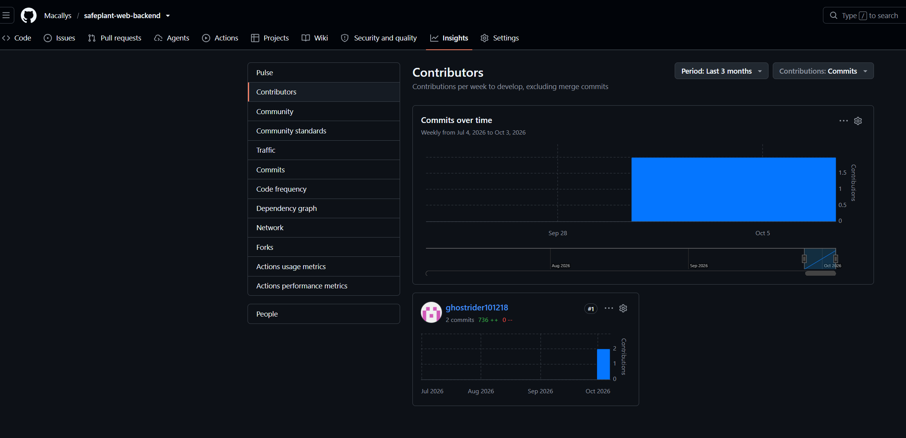

# 6.2.1. Sprint 1

En esta sección se registra y explica el avance en términos de producto y trabajo colaborativo del Sprint 1 de SafePlant. El sprint se centró en la presencia pública del producto, con la landing page desplegada; en la capa de presentación de la aplicación web del Encargado de Planta, con todas sus pantallas implementadas y desplegadas; y en la base del backend, con el módulo Identity & Access y los endpoints de registro e inicio de sesión. La integración entre la aplicación web y el backend queda como trabajo pendiente para el siguiente sprint.

## 6.2.1.1. Sprint Planning 1

El Sprint Planning Meeting del Sprint 1 tuvo como propósito definir el primer incremento visible de SafePlant. El equipo priorizó lo que permite presentar el producto a los segmentos objetivo y validar la experiencia del Encargado de Planta: la landing page informativa, las vistas de la aplicación web de gobernanza y la autenticación de usuarios en el backend. Al ser el primer sprint, no existen Review ni Retrospective previos.

<table>
  <thead>
    <tr>
      <th align="left" colspan="2">Sprint # - Sprint 1</th>
    </tr>
  </thead>
  <tbody>
    <tr>
      <td align="left" colspan="2"><strong>Sprint Planning Background</strong></td>
    </tr>
    <tr>
      <td align="left">Date</td>
      <td align="left">[2026-10-07]</td>
    </tr>
    <tr>
      <td align="left">Time</td>
      <td align="left">[21:00 PM]</td>
    </tr>
    <tr>
      <td align="left">Location</td>
      <td align="left">Reunión virtual vía Discord</td>
    </tr>
    <tr>
      <td align="left">Prepared By</td>
      <td align="left">Gabriel Sanchez</td>
    </tr>
    <tr>
      <td align="left">Attendees (to planning meeting)</td>
      <td align="left">Solano Armas, Angelo Héctor / Gordillo Ramos, Santiago Alonso / Huaman Cuba, Johan Giovani / Baldeon Vivar, Santiago Armando / Iglesias Pérez, Sergio Sebastián / Sanchez Gonzales, Gabriel</td>
    </tr>
    <tr>
      <td align="left">Sprint 0 Review Summary</td>
      <td align="left">No aplica.</td>
    </tr>
    <tr>
      <td align="left">Sprint 0 Retrospective Summary</td>
      <td align="left">No aplica. </td>
    </tr>
    <tr>
      <td align="left" colspan="2"><strong>Sprint Goal &amp; User Stories</strong></td>
    </tr>
    <tr>
      <td align="left">Sprint 1 Goal</td>
      <td align="left">
        <strong>Our focus is on</strong> dar a conocer SafePlant mediante una landing page desplegada que explique su propósito, sus beneficios y su arquitectura, y en ofrecer al Encargado de Planta las vistas de su aplicación web (inicio de sesión, gestión de cuentas y roles, dashboard de métricas e historial), respaldadas por un backend capaz de registrar usuarios e iniciar sesión.  
        <strong>We believe it delivers</strong> una comprensión clara de la propuesta de valor de SafePlant y una primera experiencia navegable de gobernanza de la planta <strong>to</strong> los visitantes interesados en la solución y los Encargados de Planta.  
        <strong>This will be confirmed when</strong> un visitante pueda recorrer la landing desplegada y acceder desde ella a la aplicación web publicada, un Encargado de Planta pueda navegar todas las vistas web, y el backend registre una cuenta y emita un token de acceso válido al iniciar sesión.
      </td>
    </tr>
    <tr>
      <td align="left">Sprint 1 Velocity</td>
      <td align="left">30 Story Points</td>
    </tr>
    <tr>
      <td align="left">Sum of Story Points</td>
      <td align="left">27 Story Points</td>
    </tr>
  </tbody>
</table>

## 6.2.1.2. Aspect Leaders and Collaborators

Los aspectos considerados en el Sprint 1 corresponden a los productos trabajados en la iteración: la landing page, la aplicación web del Encargado de Planta, el backend con el bounded context Identity & Access, el despliegue de los productos y la documentación del sprint en el informe. Para cada aspecto se define un líder, responsable de coordinar y validar el avance, y colaboradores que participan en su implementación.

<table>
  <thead>
    <tr>
      <th align="left">Team Member (Last Name, First Name)</th>
      <th align="left">GitHub Username</th>
      <th align="left">Landing Page</th>
      <th align="left">Web Application</th>
      <th align="left">Backend (Identity &amp; Access)</th>
      <th align="left">Deployment</th>
      <th align="left">Report</th>
    </tr>
  </thead>
  <tbody>
    <tr>
      <td align="left">Solano Armas, Angelo Héctor</td>
      <td align="left">Angelo5214</td>
      <td align="left">C</td>
      <td align="left">C</td>
      <td align="left">C</td>
      <td align="left">C</td>
      <td align="left">L</td>
    </tr>
    <tr>
      <td align="left">Gordillo Ramos, Santiago Alonso</td>
      <td align="left">SantiIHC</td>
      <td align="left">C</td>
      <td align="left">C</td>
      <td align="left">C</td>
      <td align="left">C</td>
      <td align="left">C</td>
    </tr>
    <tr>
      <td align="left">Huaman Cuba, Johan Giovani</td>
      <td align="left">Johancuba</td>
      <td align="left">C</td>
      <td align="left">C</td>
      <td align="left">C</td>
      <td align="left">C</td>
      <td align="left">C</td>
    </tr>
    <tr>
      <td align="left">Baldeon Vivar, Santiago Armando</td>
      <td align="left">Santibal11</td>
      <td align="left">C</td>
      <td align="left">C</td>
      <td align="left">C</td>
      <td align="left">C</td>
      <td align="left">L</td>
    </tr>
    <tr>
      <td align="left">Iglesias Pérez, Sergio Sebastián</td>
      <td align="left">ghostrider101218</td>
      <td align="left">C</td>
      <td align="left">C</td>
      <td align="left">L</td>
      <td align="left">L</td>
      <td align="left">C</td>
    </tr>
    <tr>
      <td align="left">Sanchez Gonzales, Gabriel</td>
      <td align="left">yigabriel</td>
      <td align="left">L</td>
      <td align="left">L</td>
      <td align="left">C</td>
      <td align="left">C</td>
      <td align="left">C</td>
    </tr>
  </tbody>
</table>

## 6.2.1.4. Development Evidence for Sprint Review

Durante el Sprint 1 se implementó la landing page completa de SafePlant, todas las vistas de la aplicación web del Encargado de Planta en Angular y el módulo Identity & Access del backend en ASP.NET Core, con los endpoints de registro e inicio de sesión. La siguiente tabla relaciona los commits de implementación de cada repositorio.

<table>
  <thead>
    <tr>
      <th align="left">Repository</th>
      <th align="left">Branch</th>
      <th align="left">Commit Id</th>
      <th align="left">Commit Message</th>
      <th align="left">Commit Message Body</th>
      <th align="left">Committed on (Date)</th>
    </tr>
  </thead>
  <tbody>
    <tr>
      <td align="left">Macallys/landing-page</td>
      <td align="left">develop</td>
      <td align="left"><a href="https://github.com/Macallys/landing-page/commit/9ba1a93dd2923408c13ece85a9839d930a680a1e">9ba1a93</a></td>
      <td align="left">Initial commit</td>
      <td align="left">Creación del repositorio de la landing page.</td>
      <td align="left">09/09/2026</td>
    </tr>
    <tr>
      <td align="left">Macallys/landing-page</td>
      <td align="left">develop</td>
      <td align="left"><a href="https://github.com/Macallys/landing-page/commit/ccefe6d1b451594ddc3d8d4898fe4059c8ceac4b">ccefe6d</a></td>
      <td align="left">feat: add landing page</td>
      <td align="left">Implementación de la landing page de SafePlant.</td>
      <td align="left">09/09/2026</td>
    </tr>
    <tr>
      <td align="left">Macallys/safeplant-web-client</td>
      <td align="left">develop</td>
      <td align="left"><a href="https://github.com/Macallys/safeplant-web-client/commit/695489b12b749aa18fbeffb8f17933abc79fcb33">695489b</a></td>
      <td align="left">initial commit</td>
      <td align="left">Creación del repositorio de la aplicación web.</td>
      <td align="left">02/10/2026</td>
    </tr>
    <tr>
      <td align="left">Macallys/safeplant-web-client</td>
      <td align="left">develop</td>
      <td align="left"><a href="https://github.com/Macallys/safeplant-web-client/commit/eaec417bcf9c478464338a9b9c215dec0003cecd">eaec417</a></td>
      <td align="left">chore: initial setup</td>
      <td align="left">Configuración inicial del proyecto Angular.</td>
      <td align="left">02/10/2026</td>
    </tr>
    <tr>
      <td align="left">Macallys/safeplant-web-client</td>
      <td align="left">develop</td>
      <td align="left"><a href="https://github.com/Macallys/safeplant-web-client/commit/5e084de9ef9c2218d0db995505b3bb7020148986">5e084de</a></td>
      <td align="left">feat: add sign up, sign in, metrics, history features and pages</td>
      <td align="left">Implementación de las vistas de registro, inicio de sesión, métricas e historial.</td>
      <td align="left">04/10/2026</td>
    </tr>
    <tr>
      <td align="left">Macallys/safeplant-web-client</td>
      <td align="left">develop</td>
      <td align="left"><a href="https://github.com/Macallys/safeplant-web-client/commit/d1528d733763e28654f4201f05a80a7d64a7cbb8">d1528d7</a></td>
      <td align="left">feat: administracion de roles</td>
      <td align="left">Implementación de la vista de administración y asignación de roles.</td>
      <td align="left">07/10/2026</td>
    </tr>
    <tr>
      <td align="left">Macallys/safeplant-web-backend</td>
      <td align="left">develop</td>
      <td align="left"><a href="https://github.com/Macallys/safeplant-web-backend/commit/7d011b6a4271da4cfaf1fa60a2d22c1194d8ddbf">7d011b6</a></td>
      <td align="left">chore: initial setup</td>
      <td align="left">Configuración inicial de la solución ASP.NET Core.</td>
      <td align="left">04/10/2026</td>
    </tr>
    <tr>
      <td align="left">Macallys/safeplant-web-backend</td>
      <td align="left">develop</td>
      <td align="left"><a href="https://github.com/Macallys/safeplant-web-backend/commit/be399e58592de36e84d9ab2269ec784c81393751">be399e5</a></td>
      <td align="left">chore: global error and extensions</td>
      <td align="left">Manejo global de errores y métodos de extensión del backend.</td>
      <td align="left">06/10/2026</td>
    </tr>
  </tbody>
</table>

## 6.2.1.5. Testing Suite Evidence for Sprint Review

Dentro de este Sprint no se contemplaron las pruebas

## 6.2.1.6. Execution Evidence for Sprint Review

Al cierre del Sprint 1, la landing page de SafePlant está disponible públicamente y presenta el propósito del sistema, el monitoreo en tiempo real, la respuesta automática, los beneficios y la arquitectura técnica, con acceso directo a la aplicación web. La aplicación web del Encargado de Planta está desplegada con todas sus vistas navegables: inicio de sesión, gestión de cuentas, asignación de roles, dashboard de métricas e historial. Estas vistas aún trabajan con datos de muestra hasta su integración con el backend.

**URL de la landing page:** https://macallys.github.io/landing-page/

**URL de la aplicación web:** [https://safeplant-web-client.vercel.app/signIn]

## 6.2.1.7. Services Documentation Evidence for Sprint Review

En este sprint se documentaron con OpenAPI (Swagger) los endpoints del bounded context Identity &amp; Access: el registro de usuarios y el inicio de sesión con emisión de JWT.

<table>
  <thead>
    <tr>
      <th align="left">Endpoint</th>
      <th align="left">Verbo HTTP</th>
      <th align="left">Sintaxis de llamada</th>
      <th align="left">Parámetros</th>
      <th align="left">Response</th>
      <th align="left">Documentación</th>
    </tr>
  </thead>
  <tbody>
    <tr>
      <td align="left">Sign up</td>
      <td align="left">POST</td>
      <td align="left"><code>[/api/v1/auth/sign-up]</code></td>
      <td align="left">Body JSON: <code>email</code>, <code>password</code>, <code>role</code></td>
      <td align="left"><code>201 Created</code> con el identificador de la cuenta creada; <code>409 Conflict</code> si el correo ya está registrado.</td>
      <td align="left">[URL Swagger]</td>
    </tr>
    <tr>
      <td align="left">Sign in</td>
      <td align="left">POST</td>
      <td align="left"><code>/api/v1/auth/login</code></td>
      <td align="left">Body JSON: <code>email</code>, <code>password</code></td>
      <td align="left"><code>200 OK</code> con <code>accessToken</code>, <code>role</code> y <code>expiresIn</code>; <code>401 Unauthorized</code> con <code>invalid_credentials</code> si las credenciales no son válidas.</td>
      <td align="left">[URL Swagger]</td>
    </tr>
  </tbody>
</table>

## 6.2.1.8. Software Deployment Evidence for Sprint Review

En el Sprint 1 se desplegaron la landing page y la aplicación web. La landing page se publicó en GitHub Pages desde el repositorio <code>landing-page</code> de la organización Macallys. La aplicación web Angular se publicó en [plataforma de despliegue]. El backend esta desplegado en {}.

## 6.2.1.9. Team Collaboration Insights during Sprint

